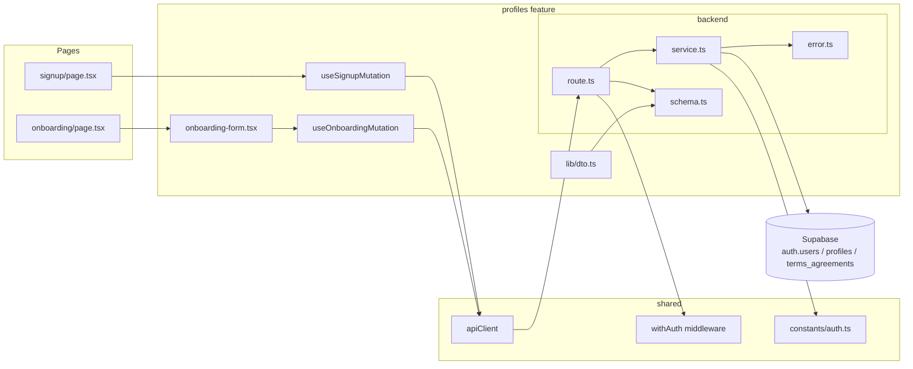

# Plan: UC-001 — 역할 선택 & 온보딩

## 개요

백엔드 레이어(`profiles` feature)는 이미 구현되어 있으며, 프론트엔드 페이지 연결이 남은 작업이다.

| 모듈 | 위치 | 설명 | 상태 |
|---|---|---|---|
| error | `src/features/profiles/backend/error.ts` | 에러 코드 상수 및 union 타입 | ✅ |
| schema | `src/features/profiles/backend/schema.ts` | SignupRequest / OnboardingRequest / OnboardingResponse zod 스키마 | ✅ |
| service | `src/features/profiles/backend/service.ts` | `signupUser`, `onboardUser` 비즈니스 로직 | ✅ |
| route | `src/features/profiles/backend/route.ts` | `POST /api/auth/signup`, `POST /api/auth/onboarding` (withAuth) | ✅ |
| dto | `src/features/profiles/lib/dto.ts` | backend schema 타입 재노출 | ✅ |
| useSignupMutation | `src/features/profiles/hooks/useSignupMutation.ts` | 회원가입 mutation 훅 | ✅ |
| useOnboardingMutation | `src/features/profiles/hooks/useOnboardingMutation.ts` | 온보딩 mutation 훅 (Bearer 토큰 주입) | ✅ |
| onboarding-form | `src/features/profiles/components/onboarding-form.tsx` | 역할 선택 + 프로필 입력 폼 컴포넌트 | ✅ |
| signup page | `src/app/signup/page.tsx` | 이메일·비밀번호 입력 폼 페이지 | 🔧 수정 중 |
| onboarding page | `src/app/onboarding/page.tsx` | 온보딩 폼 렌더링 + 역할별 리다이렉트 처리 | 🆕 신규 |

## Diagram



## Implementation Plan

### service.ts — `signupUser` / `onboardUser`

비즈니스 로직의 핵심. Supabase service-role 클라이언트를 인자로 받아 `success / failure`를 반환한다.

**Unit Test**

```typescript
describe('signupUser', () => {
  it('신규 이메일로 가입 시 201과 userId를 반환한다')
  it('이미 존재하는 이메일 → 409 EMAIL_ALREADY_EXISTS')
  it('Supabase Auth 오류 발생 → 500 SIGNUP_FAILED')
})

describe('onboardUser', () => {
  it('learner 역할 온보딩 → profiles + terms_agreements 생성, redirectTo = /courses')
  it('instructor 역할 온보딩 → redirectTo = /instructor/dashboard')
  it('프로필 중복(23505) → 409 PROFILE_ALREADY_EXISTS')
  it('profiles INSERT 실패 → auth 계정 삭제 후 500 ONBOARDING_FAILED')
  it('terms_agreements INSERT 실패 → profiles + auth 계정 삭제 후 500 ONBOARDING_FAILED')
})
```

---

### signup/page.tsx

`useSignupMutation`을 호출하고, 성공 시 `userId`를 세션에 임시 보관하여 `/onboarding`으로 이동한다.
`react-hook-form` + `zod` resolver로 클라이언트 유효성 검사.

**QA Sheet**

| 시나리오 | 기대 결과 |
|---|---|
| 유효한 이메일·비밀번호(8자↑) 입력 후 제출 | `/onboarding`으로 이동 |
| 이미 가입된 이메일 입력 후 제출 | 이메일 필드에 "이미 사용 중인 이메일입니다" 인라인 오류 |
| 비밀번호 8자 미만 입력 | 비밀번호 필드에 유효성 오류, 제출 버튼 비활성화 |
| 이메일 형식 오류 | 이메일 필드에 유효성 오류 |
| 네트워크 오류 | 토스트 오류 메시지 + 재시도 유도 |
| 제출 중 버튼 상태 | 로딩 스피너 표시, 중복 제출 방지 |

---

### onboarding/page.tsx + onboarding-form.tsx

`useOnboardingMutation`을 호출하며 `Authorization: Bearer <token>` 헤더를 주입한다.
성공 응답의 `redirectTo`를 `router.push()`로 처리한다.

**QA Sheet**

| 시나리오 | 기대 결과 |
|---|---|
| Learner 선택 + 유효 정보 입력 후 제출 | `/courses`로 이동 |
| Instructor 선택 + 유효 정보 입력 후 제출 | `/instructor/dashboard`로 이동 |
| 약관 미동의 상태 | 제출 버튼 비활성화 |
| 이름 미입력 | 이름 필드에 인라인 오류 |
| 휴대폰번호 미입력 | 휴대폰번호 필드에 인라인 오류 |
| 역할 미선택 상태 제출 시도 | 역할 선택 필드에 오류 표시 |
| 토큰 만료 후 온보딩 제출 | 401 반환 → `/login`으로 리다이렉트 |
