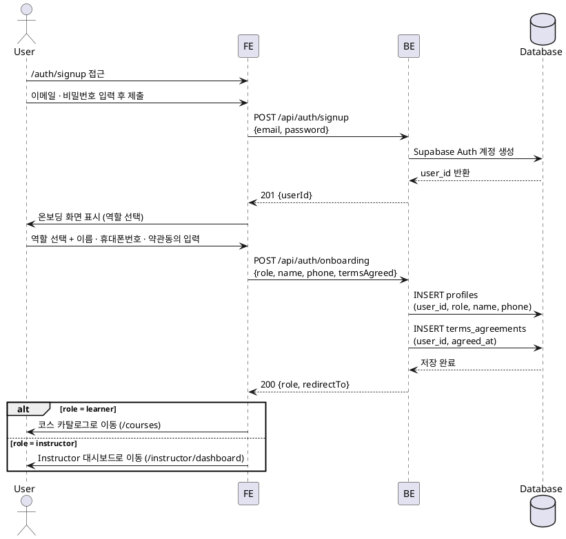

# UC-001: 역할 선택 & 온보딩

## Primary Actor

신규 사용자 (Learner 또는 Instructor 지망)

---

## Precondition

- 서비스에 계정이 없는 상태
- 유효한 이메일 주소를 보유하고 있음

---

## Trigger

사용자가 `/auth/signup` 페이지에 접근하여 회원가입 폼을 제출한다.

---

## Main Scenario

1. 사용자가 이메일 · 비밀번호를 입력하고 가입을 요청한다.
2. FE가 `POST /api/auth/signup`을 호출한다.
3. BE가 Supabase Auth 계정을 생성하고 `user_id`를 반환한다.
4. FE가 온보딩 화면(역할 선택)을 표시한다.
5. 사용자가 역할(Learner / Instructor)을 선택하고 이름 · 휴대폰번호 · 약관동의를 입력한다.
6. FE가 `POST /api/auth/onboarding`을 호출한다.
7. BE가 `profiles` 레코드와 `terms_agreements` 레코드를 생성하고 토큰을 발급한다.
8. 역할에 따라 리다이렉트한다.
   - Learner → `/courses` (코스 카탈로그)
   - Instructor → `/instructor/dashboard`

---

## Edge Cases

| 상황 | 처리 |
|---|---|
| 이미 가입된 이메일 | 409 중복 오류 반환 → FE에서 안내 메시지 표시 |
| 비밀번호 정책 불일치 | 400 유효성 오류 반환 → 입력 필드 인라인 오류 표시 |
| 약관 미동의 | 프론트엔드 제출 차단 (버튼 비활성화) |
| 필수 프로필 누락 (이름 · 휴대폰번호) | 400 유효성 오류 반환 → 필드별 인라인 오류 표시 |
| Supabase Auth 생성 성공 후 `profiles` INSERT 실패 | 500 반환, 생성된 Auth 계정 삭제 처리 (롤백) |
| 네트워크 오류 | FE에서 재시도 유도 메시지 표시 |

---

## Business Rules

- 역할은 `learner` · `instructor` 중 하나만 선택 가능하며, 이후 변경 불가.
- 이름 · 휴대폰번호 · 약관동의는 필수 항목이다.
- 약관 동의 이력은 `terms_agreements` 테이블에 별도 저장한다.
- 가입 완료 후 역할에 따라 첫 진입 화면이 다르다.
- 인증은 Supabase Auth 기반으로 처리하며, 서버 측 service-role 클라이언트를 사용한다.

---

## Sequence Diagram

