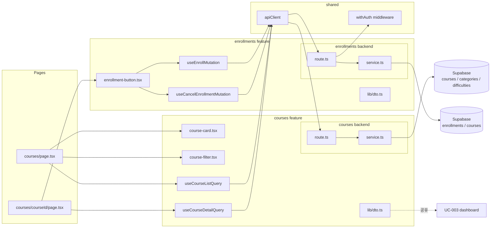

# Plan: UC-002 — 코스 탐색 & 수강신청/취소

## 개요

`courses`와 `enrollments` 두 feature로 분리한다.
`courses`는 공개 카탈로그 조회, `enrollments`는 인증된 Learner의 신청·취소 로직을 담당한다.

| 모듈 | 위치 | 설명 | 상태 |
|---|---|---|---|
| courses/error | `src/features/courses/backend/error.ts` | COURSE_NOT_FOUND, COURSE_NOT_PUBLISHED | 🆕 |
| courses/schema | `src/features/courses/backend/schema.ts` | CourseListQuery, CourseListResponse, CourseDetailResponse | 🆕 |
| courses/service | `src/features/courses/backend/service.ts` | `listCourses`, `getCourseDetail` (수강 상태 포함) | 🆕 |
| courses/route | `src/features/courses/backend/route.ts` | `GET /api/courses`, `GET /api/courses/:courseId` | 🆕 |
| courses/dto | `src/features/courses/lib/dto.ts` | CourseDto, CourseDetailDto 타입 재노출 (UC-003과 공유) | 🆕 |
| useCourseListQuery | `src/features/courses/hooks/useCourseListQuery.ts` | 코스 목록 조회 쿼리 훅 | 🆕 |
| useCourseDetailQuery | `src/features/courses/hooks/useCourseDetailQuery.ts` | 코스 상세 + 수강 상태 조회 훅 | 🆕 |
| course-card | `src/features/courses/components/course-card.tsx` | 카탈로그 카드 컴포넌트 | 🆕 |
| course-filter | `src/features/courses/components/course-filter.tsx` | 검색어·카테고리·난이도·정렬 필터바 | 🆕 |
| enrollments/error | `src/features/enrollments/backend/error.ts` | ALREADY_ENROLLED, ENROLLMENT_NOT_FOUND, COURSE_NOT_ENROLLABLE | 🆕 |
| enrollments/schema | `src/features/enrollments/backend/schema.ts` | EnrollRequest, EnrollResponse, CancelEnrollmentParams | 🆕 |
| enrollments/service | `src/features/enrollments/backend/service.ts` | `enrollCourse` (UPSERT), `cancelEnrollment` | 🆕 |
| enrollments/route | `src/features/enrollments/backend/route.ts` | `POST /api/enrollments`, `DELETE /api/enrollments/:courseId` (withAuth) | 🆕 |
| enrollments/dto | `src/features/enrollments/lib/dto.ts` | EnrollmentDto 타입 재노출 | 🆕 |
| useEnrollMutation | `src/features/enrollments/hooks/useEnrollMutation.ts` | 수강신청·재신청 mutation 훅 | 🆕 |
| useCancelEnrollmentMutation | `src/features/enrollments/hooks/useCancelEnrollmentMutation.ts` | 수강취소 mutation 훅 | 🆕 |
| enrollment-button | `src/features/enrollments/components/enrollment-button.tsx` | 수강신청·취소 토글 버튼 컴포넌트 | 🆕 |
| courses page | `src/app/courses/page.tsx` | 코스 카탈로그 페이지 | 🆕 |
| course detail page | `src/app/courses/[courseId]/page.tsx` | 코스 상세 페이지 | 🆕 |
| app.ts 등록 | `src/backend/hono/app.ts` | `registerCourseRoutes`, `registerEnrollmentRoutes` 추가 | 🔧 |

## Diagram



## Implementation Plan

### courses/service.ts — `listCourses` / `getCourseDetail`

`getCourseDetail`은 선택적 `learnerId`를 받아 enrollments 테이블에서 수강 상태를 함께 조회한다.

**Unit Test**

```typescript
describe('listCourses', () => {
  it('published 코스 목록만 반환한다 (draft, archived 제외)')
  it('search 파라미터 → title ILIKE 검색')
  it('categoryId 필터 적용 시 해당 카테고리 코스만 반환')
  it('difficultyId 필터 적용 시 해당 난이도 코스만 반환')
  it('sort=recent → created_at DESC')
  it('sort=popular → enrolled 수 DESC (또는 기본 정렬)')
  it('결과 없을 시 빈 배열 반환 (에러 아님)')
})

describe('getCourseDetail', () => {
  it('published 코스 상세와 enrollmentStatus=null(비인증) 반환')
  it('인증된 learner → enrollmentStatus: active | cancelled | null 포함')
  it('존재하지 않는 courseId → 404 COURSE_NOT_FOUND')
})
```

---

### enrollments/service.ts — `enrollCourse` / `cancelEnrollment`

UPSERT 로직의 핵심. `(course_id, learner_id)` UNIQUE 제약을 활용해 중복 데이터 없이 처리한다.

**Unit Test**

```typescript
describe('enrollCourse', () => {
  it('수강 이력 없음 → INSERT, 201 반환')
  it('cancelled_at IS NOT NULL (취소 이력) → UPDATE SET cancelled_at=NULL, enrolled_at=NOW(), 200 반환')
  it('cancelled_at IS NULL (이미 수강 중) → 409 ALREADY_ENROLLED')
  it('코스 status가 published가 아님 → 400 COURSE_NOT_ENROLLABLE')
  it('존재하지 않는 courseId → 404 COURSE_NOT_FOUND')
})

describe('cancelEnrollment', () => {
  it('활성 수강 취소 → cancelled_at = NOW() UPDATE, 200 반환')
  it('수강 이력 없거나 이미 취소됨 → 404 ENROLLMENT_NOT_FOUND')
})
```

---

### course-filter.tsx

URL searchParams와 동기화하는 필터 컴포넌트. 상태는 `useSearchParams` + `router.push`로 관리한다.

**QA Sheet**

| 시나리오 | 기대 결과 |
|---|---|
| 검색어 입력 후 엔터/버튼 클릭 | URL에 `?search=...` 반영, 목록 필터링 |
| 카테고리 선택 | URL에 `?category=...` 반영 |
| 난이도 선택 | URL에 `?difficulty=...` 반영 |
| 정렬 변경 | URL에 `?sort=recent\|popular` 반영 |
| 필터 초기화 | 모든 파라미터 제거, 전체 목록 복원 |

---

### courses/page.tsx

**QA Sheet**

| 시나리오 | 기대 결과 |
|---|---|
| 페이지 진입 | published 코스 카드 목록 표시 |
| 로딩 중 | 스켈레톤 카드 표시 |
| 코스 없음 (필터 결과 0건) | "검색 결과가 없습니다" 빈 상태 메시지 |
| 코스 카드 클릭 | `/courses/[courseId]`로 이동 |

---

### courses/[courseId]/page.tsx + enrollment-button.tsx

`useCourseDetailQuery`로 코스 정보와 수강 상태를 조회하고, `enrollment-button`이 상태에 따라 버튼을 토글한다.
mutation 성공 후 `queryClient.invalidateQueries(['course', courseId])`로 수강 상태를 갱신한다.

**QA Sheet**

| 시나리오 | 기대 결과 |
|---|---|
| 비인증 사용자 진입 | 수강신청 버튼 미표시 또는 로그인 유도 |
| 신규 수강신청 성공 | 버튼 → "수강취소"로 변경, 성공 토스트 |
| 이미 수강 중인 상태 진입 | "수강취소" 버튼 표시 |
| 수강취소 성공 | 버튼 → "수강신청"으로 변경, 취소 토스트 |
| 취소한 코스 재신청 성공 | 버튼 → "수강취소"로 변경, 성공 토스트 |
| 이미 수강 중 상태에서 API 409 반환 | "이미 수강 중인 코스입니다" 오류 토스트 |
| Instructor 역할로 진입 | 수강신청 버튼 미표시 |
| 로딩 중 | 버튼 비활성화 + 스피너 |
