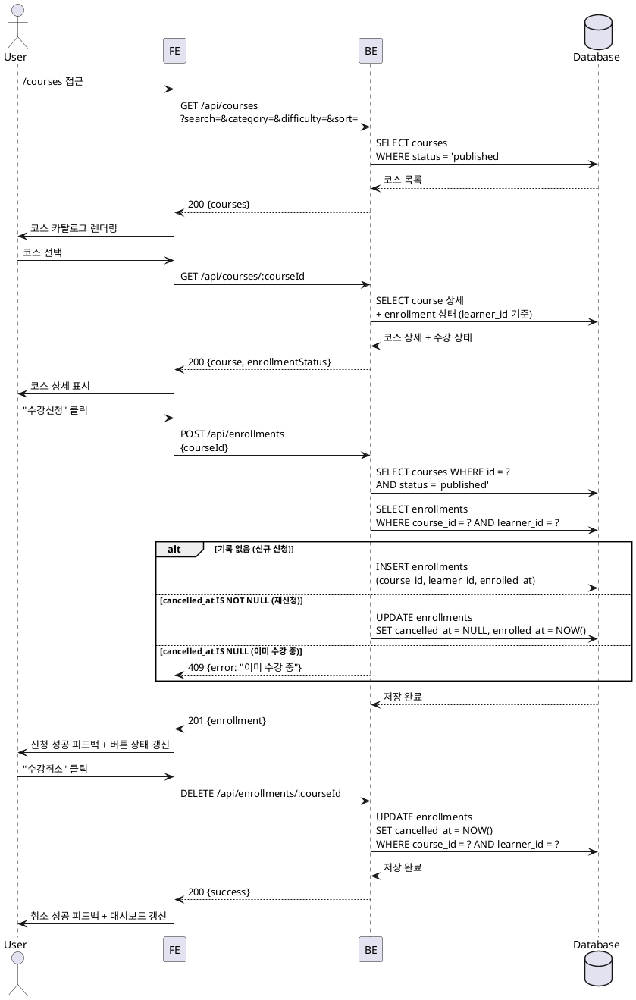

# UC-002: 코스 탐색 & 수강신청/취소

## Primary Actor

Learner (인증된 학습자)

## Precondition

- 로그인 상태이며 역할이 `learner`인 사용자
- 온보딩이 완료된 상태

## Trigger

- 사용자가 `/courses` 페이지에 접근하여 코스를 탐색한다.
- 코스 상세 페이지에서 "수강신청" 또는 "수강취소" 버튼을 클릭한다.

## Main Scenario

### 2-1. 코스 탐색

1. 사용자가 `/courses`에 접근한다.
2. FE가 `GET /api/courses`를 호출한다 (검색어, 카테고리, 난이도, 정렬 파라미터 포함).
3. BE가 `status = 'published'` 코스 목록을 필터·정렬하여 반환한다.
4. FE가 코스 카드 목록을 렌더링한다.
5. 사용자가 코스를 선택하면 코스 상세 페이지로 이동한다.
6. FE가 `GET /api/courses/:courseId`를 호출하여 상세 정보 및 현재 수강 상태를 함께 반환받는다.

### 2-2. 수강신청 (신규 / 재신청)

1. 사용자가 코스 상세 페이지에서 "수강신청" 버튼을 클릭한다.
2. FE가 `POST /api/enrollments`를 호출한다 (`{ courseId }`).
3. BE가 코스 `status = 'published'` 여부를 검증한다.
4. BE가 `enrollments` 테이블에서 `(course_id, learner_id)` 를 조회한다.
   - 기록 없음 → `INSERT` (신규 신청)
   - `cancelled_at IS NOT NULL` → `UPDATE SET cancelled_at = NULL, enrolled_at = NOW()` (재신청)
   - `cancelled_at IS NULL` → 409 에러 반환 (이미 수강 중)
5. BE가 성공을 반환한다.
6. FE가 성공 피드백을 표시하고 버튼 상태를 갱신한다.

### 2-3. 수강취소

1. 사용자가 수강 중인 코스에서 "수강취소" 버튼을 클릭한다.
2. FE가 `DELETE /api/enrollments/:courseId`를 호출한다.
3. BE가 `enrollments` 레코드를 조회하고 `cancelled_at = NOW()`로 UPDATE한다.
4. FE가 취소 성공 피드백을 표시하고 대시보드에서 해당 코스를 제거한다.

## Edge Cases

| 상황 | 처리 |
|---|---|
| 이미 수강 중인 코스 재신청 | 409 반환 → "이미 수강 중인 코스입니다" 안내 메시지 |
| `published` 상태가 아닌 코스 신청 | 400 반환 → FE에서 신청 버튼 비표시 또는 오류 메시지 |
| 인증되지 않은 사용자의 신청 시도 | 401 반환 → 로그인 페이지로 리다이렉트 |
| Instructor 역할로 신청 시도 | 403 반환 → 권한 오류 메시지 |
| 수강 중이 아닌 코스 취소 시도 | 404 반환 → FE에서 취소 버튼 비표시 |
| 네트워크 오류 | FE에서 재시도 유도 메시지 표시 |

## Business Rules

- `published` 상태의 코스만 수강신청 가능하다.
- `enrollments` 테이블의 `(course_id, learner_id)` 쌍은 UNIQUE → 재신청 시 새 레코드를 생성하지 않고 기존 레코드를 UPDATE한다 (중복 데이터 방지).
- 수강취소 시 레코드를 삭제하지 않고 `cancelled_at = NOW()`로 갱신한다.
- 재신청 시 기존 레코드의 `cancelled_at = NULL`, `enrolled_at = NOW()`로 복구한다.
- 취소 상태(`cancelled_at IS NOT NULL`)의 수강은 대시보드 목록 및 성적 집계에서 제외된다.

## Sequence Diagram

