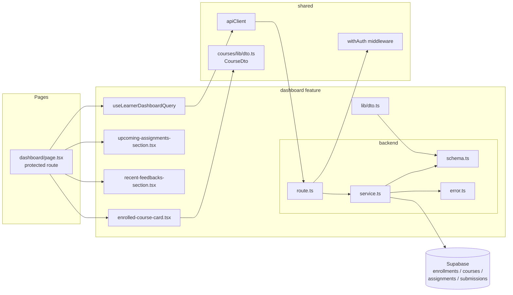

# Plan: UC-003 — Learner 대시보드

## 개요

`dashboard` feature로 구현한다.
단일 API 엔드포인트(`GET /api/dashboard/learner`)에서 집계 쿼리를 통해 4개 섹션 데이터를 일괄 반환한다.
`CourseDto`는 UC-002 `courses/lib/dto.ts`에서 공유한다.

| 모듈 | 위치 | 설명 | 상태 |
|---|---|---|---|
| dashboard/error | `src/features/dashboard/backend/error.ts` | DASHBOARD_FETCH_ERROR 에러 코드 | 🆕 |
| dashboard/schema | `src/features/dashboard/backend/schema.ts` | LearnerDashboardResponse zod 스키마 (courses, progress, upcomingAssignments, recentFeedbacks) | 🆕 |
| dashboard/service | `src/features/dashboard/backend/service.ts` | `getLearnerDashboard`, `calculateProgress` 집계 로직 | 🆕 |
| dashboard/route | `src/features/dashboard/backend/route.ts` | `GET /api/dashboard/learner` (withAuth + learner role guard) | 🆕 |
| dashboard/dto | `src/features/dashboard/lib/dto.ts` | LearnerDashboardDto 타입 재노출 | 🆕 |
| useLearnerDashboardQuery | `src/features/dashboard/hooks/useLearnerDashboardQuery.ts` | 대시보드 데이터 조회 쿼리 훅 | 🆕 |
| enrolled-course-card | `src/features/dashboard/components/enrolled-course-card.tsx` | 진행률 바 포함 수강 코스 카드 | 🆕 |
| upcoming-assignments-section | `src/features/dashboard/components/upcoming-assignments-section.tsx` | 마감 임박 과제 목록 섹션 | 🆕 |
| recent-feedbacks-section | `src/features/dashboard/components/recent-feedbacks-section.tsx` | 최근 피드백 목록 섹션 | 🆕 |
| dashboard page | `src/app/(protected)/dashboard/page.tsx` | Learner 대시보드 페이지 (protected route) | 🆕 |
| app.ts 등록 | `src/backend/hono/app.ts` | `registerDashboardRoutes` 추가 | 🔧 |

### 공유 모듈 (UC-002 의존)

| 모듈 | 위치 | 용도 |
|---|---|---|
| CourseDto | `src/features/courses/lib/dto.ts` | 수강 코스 카드에서 코스 정보 타입으로 재사용 |

## Diagram



## Implementation Plan

### dashboard/service.ts — `getLearnerDashboard` / `calculateProgress`

`calculateProgress`는 순수 함수로 분리하여 단독 테스트가 가능하게 한다.

**Unit Test**

```typescript
describe('calculateProgress', () => {
  it('제출 0건, 과제 5건 → 0')
  it('제출 3건(submitted), 과제 5건 → 0.6')
  it('제출 2건(submitted) + 1건(resubmission_required), 과제 5건 → 0.4')
  it('과제 0건 → 0 (ZeroDivisionError 방지)')
  it('전체 제출 완료 → 1.0')
})

describe('getLearnerDashboard', () => {
  it('cancelled_at IS NULL 수강만 courses 목록에 포함한다')
  it('cancelled_at IS NOT NULL 수강은 목록에서 제외된다')
  it('각 코스에 대해 진행률이 계산되어 포함된다')
  it('마감 임박 과제는 due_at ASC 정렬로 반환된다')
  it('최근 피드백은 graded_at DESC 정렬로 반환된다')
  it('최근 피드백은 status=graded 제출물만 포함한다')
  it('수강 중인 코스가 없으면 빈 배열을 반환한다 (에러 아님)')
})
```

---

### dashboard/route.ts

`withAuth()`로 인증 검증 후, `currentUser.role !== 'learner'`이면 403을 반환한다.

**Unit Test**

```typescript
describe('GET /api/dashboard/learner', () => {
  it('미인증 요청 → 401 UNAUTHORIZED')
  it('instructor 역할 요청 → 403 FORBIDDEN')
  it('learner 요청 → 200 LearnerDashboardResponse')
})
```

---

### enrolled-course-card.tsx

진행률을 `(completedCount / totalCount) * 100`으로 계산하여 `shadcn Progress` 컴포넌트로 렌더링한다.

**QA Sheet**

| 시나리오 | 기대 결과 |
|---|---|
| 진행률 0% | Progress 바 비어있음, "0%" 텍스트 |
| 진행률 60% | Progress 바 60% 채워짐 |
| 진행률 100% | Progress 바 완전히 채워짐, 완료 표시 |
| 코스 클릭 | `/courses/[courseId]`로 이동 |

---

### dashboard/page.tsx

`useLearnerDashboardQuery`로 데이터를 조회하고 4개 섹션을 렌더링한다.
`Instructor` 역할로 접근 시 `useCurrentUser`로 역할 확인 후 `/instructor/dashboard`로 리다이렉트한다.

**QA Sheet**

| 시나리오 | 기대 결과 |
|---|---|
| 수강 중인 코스 있음 | enrolled-course-card 목록 + 진행률 바 표시 |
| 수강 중인 코스 없음 | "수강 중인 코스가 없습니다" + "코스 탐색하기" 링크 |
| 마감 임박 과제 있음 | 과제명·코스명·due_at 오름차순 표시 |
| 마감 임박 과제 없음 | "임박한 과제 없습니다" 빈 상태 |
| 최근 피드백 있음 | 과제명·점수·피드백 미리보기 표시 |
| 최근 피드백 없음 | "아직 채점된 과제가 없습니다" 빈 상태 |
| Instructor 역할 접근 | `/instructor/dashboard`로 리다이렉트 |
| 로딩 중 | 각 섹션에 스켈레톤 UI 표시 |
| API 오류 | 오류 메시지 + 재시도 버튼 표시 |
