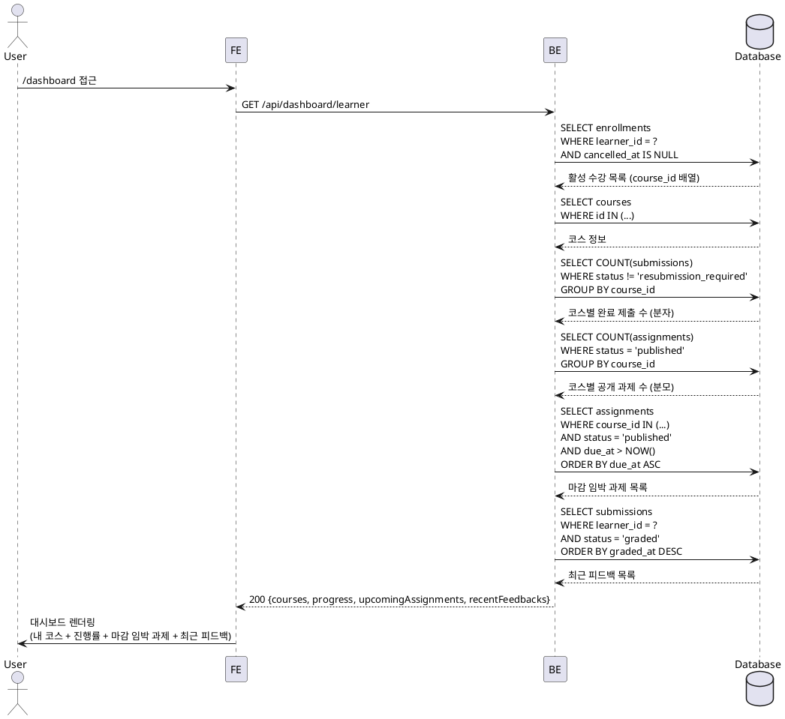

# UC-003: Learner 대시보드

## Primary Actor

Learner (인증된 학습자)

## Precondition

- 로그인 상태이며 역할이 `learner`인 사용자
- 온보딩이 완료된 상태

## Trigger

사용자가 `/dashboard` 또는 온보딩 완료 후 자동으로 Learner 대시보드에 진입한다.

## Main Scenario

1. 사용자가 대시보드에 접근한다.
2. FE가 `GET /api/dashboard/learner`를 호출한다.
3. BE가 `enrollments WHERE cancelled_at IS NULL`을 기준으로 활성 수강 목록을 조회한다.
4. BE가 각 코스에 대해 진행률을 계산한다.
   - 분자: `COUNT(submissions WHERE status != 'resubmission_required')`
   - 분모: `COUNT(assignments WHERE status = 'published' AND course_id = ?)`
5. BE가 마감 임박 과제를 조회한다 (`due_at ASC ORDER`, 미제출 과제 우선).
6. BE가 최근 피드백을 조회한다 (`submissions WHERE status = 'graded'`, 최신순).
7. BE가 내 코스 목록·진행률·마감 임박 과제·최근 피드백을 단일 응답으로 반환한다.
8. FE가 각 섹션을 렌더링한다.

## Edge Cases

| 상황 | 처리 |
|---|---|
| 수강 중인 코스가 없음 | 빈 코스 목록 표시 및 코스 탐색 유도 안내 |
| 마감 임박 과제가 없음 | 해당 섹션 빈 상태 표시 |
| 최근 피드백이 없음 | 해당 섹션 빈 상태 표시 |
| 인증되지 않은 접근 | 401 반환 → 로그인 페이지로 리다이렉트 |
| Instructor 역할로 접근 | 403 반환 → Instructor 대시보드로 리다이렉트 |
| 네트워크 오류 | FE에서 재시도 유도 메시지 표시 |

## Business Rules

- 취소된 수강(`cancelled_at IS NOT NULL`)은 대시보드 목록에서 제외된다.
- 진행률은 `published` 상태 과제만 분모로 산정하며, `resubmission_required` 상태 제출물은 완료로 집계하지 않는다.
- 미제출·미채점 과제는 진행률 분자에 포함되지 않는다 (0점 처리 없음).
- 마감 임박 과제는 `due_at` 오름차순으로 정렬하여 가장 임박한 항목을 우선 표시한다.
- 최근 피드백은 `status = 'graded'`인 제출물에 한해 표시한다.

## Sequence Diagram

