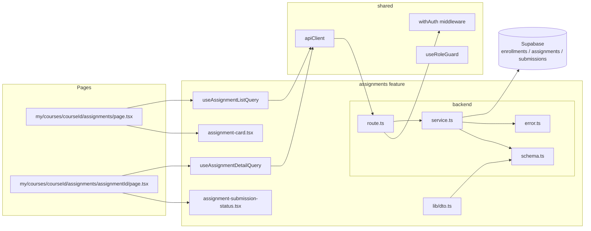

# Plan: UC-004 — 과제 상세 열람 (Learner)

## 개요

`assignments` feature를 신규 생성한다.
두 개의 엔드포인트(`GET /api/my/courses/:courseId/assignments`, `GET /api/my/courses/:courseId/assignments/:assignmentId`)를 통해
활성 수강 검증 후 과제 목록 및 상세를 반환하고, 프론트엔드에서 제출 상태에 따른 UI 분기를 처리한다.

`submissions` 테이블은 이미 `0002_create_lms_tables.sql`에 정의되어 있으며 신규 마이그레이션 불필요.
`assignments` 테이블도 동일하게 기존 마이그레이션에 정의되어 있다.

| 모듈 | 위치 | 설명 | 상태 |
|---|---|---|---|
| assignments/error | `src/features/assignments/backend/error.ts` | 에러 코드 상수 및 union 타입 | 🆕 |
| assignments/schema | `src/features/assignments/backend/schema.ts` | AssignmentListResponse, AssignmentDetailResponse zod 스키마 | 🆕 |
| assignments/service | `src/features/assignments/backend/service.ts` | `listAssignments`, `getAssignmentDetail`, `verifyEnrollment` 비즈니스 로직 | 🆕 |
| assignments/route | `src/features/assignments/backend/route.ts` | `GET /api/my/courses/:courseId/assignments`, `GET /api/my/courses/:courseId/assignments/:assignmentId` (withAuth) | 🆕 |
| assignments/dto | `src/features/assignments/lib/dto.ts` | backend/schema 타입 재노출 | 🆕 |
| useAssignmentListQuery | `src/features/assignments/hooks/useAssignmentListQuery.ts` | 과제 목록 조회 쿼리 훅 | 🆕 |
| useAssignmentDetailQuery | `src/features/assignments/hooks/useAssignmentDetailQuery.ts` | 과제 상세 조회 쿼리 훅 | 🆕 |
| assignment-card | `src/features/assignments/components/assignment-card.tsx` | 과제 목록 카드 컴포넌트 (마감 상태 + 제출 상태 배지 포함) | 🆕 |
| assignment-submission-status | `src/features/assignments/components/assignment-submission-status.tsx` | 제출 상태 UI 컴포넌트 (버튼/내역 분기) | 🆕 |
| assignments list page | `src/app/(protected)/my/courses/[courseId]/assignments/page.tsx` | 과제 목록 페이지 | 🆕 |
| assignment detail page | `src/app/(protected)/my/courses/[courseId]/assignments/[assignmentId]/page.tsx` | 과제 상세 페이지 | 🆕 |
| app.ts 등록 | `src/backend/hono/app.ts` | `registerAssignmentRoutes` 추가 | 🔧 |

## Diagram



## 충돌 분석

### 기존 코드베이스와의 충돌 여부

| 검토 항목 | 충돌 여부 | 근거 |
|---|---|---|
| `src/features/assignments/` 디렉토리 존재 여부 | 없음 (신규 생성) | `ls src/features/` 결과: auth, courses, dashboard, enrollments, example, profiles만 존재 |
| 라우트 경로 중복 | 없음 | 기존 라우트는 `/api/courses`, `/api/enrollments`, `/api/dashboard`, `/api/auth` prefix 사용 중. `/api/my/courses/:courseId/assignments`는 신규 |
| `src/app/(protected)/my/` 경로 | 없음 (신규 생성) | 기존 protected 하위: courses, dashboard, instructor, onboarding만 존재 |
| `assignments` 테이블 | 존재 (`0002_create_lms_tables.sql`) | 마이그레이션 불필요 |
| `submissions` 테이블 | 존재 (`0002_create_lms_tables.sql`) | 마이그레이션 불필요 |
| `withAuth` 미들웨어 | 재사용 | `src/backend/middleware/auth.ts`에 정의됨 |
| `useRoleGuard` 훅 | 재사용 | `src/hooks/useRoleGuard.ts`에 정의됨 |
| `apiClient` | 재사용 | `src/lib/remote/api-client.ts`에 정의됨 |

## Implementation Plan

### Step 1: assignments/backend/error.ts

기존 패턴(`courseErrorCodes`, `enrollmentErrorCodes`)을 그대로 따른다.

```typescript
// src/features/assignments/backend/error.ts
export const assignmentErrorCodes = {
  enrollmentRequired: 'ENROLLMENT_REQUIRED',      // 403: 수강 중이 아닌 경우
  assignmentNotFound: 'ASSIGNMENT_NOT_FOUND',     // 404: draft 상태 또는 존재하지 않는 과제
  fetchError: 'ASSIGNMENT_FETCH_ERROR',           // 500: DB 조회 실패
  forbidden: 'FORBIDDEN',                         // 403: role 위반
} as const;

type AssignmentErrorValue = (typeof assignmentErrorCodes)[keyof typeof assignmentErrorCodes];
export type AssignmentServiceError = AssignmentErrorValue;
```

---

### Step 2: assignments/backend/schema.ts

제출 상태는 `submission_status` ENUM(`submitted`, `graded`, `resubmission_required`, `invalidated`)을 따른다.
`MySubmissionDto`는 과제 목록·상세 양쪽에서 공통으로 사용되므로 단일 스키마로 정의하여 재사용한다.

```typescript
// src/features/assignments/backend/schema.ts
import { z } from 'zod';

export const MySubmissionDtoSchema = z.object({
  id: z.string().uuid(),
  status: z.enum(['submitted', 'graded', 'resubmission_required', 'invalidated']),
  contentText: z.string().nullable(),
  contentLink: z.string().nullable(),
  isLate: z.boolean(),
  score: z.number().int().nullable(),
  feedback: z.string().nullable(),
  submittedAt: z.string(),
  gradedAt: z.string().nullable(),
});

export const AssignmentDtoSchema = z.object({
  id: z.string().uuid(),
  courseId: z.string().uuid(),
  title: z.string(),
  description: z.string().nullable(),
  dueAt: z.string(),
  weight: z.number(),
  allowLate: z.boolean(),
  allowResubmit: z.boolean(),
  status: z.enum(['published', 'closed']),   // draft는 404 처리 후 절대 응답에 포함되지 않음
  mySubmission: MySubmissionDtoSchema.nullable(),
});

export const AssignmentListResponseSchema = z.object({
  assignments: z.array(AssignmentDtoSchema),
});

export const AssignmentDetailResponseSchema = z.object({
  assignment: AssignmentDtoSchema,
});

export type MySubmissionDto = z.infer<typeof MySubmissionDtoSchema>;
export type AssignmentDto = z.infer<typeof AssignmentDtoSchema>;
export type AssignmentListResponse = z.infer<typeof AssignmentListResponseSchema>;
export type AssignmentDetailResponse = z.infer<typeof AssignmentDetailResponseSchema>;
```

---

### Step 3: assignments/backend/service.ts

`verifyEnrollment`를 순수 헬퍼로 분리하여 목록·상세 양쪽에서 재사용한다.
`listAssignments`는 `status = 'published'` 과제만 조회 후 `due_at ASC` 정렬.
`getAssignmentDetail`은 `status != 'draft'`(published + closed) 과제를 허용하며, draft이면 404 반환.

```typescript
// src/features/assignments/backend/service.ts
import type { SupabaseClient } from '@supabase/supabase-js';
import { failure, success, type HandlerResult } from '@/backend/http/response';
import { assignmentErrorCodes, type AssignmentServiceError } from './error';
import type {
  AssignmentDto,
  MySubmissionDto,
  AssignmentListResponse,
  AssignmentDetailResponse,
} from './schema';

// 수강 여부 검증: cancelled_at IS NULL 레코드가 없으면 failure 반환
export const verifyEnrollment = async (
  supabase: SupabaseClient,
  courseId: string,
  learnerId: string,
): Promise<{ ok: true } | { ok: false; result: ReturnType<typeof failure> }> => {
  const { data, error } = await supabase
    .from('enrollments')
    .select('id')
    .eq('course_id', courseId)
    .eq('learner_id', learnerId)
    .is('cancelled_at', null)
    .maybeSingle();

  if (error) {
    return { ok: false, result: failure(500, assignmentErrorCodes.fetchError, error.message) };
  }

  if (!data) {
    return {
      ok: false,
      result: failure(403, assignmentErrorCodes.enrollmentRequired, '수강 중인 코스가 아닙니다.'),
    };
  }

  return { ok: true };
};

export const listAssignments = async (
  supabase: SupabaseClient,
  courseId: string,
  learnerId: string,
): Promise<HandlerResult<AssignmentListResponse, AssignmentServiceError>> => {
  // 1. 수강 여부 검증
  const enrollmentCheck = await verifyEnrollment(supabase, courseId, learnerId);
  if (!enrollmentCheck.ok) return enrollmentCheck.result;

  // 2. published 과제 목록 조회 (due_at ASC)
  const { data: assignmentsRaw, error: assignmentsError } = await supabase
    .from('assignments')
    .select('id, course_id, title, description, due_at, weight, allow_late, allow_resubmit, status')
    .eq('course_id', courseId)
    .eq('status', 'published')
    .order('due_at', { ascending: true });

  if (assignmentsError) {
    return failure(500, assignmentErrorCodes.fetchError, assignmentsError.message);
  }

  const assignmentIds = (assignmentsRaw ?? []).map((a) => a.id as string);

  // 3. 본인 제출 상태 일괄 조회
  let submissions: SubmissionRow[] = [];
  if (assignmentIds.length > 0) {
    const { data: submissionsRaw, error: submissionsError } = await supabase
      .from('submissions')
      .select('id, assignment_id, status, content_text, content_link, is_late, score, feedback, submitted_at, graded_at')
      .eq('learner_id', learnerId)
      .in('assignment_id', assignmentIds);

    if (submissionsError) {
      return failure(500, assignmentErrorCodes.fetchError, submissionsError.message);
    }

    submissions = (submissionsRaw ?? []) as unknown as SubmissionRow[];
  }

  const submissionMap = new Map(submissions.map((s) => [s.assignment_id, s]));

  const assignments: AssignmentDto[] = (assignmentsRaw ?? []).map((a) => {
    const sub = submissionMap.get(a.id as string) ?? null;
    return mapAssignmentRow(a as unknown as AssignmentRow, sub);
  });

  return success({ assignments });
};

export const getAssignmentDetail = async (
  supabase: SupabaseClient,
  courseId: string,
  assignmentId: string,
  learnerId: string,
): Promise<HandlerResult<AssignmentDetailResponse, AssignmentServiceError>> => {
  // 1. 수강 여부 검증
  const enrollmentCheck = await verifyEnrollment(supabase, courseId, learnerId);
  if (!enrollmentCheck.ok) return enrollmentCheck.result;

  // 2. 과제 조회 (draft 제외: published + closed 허용)
  const { data: assignmentRaw, error: assignmentError } = await supabase
    .from('assignments')
    .select('id, course_id, title, description, due_at, weight, allow_late, allow_resubmit, status')
    .eq('id', assignmentId)
    .eq('course_id', courseId)
    .neq('status', 'draft')
    .maybeSingle();

  if (assignmentError) {
    return failure(500, assignmentErrorCodes.fetchError, assignmentError.message);
  }

  if (!assignmentRaw) {
    return failure(404, assignmentErrorCodes.assignmentNotFound, '과제를 찾을 수 없습니다.');
  }

  // 3. 본인 제출 레코드 조회
  const { data: submissionRaw, error: submissionError } = await supabase
    .from('submissions')
    .select('id, assignment_id, status, content_text, content_link, is_late, score, feedback, submitted_at, graded_at')
    .eq('assignment_id', assignmentId)
    .eq('learner_id', learnerId)
    .maybeSingle();

  if (submissionError) {
    return failure(500, assignmentErrorCodes.fetchError, submissionError.message);
  }

  const assignment = mapAssignmentRow(
    assignmentRaw as unknown as AssignmentRow,
    (submissionRaw as unknown as SubmissionRow) ?? null,
  );

  return success({ assignment });
};
```

**내부 타입 및 mapper (service.ts 내부 private)**

```typescript
type AssignmentRow = {
  id: string;
  course_id: string;
  title: string;
  description: string | null;
  due_at: string;
  weight: string;            // Supabase NUMERIC → string
  allow_late: boolean;
  allow_resubmit: boolean;
  status: 'published' | 'closed';
};

type SubmissionRow = {
  id: string;
  assignment_id: string;
  status: 'submitted' | 'graded' | 'resubmission_required' | 'invalidated';
  content_text: string | null;
  content_link: string | null;
  is_late: boolean;
  score: number | null;
  feedback: string | null;
  submitted_at: string;
  graded_at: string | null;
};

const mapSubmissionRow = (row: SubmissionRow): MySubmissionDto => ({
  id: row.id,
  status: row.status,
  contentText: row.content_text,
  contentLink: row.content_link,
  isLate: row.is_late,
  score: row.score,
  feedback: row.feedback,
  submittedAt: row.submitted_at,
  gradedAt: row.graded_at,
});

const mapAssignmentRow = (
  row: AssignmentRow,
  submission: SubmissionRow | null,
): AssignmentDto => ({
  id: row.id,
  courseId: row.course_id,
  title: row.title,
  description: row.description,
  dueAt: row.due_at,
  weight: Number(row.weight),
  allowLate: row.allow_late,
  allowResubmit: row.allow_resubmit,
  status: row.status,
  mySubmission: submission ? mapSubmissionRow(submission) : null,
});
```

**Unit Test**

```typescript
describe('verifyEnrollment', () => {
  it('cancelled_at IS NULL 수강 레코드 있음 → { ok: true }')
  it('수강 레코드 없음 → { ok: false, result: 403 ENROLLMENT_REQUIRED }')
  it('cancelled_at IS NOT NULL (취소 상태) → { ok: false, result: 403 ENROLLMENT_REQUIRED }')
  it('DB 오류 → { ok: false, result: 500 ASSIGNMENT_FETCH_ERROR }')
})

describe('listAssignments', () => {
  it('수강 중 + published 과제 → due_at ASC 정렬로 AssignmentDto 배열 반환')
  it('published 과제 없음 → 빈 배열 반환 (에러 아님)')
  it('각 과제에 mySubmission 포함 (없으면 null)')
  it('수강 중이 아닌 경우 → 403 ENROLLMENT_REQUIRED')
  it('draft 과제는 결과에 포함되지 않음')
})

describe('getAssignmentDetail', () => {
  it('published 과제 상세 + mySubmission null → 200')
  it('published 과제 상세 + mySubmission 포함 → 200')
  it('closed 과제 → 200 (열람 허용)')
  it('draft 과제 직접 접근 → 404 ASSIGNMENT_NOT_FOUND')
  it('존재하지 않는 assignmentId → 404 ASSIGNMENT_NOT_FOUND')
  it('수강 중이 아닌 경우 → 403 ENROLLMENT_REQUIRED')
  it('다른 courseId의 과제 접근 → 404 ASSIGNMENT_NOT_FOUND (course_id 조건으로 필터)')
})
```

---

### Step 4: assignments/backend/route.ts

`withAuth()` 미들웨어 적용 후 `role !== 'learner'`이면 403 반환.
UUID 형식 검증은 기존 `courses/route.ts`와 동일한 정규식 패턴 사용.

```typescript
// src/features/assignments/backend/route.ts
import type { Hono } from 'hono';
import { respond, failure } from '@/backend/http/response';
import { withAuth } from '@/backend/middleware/auth';
import { getCurrentUser, getSupabase, type AppEnv } from '@/backend/hono/context';
import { assignmentErrorCodes } from './error';
import { listAssignments, getAssignmentDetail } from './service';

const UUID_REGEX = /^[0-9a-f]{8}-[0-9a-f]{4}-[0-9a-f]{4}-[0-9a-f]{4}-[0-9a-f]{12}$/i;

export const registerAssignmentRoutes = (app: Hono<AppEnv>) => {
  // 과제 목록
  app.get('/api/my/courses/:courseId/assignments', withAuth(), async (c) => {
    const currentUser = getCurrentUser(c);
    if (!currentUser) {
      return respond(c, failure(401, assignmentErrorCodes.forbidden, '인증이 필요합니다.'));
    }
    if (currentUser.role !== 'learner') {
      return respond(c, failure(403, assignmentErrorCodes.forbidden, '학습자만 접근할 수 있습니다.'));
    }

    const courseId = c.req.param('courseId');
    if (!UUID_REGEX.test(courseId)) {
      return respond(c, failure(400, assignmentErrorCodes.fetchError, '올바르지 않은 코스 ID입니다.'));
    }

    const supabase = getSupabase(c);
    const result = await listAssignments(supabase, courseId, currentUser.id);
    return respond(c, result);
  });

  // 과제 상세
  app.get('/api/my/courses/:courseId/assignments/:assignmentId', withAuth(), async (c) => {
    const currentUser = getCurrentUser(c);
    if (!currentUser) {
      return respond(c, failure(401, assignmentErrorCodes.forbidden, '인증이 필요합니다.'));
    }
    if (currentUser.role !== 'learner') {
      return respond(c, failure(403, assignmentErrorCodes.forbidden, '학습자만 접근할 수 있습니다.'));
    }

    const courseId = c.req.param('courseId');
    const assignmentId = c.req.param('assignmentId');

    if (!UUID_REGEX.test(courseId) || !UUID_REGEX.test(assignmentId)) {
      return respond(c, failure(400, assignmentErrorCodes.fetchError, '올바르지 않은 ID입니다.'));
    }

    const supabase = getSupabase(c);
    const result = await getAssignmentDetail(supabase, courseId, assignmentId, currentUser.id);
    return respond(c, result);
  });
};
```

**Unit Test**

```typescript
describe('GET /api/my/courses/:courseId/assignments', () => {
  it('미인증 요청 → 401')
  it('instructor 역할 → 403')
  it('비정상 courseId (비UUID) → 400')
  it('learner + 유효 courseId → 200 AssignmentListResponse')
})

describe('GET /api/my/courses/:courseId/assignments/:assignmentId', () => {
  it('미인증 요청 → 401')
  it('instructor 역할 → 403')
  it('비정상 UUID → 400')
  it('learner + 유효 ID → 200 AssignmentDetailResponse')
})
```

---

### Step 5: assignments/lib/dto.ts

기존 `courses/lib/dto.ts`, `enrollments/lib/dto.ts`, `dashboard/lib/dto.ts` 패턴을 동일하게 따른다.

```typescript
// src/features/assignments/lib/dto.ts
export {
  AssignmentListResponseSchema,
  AssignmentDetailResponseSchema,
  AssignmentDtoSchema,
  MySubmissionDtoSchema,
} from '@/features/assignments/backend/schema';

export type {
  AssignmentListResponse,
  AssignmentDetailResponse,
  AssignmentDto,
  MySubmissionDto,
} from '@/features/assignments/backend/schema';
```

---

### Step 6: assignments/hooks/useAssignmentListQuery.ts

`useLearnerDashboardQuery`, `useEnrollMutation` 패턴을 따른다.
`queryKey: ['assignments', courseId]`로 설정해 UC-005(과제 제출) 이후 `invalidateQueries` 연동을 준비한다.

```typescript
// src/features/assignments/hooks/useAssignmentListQuery.ts
'use client';

import { useQuery } from '@tanstack/react-query';
import { apiClient, extractApiErrorMessage } from '@/lib/remote/api-client';
import { getSupabaseBrowserClient } from '@/lib/supabase/browser-client';
import { AssignmentListResponseSchema } from '@/features/assignments/lib/dto';

const fetchAssignmentList = async (courseId: string) => {
  try {
    const supabase = getSupabaseBrowserClient();
    const { data: { session } } = await supabase.auth.getSession();
    if (!session?.access_token) throw new Error('인증이 필요합니다.');

    const { data } = await apiClient.get(`/api/my/courses/${courseId}/assignments`, {
      headers: { Authorization: `Bearer ${session.access_token}` },
    });

    return AssignmentListResponseSchema.parse(data);
  } catch (error) {
    const message = extractApiErrorMessage(error, '과제 목록을 불러오지 못했습니다.');
    throw new Error(message);
  }
};

export const useAssignmentListQuery = (courseId: string) =>
  useQuery({
    queryKey: ['assignments', courseId],
    queryFn: () => fetchAssignmentList(courseId),
    staleTime: 30 * 1000,
  });
```

---

### Step 7: assignments/hooks/useAssignmentDetailQuery.ts

```typescript
// src/features/assignments/hooks/useAssignmentDetailQuery.ts
'use client';

import { useQuery } from '@tanstack/react-query';
import { apiClient, extractApiErrorMessage } from '@/lib/remote/api-client';
import { getSupabaseBrowserClient } from '@/lib/supabase/browser-client';
import { AssignmentDetailResponseSchema } from '@/features/assignments/lib/dto';

const fetchAssignmentDetail = async (courseId: string, assignmentId: string) => {
  try {
    const supabase = getSupabaseBrowserClient();
    const { data: { session } } = await supabase.auth.getSession();
    if (!session?.access_token) throw new Error('인증이 필요합니다.');

    const { data } = await apiClient.get(
      `/api/my/courses/${courseId}/assignments/${assignmentId}`,
      { headers: { Authorization: `Bearer ${session.access_token}` } },
    );

    return AssignmentDetailResponseSchema.parse(data);
  } catch (error) {
    const message = extractApiErrorMessage(error, '과제 정보를 불러오지 못했습니다.');
    throw new Error(message);
  }
};

export const useAssignmentDetailQuery = (courseId: string, assignmentId: string) =>
  useQuery({
    queryKey: ['assignment', courseId, assignmentId],
    queryFn: () => fetchAssignmentDetail(courseId, assignmentId),
    staleTime: 30 * 1000,
  });
```

---

### Step 8: assignments/components/assignment-card.tsx

마감 상태(`isClosed`)와 제출 상태(`mySubmission`) 두 축을 조합하여 배지를 표시한다.
`date-fns`로 마감일 포맷팅. `lucide-react` 아이콘 사용.

마감 판별 로직 (FE 순수 함수, UC spec의 비즈니스 룰 직접 구현):

```typescript
// 제출 버튼 비활성화 조건
const isSubmitDisabled = (assignment: AssignmentDto): boolean =>
  assignment.status === 'closed' ||
  (new Date() > new Date(assignment.dueAt) && !assignment.allowLate);
```

**QA Sheet**

| 시나리오 | 기대 결과 |
|---|---|
| published + 마감 전 + 미제출 | "미제출" 배지 (주황) + 마감일 표시 |
| published + 마감 전 + 제출 완료 | "제출완료" 배지 (초록) |
| published + 마감 전 + 재제출 필요 | "재제출 필요" 배지 (노랑) |
| published + 마감 후 + allow_late = false | "마감됨" 배지 (회색) |
| published + 마감 후 + allow_late = true | "지각 제출 가능" 배지 (파랑) |
| closed 상태 | "강제 마감" 배지 (회색) |
| 카드 클릭 | `/my/courses/:courseId/assignments/:assignmentId`로 이동 |

---

### Step 9: assignments/components/assignment-submission-status.tsx

과제 상세 페이지에서 사용하는 제출 상태 UI 컴포넌트.
`mySubmission`과 `assignment`를 props로 받아 4가지 상태를 분기한다.

분기 로직:

```
1. status = 'closed' OR (NOW() > dueAt AND allowLate = false)
   → 제출 버튼 비활성화 + "마감된 과제입니다" 안내
2. mySubmission === null
   → "제출하기" 버튼 활성화 (UC-005 연동 포인트)
3. mySubmission.status = 'resubmission_required' AND allowResubmit = true
   → "재제출하기" 버튼 활성화 (UC-005 연동 포인트)
4. 그 외 (submitted / graded / invalidated, 또는 allow_resubmit = false)
   → 제출 내역 카드 표시 (버튼 숨김)
```

`ts-pattern`의 `match()`로 상태 분기를 구현한다.

**QA Sheet**

| 시나리오 | 기대 결과 |
|---|---|
| mySubmission = null + 마감 전 | "제출하기" 버튼 표시 |
| mySubmission.status = 'submitted' | 제출 내역 표시, 점수 없음 표시 |
| mySubmission.status = 'graded' | 제출 내역 + 점수/피드백 표시 |
| mySubmission.status = 'resubmission_required' + allowResubmit = true | "재제출하기" 버튼 표시 |
| mySubmission.status = 'resubmission_required' + allowResubmit = false | 제출 내역 표시 (재제출 버튼 없음) |
| status = 'closed' | "마감된 과제입니다" 안내, 제출 버튼 비활성화 |
| 마감 후 + allow_late = false | "마감된 과제입니다" 안내, 제출 버튼 비활성화 |
| 마감 후 + allow_late = true | "지각 제출 가능" 배지 + 제출 버튼 활성화 |

---

### Step 10: 과제 목록 페이지

`src/app/(protected)/my/courses/[courseId]/assignments/page.tsx`

`useRoleGuard('learner')`로 역할 검증 후 `useAssignmentListQuery`로 과제 목록 조회.
`assignment-card` 컴포넌트로 렌더링.

**QA Sheet**

| 시나리오 | 기대 결과 |
|---|---|
| 과제 목록 정상 조회 | assignment-card 목록 렌더링 |
| 과제 없음 (빈 배열) | "등록된 과제가 없습니다" 빈 상태 메시지 |
| 수강 중이 아닌 코스 접근 (403) | "수강 중인 코스가 아닙니다" 메시지 + 코스 목록 링크 |
| 로딩 중 | 스켈레톤 카드 표시 |
| API 오류 | 오류 메시지 + 재시도 버튼 |
| instructor 역할 접근 | `/instructor/dashboard`로 리다이렉트 |

---

### Step 11: 과제 상세 페이지

`src/app/(protected)/my/courses/[courseId]/assignments/[assignmentId]/page.tsx`

`useRoleGuard('learner')`, `useAssignmentDetailQuery`로 상세 조회.
`assignment-submission-status` 컴포넌트로 제출 UI 분기.
404 응답 시 과제 목록(`/my/courses/:courseId/assignments`)으로 리다이렉트.

**QA Sheet**

| 시나리오 | 기대 결과 |
|---|---|
| published 과제 + 미제출 + 마감 전 | 상세 정보 + "제출하기" 버튼 |
| published 과제 + 제출 완료 | 상세 정보 + 제출 내역 (버튼 없음) |
| published 과제 + 재제출 필요 + allow_resubmit = true | 상세 정보 + "재제출하기" 버튼 |
| closed 과제 | 상세 정보 + 마감 안내 (버튼 비활성화) |
| 마감 후 allow_late = false | 상세 정보 + "마감된 과제입니다" + 버튼 비활성화 |
| 마감 후 allow_late = true | 상세 정보 + "지각 제출 가능" 배지 + 버튼 활성화 |
| draft 과제 직접 URL 접근 (404) | 과제 목록으로 리다이렉트 |
| 존재하지 않는 assignmentId (404) | 과제 목록으로 리다이렉트 |
| 수강 중이 아닌 코스 (403) | "수강 중인 코스가 아닙니다" 메시지 |
| 로딩 중 | 스켈레톤 UI |
| instructor 역할 접근 | `/instructor/dashboard`로 리다이렉트 |

---

### Step 12: app.ts 등록

```typescript
// src/backend/hono/app.ts 수정 부분
import { registerAssignmentRoutes } from '@/features/assignments/backend/route';

// createHonoApp 내부에 추가
registerAssignmentRoutes(app);
```

기존 `registerDashboardRoutes(app)` 다음 줄에 추가하여 기존 라우트 순서와 충돌 없음.

---

## 공유 모듈 의존 관계

| UC-004에서 사용 | 출처 | 비고 |
|---|---|---|
| `withAuth` | `src/backend/middleware/auth.ts` | 기존 구현 재사용 |
| `useRoleGuard` | `src/hooks/useRoleGuard.ts` | 기존 구현 재사용 |
| `apiClient`, `extractApiErrorMessage` | `src/lib/remote/api-client.ts` | 기존 구현 재사용 |
| `getSupabaseBrowserClient` | `src/lib/supabase/browser-client.ts` | 기존 구현 재사용 |
| `success`, `failure`, `respond` | `src/backend/http/response.ts` | 기존 구현 재사용 |
| `getSupabase`, `getCurrentUser` | `src/backend/hono/context.ts` | 기존 구현 재사용 |

## UC-005 연동 포인트

`assignment-submission-status.tsx`의 "제출하기" / "재제출하기" 버튼은 UC-005(과제 제출/재제출)에서 구현될 제출 로직을 연결하는 진입점이다.
UC-004 구현 시에는 버튼을 비활성 또는 placeholder로 처리하고, UC-005 구현 시 `useSubmitAssignmentMutation`을 연결한다.
UC-005 성공 후 `queryClient.invalidateQueries({ queryKey: ['assignment', courseId, assignmentId] })`로 상세 화면을 갱신한다.

## 신규 마이그레이션

불필요. `assignments`, `submissions` 테이블은 `0002_create_lms_tables.sql`에 이미 정의되어 있다.
