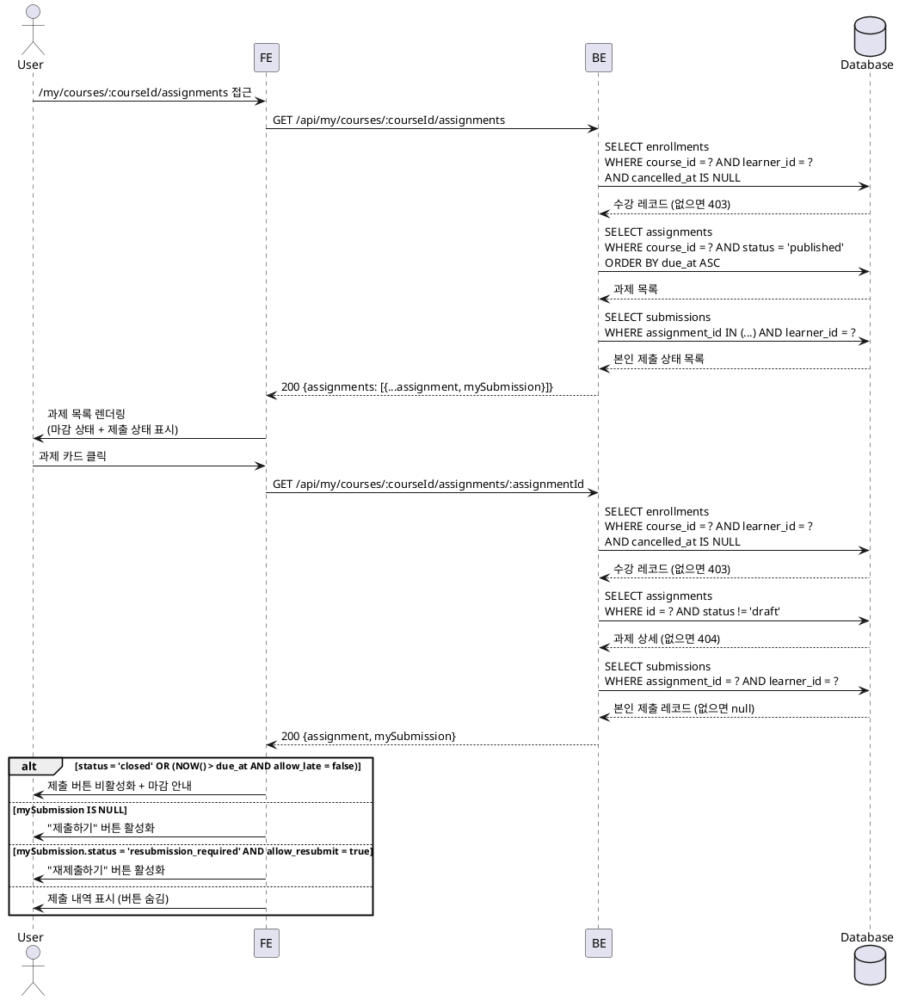

# UC-004: 과제 상세 열람 (Learner)

## Primary Actor

Learner (인증된 학습자)

## Precondition

- 로그인 상태이며 역할이 `learner`인 사용자
- 온보딩이 완료된 상태
- 해당 코스에 활성 수강 중인 상태 (`enrollments.cancelled_at IS NULL`)

---

## Trigger

사용자가 수강 중인 코스의 과제 목록 또는 과제 상세 페이지에 접근한다.

---

## Main Scenario

### 4-1. 과제 목록 조회

1. 사용자가 `/my/courses/:courseId/assignments` 페이지에 접근한다.
2. FE가 `GET /api/my/courses/:courseId/assignments`를 호출한다.
3. BE가 요청 사용자의 `enrollments` 레코드를 조회하여 활성 수강 여부를 검증한다.
   - `cancelled_at IS NULL` 인 레코드가 없으면 403 반환.
4. BE가 해당 코스의 `status = 'published'` 과제 목록을 조회한다.
5. BE가 각 과제에 대한 본인 제출 상태(`submissions` 레코드)를 함께 조회한다.
6. BE가 과제 목록을 `due_at ASC` 순으로 반환한다.
7. FE가 과제 카드 목록을 렌더링한다. 각 카드에 마감 상태(마감 전/마감 후)와 제출 상태를 표시한다.

### 4-2. 과제 상세 조회

1. 사용자가 과제 카드를 클릭하여 `/my/courses/:courseId/assignments/:assignmentId` 페이지로 이동한다.
2. FE가 `GET /api/my/courses/:courseId/assignments/:assignmentId`를 호출한다.
3. BE가 활성 수강 여부를 재검증한다.
4. BE가 `assignments.status = 'published'` 여부를 확인한다.
   - `draft` 상태이면 404 반환 (존재하지 않는 것으로 처리).
5. BE가 과제 상세 정보와 본인 제출 레코드(`submissions`)를 함께 조회하여 반환한다.
6. FE가 과제 상세 페이지를 렌더링한다.
   - 표시 항목: 제목, 설명, 마감일, 점수 비중(`weight`), 지각 허용 여부(`allow_late`), 재제출 허용 여부(`allow_resubmit`), 본인 제출 상태.
   - `assignments.status = 'closed'` 이거나 `NOW() > due_at AND allow_late = false` 인 경우 제출 버튼을 비활성화한다.
   - 미제출 상태(`submissions` 레코드 없음)이면 "제출하기" 버튼을 표시한다.
   - 이미 제출된 상태(`submissions.status = 'submitted'` 또는 `'graded'`)이면 제출 버튼을 숨기고 제출 내역을 표시한다.
   - `submissions.status = 'resubmission_required'`이고 `allow_resubmit = true`이면 "재제출하기" 버튼을 활성화한다.

---

## Edge Cases

| 상황 | 처리 |
|---|---|
| 수강하지 않은 코스의 과제 접근 | 403 반환 → "수강 중인 코스가 아닙니다" 안내 메시지 표시 |
| 수강 취소된 코스의 과제 접근 | 403 반환 → 코스 카탈로그로 유도 |
| `draft` 상태 과제 직접 URL 접근 | 404 반환 → 과제 목록으로 리다이렉트 |
| `closed` 상태 과제 열람 | 200 반환, 상세 내용은 표시하나 제출 버튼 비활성화 |
| 마감 후(`NOW() > due_at`) `allow_late = false` 과제 접근 | 200 반환, 상세 내용 표시, 제출 버튼 비활성화 및 "마감된 과제입니다" 안내 |
| 마감 후 `allow_late = true` 과제 접근 | 200 반환, 제출 버튼 활성화, "지각 제출 가능" 안내 배지 표시 |
| 인증되지 않은 접근 | 401 반환 → 로그인 페이지로 리다이렉트 |
| Instructor 역할로 접근 | 403 반환 → Instructor 전용 경로로 리다이렉트 |
| 존재하지 않는 `assignmentId` | 404 반환 → 과제 목록으로 리다이렉트 |

---

## Business Rules

- `assignments.status = 'published'` 상태의 과제만 Learner에게 열람 허용된다.
- `assignments.status = 'closed'` 상태는 강사가 수동으로 설정한 강제 마감 상태이며, 열람은 가능하되 신규 제출은 불가능하다.
- 자동 마감 조건: `status = 'published'` 이고 `NOW() > due_at` 일 때 `allow_late = false`이면 제출이 차단된다.
- 과제 열람 전 반드시 해당 코스의 활성 수강 여부(`cancelled_at IS NULL`)를 검증해야 한다.
- 본인 제출 상태는 과제 상세 응답에 포함되어야 하며, FE는 이를 기반으로 UI 상태를 결정한다.
- `allow_resubmit = false`인 경우, 제출 완료 후 재제출 버튼을 표시하지 않는다.

---

## Sequence Diagram

