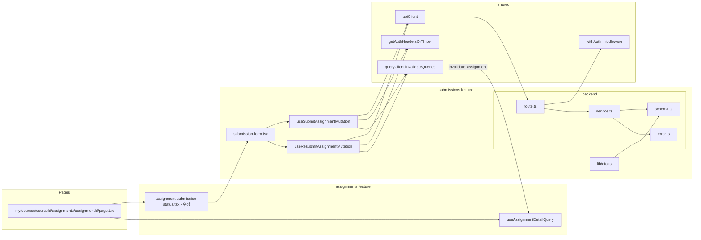

# Plan: UC-005 — 과제 제출 / 재제출 (Learner)

## 개요

`submissions` feature를 신규 생성한다.
`assignments` feature(UC-004)가 이미 구현되어 있으며, UC-005는 그 위에 제출/재제출 로직을 추가한다.

두 개의 엔드포인트(`POST /api/my/courses/:courseId/assignments/:assignmentId/submissions`,
`PUT /api/my/courses/:courseId/assignments/:assignmentId/submissions`)를 통해
신규 제출(INSERT)과 재제출(UPDATE)을 처리한다.

프론트엔드에서는 `assignment-submission-status.tsx`의 placeholder 버튼들을 실제 동작하는
제출 폼으로 연결한다.

| 모듈 | 위치 | 설명 | 상태 |
|---|---|---|---|
| submissions/error | `src/features/submissions/backend/error.ts` | 에러 코드 상수 및 union 타입 | 신규 |
| submissions/schema | `src/features/submissions/backend/schema.ts` | SubmitRequest, ResubmitRequest, SubmissionResponse zod 스키마 | 신규 |
| submissions/service | `src/features/submissions/backend/service.ts` | `submitAssignment`, `resubmitAssignment` 비즈니스 로직 | 신규 |
| submissions/route | `src/features/submissions/backend/route.ts` | `POST /api/my/courses/:courseId/assignments/:assignmentId/submissions`, `PUT` 동일 경로 | 신규 |
| submissions/dto | `src/features/submissions/lib/dto.ts` | backend/schema 타입 재노출 | 신규 |
| useSubmitAssignmentMutation | `src/features/submissions/hooks/useSubmitAssignmentMutation.ts` | 신규 제출 mutation 훅 | 신규 |
| useResubmitAssignmentMutation | `src/features/submissions/hooks/useResubmitAssignmentMutation.ts` | 재제출 mutation 훅 | 신규 |
| submission-form | `src/features/submissions/components/submission-form.tsx` | 제출/재제출 공통 폼 컴포넌트 | 신규 |
| assignment-submission-status | `src/features/assignments/components/assignment-submission-status.tsx` | placeholder 버튼을 실제 폼으로 교체 | 수정 |
| app.ts 등록 | `src/backend/hono/app.ts` | `registerSubmissionRoutes` 추가 | 수정 |

## Diagram



## 충돌 분석

### 기존 코드베이스와의 충돌 여부

| 검토 항목 | 충돌 여부 | 근거 |
|---|---|---|
| `src/features/submissions/` 디렉토리 존재 여부 | 없음 (신규 생성) | `ls src/features/` 결과: assignments, auth, courses, dashboard, enrollments, example, profiles만 존재 |
| 라우트 경로 중복 | 없음 | 기존 라우트: `/api/my/courses/:courseId/assignments`, `/api/my/courses/:courseId/assignments/:assignmentId`. 신규는 하위 경로 `/submissions` 추가 |
| `submissions` 테이블 컬럼 `content_text` | NOT NULL 제약 존재 | `0002_create_lms_tables.sql` 확인. spec에서도 `content_text` 필수. 스키마 일치 |
| `submissions` 테이블 `UNIQUE(assignment_id, learner_id)` | 활용 | 신규 제출 시 UNIQUE 충돌 → 409, 재제출은 UPDATE |
| `withAuth` 미들웨어 | 재사용 | `src/backend/middleware/auth.ts`에 정의됨 |
| `verifyEnrollment` | assignments/service.ts에서 재사용 불가 (다른 feature) | submissions/service.ts에서 동일 로직을 인라인으로 구현. 중복을 줄이려면 공통 헬퍼로 추출 가능하지만, 현재 코드베이스 패턴 상 각 feature의 service가 독립적이므로 인라인 복사 |
| `useAssignmentDetailQuery` queryKey | `['assignment', courseId, assignmentId]` | 제출 성공 후 이 키로 `invalidateQueries`하여 상세 화면 갱신 |
| `assignment-submission-status.tsx` | 수정 필요 | placeholder `disabled` 버튼을 `submission-form` 연결로 교체 |
| DB 마이그레이션 | 불필요 | `submissions` 테이블은 `0002_create_lms_tables.sql`에 이미 정의됨 |

### DB 스키마와 Spec 간 주의사항

`submissions.content_text`는 DB에서 `NOT NULL`이다. spec에서도 `content_text`는 필수 1자 이상으로 정의되어 있어 일치한다.
`content_link`는 DB에서 `text` nullable이며, spec에서도 선택 필드다.

## Implementation Plan

---

### Step 1: submissions/backend/error.ts

기존 `assignmentErrorCodes`, `enrollmentErrorCodes` 패턴을 그대로 따른다.

```typescript
// src/features/submissions/backend/error.ts
export const submissionErrorCodes = {
  forbidden: 'FORBIDDEN',                              // 401/403
  enrollmentRequired: 'ENROLLMENT_REQUIRED',           // 403: 수강 중이 아닌 경우
  assignmentNotFound: 'ASSIGNMENT_NOT_FOUND',          // 404: 과제 없음 또는 draft
  submissionNotFound: 'SUBMISSION_NOT_FOUND',          // 404: 재제출 대상 레코드 없음
  assignmentClosed: 'ASSIGNMENT_CLOSED',               // 409: status = 'closed'
  lateSubmissionBlocked: 'LATE_SUBMISSION_BLOCKED',    // 409: 마감 후 allow_late = false
  alreadySubmitted: 'ALREADY_SUBMITTED',               // 409: 신규 제출 시 이미 레코드 존재
  resubmitNotAllowed: 'RESUBMIT_NOT_ALLOWED',          // 403: allow_resubmit = false
  resubmitNotRequested: 'RESUBMIT_NOT_REQUESTED',      // 409: status != 'resubmission_required'
  fetchError: 'SUBMISSION_FETCH_ERROR',                // 500
} as const;

type SubmissionErrorValue = (typeof submissionErrorCodes)[keyof typeof submissionErrorCodes];
export type SubmissionServiceError = SubmissionErrorValue;
```

---

### Step 2: submissions/backend/schema.ts

요청 스키마는 `content_text`(필수), `content_link`(선택 URL)를 정의한다.
응답 스키마는 제출 레코드 전체를 반환한다.
`content_link`는 `z.string().url()` 대신 `z.string()` 후 별도 url 검증을 하거나, `z.string().url().optional().or(z.literal(''))`를 사용할 수 있으나, FE에서 이미 URL 검증을 하고 BE는 형식 검증만 한다. 비어있는 문자열 대신 `undefined`/`null`로 처리하는 구조를 취한다.

```typescript
// src/features/submissions/backend/schema.ts
import { z } from 'zod';

export const SubmitRequestSchema = z.object({
  contentText: z.string().min(1, '내용을 입력해주세요.'),
  contentLink: z.string().url('유효한 URL 형식이 아닙니다.').optional(),
});

export const ResubmitRequestSchema = z.object({
  contentText: z.string().min(1, '내용을 입력해주세요.'),
  contentLink: z.string().url('유효한 URL 형식이 아닙니다.').optional(),
});

export const SubmissionResponseSchema = z.object({
  id: z.string().uuid(),
  assignmentId: z.string().uuid(),
  learnerId: z.string().uuid(),
  contentText: z.string(),
  contentLink: z.string().nullable(),
  isLate: z.boolean(),
  status: z.enum(['submitted', 'graded', 'resubmission_required']),
  score: z.number().int().nullable(),
  feedback: z.string().nullable(),
  submittedAt: z.string(),
  gradedAt: z.string().nullable(),
});

export const SubmitResponseSchema = z.object({
  submission: SubmissionResponseSchema,
});

export type SubmitRequest = z.infer<typeof SubmitRequestSchema>;
export type ResubmitRequest = z.infer<typeof ResubmitRequestSchema>;
export type SubmissionResponse = z.infer<typeof SubmissionResponseSchema>;
export type SubmitResponse = z.infer<typeof SubmitResponseSchema>;
```

---

### Step 3: submissions/backend/service.ts

`verifyEnrollmentForSubmission`을 순수 헬퍼로 분리한다 (assignments/service.ts의 `verifyEnrollment`와 동일한 로직이지만, feature 간 직접 import를 피하기 위해 submissions feature 내에 자체 정의).

신규 제출(`submitAssignment`)과 재제출(`resubmitAssignment`)을 분리된 함수로 구현한다.

```typescript
// src/features/submissions/backend/service.ts
import type { SupabaseClient } from '@supabase/supabase-js';
import { failure, success, type HandlerResult } from '@/backend/http/response';
import { submissionErrorCodes, type SubmissionServiceError } from './error';
import type { SubmitRequest, SubmitResponse, SubmissionResponse } from './schema';

// --- 내부 Row 타입 ---
type AssignmentRow = {
  id: string;
  status: 'published' | 'closed';
  due_at: string;
  allow_late: boolean;
  allow_resubmit: boolean;
};

type SubmissionRow = {
  id: string;
  assignment_id: string;
  learner_id: string;
  content_text: string;
  content_link: string | null;
  is_late: boolean;
  status: 'submitted' | 'graded' | 'resubmission_required';
  score: number | null;
  feedback: string | null;
  submitted_at: string;
  graded_at: string | null;
};

// --- mapper ---
const mapSubmissionRow = (row: SubmissionRow): SubmissionResponse => ({
  id: row.id,
  assignmentId: row.assignment_id,
  learnerId: row.learner_id,
  contentText: row.content_text,
  contentLink: row.content_link,
  isLate: row.is_late,
  status: row.status,
  score: row.score,
  feedback: row.feedback,
  submittedAt: row.submitted_at,
  gradedAt: row.graded_at,
});

// --- 수강 여부 검증 헬퍼 ---
const verifyEnrollmentForSubmission = async (
  supabase: SupabaseClient,
  courseId: string,
  learnerId: string,
): Promise<HandlerResult<null, SubmissionServiceError>> => {
  const { data, error } = await supabase
    .from('enrollments')
    .select('id')
    .eq('course_id', courseId)
    .eq('learner_id', learnerId)
    .is('cancelled_at', null)
    .maybeSingle();

  if (error) {
    return failure(500, submissionErrorCodes.fetchError, error.message);
  }

  if (!data) {
    return failure(403, submissionErrorCodes.enrollmentRequired, '수강 중인 코스가 아닙니다.');
  }

  return success(null);
};

// --- 마감 판단 헬퍼 ---
// returns: { blocked: true, reason } | { blocked: false, isLate: boolean }
type DeadlineCheck =
  | { blocked: true; reason: 'closed' | 'late_not_allowed' }
  | { blocked: false; isLate: boolean };

const checkDeadline = (assignment: AssignmentRow): DeadlineCheck => {
  if (assignment.status === 'closed') {
    return { blocked: true, reason: 'closed' };
  }

  const isPastDue = new Date() > new Date(assignment.due_at);

  if (isPastDue && !assignment.allow_late) {
    return { blocked: true, reason: 'late_not_allowed' };
  }

  return { blocked: false, isLate: isPastDue };
};

// --- 신규 제출 ---
export const submitAssignment = async (
  supabase: SupabaseClient,
  courseId: string,
  assignmentId: string,
  learnerId: string,
  payload: SubmitRequest,
): Promise<HandlerResult<SubmitResponse, SubmissionServiceError>> => {
  // 1. 수강 여부 검증
  const enrollmentCheck = await verifyEnrollmentForSubmission(supabase, courseId, learnerId);
  if (!enrollmentCheck.ok) return enrollmentCheck;

  // 2. 과제 조회 (published만 허용: draft → 404, closed → 마감 처리)
  const { data: assignmentRaw, error: assignmentError } = await supabase
    .from('assignments')
    .select('id, status, due_at, allow_late, allow_resubmit')
    .eq('id', assignmentId)
    .eq('course_id', courseId)
    .neq('status', 'draft')
    .maybeSingle();

  if (assignmentError) {
    return failure(500, submissionErrorCodes.fetchError, assignmentError.message);
  }

  if (!assignmentRaw) {
    return failure(404, submissionErrorCodes.assignmentNotFound, '과제를 찾을 수 없습니다.');
  }

  const assignment = assignmentRaw as unknown as AssignmentRow;

  // 3. 마감 여부 판단
  const deadlineCheck = checkDeadline(assignment);
  if (deadlineCheck.blocked) {
    if (deadlineCheck.reason === 'closed') {
      return failure(409, submissionErrorCodes.assignmentClosed, '강사에 의해 마감된 과제입니다.');
    }
    return failure(409, submissionErrorCodes.lateSubmissionBlocked, '제출 마감 시간이 지났습니다.');
  }

  // 4. 기존 제출 레코드 확인 (UNIQUE 충돌 사전 방지)
  const { data: existingSubmission, error: existingError } = await supabase
    .from('submissions')
    .select('id')
    .eq('assignment_id', assignmentId)
    .eq('learner_id', learnerId)
    .maybeSingle();

  if (existingError) {
    return failure(500, submissionErrorCodes.fetchError, existingError.message);
  }

  if (existingSubmission) {
    return failure(409, submissionErrorCodes.alreadySubmitted, '이미 제출한 과제입니다.');
  }

  // 5. INSERT
  const { data: inserted, error: insertError } = await supabase
    .from('submissions')
    .insert({
      assignment_id: assignmentId,
      learner_id: learnerId,
      content_text: payload.contentText,
      content_link: payload.contentLink ?? null,
      is_late: deadlineCheck.isLate,
      status: 'submitted',
      submitted_at: new Date().toISOString(),
    })
    .select(
      'id, assignment_id, learner_id, content_text, content_link, is_late, status, score, feedback, submitted_at, graded_at',
    )
    .single();

  if (insertError) {
    return failure(500, submissionErrorCodes.fetchError, insertError.message);
  }

  return success({ submission: mapSubmissionRow(inserted as unknown as SubmissionRow) }, 201);
};

// --- 재제출 ---
export const resubmitAssignment = async (
  supabase: SupabaseClient,
  courseId: string,
  assignmentId: string,
  learnerId: string,
  payload: SubmitRequest,
): Promise<HandlerResult<SubmitResponse, SubmissionServiceError>> => {
  // 1. 수강 여부 검증
  const enrollmentCheck = await verifyEnrollmentForSubmission(supabase, courseId, learnerId);
  if (!enrollmentCheck.ok) return enrollmentCheck;

  // 2. 과제 조회
  const { data: assignmentRaw, error: assignmentError } = await supabase
    .from('assignments')
    .select('id, status, due_at, allow_late, allow_resubmit')
    .eq('id', assignmentId)
    .eq('course_id', courseId)
    .neq('status', 'draft')
    .maybeSingle();

  if (assignmentError) {
    return failure(500, submissionErrorCodes.fetchError, assignmentError.message);
  }

  if (!assignmentRaw) {
    return failure(404, submissionErrorCodes.assignmentNotFound, '과제를 찾을 수 없습니다.');
  }

  const assignment = assignmentRaw as unknown as AssignmentRow;

  // 3. 기존 제출 레코드 조회
  const { data: existingRaw, error: existingError } = await supabase
    .from('submissions')
    .select(
      'id, assignment_id, learner_id, content_text, content_link, is_late, status, score, feedback, submitted_at, graded_at',
    )
    .eq('assignment_id', assignmentId)
    .eq('learner_id', learnerId)
    .maybeSingle();

  if (existingError) {
    return failure(500, submissionErrorCodes.fetchError, existingError.message);
  }

  if (!existingRaw) {
    return failure(404, submissionErrorCodes.submissionNotFound, '기존 제출 내역이 없습니다.');
  }

  const existing = existingRaw as unknown as SubmissionRow;

  // 4. 재제출 가능 여부 검증 (순서: allow_resubmit → status → 마감)
  if (!assignment.allow_resubmit) {
    return failure(403, submissionErrorCodes.resubmitNotAllowed, '재제출이 허용되지 않는 과제입니다.');
  }

  if (existing.status !== 'resubmission_required') {
    return failure(409, submissionErrorCodes.resubmitNotRequested, '재제출 요청 상태가 아닙니다.');
  }

  // 5. 마감 여부 판단
  const deadlineCheck = checkDeadline(assignment);
  if (deadlineCheck.blocked) {
    if (deadlineCheck.reason === 'closed') {
      return failure(409, submissionErrorCodes.assignmentClosed, '강사에 의해 마감된 과제입니다.');
    }
    return failure(409, submissionErrorCodes.lateSubmissionBlocked, '제출 마감 시간이 지났습니다.');
  }

  // 6. UPDATE
  const { data: updated, error: updateError } = await supabase
    .from('submissions')
    .update({
      content_text: payload.contentText,
      content_link: payload.contentLink ?? null,
      is_late: deadlineCheck.isLate,
      status: 'submitted',
      score: null,
      feedback: null,
      graded_at: null,
      submitted_at: new Date().toISOString(),
    })
    .eq('assignment_id', assignmentId)
    .eq('learner_id', learnerId)
    .select(
      'id, assignment_id, learner_id, content_text, content_link, is_late, status, score, feedback, submitted_at, graded_at',
    )
    .single();

  if (updateError) {
    return failure(500, submissionErrorCodes.fetchError, updateError.message);
  }

  return success({ submission: mapSubmissionRow(updated as unknown as SubmissionRow) });
};
```

**Unit Test**

```typescript
describe('submitAssignment', () => {
  it('마감 전 정상 제출 → 201, status=submitted, is_late=false')
  it('마감 후 allow_late=true → 201, is_late=true')
  it('마감 후 allow_late=false → 409 LATE_SUBMISSION_BLOCKED')
  it('assignment.status=closed → 409 ASSIGNMENT_CLOSED')
  it('이미 제출 레코드 존재 → 409 ALREADY_SUBMITTED')
  it('draft 과제 접근 → 404 ASSIGNMENT_NOT_FOUND')
  it('수강 중이 아닌 경우 → 403 ENROLLMENT_REQUIRED')
  it('content_link 없이 content_text만 입력 → 201 정상 제출 (link=null)')
  it('content_link 있으면 DB에 저장됨')
})

describe('resubmitAssignment', () => {
  it('allow_resubmit=true + status=resubmission_required + 마감 전 → 200, status=submitted, score=null, feedback=null, graded_at=null')
  it('마감 후 allow_late=true → 200, is_late=true')
  it('allow_resubmit=false → 403 RESUBMIT_NOT_ALLOWED')
  it('status != resubmission_required (submitted) → 409 RESUBMIT_NOT_REQUESTED')
  it('status != resubmission_required (graded) → 409 RESUBMIT_NOT_REQUESTED')
  it('assignment.status=closed → 409 ASSIGNMENT_CLOSED')
  it('마감 후 allow_late=false → 409 LATE_SUBMISSION_BLOCKED')
  it('기존 제출 레코드 없음 → 404 SUBMISSION_NOT_FOUND')
  it('수강 중이 아닌 경우 → 403 ENROLLMENT_REQUIRED')
})
```

---

### Step 4: submissions/backend/route.ts

`withAuth()` 적용 후 `role !== 'learner'`이면 403 반환.
UUID 검증에는 기존 `@/constants/validation`의 `UUID_REGEX`를 재사용한다.
라우트 경로는 `/api/my/courses/:courseId/assignments/:assignmentId/submissions`.

```typescript
// src/features/submissions/backend/route.ts
import type { Hono } from 'hono';
import { respond, failure } from '@/backend/http/response';
import { withAuth } from '@/backend/middleware/auth';
import { getCurrentUser, getSupabase, type AppEnv } from '@/backend/hono/context';
import { UUID_REGEX } from '@/constants/validation';
import { submissionErrorCodes } from './error';
import { SubmitRequestSchema } from './schema';
import { submitAssignment, resubmitAssignment } from './service';

export const registerSubmissionRoutes = (app: Hono<AppEnv>) => {
  // 신규 제출
  app.post(
    '/api/my/courses/:courseId/assignments/:assignmentId/submissions',
    withAuth(),
    async (c) => {
      const currentUser = getCurrentUser(c);

      if (!currentUser) {
        return respond(c, failure(401, submissionErrorCodes.forbidden, '인증이 필요합니다.'));
      }

      if (currentUser.role !== 'learner') {
        return respond(c, failure(403, submissionErrorCodes.forbidden, '학습자만 접근할 수 있습니다.'));
      }

      const courseId = c.req.param('courseId');
      const assignmentId = c.req.param('assignmentId');

      if (!UUID_REGEX.test(courseId) || !UUID_REGEX.test(assignmentId)) {
        return respond(c, failure(400, submissionErrorCodes.fetchError, '올바르지 않은 ID입니다.'));
      }

      const body = await c.req.json();
      const parsed = SubmitRequestSchema.safeParse(body);

      if (!parsed.success) {
        return respond(
          c,
          failure(400, submissionErrorCodes.fetchError, parsed.error.errors[0]?.message ?? '입력값이 올바르지 않습니다.'),
        );
      }

      const supabase = getSupabase(c);
      const result = await submitAssignment(
        supabase,
        courseId,
        assignmentId,
        currentUser.id,
        parsed.data,
      );
      return respond(c, result);
    },
  );

  // 재제출
  app.put(
    '/api/my/courses/:courseId/assignments/:assignmentId/submissions',
    withAuth(),
    async (c) => {
      const currentUser = getCurrentUser(c);

      if (!currentUser) {
        return respond(c, failure(401, submissionErrorCodes.forbidden, '인증이 필요합니다.'));
      }

      if (currentUser.role !== 'learner') {
        return respond(c, failure(403, submissionErrorCodes.forbidden, '학습자만 접근할 수 있습니다.'));
      }

      const courseId = c.req.param('courseId');
      const assignmentId = c.req.param('assignmentId');

      if (!UUID_REGEX.test(courseId) || !UUID_REGEX.test(assignmentId)) {
        return respond(c, failure(400, submissionErrorCodes.fetchError, '올바르지 않은 ID입니다.'));
      }

      const body = await c.req.json();
      const parsed = SubmitRequestSchema.safeParse(body);

      if (!parsed.success) {
        return respond(
          c,
          failure(400, submissionErrorCodes.fetchError, parsed.error.errors[0]?.message ?? '입력값이 올바르지 않습니다.'),
        );
      }

      const supabase = getSupabase(c);
      const result = await resubmitAssignment(
        supabase,
        courseId,
        assignmentId,
        currentUser.id,
        parsed.data,
      );
      return respond(c, result);
    },
  );
};
```

**Unit Test**

```typescript
describe('POST /api/my/courses/:courseId/assignments/:assignmentId/submissions', () => {
  it('미인증 요청 → 401')
  it('instructor 역할 → 403')
  it('비정상 UUID → 400')
  it('contentText 빈 문자열 → 400 (zod validation)')
  it('learner + 유효 입력 → 201 SubmitResponse')
})

describe('PUT /api/my/courses/:courseId/assignments/:assignmentId/submissions', () => {
  it('미인증 요청 → 401')
  it('instructor 역할 → 403')
  it('비정상 UUID → 400')
  it('contentText 빈 문자열 → 400 (zod validation)')
  it('learner + 유효 입력 → 200 SubmitResponse')
})
```

---

### Step 5: submissions/lib/dto.ts

기존 `assignments/lib/dto.ts`, `enrollments/lib/dto.ts` 패턴을 따른다.

```typescript
// src/features/submissions/lib/dto.ts
export {
  SubmitRequestSchema,
  ResubmitRequestSchema,
  SubmissionResponseSchema,
  SubmitResponseSchema,
} from '@/features/submissions/backend/schema';

export type {
  SubmitRequest,
  ResubmitRequest,
  SubmissionResponse,
  SubmitResponse,
} from '@/features/submissions/backend/schema';
```

---

### Step 6: submissions/hooks/useSubmitAssignmentMutation.ts

기존 `useEnrollMutation` 패턴을 따른다.
성공 후 `queryClient.invalidateQueries({ queryKey: ['assignment', courseId, assignmentId] })`로
과제 상세 화면의 `mySubmission`을 갱신한다.

```typescript
// src/features/submissions/hooks/useSubmitAssignmentMutation.ts
'use client';

import { useMutation, useQueryClient } from '@tanstack/react-query';
import { apiClient, extractApiErrorMessage } from '@/lib/remote/api-client';
import { getAuthHeadersOrThrow } from '@/lib/remote/auth-headers';
import { SubmitResponseSchema } from '@/features/submissions/lib/dto';
import type { SubmitRequest, SubmitResponse } from '@/features/submissions/lib/dto';

type SubmitParams = {
  courseId: string;
  assignmentId: string;
  payload: SubmitRequest;
};

const submitAssignment = async ({
  courseId,
  assignmentId,
  payload,
}: SubmitParams): Promise<SubmitResponse> => {
  const headers = await getAuthHeadersOrThrow();

  try {
    const { data } = await apiClient.post(
      `/api/my/courses/${courseId}/assignments/${assignmentId}/submissions`,
      payload,
      { headers },
    );
    return SubmitResponseSchema.parse(data);
  } catch (error) {
    const message = extractApiErrorMessage(error, '과제 제출에 실패했습니다.');
    throw new Error(message);
  }
};

export const useSubmitAssignmentMutation = (courseId: string, assignmentId: string) => {
  const queryClient = useQueryClient();

  return useMutation<SubmitResponse, Error, SubmitRequest>({
    mutationFn: (payload) => submitAssignment({ courseId, assignmentId, payload }),
    onSuccess: () => {
      queryClient.invalidateQueries({ queryKey: ['assignment', courseId, assignmentId] });
    },
    throwOnError: false,
  });
};
```

---

### Step 7: submissions/hooks/useResubmitAssignmentMutation.ts

`useSubmitAssignmentMutation`과 동일 구조, HTTP method만 `PUT`으로 변경한다.

```typescript
// src/features/submissions/hooks/useResubmitAssignmentMutation.ts
'use client';

import { useMutation, useQueryClient } from '@tanstack/react-query';
import { apiClient, extractApiErrorMessage } from '@/lib/remote/api-client';
import { getAuthHeadersOrThrow } from '@/lib/remote/auth-headers';
import { SubmitResponseSchema } from '@/features/submissions/lib/dto';
import type { SubmitRequest, SubmitResponse } from '@/features/submissions/lib/dto';

type ResubmitParams = {
  courseId: string;
  assignmentId: string;
  payload: SubmitRequest;
};

const resubmitAssignment = async ({
  courseId,
  assignmentId,
  payload,
}: ResubmitParams): Promise<SubmitResponse> => {
  const headers = await getAuthHeadersOrThrow();

  try {
    const { data } = await apiClient.put(
      `/api/my/courses/${courseId}/assignments/${assignmentId}/submissions`,
      payload,
      { headers },
    );
    return SubmitResponseSchema.parse(data);
  } catch (error) {
    const message = extractApiErrorMessage(error, '재제출에 실패했습니다.');
    throw new Error(message);
  }
};

export const useResubmitAssignmentMutation = (courseId: string, assignmentId: string) => {
  const queryClient = useQueryClient();

  return useMutation<SubmitResponse, Error, SubmitRequest>({
    mutationFn: (payload) => resubmitAssignment({ courseId, assignmentId, payload }),
    onSuccess: () => {
      queryClient.invalidateQueries({ queryKey: ['assignment', courseId, assignmentId] });
    },
    throwOnError: false,
  });
};
```

---

### Step 8: submissions/components/submission-form.tsx

`react-hook-form` + `zod` resolver로 클라이언트 측 검증을 처리한다.
신규 제출과 재제출을 모두 처리하는 공통 폼 컴포넌트다. `mode` prop으로 분기한다.
재제출 시 기존 제출 내용을 `defaultValues`로 pre-fill한다.

shadcn-ui 컴포넌트: `Textarea`, `Input`, `Button`, `Label`을 사용한다.
(설치 필요 시: `$ npx shadcn@latest add textarea`)

컴포넌트 props:

```typescript
type SubmissionFormProps = {
  courseId: string;
  assignmentId: string;
  mode: 'submit' | 'resubmit';
  defaultValues?: {
    contentText: string;
    contentLink?: string;
  };
  onSuccess?: () => void;
  onCancel?: () => void;
};
```

동작:
- `content_text`: `<Textarea>` 필수 입력. 1자 이상 아니면 인라인 에러 표시.
- `content_link`: `<Input>` 선택 입력. 입력 시 URL 형식 검증. 빈 문자열이면 `undefined`로 변환하여 payload 전달.
- 제출 중 버튼 로딩 스피너 표시, 중복 제출 방지.
- 성공 시 토스트 메시지 표시 후 `onSuccess()` 호출.
  - 신규 제출: "제출이 완료되었습니다."
  - 재제출: "재제출이 완료되었습니다."
  - `is_late=true` 응답: "지각 제출로 처리되었습니다." 추가 안내.
- 실패 시 에러 메시지를 폼 상단에 표시.
- 취소 버튼은 `onCancel()` 호출.

```typescript
// src/features/submissions/components/submission-form.tsx
'use client';

import { useForm } from 'react-hook-form';
import { zodResolver } from '@hookform/resolvers/zod';
import { match } from 'ts-pattern';
import { Loader2 } from 'lucide-react';
import { Button } from '@/components/ui/button';
import { Textarea } from '@/components/ui/textarea';
import { Input } from '@/components/ui/input';
import { Label } from '@/components/ui/label';
import { useSubmitAssignmentMutation } from '@/features/submissions/hooks/useSubmitAssignmentMutation';
import { useResubmitAssignmentMutation } from '@/features/submissions/hooks/useResubmitAssignmentMutation';
import { SubmitRequestSchema } from '@/features/submissions/lib/dto';
import type { SubmitRequest } from '@/features/submissions/lib/dto';
// ... 컴포넌트 구현
```

**QA Sheet**

| 시나리오 | 기대 결과 |
|---|---|
| contentText 빈칸 제출 | "내용을 입력해주세요." 인라인 에러, 제출 버튼 비활성 |
| contentLink URL 형식 오류 | "유효한 URL 형식이 아닙니다." 인라인 에러 |
| contentLink 빈칸 (선택 필드) | 에러 없이 제출 허용 |
| 정상 제출 (텍스트만) | 성공 토스트 + onSuccess 콜백 |
| 정상 제출 (텍스트 + 링크) | 성공 토스트 + onSuccess 콜백 |
| 지각 제출 (is_late=true 응답) | 성공 토스트 + "지각 제출로 처리되었습니다." 추가 안내 |
| 409 ASSIGNMENT_CLOSED | "강사에 의해 마감된 과제입니다." 폼 상단 에러 |
| 409 LATE_SUBMISSION_BLOCKED | "제출 마감 시간이 지났습니다." 폼 상단 에러 |
| 409 ALREADY_SUBMITTED | "이미 제출한 과제입니다." 폼 상단 에러 |
| 제출 중 버튼 상태 | 로딩 스피너 표시, 중복 제출 방지 |
| 재제출 모드 진입 | 기존 contentText/contentLink가 폼에 pre-fill |

---

### Step 9: assignment-submission-status.tsx 수정

UC-004 구현 시 `disabled` placeholder로 남겨진 두 버튼을 `submission-form`으로 교체한다.

변경 내용:
- `no_submission` 상태: "제출하기" 버튼 클릭 시 `submission-form`을 인라인으로 표시한다 (별도 페이지 이동 없이 토글).
- `resubmit` 상태: "재제출하기" 버튼 클릭 시 `submission-form`을 `mode='resubmit'`, `defaultValues`로 기존 내용을 pre-fill하여 표시한다.
- 폼 성공 시 `queryClient.invalidateQueries`는 훅 내부에서 이미 처리되므로, `onSuccess` 콜백으로 폼 UI를 닫는 것만 처리한다.

```typescript
// src/features/assignments/components/assignment-submission-status.tsx 수정 부분 (핵심)
import { useState } from 'react';
import { SubmissionForm } from '@/features/submissions/components/submission-form';

// no_submission 케이스
.with({ type: 'no_submission' }, () => {
  if (showForm) {
    return (
      <SubmissionForm
        courseId={courseId}
        assignmentId={assignmentId}
        mode="submit"
        onSuccess={() => setShowForm(false)}
        onCancel={() => setShowForm(false)}
      />
    );
  }
  return (
    <Button onClick={() => setShowForm(true)}>제출하기</Button>
  );
})

// resubmit 케이스
.with({ type: 'resubmit' }, ({ submission }) => {
  if (showForm) {
    return (
      <SubmissionForm
        courseId={courseId}
        assignmentId={assignmentId}
        mode="resubmit"
        defaultValues={{
          contentText: submission.contentText ?? '',
          contentLink: submission.contentLink ?? undefined,
        }}
        onSuccess={() => setShowForm(false)}
        onCancel={() => setShowForm(false)}
      />
    );
  }
  return (
    <Button onClick={() => setShowForm(true)}>재제출하기</Button>
  );
})
```

`AssignmentSubmissionStatusProps`에 `courseId`, `assignmentId`를 추가로 받아야 한다.
이를 위해 과제 상세 페이지(`[assignmentId]/page.tsx`)에서 props를 전달한다.

```typescript
// 기존
<AssignmentSubmissionStatus assignment={assignment} />

// 수정
<AssignmentSubmissionStatus
  assignment={assignment}
  courseId={courseId}
  assignmentId={assignmentId}
/>
```

**QA Sheet**

| 시나리오 | 기대 결과 |
|---|---|
| mySubmission=null + 마감 전 | "제출하기" 버튼 표시 |
| "제출하기" 클릭 | 인라인 폼 표시 (페이지 이동 없음) |
| 폼에서 취소 클릭 | 폼 닫힘, "제출하기" 버튼 복원 |
| 폼 제출 성공 | 폼 닫힘, 과제 상세 데이터 갱신 (제출 내역 표시) |
| resubmission_required + allowResubmit=true | "재제출하기" 버튼 표시 |
| "재제출하기" 클릭 | 기존 내용 pre-fill된 폼 표시 |
| 재제출 성공 | 폼 닫힘, 과제 상세 데이터 갱신 |

---

### Step 10: app.ts 등록

기존 `registerAssignmentRoutes(app)` 다음 줄에 추가한다.

```typescript
// src/backend/hono/app.ts 수정 부분
import { registerSubmissionRoutes } from '@/features/submissions/backend/route';

// createHonoApp 내부 registerAssignmentRoutes(app); 다음에 추가
registerSubmissionRoutes(app);
```

---

## 공유 모듈 의존 관계

| UC-005에서 사용 | 출처 | 비고 |
|---|---|---|
| `withAuth` | `src/backend/middleware/auth.ts` | 기존 구현 재사용 |
| `UUID_REGEX` | `src/constants/validation.ts` | 기존 구현 재사용 |
| `success`, `failure`, `respond` | `src/backend/http/response.ts` | 기존 구현 재사용 |
| `getSupabase`, `getCurrentUser` | `src/backend/hono/context.ts` | 기존 구현 재사용 |
| `apiClient`, `extractApiErrorMessage` | `src/lib/remote/api-client.ts` | 기존 구현 재사용 |
| `getAuthHeadersOrThrow` | `src/lib/remote/auth-headers.ts` | 기존 구현 재사용 |
| `useRoleGuard` | `src/hooks/useRoleGuard.ts` | 기존 구현 재사용 (페이지 레벨, 변경 없음) |
| `AssignmentDto`, `MySubmissionDto` | `src/features/assignments/lib/dto.ts` | 기존 구현 재사용 (submission-status 컴포넌트에서) |
| `useAssignmentDetailQuery` queryKey | `['assignment', courseId, assignmentId]` | invalidateQueries 타겟 |

## 신규 마이그레이션

불필요. `submissions` 테이블은 `0002_create_lms_tables.sql`에 이미 정의되어 있다.

## 신규 shadcn-ui 컴포넌트

`submission-form.tsx`에서 `Textarea`가 필요하다. 미설치 시:

```
$ npx shadcn@latest add textarea
```

`Input`, `Label`, `Button`은 이미 설치되어 있을 가능성이 높으나, 없다면 함께 설치한다.
