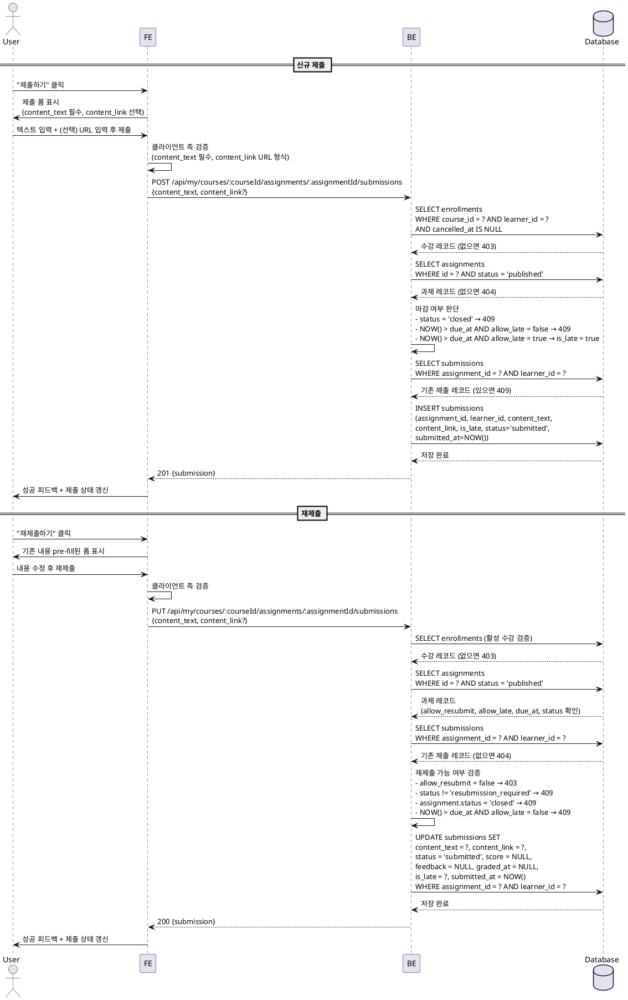

# UC-005: 과제 제출 / 재제출 (Learner)

## Primary Actor

Learner (인증된 학습자)

## Precondition

- 로그인 상태이며 역할이 `learner`인 사용자
- 해당 코스에 활성 수강 중인 상태 (`enrollments.cancelled_at IS NULL`)
- 대상 과제가 `assignments.status = 'published'` 상태
- 신규 제출: 해당 과제에 기존 제출 레코드가 없음
- 재제출: 기존 제출 레코드의 `status = 'resubmission_required'` 이고 `assignments.allow_resubmit = true`

---

## Trigger

사용자가 과제 상세 페이지에서 "제출하기" 또는 "재제출하기" 버튼을 클릭하고 폼을 제출한다.

---

## Main Scenario

### 5-1. 신규 제출

1. 사용자가 과제 상세 페이지에서 "제출하기" 버튼을 클릭한다.
2. FE가 제출 폼을 표시한다. (텍스트 필드 필수, 링크 필드 선택)
3. 사용자가 텍스트 내용을 입력하고 선택적으로 URL 링크를 입력한다.
4. FE가 입력값을 클라이언트 측에서 검증한다.
   - `content_text`: 필수, 1자 이상
   - `content_link`: 선택, 입력 시 유효한 URL 형식이어야 함
5. FE가 `POST /api/my/courses/:courseId/assignments/:assignmentId/submissions`를 호출한다.
6. BE가 활성 수강 여부를 검증한다.
7. BE가 과제 상태 및 제출 가능 여부를 검증한다.
   - `assignments.status = 'closed'`이면 409 반환 (강제 마감).
   - `NOW() > due_at` 이고 `allow_late = false`이면 409 반환 (마감 초과).
   - `NOW() > due_at` 이고 `allow_late = true`이면 `is_late = true`로 설정.
8. BE가 `UNIQUE(assignment_id, learner_id)` 충돌 여부를 확인한다. 기존 레코드가 있으면 409 반환.
9. BE가 `submissions` 테이블에 INSERT한다.
   - `status = 'submitted'`
   - `is_late`: 마감 전이면 `false`, 마감 후 지각 허용이면 `true`
   - `submitted_at = NOW()`
10. BE가 성공 응답을 반환한다.
11. FE가 성공 피드백을 표시하고 과제 상세 페이지의 제출 상태를 갱신한다.

### 5-2. 재제출

1. 사용자가 과제 상세 페이지에서 "재제출하기" 버튼을 클릭한다.
   - 이 버튼은 `submissions.status = 'resubmission_required'`이고 `assignments.allow_resubmit = true`일 때만 표시된다.
2. FE가 기존 제출 내용을 폼에 pre-fill하여 표시한다.
3. 사용자가 내용을 수정하고 재제출한다.
4. FE가 클라이언트 측 검증을 수행한다. (신규 제출과 동일)
5. FE가 `PUT /api/my/courses/:courseId/assignments/:assignmentId/submissions`를 호출한다.
6. BE가 활성 수강 여부를 검증한다.
7. BE가 재제출 가능 여부를 검증한다.
   - 기존 제출 레코드가 없으면 404 반환.
   - `submissions.status != 'resubmission_required'`이면 409 반환.
   - `assignments.allow_resubmit = false`이면 403 반환.
   - `assignments.status = 'closed'`이면 409 반환.
   - `NOW() > due_at` 이고 `allow_late = false`이면 409 반환.
8. BE가 기존 `submissions` 레코드를 UPDATE한다.
   - `content_text`, `content_link` 갱신
   - `status = 'submitted'` 으로 초기화
   - `score = NULL`, `feedback = NULL` 초기화
   - `graded_at = NULL` 초기화
   - `is_late`: 마감 전이면 `false`, 마감 후 지각 허용이면 `true`
   - `submitted_at = NOW()` 갱신
9. BE가 성공 응답을 반환한다.
10. FE가 성공 피드백을 표시하고 제출 상태를 갱신한다.

---

## Edge Cases

| 상황 | 처리 |
|---|---|
| `content_text` 미입력 | 클라이언트 측 검증 차단 → 필드 인라인 오류 표시, 제출 버튼 비활성화 |
| `content_link` 형식 오류 (URL이 아닌 값) | 클라이언트 측 검증 차단 → "유효한 URL 형식이 아닙니다" 안내 |
| `assignments.status = 'closed'` 상태에서 제출 시도 | 409 반환 → "강사에 의해 마감된 과제입니다" 안내 메시지 |
| 마감 후 `allow_late = false` 과제 제출 시도 | 409 반환 → "제출 마감 시간이 지났습니다" 안내 메시지 |
| 마감 후 `allow_late = true` 과제 제출 | `is_late = true`로 저장, FE에 "지각 제출로 처리되었습니다" 안내 |
| 이미 `submitted` 또는 `graded` 상태 과제에 신규 제출 시도 | 409 반환 → FE에서 제출 버튼 미표시로 사전 차단 |
| `allow_resubmit = false`인 과제의 재제출 시도 | 403 반환 → FE에서 재제출 버튼 미표시로 사전 차단 |
| `resubmission_required` 상태가 아닌 제출물에 재제출 시도 | 409 반환 → FE에서 재제출 버튼 미표시로 사전 차단 |
| 수강하지 않은 코스의 과제 제출 시도 | 403 반환 → "수강 중인 코스가 아닙니다" 안내 메시지 |
| 인증되지 않은 요청 | 401 반환 → 로그인 페이지로 리다이렉트 |

---

## Business Rules

- `content_text`는 필수 입력 항목이며 1자 이상이어야 한다.
- `content_link`는 선택 입력 항목이며, 입력 시 유효한 URL 형식이어야 한다.
- `UNIQUE(assignment_id, learner_id)` 제약으로 인해 동일 과제에 대해 하나의 제출 레코드만 존재한다. 신규 제출은 INSERT, 재제출은 UPDATE로 처리한다.
- 마감 전 제출: `is_late = false`, 마감 후 지각 허용 제출: `is_late = true`.
- `assignments.status = 'closed'`이면 지각 허용 여부와 무관하게 제출이 차단된다.
- 재제출 시 기존 채점 결과(`score`, `feedback`, `graded_at`)는 NULL로 초기화되며 `status`는 `submitted`로 복원된다.
- 재제출은 `submissions.status = 'resubmission_required'` 이고 `assignments.allow_resubmit = true`인 경우에만 허용된다.
- 마감일 계산은 서버 시각(`NOW()`)을 기준으로 한다. 클라이언트 시각은 참조용으로만 사용한다.

---

## Sequence Diagram

