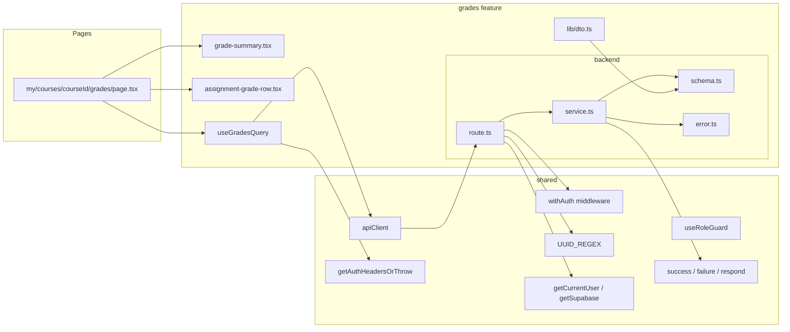

# Plan: UC-006 — 성적 & 피드백 열람 (Learner)

## 개요

`grades` feature를 신규 생성한다.
`assignments` feature(UC-004)와 `submissions` feature(UC-005)가 이미 구현되어 있으며,
UC-006은 그 위에 성적 조회 로직을 추가한다.

하나의 엔드포인트(`GET /api/my/courses/:courseId/grades`)를 통해
활성 수강 검증 후 과제별 제출 상태와 가중 평균 성적을 계산하여 반환한다.

프론트엔드에서는 `/my/courses/:courseId/grades` 페이지에서 현재 성적 요약과
과제별 제출 상태를 렌더링한다.

| 모듈 | 위치 | 설명 | 상태 |
|---|---|---|---|
| grades/error | `src/features/grades/backend/error.ts` | 에러 코드 상수 및 union 타입 | 신규 |
| grades/schema | `src/features/grades/backend/schema.ts` | GradesResponse zod 스키마 | 신규 |
| grades/service | `src/features/grades/backend/service.ts` | `getGrades` 비즈니스 로직 (수강 검증 + 성적 계산) | 신규 |
| grades/route | `src/features/grades/backend/route.ts` | `GET /api/my/courses/:courseId/grades` (withAuth) | 신규 |
| grades/dto | `src/features/grades/lib/dto.ts` | backend/schema 타입 재노출 | 신규 |
| useGradesQuery | `src/features/grades/hooks/useGradesQuery.ts` | 성적 조회 쿼리 훅 | 신규 |
| grade-summary | `src/features/grades/components/grade-summary.tsx` | 현재 성적 요약 컴포넌트 | 신규 |
| assignment-grade-row | `src/features/grades/components/assignment-grade-row.tsx` | 과제별 성적 행 컴포넌트 | 신규 |
| grades page | `src/app/(protected)/my/courses/[courseId]/grades/page.tsx` | 성적 페이지 | 신규 |
| app.ts 등록 | `src/backend/hono/app.ts` | `registerGradeRoutes` 추가 | 수정 |

## Diagram



## 충돌 분석

### 기존 코드베이스와의 충돌 여부

| 검토 항목 | 충돌 여부 | 근거 |
|---|---|---|
| `src/features/grades/` 디렉토리 존재 여부 | 없음 (신규 생성) | `ls src/features/` 결과: assignments, auth, courses, dashboard, enrollments, example, profiles, submissions만 존재 |
| 라우트 경로 중복 | 없음 | 기존 라우트: `/api/my/courses/:courseId/assignments`, `/api/my/courses/:courseId/assignments/:assignmentId`, `/api/my/courses/:courseId/assignments/:assignmentId/submissions`. 신규 경로 `/api/my/courses/:courseId/grades`는 기존과 완전 분리 |
| `/my/courses/:courseId/grades` 페이지 | 없음 (신규 생성) | `ls src/app/(protected)/my/courses/[courseId]/` 결과: `assignments/`만 존재 |
| `assignments` 테이블 `weight` 컬럼 타입 | 주의 | DB에서 `numeric(5,2)` → Supabase JS SDK가 `string`으로 반환. service.ts 내에서 `Number()` 변환 필요 (assignments/service.ts와 동일 패턴) |
| `submissions` 테이블 `score` 컬럼 타입 | 확인 | DB에서 `integer` → Supabase JS SDK가 `number | null`로 반환. 그대로 사용 가능 |
| `verifyEnrollment` 로직 중복 | 의도적 인라인 | assignments/service.ts와 submissions/service.ts 모두 feature 내부에 독립적으로 정의. grades feature도 동일 패턴 따름 (feature 간 직접 import 금지) |
| `withAuth` 미들웨어 | 재사용 | `src/backend/middleware/auth.ts`에 정의됨 |
| `useRoleGuard` 훅 | 재사용 | `src/hooks/useRoleGuard.ts`에 정의됨 |
| `UUID_REGEX` | 재사용 | `src/constants/validation.ts`에 정의됨 |
| `getAuthHeadersOrThrow` | 재사용 | `src/lib/remote/auth-headers.ts`에 정의됨 |
| DB 마이그레이션 | 불필요 | `assignments`, `submissions`, `enrollments` 테이블 모두 `0002_create_lms_tables.sql`에 이미 정의됨 |
| `app.ts` 등록 | 수정 필요 | `registerSubmissionRoutes(app)` 다음 줄에 `registerGradeRoutes(app)` 추가 |

### DB 스키마와 Spec 간 주의사항

- `assignments.weight`는 DB에서 `numeric(5,2)` 타입이다. Supabase JS SDK는 이를 `string`으로 반환하므로 service.ts 내에서 `Number()` 변환 후 계산한다.
- `submissions.score`는 DB에서 `integer check(score >= 0 and score <= 100)`이다. `null`이거나 0~100 정수이므로 성적 계산 시 `score !== null`로 선별한다.
- 성적 집계 대상: `submissions.status = 'graded'`인 제출물만. `submitted`, `resubmission_required`는 집계 제외.
- `assignments.status = 'published'` 과제만 응답에 포함. `draft` 과제 제외.

---

## Implementation Plan

### Step 1: grades/backend/error.ts

기존 `assignmentErrorCodes`, `submissionErrorCodes` 패턴을 그대로 따른다.

```typescript
// src/features/grades/backend/error.ts
export const gradeErrorCodes = {
  forbidden: 'FORBIDDEN',
  enrollmentRequired: 'ENROLLMENT_REQUIRED',
  fetchError: 'GRADE_FETCH_ERROR',
} as const;

type GradeErrorValue = (typeof gradeErrorCodes)[keyof typeof gradeErrorCodes];
export type GradeServiceError = GradeErrorValue;
```

에러 코드는 3종으로 최소화한다:
- `FORBIDDEN`: 401(미인증) / 403(role 위반)
- `ENROLLMENT_REQUIRED`: 403, 수강 중이 아닌 경우
- `GRADE_FETCH_ERROR`: 500, DB 조회 실패

---

### Step 2: grades/backend/schema.ts

`AssignmentGradeItemSchema`는 과제 + 본인 제출 정보를 합산한 응답 형태다.
`mySubmission`은 null 가능 (미제출 과제).
`GradesResponseSchema`는 `currentGrade`(가중 평균 또는 null)와 과제 목록을 포함한다.

```typescript
// src/features/grades/backend/schema.ts
import { z } from 'zod';

export const SubmissionGradeInfoSchema = z.object({
  id: z.string().uuid(),
  status: z.enum(['submitted', 'graded', 'resubmission_required']),
  isLate: z.boolean(),
  score: z.number().int().nullable(),
  feedback: z.string().nullable(),
  submittedAt: z.string(),
  gradedAt: z.string().nullable(),
});

export const AssignmentGradeItemSchema = z.object({
  id: z.string().uuid(),
  title: z.string(),
  dueAt: z.string(),
  weight: z.number(),
  mySubmission: SubmissionGradeInfoSchema.nullable(),
});

export const GradesResponseSchema = z.object({
  currentGrade: z.number().nullable(),
  assignments: z.array(AssignmentGradeItemSchema),
});

export type SubmissionGradeInfo = z.infer<typeof SubmissionGradeInfoSchema>;
export type AssignmentGradeItem = z.infer<typeof AssignmentGradeItemSchema>;
export type GradesResponse = z.infer<typeof GradesResponseSchema>;
```

`AssignmentGradeItemSchema`는 `AssignmentDtoSchema`와 별개로 설계한다. 이유:
- grades feature는 성적 열람 전용으로 `allowLate`, `allowResubmit`, `status`, `description`, `courseId` 등 제출 UI에 필요한 필드가 불필요하다.
- `SubmissionGradeInfoSchema`도 `MySubmissionDtoSchema`와 별개: `contentText`, `contentLink`를 제외하고 성적 관련 필드만 포함한다.
- 두 feature의 스키마가 일치하지 않으므로 재사용하지 않고 독립 정의한다.

---

### Step 3: grades/backend/service.ts

수강 검증 헬퍼를 feature 내부에 독립 정의한다 (assignments/service.ts, submissions/service.ts와 동일 패턴).
`getGrades` 함수는 3단계 DB 쿼리: 수강 검증 → 과제 목록 → 제출 내역, 이후 성적 계산.

```typescript
// src/features/grades/backend/service.ts
import type { SupabaseClient } from '@supabase/supabase-js';
import { failure, success, type HandlerResult } from '@/backend/http/response';
import { gradeErrorCodes, type GradeServiceError } from './error';
import type {
  AssignmentGradeItem,
  GradesResponse,
  SubmissionGradeInfo,
} from './schema';

// --- 내부 Row 타입 ---
type AssignmentRow = {
  id: string;
  title: string;
  due_at: string;
  weight: string; // Supabase NUMERIC → string
};

type SubmissionRow = {
  id: string;
  assignment_id: string;
  status: 'submitted' | 'graded' | 'resubmission_required';
  is_late: boolean;
  score: number | null;
  feedback: string | null;
  submitted_at: string;
  graded_at: string | null;
};

// --- mapper ---
const mapSubmissionRow = (row: SubmissionRow): SubmissionGradeInfo => ({
  id: row.id,
  status: row.status,
  isLate: row.is_late,
  score: row.score,
  feedback: row.feedback,
  submittedAt: row.submitted_at,
  gradedAt: row.graded_at,
});

// --- 수강 여부 검증 헬퍼 (feature 내 독립 정의) ---
const verifyEnrollmentForGrades = async (
  supabase: SupabaseClient,
  courseId: string,
  learnerId: string,
): Promise<HandlerResult<null, GradeServiceError>> => {
  const { data, error } = await supabase
    .from('enrollments')
    .select('id')
    .eq('course_id', courseId)
    .eq('learner_id', learnerId)
    .is('cancelled_at', null)
    .maybeSingle();

  if (error) {
    return failure(500, gradeErrorCodes.fetchError, error.message);
  }

  if (!data) {
    return failure(403, gradeErrorCodes.enrollmentRequired, '수강 중인 코스가 아닙니다.');
  }

  return success(null);
};

// --- 성적 계산 순수 함수 ---
// 채점된 제출물이 없으면 null 반환, 그 외 가중 평균 계산
const calculateCurrentGrade = (
  assignments: AssignmentRow[],
  submissionMap: Map<string, SubmissionRow>,
): number | null => {
  let weightedScoreSum = 0;
  let gradedWeightSum = 0;

  for (const assignment of assignments) {
    const submission = submissionMap.get(assignment.id);
    if (submission?.status === 'graded' && submission.score !== null) {
      const weight = Number(assignment.weight);
      weightedScoreSum += submission.score * weight;
      gradedWeightSum += weight;
    }
  }

  if (gradedWeightSum === 0) return null;

  return weightedScoreSum / gradedWeightSum;
};

// --- 메인 서비스 함수 ---
export const getGrades = async (
  supabase: SupabaseClient,
  courseId: string,
  learnerId: string,
): Promise<HandlerResult<GradesResponse, GradeServiceError>> => {
  // 1. 수강 여부 검증
  const enrollmentCheck = await verifyEnrollmentForGrades(supabase, courseId, learnerId);
  if (!enrollmentCheck.ok) return enrollmentCheck;

  // 2. published 과제 목록 조회 (due_at ASC)
  const { data: assignmentsRaw, error: assignmentsError } = await supabase
    .from('assignments')
    .select('id, title, due_at, weight')
    .eq('course_id', courseId)
    .eq('status', 'published')
    .order('due_at', { ascending: true });

  if (assignmentsError) {
    return failure(500, gradeErrorCodes.fetchError, assignmentsError.message);
  }

  const assignments = (assignmentsRaw ?? []) as unknown as AssignmentRow[];
  const assignmentIds = assignments.map((a) => a.id);

  // 3. 본인 제출 내역 일괄 조회
  let submissions: SubmissionRow[] = [];
  if (assignmentIds.length > 0) {
    const { data: submissionsRaw, error: submissionsError } = await supabase
      .from('submissions')
      .select('id, assignment_id, status, is_late, score, feedback, submitted_at, graded_at')
      .eq('learner_id', learnerId)
      .in('assignment_id', assignmentIds);

    if (submissionsError) {
      return failure(500, gradeErrorCodes.fetchError, submissionsError.message);
    }

    submissions = (submissionsRaw ?? []) as unknown as SubmissionRow[];
  }

  const submissionMap = new Map(submissions.map((s) => [s.assignment_id, s]));

  // 4. 성적 계산
  const currentGrade = calculateCurrentGrade(assignments, submissionMap);

  // 5. 과제별 응답 생성
  const assignmentGradeItems: AssignmentGradeItem[] = assignments.map((a) => {
    const sub = submissionMap.get(a.id) ?? null;
    return {
      id: a.id,
      title: a.title,
      dueAt: a.due_at,
      weight: Number(a.weight),
      mySubmission: sub ? mapSubmissionRow(sub) : null,
    };
  });

  return success({
    currentGrade,
    assignments: assignmentGradeItems,
  });
};
```

**핵심 비즈니스 로직 검증 포인트**

- `calculateCurrentGrade`는 순수 함수로 분리하여 독립 테스트 가능.
- `gradedWeightSum === 0`이면 `null` 반환 (0점 처리 없음).
- `resubmission_required`, `submitted` 상태 제출물은 집계에서 자동 제외 (`status === 'graded'` 조건).
- `is_late = true`인 제출물도 `status === 'graded'`이면 정상 집계.

**Unit Test**

```typescript
describe('calculateCurrentGrade', () => {
  it('채점된 과제 없음 → null')
  it('채점된 과제 1개 (score=80, weight=50) → 80')
  it('채점된 과제 2개 (score=80,weight=50 / score=60,weight=50) → 70')
  it('가중치 다름 (score=100,weight=70 / score=0,weight=30) → 70')
  it('status=submitted 과제는 집계 제외')
  it('status=resubmission_required 과제는 집계 제외')
  it('is_late=true이고 status=graded이면 정상 집계')
  it('score=null이고 status=graded인 경우 집계 제외 (집계 불가)')
})

describe('getGrades', () => {
  it('활성 수강 + published 과제 있음 + 채점 완료 제출물 → currentGrade 계산, assignments 목록')
  it('활성 수강 + published 과제 없음 → currentGrade=null, assignments=[]')
  it('활성 수강 + 제출물 없음 → currentGrade=null, assignments에 mySubmission=null')
  it('활성 수강 + 제출물 있으나 모두 submitted → currentGrade=null')
  it('수강 중이 아닌 경우 → 403 ENROLLMENT_REQUIRED')
  it('수강 취소된 경우(cancelled_at IS NOT NULL) → 403 ENROLLMENT_REQUIRED')
  it('DB 오류 → 500 GRADE_FETCH_ERROR')
})
```

---

### Step 4: grades/backend/route.ts

`withAuth()` 적용 후 `role !== 'learner'`이면 403 반환.
기존 `assignments/route.ts` 패턴을 그대로 따른다.

```typescript
// src/features/grades/backend/route.ts
import type { Hono } from 'hono';
import { respond, failure } from '@/backend/http/response';
import { withAuth } from '@/backend/middleware/auth';
import { getCurrentUser, getSupabase, type AppEnv } from '@/backend/hono/context';
import { UUID_REGEX } from '@/constants/validation';
import { gradeErrorCodes } from './error';
import { getGrades } from './service';

export const registerGradeRoutes = (app: Hono<AppEnv>) => {
  app.get('/api/my/courses/:courseId/grades', withAuth(), async (c) => {
    const currentUser = getCurrentUser(c);

    if (!currentUser) {
      return respond(c, failure(401, gradeErrorCodes.forbidden, '인증이 필요합니다.'));
    }

    if (currentUser.role !== 'learner') {
      return respond(c, failure(403, gradeErrorCodes.forbidden, '학습자만 접근할 수 있습니다.'));
    }

    const courseId = c.req.param('courseId');

    if (!UUID_REGEX.test(courseId)) {
      return respond(c, failure(400, gradeErrorCodes.fetchError, '올바르지 않은 코스 ID입니다.'));
    }

    const supabase = getSupabase(c);
    const result = await getGrades(supabase, courseId, currentUser.id);
    return respond(c, result);
  });
};
```

**Unit Test**

```typescript
describe('GET /api/my/courses/:courseId/grades', () => {
  it('미인증 요청 → 401 FORBIDDEN')
  it('instructor 역할 → 403 FORBIDDEN')
  it('비정상 courseId (비UUID) → 400 GRADE_FETCH_ERROR')
  it('learner + 유효 courseId → 200 GradesResponse')
  it('수강 중이 아닌 경우 → 403 ENROLLMENT_REQUIRED')
})
```

---

### Step 5: grades/lib/dto.ts

기존 `assignments/lib/dto.ts`, `submissions/lib/dto.ts` 패턴을 동일하게 따른다.

```typescript
// src/features/grades/lib/dto.ts
export {
  GradesResponseSchema,
  AssignmentGradeItemSchema,
  SubmissionGradeInfoSchema,
} from '@/features/grades/backend/schema';

export type {
  GradesResponse,
  AssignmentGradeItem,
  SubmissionGradeInfo,
} from '@/features/grades/backend/schema';
```

---

### Step 6: grades/hooks/useGradesQuery.ts

기존 `useAssignmentListQuery.ts`, `useLearnerDashboardQuery.ts` 패턴을 따른다.
`queryKey: ['grades', courseId]`로 설정한다.

```typescript
// src/features/grades/hooks/useGradesQuery.ts
'use client';

import { useQuery } from '@tanstack/react-query';
import { apiClient, extractApiErrorMessage } from '@/lib/remote/api-client';
import { getAuthHeadersOrThrow } from '@/lib/remote/auth-headers';
import { GradesResponseSchema } from '@/features/grades/lib/dto';
import type { GradesResponse } from '@/features/grades/lib/dto';

const fetchGrades = async (courseId: string): Promise<GradesResponse> => {
  try {
    const headers = await getAuthHeadersOrThrow();
    const { data } = await apiClient.get(`/api/my/courses/${courseId}/grades`, { headers });
    return GradesResponseSchema.parse(data);
  } catch (error) {
    const message = extractApiErrorMessage(error, '성적을 불러오지 못했습니다.');
    throw new Error(message);
  }
};

export const useGradesQuery = (courseId: string) =>
  useQuery({
    queryKey: ['grades', courseId],
    queryFn: () => fetchGrades(courseId),
    staleTime: 30 * 1000,
  });
```

---

### Step 7: grades/components/grade-summary.tsx

현재 성적 요약 섹션을 담당하는 컴포넌트.
`currentGrade`가 `null`이면 상황별 안내 메시지를 분기하여 표시한다.

```typescript
// src/features/grades/components/grade-summary.tsx
'use client';

import { match } from 'ts-pattern';
import { TrendingUp, Clock, BookOpen } from 'lucide-react';
import { Card, CardContent, CardHeader, CardTitle } from '@/components/ui/card';
import type { AssignmentGradeItem } from '@/features/grades/lib/dto';

type GradeSummaryProps = {
  currentGrade: number | null;
  assignments: AssignmentGradeItem[];
};

type SummaryState =
  | { type: 'graded'; grade: number }
  | { type: 'pending' }
  | { type: 'no_assignments' };

const resolveSummaryState = (
  currentGrade: number | null,
  assignments: AssignmentGradeItem[],
): SummaryState => {
  if (currentGrade !== null) return { type: 'graded', grade: currentGrade };
  if (assignments.length === 0) return { type: 'no_assignments' };

  const hasPendingSubmission = assignments.some(
    (a) => a.mySubmission?.status === 'submitted',
  );
  return hasPendingSubmission ? { type: 'pending' } : { type: 'no_assignments' };
};
```

분기 렌더링:
- `graded`: `"{grade}점 / 100점"` 표시 (소수점 반올림, `Math.round`)
- `pending`: "채점 대기중인 과제가 있습니다" 안내
- `no_assignments`: "아직 채점된 과제가 없습니다" 안내

**QA Sheet**

| 시나리오 | 기대 결과 |
|---|---|
| currentGrade = 85.5 | "86점 / 100점" (반올림) 표시 |
| currentGrade = null + submitted 제출물 존재 | "채점 대기중인 과제가 있습니다" |
| currentGrade = null + submitted 없음 | "아직 채점된 과제가 없습니다" |
| assignments 빈 배열 | "아직 채점된 과제가 없습니다" |

---

### Step 8: grades/components/assignment-grade-row.tsx

과제별 성적 행 컴포넌트. `ts-pattern`으로 제출 상태별 배지를 분기한다.
`date-fns`로 마감일 포맷팅. `lucide-react` 아이콘 사용.

```typescript
// src/features/grades/components/assignment-grade-row.tsx
'use client';

import { match } from 'ts-pattern';
import { format } from 'date-fns';
import { ko } from 'date-fns/locale';
import { Clock, CheckCircle2, RefreshCw, AlertCircle } from 'lucide-react';
import { Badge } from '@/components/ui/badge';
import { Separator } from '@/components/ui/separator';
import type { AssignmentGradeItem } from '@/features/grades/lib/dto';

type AssignmentGradeRowProps = {
  item: AssignmentGradeItem;
};
```

제출 상태별 배지 및 표시 규칙:

| mySubmission | status | 표시 |
|---|---|---|
| null | - | "미제출" 배지 (회색), 점수/피드백 없음 |
| not null | submitted | "채점 대기중" 배지 (파랑) |
| not null | resubmission_required | "재제출 요청" 배지 (노랑) + 피드백 표시 |
| not null | graded | 점수 표시 + 피드백 표시 + is_late=true면 "지각 제출" 배지 |

**QA Sheet**

| 시나리오 | 기대 결과 |
|---|---|
| mySubmission = null | "미제출" 배지, 점수 없음, 피드백 없음 |
| status = submitted | "채점 대기중" 배지, 점수 없음 |
| status = resubmission_required | "재제출 요청" 배지, 피드백 표시 |
| status = graded + is_late = false | 점수 표시, 피드백 표시 |
| status = graded + is_late = true | 점수 표시, 피드백 표시, "지각 제출" 배지 추가 |
| weight = 30 | "배점: 30점" 표시 |

---

### Step 9: grades 페이지

`src/app/(protected)/my/courses/[courseId]/grades/page.tsx`

`useRoleGuard('learner')`로 역할 검증 후 `useGradesQuery`로 성적 조회.
로딩/에러/빈 상태를 별도 처리.
403 에러(수강 중이 아닌 경우)는 코스 카탈로그(`/courses`)로 유도.

```typescript
// src/app/(protected)/my/courses/[courseId]/grades/page.tsx
'use client';

import { use } from 'react';
import Link from 'next/link';
import { ArrowLeft, AlertCircle, RefreshCw } from 'lucide-react';
import { Button } from '@/components/ui/button';
import { Separator } from '@/components/ui/separator';
import { useRoleGuard } from '@/hooks/useRoleGuard';
import { useGradesQuery } from '@/features/grades/hooks/useGradesQuery';
import { GradeSummary } from '@/features/grades/components/grade-summary';
import { AssignmentGradeRow } from '@/features/grades/components/assignment-grade-row';

type GradesPageProps = {
  params: Promise<{ courseId: string }>;
};

export default function GradesPage({ params }: GradesPageProps) {
  const { courseId } = use(params);
  const { isAllowed, isLoading: isRoleLoading } = useRoleGuard('learner');
  const { data, isLoading, isError, error, refetch } = useGradesQuery(courseId);
  // ...
}
```

**QA Sheet**

| 시나리오 | 기대 결과 |
|---|---|
| 성적 정상 조회 (채점된 과제 있음) | GradeSummary에 점수, AssignmentGradeRow 목록 |
| 채점된 과제 없음 (submitted 있음) | "채점 대기중인 과제가 있습니다" + 과제 목록 |
| 채점된 과제 없음 (제출 없음) | "아직 채점된 과제가 없습니다" + 과제 목록 |
| published 과제 없음 | "아직 채점된 과제가 없습니다" + 빈 목록 |
| 403 수강 중이 아닌 코스 | "수강 중인 코스가 아닙니다" + "/courses"로 유도 버튼 |
| 401 미인증 | useRoleGuard가 로그인 페이지로 리다이렉트 |
| 403 instructor 역할 | useRoleGuard가 instructor 홈으로 리다이렉트 |
| 로딩 중 | 스켈레톤 UI (GradeSummary 스켈레톤 + 과제 행 스켈레톤) |
| API 오류 | 오류 메시지 + "다시 시도" 버튼 |

---

### Step 10: app.ts 등록

기존 `registerSubmissionRoutes(app)` 다음 줄에 추가한다.
기존 라우트 순서와 충돌 없음.

```typescript
// src/backend/hono/app.ts 수정 부분
import { registerGradeRoutes } from '@/features/grades/backend/route';

// createHonoApp 내부 registerSubmissionRoutes(app); 다음에 추가
registerGradeRoutes(app);
```

---

## 공유 모듈 의존 관계

| UC-006에서 사용 | 출처 | 비고 |
|---|---|---|
| `withAuth` | `src/backend/middleware/auth.ts` | 기존 구현 재사용 |
| `UUID_REGEX` | `src/constants/validation.ts` | 기존 구현 재사용 |
| `success`, `failure`, `respond` | `src/backend/http/response.ts` | 기존 구현 재사용 |
| `getSupabase`, `getCurrentUser` | `src/backend/hono/context.ts` | 기존 구현 재사용 |
| `apiClient`, `extractApiErrorMessage` | `src/lib/remote/api-client.ts` | 기존 구현 재사용 |
| `getAuthHeadersOrThrow` | `src/lib/remote/auth-headers.ts` | 기존 구현 재사용 |
| `useRoleGuard` | `src/hooks/useRoleGuard.ts` | 기존 구현 재사용 |
| `date-fns` (format, ko locale) | npm 패키지 | assignment-grade-row.tsx에서 마감일 포맷팅 |
| `ts-pattern` (match) | npm 패키지 | grade-summary.tsx, assignment-grade-row.tsx 상태 분기 |
| `lucide-react` | npm 패키지 | 아이콘 |
| `shadcn-ui` (Badge, Card, Separator, Button) | 기존 설치 | 이미 설치되어 있음 |

## 신규 마이그레이션

불필요. `assignments`, `submissions`, `enrollments` 테이블은 `0002_create_lms_tables.sql`에 이미 정의되어 있다.

## 신규 shadcn-ui 컴포넌트

신규 설치 불필요. `Badge`, `Card`, `CardContent`, `CardHeader`, `CardTitle`, `Separator`, `Button`은 기존 코드베이스에서 이미 사용 중이다.
(`assignment-submission-status.tsx`, `[assignmentId]/page.tsx` 등에서 이미 import 확인됨)
