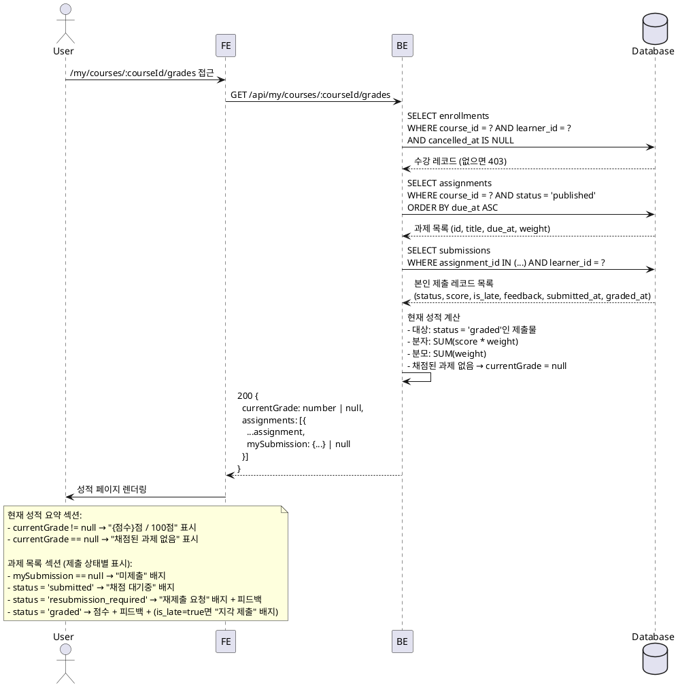

# UC-006: 성적 & 피드백 열람 (Learner)

## Primary Actor

Learner (인증된 학습자)

## Precondition

- 로그인 상태이며 역할이 `learner`인 사용자
- 해당 코스에 활성 수강 중인 상태 (`enrollments.cancelled_at IS NULL`)

---

## Trigger

사용자가 수강 중인 코스의 성적 페이지 (`/my/courses/:courseId/grades`)에 접근한다.

---

## Main Scenario

1. 사용자가 `/my/courses/:courseId/grades` 페이지에 접근한다.
2. FE가 `GET /api/my/courses/:courseId/grades`를 호출한다.
3. BE가 요청 사용자의 활성 수강 여부를 검증한다.
   - `enrollments WHERE course_id = ? AND learner_id = ? AND cancelled_at IS NULL` 이 없으면 403 반환.
4. BE가 해당 코스의 `status = 'published'` 과제 목록을 조회한다.
5. BE가 각 과제에 대한 본인 제출 레코드(`submissions WHERE learner_id = ?`)를 조회한다.
6. BE가 현재 성적(현재까지 채점된 과제 기준 가중 평균)을 계산한다.
   - 분자: `SUM(submissions.score * assignments.weight) WHERE submissions.status = 'graded'`
   - 분모: `SUM(assignments.weight) WHERE submissions.status = 'graded'`
   - 채점된 제출물이 없으면 현재 성적을 `null`로 반환한다 (0점 처리 없음).
7. BE가 과제 목록, 각 과제별 제출 상태, 현재 성적을 단일 응답으로 반환한다.
8. FE가 성적 페이지를 렌더링한다.
   - 상단: 현재 성적 요약 (가중 평균 점수 또는 "채점된 과제 없음")
   - 과제 목록: 과제명, 마감일, 점수 비중(`weight`), 제출 상태, 점수(`score`), 지각 여부(`is_late`), 피드백(`feedback`)
   - 미제출 과제는 "미제출" 배지로 표시하고 점수·피드백 없음으로 표시한다.
   - `status = 'submitted'` 과제는 "채점 대기중" 배지로 표시한다.
   - `status = 'resubmission_required'` 과제는 "재제출 요청" 배지로 표시하고 피드백을 함께 표시한다.
   - `status = 'graded'` 과제는 점수와 피드백을 모두 표시한다.

---

## Edge Cases

| 상황 | 처리 |
|---|---|
| 수강하지 않은 코스의 성적 접근 | 403 반환 → "수강 중인 코스가 아닙니다" 안내 메시지 표시 |
| 수강 취소된 코스의 성적 접근 | 403 반환 → 코스 카탈로그로 유도 |
| 제출한 과제가 하나도 없는 경우 | 현재 성적 `null` 반환 → "아직 채점된 과제가 없습니다" 안내 표시 |
| 제출한 과제가 있으나 채점된 과제가 없는 경우 | 현재 성적 `null` 반환 → "채점 대기중인 과제가 있습니다" 안내 표시 |
| 코스에 published 과제가 없는 경우 | 빈 과제 목록 반환 → "등록된 과제가 없습니다" 안내 표시 |
| `resubmission_required` 상태 제출물 | 채점 집계 제외, "재제출 요청" 상태 표시 및 피드백 표시 |
| 인증되지 않은 접근 | 401 반환 → 로그인 페이지로 리다이렉트 |
| Instructor 역할로 접근 | 403 반환 → Instructor 전용 경로로 리다이렉트 |
| `is_late = true`인 제출물 | 점수 및 피드백 정상 표시, "지각 제출" 배지 추가 표시 |

---

## Business Rules

- 본인(`learner_id = 요청 사용자 ID`) 제출물만 조회 가능하다. 타인의 성적은 어떠한 경우에도 열람할 수 없다.
- 현재 성적 계산은 `status = 'graded'`인 제출물만 집계 대상에 포함한다.
- 미제출 과제 및 `status != 'graded'`인 제출물(submitted, resubmission_required)은 성적 집계에서 제외된다. 0점으로 처리하지 않는다.
- 현재 성적 공식: `SUM(score × weight) / SUM(weight)` — `status = 'graded'`인 과제 기준 가중 평균.
- 채점된 과제가 단 하나도 없으면 현재 성적은 `null`로 반환한다.
- `is_late = true`인 제출물도 채점 완료 시 정상적으로 성적 집계에 포함된다.
- `status = 'resubmission_required'`인 제출물은 피드백을 열람할 수 있으나 채점 집계에서 제외된다.
- 열람 대상 과제는 `assignments.status = 'published'`인 과제에 한정된다 (`draft` 과제 제외).

---

## Sequence Diagram

