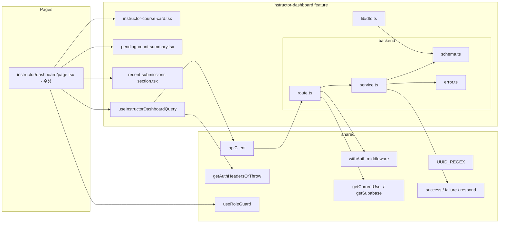

# Plan: UC-007 — Instructor 대시보드

## 개요

`instructor-dashboard` feature를 신규 생성한다.
강사(`instructor`) 역할 사용자가 `/instructor/dashboard`에 접근하면
자신의 코스 목록, 전체 채점 대기 수, 최근 제출물(10건)을 단일 API 응답으로 받아 렌더링한다.

`/instructor/dashboard` 페이지는 이미 placeholder로 구현되어 있으므로 해당 파일을 실제 동작으로 교체한다.
신규 feature 디렉토리는 `src/features/instructor-dashboard/`로 생성한다.

| 모듈 | 위치 | 설명 | 상태 |
|---|---|---|---|
| instructor-dashboard/error | `src/features/instructor-dashboard/backend/error.ts` | 에러 코드 상수 및 union 타입 | 신규 |
| instructor-dashboard/schema | `src/features/instructor-dashboard/backend/schema.ts` | InstructorDashboardResponse zod 스키마 | 신규 |
| instructor-dashboard/service | `src/features/instructor-dashboard/backend/service.ts` | `getInstructorDashboard` 비즈니스 로직 (코스 목록 + 채점 대기 수 + 최근 제출물) | 신규 |
| instructor-dashboard/route | `src/features/instructor-dashboard/backend/route.ts` | `GET /api/instructor/dashboard` (withAuth, role=instructor) | 신규 |
| instructor-dashboard/dto | `src/features/instructor-dashboard/lib/dto.ts` | backend/schema 타입 재노출 | 신규 |
| useInstructorDashboardQuery | `src/features/instructor-dashboard/hooks/useInstructorDashboardQuery.ts` | 강사 대시보드 조회 쿼리 훅 | 신규 |
| instructor-course-card | `src/features/instructor-dashboard/components/instructor-course-card.tsx` | 코스 카드 (채점 대기 배지 포함) | 신규 |
| pending-count-summary | `src/features/instructor-dashboard/components/pending-count-summary.tsx` | 전체 채점 대기 수 요약 카드 | 신규 |
| recent-submissions-section | `src/features/instructor-dashboard/components/recent-submissions-section.tsx` | 최근 제출물 목록 섹션 | 신규 |
| instructor dashboard page | `src/app/(protected)/instructor/dashboard/page.tsx` | 강사 대시보드 페이지 (placeholder 교체) | 수정 |
| app.ts 등록 | `src/backend/hono/app.ts` | `registerInstructorDashboardRoutes` 추가 | 수정 |

---

## 충돌 분석

### 기존 코드베이스와의 충돌 여부

| 검토 항목 | 충돌 여부 | 근거 |
|---|---|---|
| `src/features/instructor-dashboard/` 디렉토리 존재 여부 | 없음 (신규 생성) | `ls src/features/` 결과: assignments, auth, courses, dashboard, enrollments, example, grades, profiles, submissions만 존재. `instructor-dashboard`는 미존재 |
| 라우트 경로 중복 | 없음 | 기존 라우트: `/api/dashboard/learner`, `/api/dashboard/learner/courses/:courseId/grades`, `/api/courses`, `/api/enrollments`, `/api/my/courses/...` 등. `/api/instructor/dashboard`는 신규 |
| `/instructor/dashboard` 페이지 존재 여부 | 존재 (수정 대상) | `src/app/(protected)/instructor/dashboard/page.tsx`가 이미 placeholder로 구현됨. 실제 데이터 연동으로 교체 |
| `useRoleGuard('instructor')` | 재사용 | 기존 placeholder 페이지에서 이미 사용 중. 변경 없음 |
| `withAuth` 미들웨어 | 재사용 | `src/backend/middleware/auth.ts`에 정의됨 |
| `UUID_REGEX` | 재사용 | `src/constants/validation.ts`에 정의됨 |
| `apiClient`, `extractApiErrorMessage` | 재사용 | `src/lib/remote/api-client.ts`에 정의됨 |
| `getAuthHeadersOrThrow` | 재사용 | `src/lib/remote/auth-headers.ts`에 정의됨 |
| `success`, `failure`, `respond` | 재사용 | `src/backend/http/response.ts`에 정의됨 |
| `getSupabase`, `getCurrentUser` | 재사용 | `src/backend/hono/context.ts`에 정의됨 |
| `instructor-dashboard` feature 내 `dashboard` feature와 스키마 충돌 | 없음 | `dashboard` feature는 Learner 전용 (`LearnerDashboardResponseSchema`). 이번 `instructor-dashboard`는 완전 별개 feature로 스키마 독립 정의 |
| DB 마이그레이션 | 불필요 | `courses`, `assignments`, `submissions`, `profiles` 테이블 모두 `0002_create_lms_tables.sql`에 이미 정의됨 |
| `app.ts` 등록 | 수정 필요 | `registerGradeRoutes(app)` 다음 줄에 `registerInstructorDashboardRoutes(app)` 추가 |

### DB 스키마와 Spec 간 주의사항

- `courses.instructor_id`는 `profiles.id` FK. 세션에서 추출한 `currentUser.id`를 그대로 사용 가능.
- `assignments.weight`는 DB에서 `NUMERIC(5,2)`. Supabase JS SDK가 `string`으로 반환하므로 사용 위치에서 `Number()` 변환 필요 (dashboard/service.ts 동일 패턴).
- `submissions.status = 'submitted'` 조건으로 채점 대기 수 집계. `graded`, `resubmission_required`, `invalidated`는 제외.
- 최근 제출물 조회 시 `profiles` 테이블의 `name`을 JOIN으로 가져와 `learnerName`으로 노출.
- `submitted_at DESC` 정렬 후 LIMIT 10.

---

## Diagram



---

## Implementation Plan

### Step 1: instructor-dashboard/backend/error.ts

기존 `dashboardErrorCodes`, `gradeErrorCodes` 패턴을 그대로 따른다.

```typescript
// src/features/instructor-dashboard/backend/error.ts
export const instructorDashboardErrorCodes = {
  forbidden: 'FORBIDDEN',
  fetchError: 'INSTRUCTOR_DASHBOARD_FETCH_ERROR',
} as const;

type InstructorDashboardErrorValue =
  (typeof instructorDashboardErrorCodes)[keyof typeof instructorDashboardErrorCodes];
export type InstructorDashboardServiceError = InstructorDashboardErrorValue;
```

에러 코드는 2종으로 최소화한다:
- `FORBIDDEN`: 401(미인증) / 403(role 위반)
- `INSTRUCTOR_DASHBOARD_FETCH_ERROR`: 500, DB 조회 실패

---

### Step 2: instructor-dashboard/backend/schema.ts

spec의 응답 구조를 그대로 반영한다.

- `InstructorCourseItemSchema`: 코스 정보 + 해당 코스의 채점 대기 수
- `RecentSubmissionItemSchema`: 최근 제출물 단건 (학습자명, 과제 제목, 코스 제목, 제출 시각)
- `InstructorDashboardResponseSchema`: 코스 목록, 전체 채점 대기 수, 최근 제출물

```typescript
// src/features/instructor-dashboard/backend/schema.ts
import { z } from 'zod';

export const InstructorCourseItemSchema = z.object({
  id: z.string().uuid(),
  title: z.string(),
  status: z.enum(['draft', 'published', 'archived']),
  pendingCount: z.number().int().nonnegative(),
});

export const RecentSubmissionItemSchema = z.object({
  submissionId: z.string().uuid(),
  learnerName: z.string(),
  assignmentTitle: z.string(),
  courseTitle: z.string(),
  submittedAt: z.string(),
});

export const InstructorDashboardResponseSchema = z.object({
  courses: z.array(InstructorCourseItemSchema),
  totalPendingCount: z.number().int().nonnegative(),
  recentSubmissions: z.array(RecentSubmissionItemSchema),
});

export type InstructorCourseItem = z.infer<typeof InstructorCourseItemSchema>;
export type RecentSubmissionItem = z.infer<typeof RecentSubmissionItemSchema>;
export type InstructorDashboardResponse = z.infer<typeof InstructorDashboardResponseSchema>;
```

`InstructorCourseItemSchema`의 `status`는 `course_status` ENUM(`draft`, `published`, `archived`)을 반영한다.
`pendingCount`는 BE에서 집계하여 내려준다 (FE에서 별도 계산 없음).

---

### Step 3: instructor-dashboard/backend/service.ts

3단계 DB 쿼리로 구현한다:
1. `courses WHERE instructor_id = ?` 조회 (전체 status, `created_at DESC`)
2. 코스별 채점 대기 수 집계 (`submissions JOIN assignments JOIN courses WHERE instructor_id = ? AND status = 'submitted'`)
3. 최근 제출물 10건 조회 (`submitted_at DESC`, `profiles JOIN`)

```typescript
// src/features/instructor-dashboard/backend/service.ts
import type { SupabaseClient } from '@supabase/supabase-js';
import { failure, success, type HandlerResult } from '@/backend/http/response';
import {
  instructorDashboardErrorCodes,
  type InstructorDashboardServiceError,
} from './error';
import type {
  InstructorCourseItem,
  RecentSubmissionItem,
  InstructorDashboardResponse,
} from './schema';

// --- 내부 Row 타입 ---
type CourseRow = {
  id: string;
  title: string;
  status: 'draft' | 'published' | 'archived';
};

type PendingCountRow = {
  course_id: string;
  count: number;
};

type RecentSubmissionRow = {
  id: string;
  submitted_at: string;
  assignment: {
    title: string;
    course: {
      title: string;
    } | null;
  } | null;
  learner: {
    name: string;
  } | null;
};

// --- 채점 대기 수 집계 순수 함수 ---
// pendingMap(courseId → pendingCount)과 courses를 합산하여 InstructorCourseItem 배열 생성
const mergePendingCounts = (
  courses: CourseRow[],
  pendingMap: Map<string, number>,
): InstructorCourseItem[] =>
  courses.map((c) => ({
    id: c.id,
    title: c.title,
    status: c.status,
    pendingCount: pendingMap.get(c.id) ?? 0,
  }));

// --- 메인 서비스 함수 ---
export const getInstructorDashboard = async (
  supabase: SupabaseClient,
  instructorId: string,
): Promise<HandlerResult<InstructorDashboardResponse, InstructorDashboardServiceError>> => {
  // 1. 내 코스 목록 조회 (전체 status, created_at DESC)
  const { data: coursesRaw, error: coursesError } = await supabase
    .from('courses')
    .select('id, title, status')
    .eq('instructor_id', instructorId)
    .order('created_at', { ascending: false });

  if (coursesError) {
    return failure(
      500,
      instructorDashboardErrorCodes.fetchError,
      coursesError.message,
    );
  }

  const courses = (coursesRaw ?? []) as unknown as CourseRow[];
  const courseIds = courses.map((c) => c.id);

  // 2. 채점 대기 수 집계 (내 코스에 속한 submissions WHERE status = 'submitted')
  // courseIds가 없으면 조회 생략
  const pendingMap = new Map<string, number>();

  if (courseIds.length > 0) {
    const { data: pendingRaw, error: pendingError } = await supabase
      .from('submissions')
      .select(`
        id,
        assignment:assignments!assignment_id(
          course_id
        )
      `)
      .eq('status', 'submitted')
      .in('assignments.course_id', courseIds);

    if (pendingError) {
      return failure(
        500,
        instructorDashboardErrorCodes.fetchError,
        pendingError.message,
      );
    }

    // course_id별 카운트 집계
    for (const row of pendingRaw ?? []) {
      const courseId = (row as unknown as { assignment: { course_id: string } | null })
        .assignment?.course_id;
      if (courseId) {
        pendingMap.set(courseId, (pendingMap.get(courseId) ?? 0) + 1);
      }
    }
  }

  // 3. 최근 제출물 10건 조회
  let recentSubmissions: RecentSubmissionItem[] = [];

  if (courseIds.length > 0) {
    const { data: submissionsRaw, error: submissionsError } = await supabase
      .from('submissions')
      .select(`
        id,
        submitted_at,
        assignment:assignments!assignment_id(
          title,
          course:courses!course_id(title)
        ),
        learner:profiles!learner_id(name)
      `)
      .in('assignments.course_id', courseIds)
      .order('submitted_at', { ascending: false })
      .limit(10);

    if (submissionsError) {
      return failure(
        500,
        instructorDashboardErrorCodes.fetchError,
        submissionsError.message,
      );
    }

    recentSubmissions = ((submissionsRaw ?? []) as unknown as RecentSubmissionRow[]).map(
      (s) => ({
        submissionId: s.id,
        learnerName: s.learner?.name ?? '알 수 없음',
        assignmentTitle: s.assignment?.title ?? '알 수 없음',
        courseTitle: s.assignment?.course?.title ?? '알 수 없음',
        submittedAt: s.submitted_at,
      }),
    );
  }

  const courseItems = mergePendingCounts(courses, pendingMap);
  const totalPendingCount = courseItems.reduce((sum, c) => sum + c.pendingCount, 0);

  return success({
    courses: courseItems,
    totalPendingCount,
    recentSubmissions,
  });
};
```

**Supabase 중첩 JOIN 필터 주의사항**

Supabase JS SDK의 중첩 관계 필터(`.in('assignments.course_id', courseIds)`)는 현재 공식 지원이 제한적이다.
안정적인 구현을 위해 별도 조회 방식을 사용한다:

- 채점 대기 수 집계: `assignments` 테이블에서 `course_id IN (courseIds)`인 `assignment_id` 목록을 먼저 조회한 뒤, `submissions WHERE assignment_id IN (assignmentIds) AND status = 'submitted'`로 2-step 쿼리를 수행한다.
- 최근 제출물 조회: 동일하게 `assignmentIds` 기준으로 submissions를 조회 후 `profiles`와 `assignments` JOIN으로 이름/제목을 가져온다.

**수정된 service.ts 구현 (2-step 쿼리 방식)**

```typescript
// 채점 대기 수 집계 (안정적인 2-step 쿼리)
if (courseIds.length > 0) {
  // Step A: 내 코스의 assignment_id 목록 조회
  const { data: assignmentsRaw, error: assignmentsError } = await supabase
    .from('assignments')
    .select('id, course_id')
    .in('course_id', courseIds);

  if (assignmentsError) {
    return failure(500, instructorDashboardErrorCodes.fetchError, assignmentsError.message);
  }

  const assignments = (assignmentsRaw ?? []) as { id: string; course_id: string }[];
  const assignmentIdToCourseId = new Map(assignments.map((a) => [a.id, a.course_id]));
  const assignmentIds = assignments.map((a) => a.id);

  if (assignmentIds.length > 0) {
    // Step B: submitted 상태 제출물 조회
    const { data: pendingRaw, error: pendingError } = await supabase
      .from('submissions')
      .select('id, assignment_id')
      .in('assignment_id', assignmentIds)
      .eq('status', 'submitted');

    if (pendingError) {
      return failure(500, instructorDashboardErrorCodes.fetchError, pendingError.message);
    }

    for (const row of pendingRaw ?? []) {
      const courseId = assignmentIdToCourseId.get(row.assignment_id);
      if (courseId) {
        pendingMap.set(courseId, (pendingMap.get(courseId) ?? 0) + 1);
      }
    }

    // 최근 제출물 조회 (Step B와 동일한 assignmentIds 재사용)
    const { data: submissionsRaw, error: submissionsError } = await supabase
      .from('submissions')
      .select(`
        id,
        submitted_at,
        assignment_id,
        learner_id
      `)
      .in('assignment_id', assignmentIds)
      .order('submitted_at', { ascending: false })
      .limit(10);

    if (submissionsError) {
      return failure(500, instructorDashboardErrorCodes.fetchError, submissionsError.message);
    }

    // 관련 profiles 일괄 조회
    const learnerIds = [...new Set((submissionsRaw ?? []).map((s) => s.learner_id))];
    const assignmentIdsForSubmissions = [
      ...new Set((submissionsRaw ?? []).map((s) => s.assignment_id)),
    ];

    const [profilesResult, assignmentTitlesResult] = await Promise.all([
      supabase.from('profiles').select('id, name').in('id', learnerIds),
      supabase
        .from('assignments')
        .select('id, title')
        .in('id', assignmentIdsForSubmissions),
    ]);

    const profileMap = new Map(
      (profilesResult.data ?? []).map((p) => [p.id, p.name as string]),
    );
    const assignmentTitleMap = new Map(
      (assignmentTitlesResult.data ?? []).map((a) => [a.id, a.title as string]),
    );
    const courseIdToTitle = new Map(courses.map((c) => [c.id, c.title]));

    recentSubmissions = (submissionsRaw ?? []).map((s) => ({
      submissionId: s.id,
      learnerName: profileMap.get(s.learner_id) ?? '알 수 없음',
      assignmentTitle: assignmentTitleMap.get(s.assignment_id) ?? '알 수 없음',
      courseTitle: courseIdToTitle.get(
        assignmentIdToCourseId.get(s.assignment_id) ?? '',
      ) ?? '알 수 없음',
      submittedAt: s.submitted_at,
    }));
  }
}
```

**Unit Test**

```typescript
describe('mergePendingCounts', () => {
  it('pendingMap에 courseId가 있으면 해당 count 반영')
  it('pendingMap에 courseId가 없으면 pendingCount = 0')
  it('빈 courses 배열 → 빈 배열 반환')
})

describe('getInstructorDashboard', () => {
  it('코스 있음 + submitted 제출물 있음 → courses, totalPendingCount > 0, recentSubmissions')
  it('코스 없음 → courses=[], totalPendingCount=0, recentSubmissions=[]')
  it('코스 있음 + submitted 제출물 없음 → totalPendingCount=0, recentSubmissions=[]')
  it('코스 있음 + 과제 없음 → pendingCount=0, recentSubmissions=[]')
  it('최근 제출물은 submitted_at DESC 최대 10건')
  it('다른 instructor의 코스 데이터 포함되지 않음 (instructor_id 필터)')
  it('graded 상태 제출물은 채점 대기 수에서 제외')
  it('resubmission_required 상태 제출물은 채점 대기 수에서 제외')
  it('DB 오류 → 500 INSTRUCTOR_DASHBOARD_FETCH_ERROR')
})
```

---

### Step 4: instructor-dashboard/backend/route.ts

`withAuth()` 적용 후 `role !== 'instructor'`이면 403 반환.
기존 `dashboard/route.ts` 및 `grades/route.ts` 패턴을 그대로 따른다.

```typescript
// src/features/instructor-dashboard/backend/route.ts
import type { Hono } from 'hono';
import { respond, failure } from '@/backend/http/response';
import { withAuth } from '@/backend/middleware/auth';
import { getCurrentUser, getSupabase, type AppEnv } from '@/backend/hono/context';
import { instructorDashboardErrorCodes } from './error';
import { getInstructorDashboard } from './service';

export const registerInstructorDashboardRoutes = (app: Hono<AppEnv>) => {
  app.get('/api/instructor/dashboard', withAuth(), async (c) => {
    const currentUser = getCurrentUser(c);

    if (!currentUser) {
      return respond(
        c,
        failure(401, instructorDashboardErrorCodes.forbidden, '인증이 필요합니다.'),
      );
    }

    if (currentUser.role !== 'instructor') {
      return respond(
        c,
        failure(403, instructorDashboardErrorCodes.forbidden, '강사만 접근할 수 있습니다.'),
      );
    }

    const supabase = getSupabase(c);
    const result = await getInstructorDashboard(supabase, currentUser.id);
    return respond(c, result);
  });
};
```

경로에 파라미터가 없으므로 UUID 검증은 불필요하다.

**Unit Test**

```typescript
describe('GET /api/instructor/dashboard', () => {
  it('미인증 요청 → 401 FORBIDDEN')
  it('learner 역할 요청 → 403 FORBIDDEN')
  it('operator 역할 요청 → 403 FORBIDDEN')
  it('instructor 역할 + 유효한 세션 → 200 InstructorDashboardResponse')
})
```

---

### Step 5: instructor-dashboard/lib/dto.ts

기존 `dashboard/lib/dto.ts`, `grades/lib/dto.ts` 패턴을 그대로 따른다.

```typescript
// src/features/instructor-dashboard/lib/dto.ts
export {
  InstructorDashboardResponseSchema,
  InstructorCourseItemSchema,
  RecentSubmissionItemSchema,
} from '@/features/instructor-dashboard/backend/schema';

export type {
  InstructorDashboardResponse,
  InstructorCourseItem,
  RecentSubmissionItem,
} from '@/features/instructor-dashboard/backend/schema';
```

---

### Step 6: instructor-dashboard/hooks/useInstructorDashboardQuery.ts

기존 `useLearnerDashboardQuery.ts` 패턴을 그대로 따른다.
`queryKey: ['instructor', 'dashboard']`로 설정한다.

```typescript
// src/features/instructor-dashboard/hooks/useInstructorDashboardQuery.ts
'use client';

import { useQuery } from '@tanstack/react-query';
import { apiClient, extractApiErrorMessage } from '@/lib/remote/api-client';
import { getAuthHeadersOrThrow } from '@/lib/remote/auth-headers';
import { InstructorDashboardResponseSchema } from '@/features/instructor-dashboard/lib/dto';
import type { InstructorDashboardResponse } from '@/features/instructor-dashboard/lib/dto';

const fetchInstructorDashboard = async (): Promise<InstructorDashboardResponse> => {
  try {
    const headers = await getAuthHeadersOrThrow();
    const { data } = await apiClient.get('/api/instructor/dashboard', { headers });
    return InstructorDashboardResponseSchema.parse(data);
  } catch (error) {
    const message = extractApiErrorMessage(error, '대시보드 데이터를 불러오지 못했습니다.');
    throw new Error(message);
  }
};

export const useInstructorDashboardQuery = () =>
  useQuery({
    queryKey: ['instructor', 'dashboard'],
    queryFn: fetchInstructorDashboard,
    staleTime: 30 * 1000,
  });
```

---

### Step 7: instructor-dashboard/components/instructor-course-card.tsx

코스 카드 컴포넌트. 코스 제목, status 배지, 채점 대기 수 배지를 표시한다.
`ts-pattern`으로 status별 배지 색상을 분기한다.
`shadcn-ui`의 `Card`, `Badge` 컴포넌트를 사용한다.

```typescript
// src/features/instructor-dashboard/components/instructor-course-card.tsx
'use client';

import { match } from 'ts-pattern';
import { ClipboardList } from 'lucide-react';
import { Card, CardContent, CardHeader, CardTitle } from '@/components/ui/card';
import { Badge } from '@/components/ui/badge';
import type { InstructorCourseItem } from '@/features/instructor-dashboard/lib/dto';

type InstructorCourseCardProps = {
  course: InstructorCourseItem;
};
```

status별 배지 표시 규칙:

| status | 배지 텍스트 | 색상 |
|---|---|---|
| draft | 초안 | 회색 (secondary) |
| published | 게시됨 | 초록 (default) |
| archived | 보관됨 | 노랑 (outline) |

채점 대기 수 배지 표시 규칙:
- `pendingCount > 0`: "채점 대기 N건" 배지 (파랑/destructive 계열)
- `pendingCount === 0`: 배지 미표시

**QA Sheet**

| 시나리오 | 기대 결과 |
|---|---|
| status = draft | "초안" 회색 배지 표시 |
| status = published | "게시됨" 초록 배지 표시 |
| status = archived | "보관됨" 노랑 배지 표시 |
| pendingCount = 5 | "채점 대기 5건" 배지 표시 |
| pendingCount = 0 | 채점 대기 배지 미표시 |

---

### Step 8: instructor-dashboard/components/pending-count-summary.tsx

전체 채점 대기 수를 요약 카드로 표시하는 컴포넌트.
`totalPendingCount`가 0이면 "채점할 제출물이 없습니다." 안내 메시지를 표시한다.

```typescript
// src/features/instructor-dashboard/components/pending-count-summary.tsx
'use client';

import { ClipboardCheck } from 'lucide-react';
import { Card, CardContent, CardHeader, CardTitle } from '@/components/ui/card';

type PendingCountSummaryProps = {
  totalPendingCount: number;
};
```

**QA Sheet**

| 시나리오 | 기대 결과 |
|---|---|
| totalPendingCount = 0 | "채점할 제출물이 없습니다." 메시지 표시 |
| totalPendingCount = 12 | "12건" 채점 대기 수 표시 |

---

### Step 9: instructor-dashboard/components/recent-submissions-section.tsx

최근 제출물 목록 섹션 컴포넌트.
`date-fns`로 `submitted_at` 포맷팅 (예: "2026. 2. 20. 오후 3:00").
빈 배열이면 "최근 제출물이 없습니다." 안내 메시지를 표시한다.

```typescript
// src/features/instructor-dashboard/components/recent-submissions-section.tsx
'use client';

import { format } from 'date-fns';
import { ko } from 'date-fns/locale';
import { FileText } from 'lucide-react';
import type { RecentSubmissionItem } from '@/features/instructor-dashboard/lib/dto';

type RecentSubmissionsSectionProps = {
  submissions: RecentSubmissionItem[];
};
```

표시 항목: 학습자명, 과제 제목, 코스 제목, 제출 시각.

**QA Sheet**

| 시나리오 | 기대 결과 |
|---|---|
| recentSubmissions = [] | "최근 제출물이 없습니다." 빈 상태 메시지 |
| recentSubmissions 10건 | 각 행: 학습자명 + 과제 제목 + 코스 제목 + 제출 시각 |
| submitted_at 포맷 | date-fns `format`으로 한국어 날짜 표시 |

---

### Step 10: instructor/dashboard/page.tsx 수정

기존 placeholder 구현을 실제 데이터 연동으로 교체한다.
`useRoleGuard('instructor')`는 기존 코드를 그대로 유지한다.
`useInstructorDashboardQuery`를 추가 연동하여 데이터를 렌더링한다.

```typescript
// src/app/(protected)/instructor/dashboard/page.tsx
'use client';

import Link from 'next/link';
import { BookOpen, RefreshCw } from 'lucide-react';
import { useRoleGuard } from '@/hooks/useRoleGuard';
import { useInstructorDashboardQuery } from '@/features/instructor-dashboard/hooks/useInstructorDashboardQuery';
import { PendingCountSummary } from '@/features/instructor-dashboard/components/pending-count-summary';
import { InstructorCourseCard } from '@/features/instructor-dashboard/components/instructor-course-card';
import { RecentSubmissionsSection } from '@/features/instructor-dashboard/components/recent-submissions-section';

type InstructorDashboardPageProps = {
  params: Promise<Record<string, never>>;
};

export default function InstructorDashboardPage({ params }: InstructorDashboardPageProps) {
  void params;
  const { isAllowed, isLoading: isRoleLoading } = useRoleGuard('instructor');
  const { data, isLoading, isError, error, refetch } = useInstructorDashboardQuery();

  if (isRoleLoading || !isAllowed) return null;
  // ...
}
```

렌더링 섹션 구성:
- 헤더: "강사 대시보드" 제목 + "코스와 과제를 관리하세요." 부제목
- 채점 대기 요약 카드 (`PendingCountSummary`)
- 내 코스 목록 섹션: `InstructorCourseCard` 그리드 + 코스 없을 때 "코스 만들기" 유도 버튼
- 최근 제출물 섹션 (`RecentSubmissionsSection`)

**로딩/에러/빈 상태 처리**:
- 로딩 중: 스켈레톤 UI (요약 카드 + 코스 그리드 + 제출물 목록)
- 에러: "데이터를 불러오지 못했습니다." + `refetch` 버튼
- 코스 없음: "아직 개설된 코스가 없습니다." + "/instructor/courses/new" 링크

**QA Sheet**

| 시나리오 | 기대 결과 |
|---|---|
| 정상 데이터 (코스 있음, 채점 대기 있음) | 채점 대기 요약 + 코스 그리드 + 최근 제출물 목록 렌더링 |
| 코스 없음 | "아직 개설된 코스가 없습니다." + "코스 만들기" 버튼 |
| 채점 대기 없음 | "채점할 제출물이 없습니다." 메시지 |
| 최근 제출물 없음 | "최근 제출물이 없습니다." 메시지 |
| 401 미인증 | `useRoleGuard` 가 로그인 페이지로 리다이렉트 |
| learner 역할 접근 | `useRoleGuard` 가 `/courses`(LEARNER_HOME_PATH)로 리다이렉트 |
| API 오류 | "데이터를 불러오지 못했습니다." + "다시 시도" 버튼 |
| 로딩 중 | 스켈레톤 UI |

---

### Step 11: app.ts 등록

기존 `registerGradeRoutes(app)` 다음 줄에 추가한다.
기존 라우트 순서(`example → profiles → courses → enrollments → dashboard → assignments → submissions → grades`)와 충돌 없음.

```typescript
// src/backend/hono/app.ts 수정 부분
import { registerInstructorDashboardRoutes } from '@/features/instructor-dashboard/backend/route';

// createHonoApp 내부 registerGradeRoutes(app); 다음에 추가
registerInstructorDashboardRoutes(app);
```

---

## 공유 모듈 의존 관계

| UC-007에서 사용 | 출처 | 비고 |
|---|---|---|
| `withAuth` | `src/backend/middleware/auth.ts` | 기존 구현 재사용 |
| `success`, `failure`, `respond` | `src/backend/http/response.ts` | 기존 구현 재사용 |
| `getSupabase`, `getCurrentUser` | `src/backend/hono/context.ts` | 기존 구현 재사용 |
| `apiClient`, `extractApiErrorMessage` | `src/lib/remote/api-client.ts` | 기존 구현 재사용 |
| `getAuthHeadersOrThrow` | `src/lib/remote/auth-headers.ts` | 기존 구현 재사용 |
| `useRoleGuard` | `src/hooks/useRoleGuard.ts` | 기존 구현 재사용 (instructor 역할) |
| `INSTRUCTOR_HOME_PATH` | `src/constants/auth.ts` | `useRoleGuard` 내부에서 사용. 변경 없음 |
| `date-fns` (format, ko locale) | npm 패키지 | recent-submissions-section.tsx에서 제출 시각 포맷팅 |
| `ts-pattern` (match) | npm 패키지 | instructor-course-card.tsx status 분기 |
| `lucide-react` | npm 패키지 | 아이콘 |
| `shadcn-ui` (Badge, Card, CardContent, CardHeader, CardTitle) | 기존 설치 | 이미 설치됨 |

## 신규 마이그레이션

불필요. `courses`, `assignments`, `submissions`, `profiles` 테이블은 `0002_create_lms_tables.sql`에 이미 정의되어 있다.

## 신규 shadcn-ui 컴포넌트

신규 설치 불필요. `Badge`, `Card`, `CardContent`, `CardHeader`, `CardTitle`은 기존 코드베이스에서 이미 사용 중이다.
