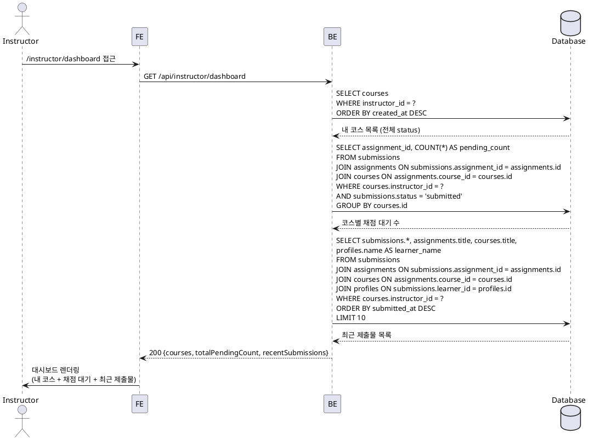

# UC-007: Instructor 대시보드

## Primary Actor

Instructor (인증된 강사)

---

## Precondition

- 로그인 상태이며 역할이 `instructor`인 사용자
- 온보딩이 완료된 상태

---

## Trigger

강사가 `/instructor/dashboard` 페이지에 접근하거나 온보딩 완료 후 자동으로 대시보드에 진입한다.

---

## Main Scenario

1. 강사가 `/instructor/dashboard`에 접근한다.
2. FE가 `GET /api/instructor/dashboard`를 호출한다.
3. BE가 요청자의 `instructor_id`를 세션에서 추출한다.
4. BE가 `courses WHERE instructor_id = ?`를 조회하여 내 코스 목록(draft/published/archived 전체)을 가져온다.
5. BE가 각 코스에 속한 `assignments`의 `submissions WHERE status = 'submitted'` 건수를 집계하여 코스별 채점 대기 수를 산출한다.
6. BE가 채점 대기 수의 합산(전체 채점 대기 수)을 계산한다.
7. BE가 내 코스 전체에 대한 최근 제출물을 `submitted_at DESC` 기준으로 조회한다 (최대 10건).
8. BE가 내 코스 목록, 전체 채점 대기 수, 최근 제출물을 단일 응답으로 반환한다.
9. FE가 각 섹션을 렌더링한다.
   - 내 코스 목록: 코스 제목, 상태(draft/published/archived), 채점 대기 수 배지
   - 전체 채점 대기 수 요약 카드
   - 최근 제출물: 학습자명, 과제 제목, 코스 제목, 제출 시각

---

## Edge Cases

| 상황 | 처리 |
|---|---|
| 개설한 코스가 없음 | 빈 코스 목록 표시 및 "코스 만들기" 유도 버튼 표시 |
| 채점 대기 제출물이 없음 | 채점 대기 수 0 표시, 최근 제출물 섹션 빈 상태 표시 |
| 인증되지 않은 사용자 접근 | 401 반환 → 로그인 페이지로 리다이렉트 |
| Learner 역할로 접근 | 403 반환 → Learner 대시보드(`/dashboard`)로 리다이렉트 |
| 코스는 있으나 과제가 없는 경우 | 해당 코스의 채점 대기 수 0으로 표시 |
| 네트워크 오류 | FE에서 재시도 유도 메시지 표시 |
| 세션 만료 | 401 반환 → 로그인 페이지로 리다이렉트 |

---

## Business Rules

- 내 코스 목록은 `instructor_id = 현재 사용자`인 코스만 표시하며, status 무관하게 모두 포함한다 (draft/published/archived).
- 채점 대기 수는 `submissions.status = 'submitted'`인 건수만 집계한다 (`graded`, `resubmission_required`는 제외).
- 최근 제출물은 `submitted_at DESC` 기준으로 정렬하며, 내 코스에 속한 제출물만 표시한다.
- 다른 강사의 코스 데이터는 절대 노출되지 않는다 (BE에서 `instructor_id` 필터 필수).

---

## Sequence Diagram

