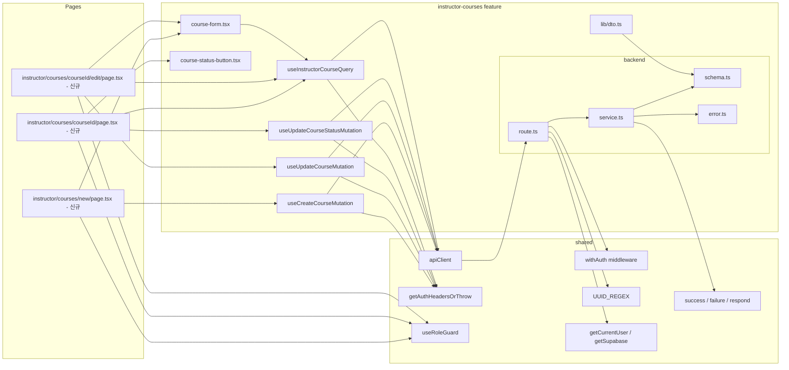

# Plan: UC-008 — 코스 관리 (Instructor)

## 개요

`instructor-courses` feature를 신규 생성한다.
강사(`instructor`) 역할 사용자가 코스를 생성(`/instructor/courses/new`), 수정(`/instructor/courses/:courseId/edit`), 상태 전환(detail 페이지)할 수 있는 기능을 구현한다.

기존 `courses` feature(`src/features/courses/`)는 학습자용 공개 코스 탐색(읽기 전용)을 담당한다. UC-008은 강사 전용 쓰기 작업(생성/수정/상태 전환)이므로 완전히 독립된 `instructor-courses` feature로 분리한다.

`/instructor/courses` 관련 Next.js 페이지는 현재 존재하지 않으므로 신규 생성한다.
`/instructor/dashboard` 페이지의 `InstructorCourseCard`가 코스 상세 편집 링크(`/instructor/courses/:courseId`)를 이미 전제하므로, 해당 경로의 페이지도 함께 구현한다.

| 모듈 | 위치 | 설명 | 상태 |
|---|---|---|---|
| instructor-courses/error | `src/features/instructor-courses/backend/error.ts` | 에러 코드 상수 및 union 타입 | 신규 |
| instructor-courses/schema | `src/features/instructor-courses/backend/schema.ts` | 요청/응답 zod 스키마 | 신규 |
| instructor-courses/service | `src/features/instructor-courses/backend/service.ts` | `createCourse`, `updateCourse`, `updateCourseStatus`, `getInstructorCourse` 비즈니스 로직 | 신규 |
| instructor-courses/route | `src/features/instructor-courses/backend/route.ts` | `POST /api/instructor/courses`, `PUT /api/instructor/courses/:courseId`, `PATCH /api/instructor/courses/:courseId/status`, `GET /api/instructor/courses/:courseId` | 신규 |
| instructor-courses/dto | `src/features/instructor-courses/lib/dto.ts` | backend/schema 타입 재노출 | 신규 |
| useInstructorCourseQuery | `src/features/instructor-courses/hooks/useInstructorCourseQuery.ts` | 단일 코스 조회 쿼리 훅 | 신규 |
| useCreateCourseMutation | `src/features/instructor-courses/hooks/useCreateCourseMutation.ts` | 코스 생성 뮤테이션 훅 | 신규 |
| useUpdateCourseMutation | `src/features/instructor-courses/hooks/useUpdateCourseMutation.ts` | 코스 수정 뮤테이션 훅 | 신규 |
| useUpdateCourseStatusMutation | `src/features/instructor-courses/hooks/useUpdateCourseStatusMutation.ts` | 코스 상태 전환 뮤테이션 훅 | 신규 |
| course-form | `src/features/instructor-courses/components/course-form.tsx` | 코스 생성/수정 공통 폼 컴포넌트 | 신규 |
| course-status-button | `src/features/instructor-courses/components/course-status-button.tsx` | 상태 전환 버튼 컴포넌트 (`ts-pattern` 분기) | 신규 |
| instructor courses new page | `src/app/(protected)/instructor/courses/new/page.tsx` | 코스 생성 페이지 | 신규 |
| instructor courses detail page | `src/app/(protected)/instructor/courses/[courseId]/page.tsx` | 코스 상세 페이지 (강사용) | 신규 |
| instructor courses edit page | `src/app/(protected)/instructor/courses/[courseId]/edit/page.tsx` | 코스 수정 페이지 | 신규 |
| app.ts 등록 | `src/backend/hono/app.ts` | `registerInstructorCourseRoutes` 추가 | 수정 |

---

## 충돌 분석

### 기존 코드베이스와의 충돌 여부

| 검토 항목 | 충돌 여부 | 근거 |
|---|---|---|
| `src/features/instructor-courses/` 디렉토리 존재 여부 | 없음 (신규 생성) | `ls src/features/` 결과: assignments, auth, courses, dashboard, enrollments, example, grades, instructor-dashboard, profiles, submissions만 존재. `instructor-courses`는 미존재 |
| 기존 `courses` feature와 스키마 충돌 | 없음 | 기존 `courses` feature는 학습자용 공개 조회(읽기)만 담당. `instructor-courses`는 강사 전용 쓰기 작업으로 완전 독립 feature로 분리 |
| 라우트 경로 중복 | 없음 | 기존 라우트: `GET /api/courses`, `GET /api/courses/:courseId` (학습자 공개). 신규 경로: `POST /api/instructor/courses`, `GET /api/instructor/courses/:courseId`, `PUT /api/instructor/courses/:courseId`, `PATCH /api/instructor/courses/:courseId/status`는 모두 신규 |
| `/instructor/courses/*` 페이지 존재 여부 | 없음 (신규 생성) | `ls src/app/(protected)/instructor/` 결과: `dashboard/`만 존재 |
| `instructor_id` 소유권 검증 | 신규 구현 필요 | 기존 코드베이스에 instructor 소유권 검증 패턴 없음. `courses` 테이블 `instructor_id` 컬럼으로 BE에서 검증 |
| 상태 전환 단방향 로직 | 신규 구현 필요 | `draft → published → archived` 단방향 전환 검증 로직은 service.ts 내 순수 함수로 분리하여 테스트 가능하게 구현 |
| `categories`, `difficulties` 조회 | 기존 패턴 재사용 | `courses/service.ts`의 `listCourses`에서 이미 `categories`, `difficulties` 조회 패턴 확인. 동일 패턴 적용 |
| `withAuth` 미들웨어 | 재사용 | `src/backend/middleware/auth.ts`에 정의됨 |
| `UUID_REGEX` | 재사용 | `src/constants/validation.ts`에 정의됨 |
| `apiClient`, `extractApiErrorMessage` | 재사용 | `src/lib/remote/api-client.ts`에 정의됨 |
| `getAuthHeadersOrThrow` | 재사용 | `src/lib/remote/auth-headers.ts`에 정의됨 |
| `success`, `failure`, `respond` | 재사용 | `src/backend/http/response.ts`에 정의됨 |
| `getCurrentUser`, `getSupabase` | 재사용 | `src/backend/hono/context.ts`에 정의됨 |
| `AppSupabaseClient` 타입 | 재사용 | `src/backend/supabase/client.ts`에서 import |
| `useRoleGuard('instructor')` | 재사용 | `src/hooks/useRoleGuard.ts`에 정의됨 |
| `INSTRUCTOR_HOME_PATH` | 재사용 | `src/constants/auth.ts`에 정의됨 |
| DB 마이그레이션 | 불필요 | `courses`, `categories`, `difficulties` 테이블은 `0002_create_lms_tables.sql`에 이미 정의됨. `updated_at` 트리거도 이미 존재 |
| `app.ts` 등록 | 수정 필요 | `registerInstructorDashboardRoutes(app)` 다음 줄에 `registerInstructorCourseRoutes(app)` 추가 |

### DB 스키마와 Spec 간 주의사항

- `courses.status`는 `course_status` ENUM(`draft`, `published`, `archived`). BE에서 상태 전환 유효성 검증 후 UPDATE 수행.
- `courses.category_id`, `courses.difficulty_id`는 NULL 허용. 생성/수정 시 선택 항목이므로 schema에서 `.nullable().optional()` 처리.
- `courses.instructor_id`는 생성 후 변경 불가. 생성 시 세션에서 추출한 `currentUser.id`를 INSERT에 고정 사용.
- `category_id`, `difficulty_id` 유효성: 생성/수정 시 `is_active = true` 여부를 BE에서 검증 (Edge Case: 비활성화된 카테고리/난이도 사용 방지).
- `updated_at`은 `trg_courses_updated_at` 트리거가 자동 갱신하므로 UPDATE 쿼리에서 명시 불필요.

---

## Diagram



---

## Implementation Plan

### Step 1: instructor-courses/backend/error.ts

기존 `assignmentErrorCodes`, `courseErrorCodes`, `instructorDashboardErrorCodes` 패턴을 그대로 따른다.

```typescript
// src/features/instructor-courses/backend/error.ts
export const instructorCourseErrorCodes = {
  forbidden: 'FORBIDDEN',
  notFound: 'INSTRUCTOR_COURSE_NOT_FOUND',
  invalidStatus: 'INVALID_STATUS_TRANSITION',
  inactiveMeta: 'INACTIVE_META',
  fetchError: 'INSTRUCTOR_COURSE_FETCH_ERROR',
} as const;

type InstructorCourseErrorValue =
  (typeof instructorCourseErrorCodes)[keyof typeof instructorCourseErrorCodes];
export type InstructorCourseServiceError = InstructorCourseErrorValue;
```

에러 코드 5종:
- `FORBIDDEN`: 401(미인증) / 403(role 위반 또는 소유권 불일치)
- `INSTRUCTOR_COURSE_NOT_FOUND`: 404, 코스 미존재
- `INVALID_STATUS_TRANSITION`: 400, 허용되지 않는 상태 전환
- `INACTIVE_META`: 400, 비활성화된 `category_id` 또는 `difficulty_id` 사용
- `INSTRUCTOR_COURSE_FETCH_ERROR`: 500, DB 오류

---

### Step 2: instructor-courses/backend/schema.ts

생성/수정 요청 바디와 응답 스키마를 분리하여 정의한다.
기존 `courses/backend/schema.ts`의 `CategorySchema`, `DifficultySchema`를 재사용하지 않고 독립 정의한다 (feature 간 직접 import 금지 원칙).

```typescript
// src/features/instructor-courses/backend/schema.ts
import { z } from 'zod';

// --- 요청 스키마 ---

export const CreateCourseBodySchema = z.object({
  title: z.string().min(1, '제목은 필수입니다.'),
  description: z.string().nullable().optional(),
  categoryId: z.string().uuid().nullable().optional(),
  difficultyId: z.string().uuid().nullable().optional(),
  curriculum: z.string().nullable().optional(),
});

export const UpdateCourseBodySchema = z.object({
  title: z.string().min(1, '제목은 필수입니다.'),
  description: z.string().nullable().optional(),
  categoryId: z.string().uuid().nullable().optional(),
  difficultyId: z.string().uuid().nullable().optional(),
  curriculum: z.string().nullable().optional(),
});

export const UpdateCourseStatusBodySchema = z.object({
  status: z.enum(['published', 'archived']),
});

// --- 응답 스키마 ---

export const InstructorCourseCategorySchema = z.object({
  id: z.string().uuid(),
  name: z.string(),
});

export const InstructorCourseDifficultySchema = z.object({
  id: z.string().uuid(),
  name: z.string(),
});

export const InstructorCourseDtoSchema = z.object({
  id: z.string().uuid(),
  title: z.string(),
  description: z.string().nullable(),
  category: InstructorCourseCategorySchema.nullable(),
  difficulty: InstructorCourseDifficultySchema.nullable(),
  curriculum: z.string().nullable(),
  status: z.enum(['draft', 'published', 'archived']),
  createdAt: z.string(),
  updatedAt: z.string(),
});

export const InstructorCourseResponseSchema = z.object({
  course: InstructorCourseDtoSchema,
});

// --- 메타 스키마 (생성/수정 폼에 필요한 카테고리/난이도 목록) ---

export const InstructorCourseMetaSchema = z.object({
  categories: z.array(InstructorCourseCategorySchema),
  difficulties: z.array(InstructorCourseDifficultySchema),
});

export const InstructorCourseWithMetaResponseSchema = z.object({
  course: InstructorCourseDtoSchema,
  meta: InstructorCourseMetaSchema,
});

export const InstructorCourseMetaOnlyResponseSchema = z.object({
  meta: InstructorCourseMetaSchema,
});

// --- 타입 추론 ---

export type CreateCourseBody = z.infer<typeof CreateCourseBodySchema>;
export type UpdateCourseBody = z.infer<typeof UpdateCourseBodySchema>;
export type UpdateCourseStatusBody = z.infer<typeof UpdateCourseStatusBodySchema>;
export type InstructorCourseDto = z.infer<typeof InstructorCourseDtoSchema>;
export type InstructorCourseResponse = z.infer<typeof InstructorCourseResponseSchema>;
export type InstructorCourseWithMetaResponse = z.infer<typeof InstructorCourseWithMetaResponseSchema>;
export type InstructorCourseMetaOnlyResponse = z.infer<typeof InstructorCourseMetaOnlyResponseSchema>;
export type InstructorCourseMeta = z.infer<typeof InstructorCourseMetaSchema>;
```

**설계 근거**:

- `UpdateCourseStatusBodySchema`의 `status`는 `published | archived`만 허용 (생성 후 `draft`는 기본값이며 수동 전환 대상 아님).
- `InstructorCourseDtoSchema`는 강사 전용 응답으로 `updatedAt` 포함 (학습자용 `CourseDto`에는 없음).
- `GET /api/instructor/courses/:courseId`는 폼 렌더링에 필요한 `meta`(카테고리/난이도 목록)를 함께 반환하여 FE에서 추가 API 호출 없이 폼을 구성할 수 있도록 한다.

---

### Step 3: instructor-courses/backend/service.ts

소유권 검증 헬퍼를 내부에 독립 정의한다. 상태 전환 유효성 로직은 순수 함수로 분리하여 단위 테스트 가능하게 구현한다.

```typescript
// src/features/instructor-courses/backend/service.ts
import { failure, success, type HandlerResult } from '@/backend/http/response';
import type { AppSupabaseClient } from '@/backend/supabase/client';
import {
  instructorCourseErrorCodes,
  type InstructorCourseServiceError,
} from './error';
import type {
  CreateCourseBody,
  UpdateCourseBody,
  UpdateCourseStatusBody,
  InstructorCourseDto,
  InstructorCourseResponse,
  InstructorCourseWithMetaResponse,
  InstructorCourseMetaOnlyResponse,
} from './schema';

// --- 내부 Row 타입 ---
type CourseRow = {
  id: string;
  title: string;
  description: string | null;
  curriculum: string | null;
  status: 'draft' | 'published' | 'archived';
  created_at: string;
  updated_at: string;
  category: { id: string; name: string } | null;
  difficulty: { id: string; name: string } | null;
};

type MetaRow = {
  id: string;
  name: string;
};

const COURSE_SELECT = `
  id,
  title,
  description,
  curriculum,
  status,
  created_at,
  updated_at,
  category:categories!category_id(id, name),
  difficulty:difficulties!difficulty_id(id, name)
` as const;

// --- mapper ---
const mapCourseRow = (row: CourseRow): InstructorCourseDto => ({
  id: row.id,
  title: row.title,
  description: row.description,
  curriculum: row.curriculum,
  status: row.status,
  createdAt: row.created_at,
  updatedAt: row.updated_at,
  category: row.category ?? null,
  difficulty: row.difficulty ?? null,
});

// --- 상태 전환 허용 여부 순수 함수 ---
// 허용: draft → published, published → archived
// 불허: 그 외 모든 전환
export const isAllowedStatusTransition = (
  currentStatus: string,
  nextStatus: string,
): boolean => {
  if (currentStatus === 'draft' && nextStatus === 'published') return true;
  if (currentStatus === 'published' && nextStatus === 'archived') return true;
  return false;
};

// --- 소유권 검증 헬퍼 (feature 내 독립 정의) ---
const verifyCourseOwnership = async (
  supabase: AppSupabaseClient,
  courseId: string,
  instructorId: string,
): Promise<HandlerResult<CourseRow, InstructorCourseServiceError>> => {
  const { data, error } = await supabase
    .from('courses')
    .select(COURSE_SELECT)
    .eq('id', courseId)
    .maybeSingle();

  if (error) {
    return failure(500, instructorCourseErrorCodes.fetchError, error.message);
  }

  if (!data) {
    return failure(404, instructorCourseErrorCodes.notFound, '코스를 찾을 수 없습니다.');
  }

  const row = data as unknown as CourseRow;

  if ((data as { instructor_id?: string }).instructor_id !== instructorId) {
    return failure(403, instructorCourseErrorCodes.forbidden, '해당 코스에 대한 권한이 없습니다.');
  }

  return success(row);
};
```

**주의**: `COURSE_SELECT`에 `instructor_id`를 포함시켜야 소유권 검증이 가능하다. 실제 코드에서는 `instructor_id`를 select에 추가하고 `CourseRow` 타입에 포함한다.

#### 3-1. `getInstructorCourse` (코스 상세 + 메타 조회)

```typescript
export const getInstructorCourse = async (
  supabase: AppSupabaseClient,
  courseId: string,
  instructorId: string,
): Promise<HandlerResult<InstructorCourseWithMetaResponse, InstructorCourseServiceError>> => {
  const ownershipResult = await verifyCourseOwnership(supabase, courseId, instructorId);
  if (!ownershipResult.ok) return ownershipResult;

  const course = mapCourseRow(ownershipResult.data);

  const [categoriesResult, difficultiesResult] = await Promise.all([
    supabase.from('categories').select('id, name').eq('is_active', true).order('name', { ascending: true }),
    supabase.from('difficulties').select('id, name').eq('is_active', true).order('name', { ascending: true }),
  ]);

  if (categoriesResult.error) {
    return failure(500, instructorCourseErrorCodes.fetchError, categoriesResult.error.message);
  }

  if (difficultiesResult.error) {
    return failure(500, instructorCourseErrorCodes.fetchError, difficultiesResult.error.message);
  }

  return success({
    course,
    meta: {
      categories: (categoriesResult.data ?? []) as MetaRow[],
      difficulties: (difficultiesResult.data ?? []) as MetaRow[],
    },
  });
};
```

#### 3-2. `createCourse` (코스 생성)

```typescript
export const createCourse = async (
  supabase: AppSupabaseClient,
  instructorId: string,
  body: CreateCourseBody,
): Promise<HandlerResult<InstructorCourseResponse, InstructorCourseServiceError>> => {
  // 비활성화된 category/difficulty 검증
  if (body.categoryId) {
    const { data: cat } = await supabase
      .from('categories')
      .select('id, is_active')
      .eq('id', body.categoryId)
      .maybeSingle();

    if (!cat || !cat.is_active) {
      return failure(400, instructorCourseErrorCodes.inactiveMeta, '사용할 수 없는 카테고리입니다.');
    }
  }

  if (body.difficultyId) {
    const { data: diff } = await supabase
      .from('difficulties')
      .select('id, is_active')
      .eq('id', body.difficultyId)
      .maybeSingle();

    if (!diff || !diff.is_active) {
      return failure(400, instructorCourseErrorCodes.inactiveMeta, '사용할 수 없는 난이도입니다.');
    }
  }

  const { data, error } = await supabase
    .from('courses')
    .insert({
      instructor_id: instructorId,
      title: body.title,
      description: body.description ?? null,
      category_id: body.categoryId ?? null,
      difficulty_id: body.difficultyId ?? null,
      curriculum: body.curriculum ?? null,
      status: 'draft',
    })
    .select(COURSE_SELECT)
    .single();

  if (error) {
    return failure(500, instructorCourseErrorCodes.fetchError, error.message);
  }

  return success({ course: mapCourseRow(data as unknown as CourseRow) }, 201);
};
```

#### 3-3. `updateCourse` (코스 수정)

```typescript
export const updateCourse = async (
  supabase: AppSupabaseClient,
  courseId: string,
  instructorId: string,
  body: UpdateCourseBody,
): Promise<HandlerResult<InstructorCourseResponse, InstructorCourseServiceError>> => {
  const ownershipResult = await verifyCourseOwnership(supabase, courseId, instructorId);
  if (!ownershipResult.ok) return ownershipResult;

  // 비활성화된 category/difficulty 검증
  if (body.categoryId) {
    const { data: cat } = await supabase
      .from('categories')
      .select('id, is_active')
      .eq('id', body.categoryId)
      .maybeSingle();

    if (!cat || !cat.is_active) {
      return failure(400, instructorCourseErrorCodes.inactiveMeta, '사용할 수 없는 카테고리입니다.');
    }
  }

  if (body.difficultyId) {
    const { data: diff } = await supabase
      .from('difficulties')
      .select('id, is_active')
      .eq('id', body.difficultyId)
      .maybeSingle();

    if (!diff || !diff.is_active) {
      return failure(400, instructorCourseErrorCodes.inactiveMeta, '사용할 수 없는 난이도입니다.');
    }
  }

  const { data, error } = await supabase
    .from('courses')
    .update({
      title: body.title,
      description: body.description ?? null,
      category_id: body.categoryId ?? null,
      difficulty_id: body.difficultyId ?? null,
      curriculum: body.curriculum ?? null,
      // updated_at은 트리거가 자동 갱신하므로 명시 불필요
    })
    .eq('id', courseId)
    .select(COURSE_SELECT)
    .single();

  if (error) {
    return failure(500, instructorCourseErrorCodes.fetchError, error.message);
  }

  return success({ course: mapCourseRow(data as unknown as CourseRow) });
};
```

#### 3-4. `updateCourseStatus` (코스 상태 전환)

```typescript
export const updateCourseStatus = async (
  supabase: AppSupabaseClient,
  courseId: string,
  instructorId: string,
  body: UpdateCourseStatusBody,
): Promise<HandlerResult<InstructorCourseResponse, InstructorCourseServiceError>> => {
  const ownershipResult = await verifyCourseOwnership(supabase, courseId, instructorId);
  if (!ownershipResult.ok) return ownershipResult;

  const currentStatus = ownershipResult.data.status;

  if (!isAllowedStatusTransition(currentStatus, body.status)) {
    return failure(
      400,
      instructorCourseErrorCodes.invalidStatus,
      `'${currentStatus}' 상태에서 '${body.status}'로 전환할 수 없습니다.`,
    );
  }

  const { data, error } = await supabase
    .from('courses')
    .update({ status: body.status })
    .eq('id', courseId)
    .select(COURSE_SELECT)
    .single();

  if (error) {
    return failure(500, instructorCourseErrorCodes.fetchError, error.message);
  }

  return success({ course: mapCourseRow(data as unknown as CourseRow) });
};
```

**Unit Test**

```typescript
describe('isAllowedStatusTransition', () => {
  it('draft → published → true')
  it('published → archived → true')
  it('draft → archived → false (단계 건너뜀)')
  it('archived → published → false (역방향)')
  it('published → draft → false (역방향)')
  it('archived → draft → false (역방향)')
  it('draft → draft → false (동일 상태)')
  it('published → published → false (동일 상태)')
  it('archived → archived → false (동일 상태)')
})

describe('createCourse', () => {
  it('유효한 instructor + 필수 필드(title)만 → 201 status=draft 코스 생성')
  it('유효한 instructor + 전체 필드(title, description, categoryId, difficultyId, curriculum) → 201 코스 생성')
  it('비활성화된 categoryId → 400 INACTIVE_META')
  it('비활성화된 difficultyId → 400 INACTIVE_META')
  it('categoryId 없음(null) → 정상 생성 (NULL 허용)')
  it('difficultyId 없음(null) → 정상 생성 (NULL 허용)')
  it('DB INSERT 오류 → 500 INSTRUCTOR_COURSE_FETCH_ERROR')
})

describe('updateCourse', () => {
  it('소유권 일치 + 유효 바디 → 200 수정된 코스')
  it('소유권 불일치 → 403 FORBIDDEN')
  it('존재하지 않는 courseId → 404 INSTRUCTOR_COURSE_NOT_FOUND')
  it('비활성화된 categoryId → 400 INACTIVE_META')
  it('비활성화된 difficultyId → 400 INACTIVE_META')
  it('DB UPDATE 오류 → 500 INSTRUCTOR_COURSE_FETCH_ERROR')
})

describe('updateCourseStatus', () => {
  it('draft → published 전환 성공 → 200 갱신된 코스')
  it('published → archived 전환 성공 → 200 갱신된 코스')
  it('draft → archived 전환 시도 → 400 INVALID_STATUS_TRANSITION')
  it('archived → published 전환 시도 → 400 INVALID_STATUS_TRANSITION')
  it('published → draft 전환 시도 → 400 INVALID_STATUS_TRANSITION')
  it('소유권 불일치 → 403 FORBIDDEN')
  it('존재하지 않는 courseId → 404 INSTRUCTOR_COURSE_NOT_FOUND')
  it('DB UPDATE 오류 → 500 INSTRUCTOR_COURSE_FETCH_ERROR')
})

describe('getInstructorCourse', () => {
  it('소유권 일치 → 200 코스 + 메타(categories, difficulties)')
  it('소유권 불일치 → 403 FORBIDDEN')
  it('존재하지 않는 courseId → 404 INSTRUCTOR_COURSE_NOT_FOUND')
  it('DB 오류 → 500 INSTRUCTOR_COURSE_FETCH_ERROR')
})
```

---

### Step 4: instructor-courses/backend/route.ts

기존 `assignments/route.ts`, `instructor-dashboard/route.ts` 패턴을 따른다.
모든 라우트에 `withAuth()` 적용, `role !== 'instructor'`이면 403 반환.

```typescript
// src/features/instructor-courses/backend/route.ts
import type { Hono } from 'hono';
import { respond, failure } from '@/backend/http/response';
import { withAuth } from '@/backend/middleware/auth';
import { getCurrentUser, getSupabase, type AppEnv } from '@/backend/hono/context';
import { UUID_REGEX } from '@/constants/validation';
import { instructorCourseErrorCodes } from './error';
import { CreateCourseBodySchema, UpdateCourseBodySchema, UpdateCourseStatusBodySchema } from './schema';
import {
  createCourse,
  updateCourse,
  updateCourseStatus,
  getInstructorCourse,
} from './service';

export const registerInstructorCourseRoutes = (app: Hono<AppEnv>) => {
  // 공통 instructor 역할 검증 헬퍼 (route 내 인라인)
  // GET /api/instructor/courses/:courseId
  app.get('/api/instructor/courses/:courseId', withAuth(), async (c) => {
    const currentUser = getCurrentUser(c);
    if (!currentUser) {
      return respond(c, failure(401, instructorCourseErrorCodes.forbidden, '인증이 필요합니다.'));
    }
    if (currentUser.role !== 'instructor') {
      return respond(c, failure(403, instructorCourseErrorCodes.forbidden, '강사만 접근할 수 있습니다.'));
    }
    const courseId = c.req.param('courseId');
    if (!UUID_REGEX.test(courseId)) {
      return respond(c, failure(400, instructorCourseErrorCodes.notFound, '올바르지 않은 코스 ID입니다.'));
    }
    const supabase = getSupabase(c);
    const result = await getInstructorCourse(supabase, courseId, currentUser.id);
    return respond(c, result);
  });

  // POST /api/instructor/courses
  app.post('/api/instructor/courses', withAuth(), async (c) => {
    const currentUser = getCurrentUser(c);
    if (!currentUser) {
      return respond(c, failure(401, instructorCourseErrorCodes.forbidden, '인증이 필요합니다.'));
    }
    if (currentUser.role !== 'instructor') {
      return respond(c, failure(403, instructorCourseErrorCodes.forbidden, '강사만 접근할 수 있습니다.'));
    }
    const rawBody = await c.req.json().catch(() => null);
    const parsed = CreateCourseBodySchema.safeParse(rawBody);
    if (!parsed.success) {
      return respond(
        c,
        failure(400, instructorCourseErrorCodes.fetchError, '올바르지 않은 요청입니다.', parsed.error.format()),
      );
    }
    const supabase = getSupabase(c);
    const result = await createCourse(supabase, currentUser.id, parsed.data);
    return respond(c, result);
  });

  // PUT /api/instructor/courses/:courseId
  app.put('/api/instructor/courses/:courseId', withAuth(), async (c) => {
    const currentUser = getCurrentUser(c);
    if (!currentUser) {
      return respond(c, failure(401, instructorCourseErrorCodes.forbidden, '인증이 필요합니다.'));
    }
    if (currentUser.role !== 'instructor') {
      return respond(c, failure(403, instructorCourseErrorCodes.forbidden, '강사만 접근할 수 있습니다.'));
    }
    const courseId = c.req.param('courseId');
    if (!UUID_REGEX.test(courseId)) {
      return respond(c, failure(400, instructorCourseErrorCodes.notFound, '올바르지 않은 코스 ID입니다.'));
    }
    const rawBody = await c.req.json().catch(() => null);
    const parsed = UpdateCourseBodySchema.safeParse(rawBody);
    if (!parsed.success) {
      return respond(
        c,
        failure(400, instructorCourseErrorCodes.fetchError, '올바르지 않은 요청입니다.', parsed.error.format()),
      );
    }
    const supabase = getSupabase(c);
    const result = await updateCourse(supabase, courseId, currentUser.id, parsed.data);
    return respond(c, result);
  });

  // PATCH /api/instructor/courses/:courseId/status
  app.patch('/api/instructor/courses/:courseId/status', withAuth(), async (c) => {
    const currentUser = getCurrentUser(c);
    if (!currentUser) {
      return respond(c, failure(401, instructorCourseErrorCodes.forbidden, '인증이 필요합니다.'));
    }
    if (currentUser.role !== 'instructor') {
      return respond(c, failure(403, instructorCourseErrorCodes.forbidden, '강사만 접근할 수 있습니다.'));
    }
    const courseId = c.req.param('courseId');
    if (!UUID_REGEX.test(courseId)) {
      return respond(c, failure(400, instructorCourseErrorCodes.notFound, '올바르지 않은 코스 ID입니다.'));
    }
    const rawBody = await c.req.json().catch(() => null);
    const parsed = UpdateCourseStatusBodySchema.safeParse(rawBody);
    if (!parsed.success) {
      return respond(
        c,
        failure(400, instructorCourseErrorCodes.invalidStatus, '올바르지 않은 상태값입니다.', parsed.error.format()),
      );
    }
    const supabase = getSupabase(c);
    const result = await updateCourseStatus(supabase, courseId, currentUser.id, parsed.data);
    return respond(c, result);
  });
};
```

**Unit Test**

```typescript
describe('POST /api/instructor/courses', () => {
  it('미인증 요청 → 401 FORBIDDEN')
  it('learner 역할 요청 → 403 FORBIDDEN')
  it('title 누락 → 400 (zod validation)')
  it('instructor + 유효 바디 → 201 InstructorCourseResponse')
})

describe('PUT /api/instructor/courses/:courseId', () => {
  it('미인증 요청 → 401 FORBIDDEN')
  it('learner 역할 요청 → 403 FORBIDDEN')
  it('비UUID courseId → 400')
  it('title 누락 → 400 (zod validation)')
  it('소유권 불일치 → 403 FORBIDDEN')
  it('instructor + 유효 바디 → 200 InstructorCourseResponse')
})

describe('PATCH /api/instructor/courses/:courseId/status', () => {
  it('미인증 요청 → 401 FORBIDDEN')
  it('learner 역할 요청 → 403 FORBIDDEN')
  it('비UUID courseId → 400')
  it('허용되지 않는 status 값(e.g. "draft") → 400 (zod validation)')
  it('소유권 불일치 → 403 FORBIDDEN')
  it('불허 상태 전환(archived → published) → 400 INVALID_STATUS_TRANSITION')
  it('instructor + draft→published → 200 InstructorCourseResponse')
})

describe('GET /api/instructor/courses/:courseId', () => {
  it('미인증 요청 → 401 FORBIDDEN')
  it('learner 역할 요청 → 403 FORBIDDEN')
  it('비UUID courseId → 400')
  it('소유권 불일치 → 403 FORBIDDEN')
  it('존재하지 않는 courseId → 404 INSTRUCTOR_COURSE_NOT_FOUND')
  it('instructor + 유효 courseId → 200 InstructorCourseWithMetaResponse')
})
```

---

### Step 5: instructor-courses/lib/dto.ts

기존 `courses/lib/dto.ts`, `instructor-dashboard/lib/dto.ts` 패턴을 그대로 따른다.

```typescript
// src/features/instructor-courses/lib/dto.ts
export {
  CreateCourseBodySchema,
  UpdateCourseBodySchema,
  UpdateCourseStatusBodySchema,
  InstructorCourseDtoSchema,
  InstructorCourseResponseSchema,
  InstructorCourseWithMetaResponseSchema,
  InstructorCourseMetaOnlyResponseSchema,
  InstructorCourseMetaSchema,
} from '@/features/instructor-courses/backend/schema';

export type {
  CreateCourseBody,
  UpdateCourseBody,
  UpdateCourseStatusBody,
  InstructorCourseDto,
  InstructorCourseResponse,
  InstructorCourseWithMetaResponse,
  InstructorCourseMetaOnlyResponse,
  InstructorCourseMeta,
} from '@/features/instructor-courses/backend/schema';
```

---

### Step 6: instructor-courses/hooks/useInstructorCourseQuery.ts

기존 `useCourseDetailQuery.ts`, `useInstructorDashboardQuery.ts` 패턴을 따른다.

```typescript
// src/features/instructor-courses/hooks/useInstructorCourseQuery.ts
'use client';

import { useQuery } from '@tanstack/react-query';
import { apiClient, extractApiErrorMessage } from '@/lib/remote/api-client';
import { getAuthHeadersOrThrow } from '@/lib/remote/auth-headers';
import { InstructorCourseWithMetaResponseSchema } from '@/features/instructor-courses/lib/dto';
import type { InstructorCourseWithMetaResponse } from '@/features/instructor-courses/lib/dto';

const fetchInstructorCourse = async (courseId: string): Promise<InstructorCourseWithMetaResponse> => {
  try {
    const headers = await getAuthHeadersOrThrow();
    const { data } = await apiClient.get(`/api/instructor/courses/${courseId}`, { headers });
    return InstructorCourseWithMetaResponseSchema.parse(data);
  } catch (error) {
    const message = extractApiErrorMessage(error, '코스 정보를 불러오지 못했습니다.');
    throw new Error(message);
  }
};

export const useInstructorCourseQuery = (courseId: string) =>
  useQuery({
    queryKey: ['instructor', 'courses', courseId],
    queryFn: () => fetchInstructorCourse(courseId),
    enabled: Boolean(courseId),
    staleTime: 30 * 1000,
  });
```

---

### Step 7: instructor-courses/hooks/useCreateCourseMutation.ts

기존 mutation 패턴(enrollment feature 참고)을 따른다.
성공 시 `instructor-dashboard` queryKey를 invalidate하여 코스 카드 목록이 최신 상태로 갱신된다.

```typescript
// src/features/instructor-courses/hooks/useCreateCourseMutation.ts
'use client';

import { useMutation, useQueryClient } from '@tanstack/react-query';
import { useRouter } from 'next/navigation';
import { apiClient, extractApiErrorMessage } from '@/lib/remote/api-client';
import { getAuthHeadersOrThrow } from '@/lib/remote/auth-headers';
import { InstructorCourseResponseSchema } from '@/features/instructor-courses/lib/dto';
import type { CreateCourseBody } from '@/features/instructor-courses/lib/dto';

const createCourseApi = async (body: CreateCourseBody) => {
  try {
    const headers = await getAuthHeadersOrThrow();
    const { data } = await apiClient.post('/api/instructor/courses', body, { headers });
    return InstructorCourseResponseSchema.parse(data);
  } catch (error) {
    const message = extractApiErrorMessage(error, '코스 생성에 실패했습니다.');
    throw new Error(message);
  }
};

export const useCreateCourseMutation = () => {
  const queryClient = useQueryClient();
  const router = useRouter();

  return useMutation({
    mutationFn: createCourseApi,
    onSuccess: (data) => {
      void queryClient.invalidateQueries({ queryKey: ['instructor', 'dashboard'] });
      router.push(`/instructor/courses/${data.course.id}`);
    },
  });
};
```

---

### Step 8: instructor-courses/hooks/useUpdateCourseMutation.ts

수정 성공 시 해당 코스 query와 `instructor-dashboard` queryKey를 모두 invalidate한다.

```typescript
// src/features/instructor-courses/hooks/useUpdateCourseMutation.ts
'use client';

import { useMutation, useQueryClient } from '@tanstack/react-query';
import { apiClient, extractApiErrorMessage } from '@/lib/remote/api-client';
import { getAuthHeadersOrThrow } from '@/lib/remote/auth-headers';
import { InstructorCourseResponseSchema } from '@/features/instructor-courses/lib/dto';
import type { UpdateCourseBody } from '@/features/instructor-courses/lib/dto';

const updateCourseApi = async ({
  courseId,
  body,
}: {
  courseId: string;
  body: UpdateCourseBody;
}) => {
  try {
    const headers = await getAuthHeadersOrThrow();
    const { data } = await apiClient.put(`/api/instructor/courses/${courseId}`, body, { headers });
    return InstructorCourseResponseSchema.parse(data);
  } catch (error) {
    const message = extractApiErrorMessage(error, '코스 수정에 실패했습니다.');
    throw new Error(message);
  }
};

export const useUpdateCourseMutation = (courseId: string) => {
  const queryClient = useQueryClient();

  return useMutation({
    mutationFn: (body: UpdateCourseBody) => updateCourseApi({ courseId, body }),
    onSuccess: () => {
      void queryClient.invalidateQueries({ queryKey: ['instructor', 'courses', courseId] });
      void queryClient.invalidateQueries({ queryKey: ['instructor', 'dashboard'] });
    },
  });
};
```

---

### Step 9: instructor-courses/hooks/useUpdateCourseStatusMutation.ts

상태 전환 성공 시 해당 코스 query와 `instructor-dashboard` queryKey를 invalidate한다.

```typescript
// src/features/instructor-courses/hooks/useUpdateCourseStatusMutation.ts
'use client';

import { useMutation, useQueryClient } from '@tanstack/react-query';
import { apiClient, extractApiErrorMessage } from '@/lib/remote/api-client';
import { getAuthHeadersOrThrow } from '@/lib/remote/auth-headers';
import { InstructorCourseResponseSchema } from '@/features/instructor-courses/lib/dto';
import type { UpdateCourseStatusBody } from '@/features/instructor-courses/lib/dto';

const updateCourseStatusApi = async ({
  courseId,
  body,
}: {
  courseId: string;
  body: UpdateCourseStatusBody;
}) => {
  try {
    const headers = await getAuthHeadersOrThrow();
    const { data } = await apiClient.patch(
      `/api/instructor/courses/${courseId}/status`,
      body,
      { headers },
    );
    return InstructorCourseResponseSchema.parse(data);
  } catch (error) {
    const message = extractApiErrorMessage(error, '코스 상태 변경에 실패했습니다.');
    throw new Error(message);
  }
};

export const useUpdateCourseStatusMutation = (courseId: string) => {
  const queryClient = useQueryClient();

  return useMutation({
    mutationFn: (body: UpdateCourseStatusBody) => updateCourseStatusApi({ courseId, body }),
    onSuccess: () => {
      void queryClient.invalidateQueries({ queryKey: ['instructor', 'courses', courseId] });
      void queryClient.invalidateQueries({ queryKey: ['instructor', 'dashboard'] });
    },
  });
};
```

---

### Step 10: instructor-courses/components/course-form.tsx

코스 생성과 수정 양쪽에서 재사용하는 공통 폼 컴포넌트.
`react-hook-form` + `zod` resolver를 사용한다.
`CategoryDto`, `DifficultyDto`는 `InstructorCourseMeta`에서 전달받는다.

```typescript
// src/features/instructor-courses/components/course-form.tsx
'use client';

import { useForm } from 'react-hook-form';
import { zodResolver } from '@hookform/resolvers/zod';
import { Loader2 } from 'lucide-react';
import { Button } from '@/components/ui/button';
import { Input } from '@/components/ui/input';
import { Textarea } from '@/components/ui/textarea';
import {
  Select,
  SelectContent,
  SelectItem,
  SelectTrigger,
  SelectValue,
} from '@/components/ui/select';
import {
  Form,
  FormControl,
  FormField,
  FormItem,
  FormLabel,
  FormMessage,
} from '@/components/ui/form';
import { CreateCourseBodySchema } from '@/features/instructor-courses/lib/dto';
import type { CreateCourseBody, InstructorCourseMeta } from '@/features/instructor-courses/lib/dto';

type CourseFormProps = {
  defaultValues?: Partial<CreateCourseBody>;
  meta: InstructorCourseMeta;
  onSubmit: (values: CreateCourseBody) => void;
  isPending: boolean;
  submitLabel?: string;
};
```

**필드 구성**:
- `title` (필수): `Input` 컴포넌트
- `description` (선택): `Textarea` 컴포넌트
- `categoryId` (선택): `Select` 컴포넌트, "카테고리 없음" 옵션 포함
- `difficultyId` (선택): `Select` 컴포넌트, "난이도 없음" 옵션 포함
- `curriculum` (선택): `Textarea` 컴포넌트

**Select null 처리 주의**: `shadcn-ui Select`는 value로 빈 문자열을 사용하여 "선택 안함"을 표현하고, form submit 시 `null`로 변환한다.

**QA Sheet**

| 시나리오 | 기대 결과 |
|---|---|
| title 미입력 후 제출 | "제목은 필수입니다." 인라인 오류 메시지 |
| title 입력 후 제출 | onSubmit 호출 |
| categoryId 미선택 | null로 제출 (정상 처리) |
| difficultyId 미선택 | null로 제출 (정상 처리) |
| isPending = true | 제출 버튼 비활성화 + 로딩 스피너 |
| defaultValues 전달 | 폼 필드에 기존 값 채워짐 (수정 시나리오) |
| 카테고리 선택 후 다시 해제 | null로 초기화 |

---

### Step 11: instructor-courses/components/course-status-button.tsx

코스 상세 페이지에서 현재 상태에 따라 적절한 전환 버튼을 렌더링한다.
`ts-pattern`으로 상태별 버튼 분기를 구현한다.

```typescript
// src/features/instructor-courses/components/course-status-button.tsx
'use client';

import { match } from 'ts-pattern';
import { Globe, Archive } from 'lucide-react';
import { Button } from '@/components/ui/button';
import type { InstructorCourseDto } from '@/features/instructor-courses/lib/dto';

type CourseStatusButtonProps = {
  status: InstructorCourseDto['status'];
  onPublish: () => void;
  onArchive: () => void;
  isPending: boolean;
};
```

상태별 버튼 렌더링 규칙:

| status | 렌더링 |
|---|---|
| `draft` | "공개하기" 버튼 (onClick: onPublish) |
| `published` | "보관하기" 버튼 (onClick: onArchive) |
| `archived` | 버튼 없음 (보관됨 배지만 표시) |

**QA Sheet**

| 시나리오 | 기대 결과 |
|---|---|
| status = draft | "공개하기" 버튼 표시 |
| status = published | "보관하기" 버튼 표시 |
| status = archived | 버튼 미표시 |
| isPending = true | 버튼 비활성화 + 로딩 스피너 |
| "공개하기" 클릭 | onPublish 호출 |
| "보관하기" 클릭 | onArchive 호출 |

---

### Step 12: 페이지 구현

#### 12-1. `instructor/courses/new/page.tsx` (코스 생성 페이지)

```typescript
// src/app/(protected)/instructor/courses/new/page.tsx
'use client';

import { useRoleGuard } from '@/hooks/useRoleGuard';
import { useCreateCourseMutation } from '@/features/instructor-courses/hooks/useCreateCourseMutation';
import { CourseForm } from '@/features/instructor-courses/components/course-form';

// 생성 페이지는 meta(카테고리/난이도 목록)를 별도로 조회해야 한다.
// 별도 GET /api/instructor/courses/meta 엔드포인트를 추가하거나,
// 혹은 기존 GET /api/courses (학습자 공개 API)의 meta 응답을 활용한다.
// 가장 단순한 방법: 기존 useCourseListQuery의 meta 필드를 재사용한다.
// 그러나 feature 간 직접 의존 금지 원칙에 따라,
// instructor-courses feature 내 별도 meta 전용 쿼리 훅을 구현한다.

type NewCoursePageProps = {
  params: Promise<Record<string, never>>;
};

export default function NewCoursePage({ params }: NewCoursePageProps) {
  void params;
  const { isAllowed, isLoading: isRoleLoading } = useRoleGuard('instructor');
  const { mutate, isPending } = useCreateCourseMutation();
  // ...
}
```

**메타 데이터 조회 전략**: 코스 생성 폼에는 카테고리/난이도 목록이 필요하다.
`GET /api/instructor/courses/:courseId` 응답에 meta가 포함되어 있으므로, 생성 페이지 전용으로 메타만 반환하는 `GET /api/instructor/courses/meta` 엔드포인트를 별도 추가한다.

route.ts에 추가할 엔드포인트:
```
GET /api/instructor/courses/meta
→ { meta: { categories, difficulties } }
```

이에 따라 `useInstructorCourseMetaQuery.ts` 훅을 추가로 구현한다.

**QA Sheet**

| 시나리오 | 기대 결과 |
|---|---|
| 강사 로그인 후 페이지 접근 | 코스 생성 폼 렌더링 |
| title 미입력 제출 | 인라인 오류 메시지 |
| 정상 제출 | API 호출 → 성공 시 `/instructor/courses/:courseId` 이동 |
| API 오류 | 오류 메시지 토스트/인라인 표시 |
| 메타 로딩 중 | 스켈레톤 또는 로딩 스피너 |
| 비인가 역할(learner) 접근 | useRoleGuard가 LEARNER_HOME_PATH로 리다이렉트 |

#### 12-2. `instructor/courses/[courseId]/page.tsx` (코스 상세 페이지)

```typescript
// src/app/(protected)/instructor/courses/[courseId]/page.tsx
'use client';

import { use } from 'react';
import Link from 'next/link';
import { Pencil } from 'lucide-react';
import { useRoleGuard } from '@/hooks/useRoleGuard';
import { useInstructorCourseQuery } from '@/features/instructor-courses/hooks/useInstructorCourseQuery';
import { useUpdateCourseStatusMutation } from '@/features/instructor-courses/hooks/useUpdateCourseStatusMutation';
import { CourseStatusButton } from '@/features/instructor-courses/components/course-status-button';

type InstructorCourseDetailPageProps = {
  params: Promise<{ courseId: string }>;
};

export default function InstructorCourseDetailPage({ params }: InstructorCourseDetailPageProps) {
  const { courseId } = use(params);
  const { isAllowed, isLoading: isRoleLoading } = useRoleGuard('instructor');
  const { data, isLoading, isError, error, refetch } = useInstructorCourseQuery(courseId);
  const { mutate: changeStatus, isPending } = useUpdateCourseStatusMutation(courseId);
  // ...
}
```

**렌더링 구성**:
- 헤더: 코스 제목 + 상태 배지 + "수정" 링크 버튼(`/instructor/courses/:courseId/edit`)
- 상태 전환 버튼 (`CourseStatusButton`)
- 코스 상세 정보: description, category, difficulty, curriculum

**QA Sheet**

| 시나리오 | 기대 결과 |
|---|---|
| draft 코스 접근 | "공개하기" 버튼 표시 + 수정 링크 |
| "공개하기" 클릭 | PATCH 호출 → 성공 시 버튼이 "보관하기"로 갱신 |
| published 코스 접근 | "보관하기" 버튼 표시 + 수정 링크 |
| "보관하기" 클릭 | PATCH 호출 → 성공 시 버튼 미표시 |
| archived 코스 접근 | 상태 전환 버튼 없음 + 수정 링크 |
| 소유권 없는 코스 접근 | 403 오류 메시지 표시 |
| 존재하지 않는 courseId | 404 오류 메시지 표시 |
| 로딩 중 | 스켈레톤 UI |
| API 오류 | 오류 메시지 + "다시 시도" 버튼 |
| "수정" 링크 클릭 | `/instructor/courses/:courseId/edit`로 이동 |

#### 12-3. `instructor/courses/[courseId]/edit/page.tsx` (코스 수정 페이지)

```typescript
// src/app/(protected)/instructor/courses/[courseId]/edit/page.tsx
'use client';

import { use } from 'react';
import { useRoleGuard } from '@/hooks/useRoleGuard';
import { useInstructorCourseQuery } from '@/features/instructor-courses/hooks/useInstructorCourseQuery';
import { useUpdateCourseMutation } from '@/features/instructor-courses/hooks/useUpdateCourseMutation';
import { CourseForm } from '@/features/instructor-courses/components/course-form';

type EditCoursePageProps = {
  params: Promise<{ courseId: string }>;
};

export default function EditCoursePage({ params }: EditCoursePageProps) {
  const { courseId } = use(params);
  const { isAllowed, isLoading: isRoleLoading } = useRoleGuard('instructor');
  const { data, isLoading, isError } = useInstructorCourseQuery(courseId);
  const { mutate: updateCourse, isPending } = useUpdateCourseMutation(courseId);
  // ...
}
```

**QA Sheet**

| 시나리오 | 기대 결과 |
|---|---|
| 코스 데이터 로드 | CourseForm에 기존 값 채워짐 |
| title 미입력 제출 | 인라인 오류 메시지 |
| 정상 제출 | PUT 호출 → 성공 피드백 표시 |
| API 오류 | 오류 메시지 표시 |
| 로딩 중 | 스켈레톤 UI |
| 소유권 없는 코스 편집 시도 | 403 오류 메시지 |
| 비인가 역할(learner) 접근 | useRoleGuard가 리다이렉트 |

---

### Step 13: app.ts 등록

기존 `registerInstructorDashboardRoutes(app)` 다음 줄에 추가한다.

```typescript
// src/backend/hono/app.ts 수정 부분
import { registerInstructorCourseRoutes } from '@/features/instructor-courses/backend/route';

// createHonoApp 내부 registerInstructorDashboardRoutes(app); 다음에 추가
registerInstructorCourseRoutes(app);
```

**기존 라우트 순서 (`app.ts` 기준)**:

```
registerExampleRoutes(app)
registerProfileRoutes(app)
registerCourseRoutes(app)          ← GET /api/courses (학습자 공개)
registerEnrollmentRoutes(app)
registerDashboardRoutes(app)
registerAssignmentRoutes(app)
registerSubmissionRoutes(app)
registerGradeRoutes(app)
registerInstructorDashboardRoutes(app)
registerInstructorCourseRoutes(app) ← 신규 추가
```

경로 충돌 없음: `GET /api/courses/:courseId` (학습자용)와 `GET /api/instructor/courses/:courseId` (강사용)은 prefix가 다르므로 충돌하지 않는다.

---

### Step 14: useInstructorCourseMetaQuery.ts (신규 추가)

Step 12-1의 코스 생성 페이지에서 카테고리/난이도 목록을 조회하기 위한 쿼리 훅.
route.ts에 `GET /api/instructor/courses/meta` 엔드포인트를 추가하고, service.ts에 `getInstructorCourseMeta` 함수를 추가한다.

```typescript
// src/features/instructor-courses/hooks/useInstructorCourseMetaQuery.ts
'use client';

import { useQuery } from '@tanstack/react-query';
import { apiClient, extractApiErrorMessage } from '@/lib/remote/api-client';
import { getAuthHeadersOrThrow } from '@/lib/remote/auth-headers';
import { InstructorCourseMetaOnlyResponseSchema } from '@/features/instructor-courses/lib/dto';
import type { InstructorCourseMetaOnlyResponse } from '@/features/instructor-courses/lib/dto';

const fetchInstructorCourseMeta = async (): Promise<InstructorCourseMetaOnlyResponse> => {
  try {
    const headers = await getAuthHeadersOrThrow();
    const { data } = await apiClient.get('/api/instructor/courses/meta', { headers });
    return InstructorCourseMetaOnlyResponseSchema.parse(data);
  } catch (error) {
    const message = extractApiErrorMessage(error, '카테고리/난이도 정보를 불러오지 못했습니다.');
    throw new Error(message);
  }
};

export const useInstructorCourseMetaQuery = () =>
  useQuery({
    queryKey: ['instructor', 'courses', 'meta'],
    queryFn: fetchInstructorCourseMeta,
    staleTime: 5 * 60 * 1000, // 카테고리/난이도는 자주 변경되지 않으므로 5분 stale
  });
```

**라우트 경로 주의사항**: `GET /api/instructor/courses/meta` 경로는 `GET /api/instructor/courses/:courseId`와 겹칠 수 있다. Hono는 라우트를 등록 순서대로 매칭하므로, `/api/instructor/courses/meta`를 `/api/instructor/courses/:courseId` **보다 먼저** 등록해야 한다.

---

## 공유 모듈 의존 관계

| UC-008에서 사용 | 출처 | 비고 |
|---|---|---|
| `withAuth` | `src/backend/middleware/auth.ts` | 기존 구현 재사용 |
| `success`, `failure`, `respond` | `src/backend/http/response.ts` | 기존 구현 재사용 |
| `getSupabase`, `getCurrentUser` | `src/backend/hono/context.ts` | 기존 구현 재사용 |
| `AppSupabaseClient` | `src/backend/supabase/client.ts` | 기존 구현 재사용 |
| `UUID_REGEX` | `src/constants/validation.ts` | 기존 구현 재사용 |
| `apiClient`, `extractApiErrorMessage` | `src/lib/remote/api-client.ts` | 기존 구현 재사용 |
| `getAuthHeadersOrThrow` | `src/lib/remote/auth-headers.ts` | 기존 구현 재사용 |
| `useRoleGuard` | `src/hooks/useRoleGuard.ts` | 기존 구현 재사용 (instructor 역할) |
| `INSTRUCTOR_HOME_PATH` | `src/constants/auth.ts` | `useRoleGuard` 내부에서 사용. 변경 없음 |
| `ts-pattern` (match) | npm 패키지 | `course-status-button.tsx` 상태 분기 |
| `lucide-react` | npm 패키지 | 아이콘 (Globe, Archive, Pencil, Loader2) |
| `react-hook-form` + `@hookform/resolvers/zod` | npm 패키지 | `course-form.tsx` 폼 관리 |
| `shadcn-ui` (Button, Input, Textarea, Select, Form, Badge) | 기존 설치 | 기존 코드베이스에서 이미 사용 중 |

## 신규 마이그레이션

불필요. `courses`, `categories`, `difficulties` 테이블 및 `updated_at` 트리거는 `0002_create_lms_tables.sql`에 이미 정의되어 있다.

## 신규 shadcn-ui 컴포넌트

- `Form`, `FormControl`, `FormField`, `FormItem`, `FormLabel`, `FormMessage`: `react-hook-form` 연동 폼 컴포넌트. 기존 코드베이스 사용 여부 확인 필요.
  ```
  $ npx shadcn@latest add form
  ```
- `Textarea`: 코스 description, curriculum 입력 필드.
  ```
  $ npx shadcn@latest add textarea
  ```
- `Select`: 카테고리/난이도 선택. 기존 `course-filter.tsx`에서 이미 사용 중이므로 추가 설치 불필요.

## 구현 순서 요약

| 순서 | 파일 | 비고 |
|---|---|---|
| 1 | `src/features/instructor-courses/backend/error.ts` | 에러 코드 |
| 2 | `src/features/instructor-courses/backend/schema.ts` | zod 스키마 |
| 3 | `src/features/instructor-courses/backend/service.ts` | 비즈니스 로직 |
| 4 | `src/features/instructor-courses/backend/route.ts` | Hono 라우터 (meta 엔드포인트 포함) |
| 5 | `src/features/instructor-courses/lib/dto.ts` | 타입 재노출 |
| 6 | `src/features/instructor-courses/hooks/useInstructorCourseMetaQuery.ts` | 메타 조회 쿼리 |
| 7 | `src/features/instructor-courses/hooks/useInstructorCourseQuery.ts` | 코스 조회 쿼리 |
| 8 | `src/features/instructor-courses/hooks/useCreateCourseMutation.ts` | 생성 뮤테이션 |
| 9 | `src/features/instructor-courses/hooks/useUpdateCourseMutation.ts` | 수정 뮤테이션 |
| 10 | `src/features/instructor-courses/hooks/useUpdateCourseStatusMutation.ts` | 상태 전환 뮤테이션 |
| 11 | `src/features/instructor-courses/components/course-form.tsx` | 공통 폼 컴포넌트 |
| 12 | `src/features/instructor-courses/components/course-status-button.tsx` | 상태 전환 버튼 |
| 13 | `src/app/(protected)/instructor/courses/new/page.tsx` | 생성 페이지 |
| 14 | `src/app/(protected)/instructor/courses/[courseId]/page.tsx` | 상세 페이지 |
| 15 | `src/app/(protected)/instructor/courses/[courseId]/edit/page.tsx` | 수정 페이지 |
| 16 | `src/backend/hono/app.ts` | 라우터 등록 |
