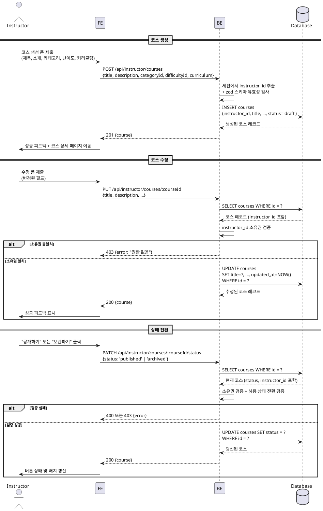

# UC-008: 코스 관리 (Instructor)

## Primary Actor

Instructor (인증된 강사)

---

## Precondition

- 로그인 상태이며 역할이 `instructor`인 사용자
- 온보딩이 완료된 상태
- 코스 수정·상태 전환의 경우, 해당 코스의 `instructor_id`가 현재 사용자와 일치해야 한다

---

## Trigger

- 강사가 `/instructor/dashboard`에서 "코스 만들기" 버튼을 클릭한다.
- 강사가 코스 목록에서 특정 코스를 선택하여 수정 페이지에 진입한다.
- 강사가 코스 상세 페이지에서 "공개" 또는 "보관" 버튼을 클릭한다.

---

## Main Scenario

### 8-1. 코스 생성

1. 강사가 코스 생성 폼에 접근한다 (`/instructor/courses/new`).
2. 강사가 제목(필수), 소개, 카테고리, 난이도, 커리큘럼을 입력하고 "저장" 버튼을 클릭한다.
3. FE가 입력값을 클라이언트 측에서 유효성 검사한다 (제목 필수 여부 등).
4. FE가 `POST /api/instructor/courses`를 호출한다.
5. BE가 요청자의 `instructor_id`를 세션에서 추출하고 요청 바디를 zod 스키마로 검증한다.
6. BE가 `courses` 테이블에 `status = 'draft'`로 레코드를 INSERT한다.
7. BE가 생성된 코스 정보를 반환한다.
8. FE가 성공 피드백을 표시하고 코스 상세 페이지(`/instructor/courses/:courseId`)로 이동한다.

### 8-2. 코스 수정

1. 강사가 코스 상세 편집 페이지에 접근한다 (`/instructor/courses/:courseId/edit`).
2. FE가 현재 코스 정보를 폼에 채워 렌더링한다.
3. 강사가 수정할 필드를 변경하고 "저장" 버튼을 클릭한다.
4. FE가 `PUT /api/instructor/courses/:courseId`를 호출한다.
5. BE가 세션의 `instructor_id`와 코스의 `instructor_id`를 대조하여 소유권을 검증한다.
6. 소유권 검증 실패 시 403을 반환한다.
7. BE가 요청 바디를 zod 스키마로 검증한다.
8. BE가 `courses` 테이블의 해당 레코드를 UPDATE한다 (`updated_at`은 트리거로 자동 갱신).
9. BE가 수정된 코스 정보를 반환한다.
10. FE가 성공 피드백을 표시한다.

### 8-3. 코스 상태 전환

1. 강사가 코스 상세 페이지에서 상태 전환 버튼을 클릭한다.
   - `draft` 상태 → "공개하기" 버튼 → `published` 전환
   - `published` 상태 → "보관하기" 버튼 → `archived` 전환
2. FE가 `PATCH /api/instructor/courses/:courseId/status`를 호출한다 (`{ status: 'published' | 'archived' }`).
3. BE가 소유권을 검증한다 (403 반환 조건 동일).
4. BE가 현재 코스 status를 조회하여 전환 가능 여부를 검증한다.
   - 허용: `draft → published`, `published → archived`
   - 불허: `archived → *`, `published → draft`, `draft → archived`
5. 전환 불가 상태의 경우 400을 반환한다.
6. BE가 `courses.status`를 UPDATE한다.
7. BE가 갱신된 코스 상태를 반환한다.
8. FE가 버튼 상태 및 배지를 즉시 갱신한다.

---

## Edge Cases

| 상황 | 처리 |
|---|---|
| 제목 누락 (필수 필드 미입력) | 400 유효성 오류 반환 → 인라인 오류 메시지 표시 |
| 다른 강사 소유 코스에 접근 | 403 반환 → "권한이 없습니다" 안내 메시지 표시 |
| 존재하지 않는 코스 ID 접근 | 404 반환 → 오류 페이지 표시 |
| `archived → published` 등 허용되지 않는 상태 전환 시도 | 400 반환 → "전환할 수 없는 상태입니다" 안내 메시지 |
| `published` 상태 코스를 `draft`로 되돌리려는 시도 | 400 반환 → 허용되지 않는 역방향 전환임을 안내 |
| 비활성화된 `category_id` 또는 `difficulty_id` 사용 | 400 반환 → "사용할 수 없는 카테고리/난이도입니다" 안내 |
| 인증되지 않은 사용자 접근 | 401 반환 → 로그인 페이지로 리다이렉트 |
| 네트워크 오류 | FE에서 재시도 유도 메시지 표시 |

---

## Business Rules

- 코스 생성 시 초기 status는 항상 `draft`이다.
- 상태 전환은 단방향이다: `draft → published → archived`. 역방향 또는 단계 건너뜀은 허용하지 않는다.
- `published` 상태로 전환 시 학습자가 코스를 탐색하고 수강신청할 수 있게 된다.
- `archived` 상태로 전환 시 신규 수강신청이 차단되나, 기존 수강자의 접근은 유지된다.
- 코스의 `instructor_id`는 생성 후 변경할 수 없다.
- `category_id`, `difficulty_id`는 선택 항목이며 NULL을 허용한다.
- 소유권 검증은 BE에서 반드시 수행하며, FE 단독 검증으로 대체할 수 없다.

---

## Sequence Diagram

