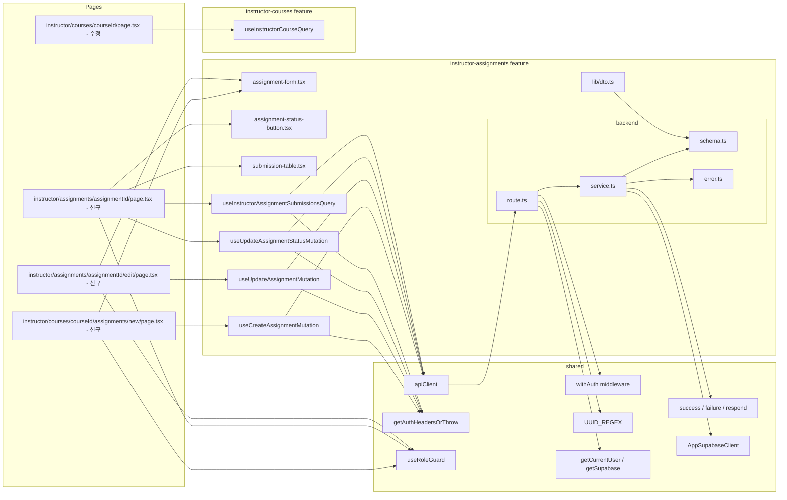

# Plan: UC-009 — 과제 관리 (Instructor)

## 개요

`instructor-assignments` feature를 신규 생성한다.
강사(`instructor`) 역할 사용자가 코스에 속한 과제를 생성(`POST /api/instructor/courses/:courseId/assignments`), 수정(`PUT /api/instructor/assignments/:assignmentId`), 상태 전환(`PATCH /api/instructor/assignments/:assignmentId/status`), 제출물 목록 조회(`GET /api/instructor/assignments/:assignmentId/submissions`)할 수 있는 기능을 구현한다.

기존 `assignments` feature(`src/features/assignments/`)는 학습자 전용 과제 열람(읽기 전용, `GET /api/my/courses/:courseId/assignments`)을 담당하므로, UC-009는 강사 전용 쓰기 작업 및 제출물 조회로 완전히 독립된 `instructor-assignments` feature로 분리한다.

코스 상세 페이지(`/instructor/courses/:courseId`)는 UC-008에서 이미 구현되었다. UC-009에서는 해당 페이지에 "과제 추가" 버튼과 과제 목록 섹션을 추가하고, 신규 과제 관련 페이지를 생성한다.

| 모듈 | 위치 | 설명 | 상태 |
|---|---|---|---|
| instructor-assignments/error | `src/features/instructor-assignments/backend/error.ts` | 에러 코드 상수 및 union 타입 | 신규 |
| instructor-assignments/schema | `src/features/instructor-assignments/backend/schema.ts` | 요청/응답 zod 스키마 | 신규 |
| instructor-assignments/service | `src/features/instructor-assignments/backend/service.ts` | `createAssignment`, `updateAssignment`, `updateAssignmentStatus`, `listAssignmentSubmissions` 비즈니스 로직 | 신규 |
| instructor-assignments/route | `src/features/instructor-assignments/backend/route.ts` | 4개 라우트 정의 | 신규 |
| instructor-assignments/dto | `src/features/instructor-assignments/lib/dto.ts` | backend/schema 타입 재노출 | 신규 |
| useCreateAssignmentMutation | `src/features/instructor-assignments/hooks/useCreateAssignmentMutation.ts` | 과제 생성 뮤테이션 훅 | 신규 |
| useUpdateAssignmentMutation | `src/features/instructor-assignments/hooks/useUpdateAssignmentMutation.ts` | 과제 수정 뮤테이션 훅 | 신규 |
| useUpdateAssignmentStatusMutation | `src/features/instructor-assignments/hooks/useUpdateAssignmentStatusMutation.ts` | 상태 전환 뮤테이션 훅 | 신규 |
| useInstructorAssignmentSubmissionsQuery | `src/features/instructor-assignments/hooks/useInstructorAssignmentSubmissionsQuery.ts` | 제출물 목록 조회 쿼리 훅 | 신규 |
| assignment-form | `src/features/instructor-assignments/components/assignment-form.tsx` | 과제 생성/수정 공통 폼 | 신규 |
| assignment-status-button | `src/features/instructor-assignments/components/assignment-status-button.tsx` | 상태 전환 버튼 컴포넌트 | 신규 |
| submission-table | `src/features/instructor-assignments/components/submission-table.tsx` | 제출물 목록 테이블 | 신규 |
| instructor assignments new page | `src/app/(protected)/instructor/courses/[courseId]/assignments/new/page.tsx` | 과제 생성 페이지 | 신규 |
| instructor assignment detail page | `src/app/(protected)/instructor/assignments/[assignmentId]/page.tsx` | 과제 상세 페이지 (상태 전환 + 제출물 탭) | 신규 |
| instructor assignment edit page | `src/app/(protected)/instructor/assignments/[assignmentId]/edit/page.tsx` | 과제 수정 페이지 | 신규 |
| instructor courses detail page | `src/app/(protected)/instructor/courses/[courseId]/page.tsx` | 기존 코스 상세 페이지에 과제 목록 섹션 추가 | 수정 |
| app.ts 등록 | `src/backend/hono/app.ts` | `registerInstructorAssignmentRoutes` 추가 | 수정 |

---

## 충돌 분석

### 기존 코드베이스와의 충돌 여부

| 검토 항목 | 충돌 여부 | 근거 |
|---|---|---|
| `src/features/instructor-assignments/` 디렉토리 존재 여부 | 없음 (신규 생성) | `ls src/features/` 결과: assignments, auth, courses, dashboard, enrollments, example, grades, instructor-courses, instructor-dashboard, profiles, submissions만 존재. `instructor-assignments`는 미존재 |
| 기존 `assignments` feature와 충돌 | 없음 | 기존 `assignments` feature는 학습자 전용(`GET /api/my/courses/:courseId/assignments`). UC-009 경로는 `/api/instructor/courses/:courseId/assignments`, `/api/instructor/assignments/:assignmentId`로 prefix가 완전히 다름 |
| 라우트 경로 중복 | 없음 | 기존 라우트: `GET /api/my/courses/:courseId/assignments`, `GET /api/my/courses/:courseId/assignments/:assignmentId`. 신규 경로: `POST /api/instructor/courses/:courseId/assignments`, `PUT /api/instructor/assignments/:assignmentId`, `PATCH /api/instructor/assignments/:assignmentId/status`, `GET /api/instructor/assignments/:assignmentId/submissions` |
| 기존 `submissions` feature와 충돌 | 없음 | 기존 submissions feature는 학습자 전용(`POST/PUT /api/my/courses/:courseId/assignments/:assignmentId/submissions`). 강사 제출물 조회(`GET /api/instructor/assignments/:assignmentId/submissions`)는 신규 경로 |
| `/instructor/courses/:courseId/assignments/new` 페이지 존재 여부 | 없음 (신규 생성) | `ls src/app/(protected)/instructor/courses/[courseId]/` 결과: `edit/`, `page.tsx`만 존재 |
| `/instructor/assignments/:assignmentId` 페이지 존재 여부 | 없음 (신규 생성) | `ls src/app/(protected)/instructor/` 결과: `courses/`, `dashboard/`만 존재 |
| 코스 상세 페이지 수정 | 수정 필요 | `src/app/(protected)/instructor/courses/[courseId]/page.tsx`에 과제 목록 섹션 및 "과제 추가" 버튼 추가. 기존 렌더링 로직과 충돌 없이 섹션 추가만 필요 |
| `withAuth`, `UUID_REGEX`, `success`/`failure`/`respond`, `getCurrentUser`/`getSupabase` | 재사용 | 기존 공통 모듈 그대로 사용. 변경 없음 |
| `handleServiceResult` | 재사용 | `src/backend/http/response.ts`에 정의. submissions/route.ts에서 이미 사용 중 |
| `AppSupabaseClient` | 재사용 | `src/backend/supabase/client.ts`에 정의 |
| `useRoleGuard('instructor')` | 재사용 | `src/hooks/useRoleGuard.ts`에 정의됨 |
| DB 마이그레이션 | 불필요 | `assignments`, `submissions`, `courses`, `profiles` 테이블은 `0002_create_lms_tables.sql`에 이미 정의됨. `assignments.weight`의 `CHECK (weight > 0)` 제약, `assignments.status`의 `assignment_status` ENUM(`draft`, `published`, `closed`)도 이미 존재 |
| `app.ts` 등록 | 수정 필요 | `registerInstructorCourseRoutes(app)` 다음 줄에 `registerInstructorAssignmentRoutes(app)` 추가 |

### DB 스키마와 Spec 간 주의사항

- `assignments.weight`는 DB에서 `NUMERIC(5,2)`. Supabase JS SDK가 `string`으로 반환하므로 service.ts에서 `Number(row.weight)` 변환 필요 (instructor-dashboard/service.ts 동일 패턴).
- `assignments.status`는 `assignment_status` ENUM(`draft`, `published`, `closed`). 상태 전환은 `draft → published → closed` 단방향만 허용.
- `submissions.is_late`는 BOOLEAN. 필터 `late` 적용 시 `.eq('is_late', true)` 사용.
- 제출물 목록에서 학습자명은 `profiles.name`을 2-step 쿼리로 조회 (Supabase JS SDK 중첩 필터 제한 고려).
- `submissions` 테이블의 `(assignment_id, learner_id)` UNIQUE 제약이 있으므로 과제당 학습자당 1건만 존재.
- 과제 소유권 검증 체인: `assignments.course_id → courses.instructor_id` 조회로 반드시 BE에서 수행.
- 제출물 필터 `pending`은 `status = 'submitted'`, `late`는 `is_late = true`, `resubmission`은 `status = 'resubmission_required'`으로 단일 조건 적용. 복수 필터는 spec상 허용하지 않음.

---

## Diagram



---

## Implementation Plan

### Step 1: instructor-assignments/backend/error.ts

기존 `instructorCourseErrorCodes`, `assignmentErrorCodes` 패턴을 그대로 따른다.

```typescript
// src/features/instructor-assignments/backend/error.ts
export const instructorAssignmentErrorCodes = {
  forbidden: 'FORBIDDEN',
  notFound: 'INSTRUCTOR_ASSIGNMENT_NOT_FOUND',
  invalidStatus: 'INVALID_ASSIGNMENT_STATUS_TRANSITION',
  invalidFilter: 'INVALID_SUBMISSION_FILTER',
  fetchError: 'INSTRUCTOR_ASSIGNMENT_FETCH_ERROR',
} as const;

type InstructorAssignmentErrorValue =
  (typeof instructorAssignmentErrorCodes)[keyof typeof instructorAssignmentErrorCodes];
export type InstructorAssignmentServiceError = InstructorAssignmentErrorValue;
```

에러 코드 5종:
- `FORBIDDEN`: 401(미인증) / 403(role 위반 또는 소유권 불일치)
- `INSTRUCTOR_ASSIGNMENT_NOT_FOUND`: 404, 과제 미존재
- `INVALID_ASSIGNMENT_STATUS_TRANSITION`: 400, 허용되지 않는 상태 전환
- `INVALID_SUBMISSION_FILTER`: 400, 유효하지 않은 필터 파라미터
- `INSTRUCTOR_ASSIGNMENT_FETCH_ERROR`: 500, DB 오류

**Unit Test**

```typescript
describe('instructorAssignmentErrorCodes', () => {
  it('모든 에러 코드 값이 unique 문자열임')
  it('InstructorAssignmentServiceError 타입은 5개 에러 코드 union')
})
```

---

### Step 2: instructor-assignments/backend/schema.ts

생성/수정 요청 바디, 상태 전환 요청 바디, 응답 DTO, 제출물 목록 응답 스키마를 정의한다.
기존 `instructor-courses/backend/schema.ts` 패턴을 따르되, `assignments` 도메인에 맞는 필드를 사용한다.

```typescript
// src/features/instructor-assignments/backend/schema.ts
import { z } from 'zod';

// --- 요청 스키마 ---

export const CreateAssignmentBodySchema = z.object({
  title: z.string().min(1, '제목은 필수입니다.'),
  description: z.string().nullable().optional(),
  dueAt: z.string().datetime('올바른 날짜/시간 형식이 아닙니다.'),
  weight: z.number().positive('점수 비중은 0보다 커야 합니다.'),
  allowLate: z.boolean().optional().default(false),
  allowResubmit: z.boolean().optional().default(false),
});

export const UpdateAssignmentBodySchema = z.object({
  title: z.string().min(1, '제목은 필수입니다.'),
  description: z.string().nullable().optional(),
  dueAt: z.string().datetime('올바른 날짜/시간 형식이 아닙니다.'),
  weight: z.number().positive('점수 비중은 0보다 커야 합니다.'),
  allowLate: z.boolean().optional(),
  allowResubmit: z.boolean().optional(),
});

export const UpdateAssignmentStatusBodySchema = z.object({
  status: z.enum(['published', 'closed']),
});

// 제출물 필터: 단일값만 허용
export const SubmissionFilterSchema = z.enum(['pending', 'late', 'resubmission']).optional();

// --- 응답 스키마 ---

export const InstructorAssignmentDtoSchema = z.object({
  id: z.string().uuid(),
  courseId: z.string().uuid(),
  title: z.string(),
  description: z.string().nullable(),
  dueAt: z.string(),
  weight: z.number(),
  allowLate: z.boolean(),
  allowResubmit: z.boolean(),
  status: z.enum(['draft', 'published', 'closed']),
  createdAt: z.string(),
  updatedAt: z.string(),
});

export const InstructorAssignmentResponseSchema = z.object({
  assignment: InstructorAssignmentDtoSchema,
});

// 제출물 목록 아이템
export const InstructorSubmissionItemSchema = z.object({
  id: z.string().uuid(),
  learnerId: z.string().uuid(),
  learnerName: z.string(),
  submittedAt: z.string(),
  isLate: z.boolean(),
  status: z.enum(['submitted', 'graded', 'resubmission_required', 'invalidated']),
  score: z.number().int().nullable(),
});

export const InstructorSubmissionListResponseSchema = z.object({
  submissions: z.array(InstructorSubmissionItemSchema),
  totalCount: z.number().int().nonnegative(),
});

// --- 타입 추론 ---

export type CreateAssignmentBody = z.infer<typeof CreateAssignmentBodySchema>;
export type UpdateAssignmentBody = z.infer<typeof UpdateAssignmentBodySchema>;
export type UpdateAssignmentStatusBody = z.infer<typeof UpdateAssignmentStatusBodySchema>;
export type SubmissionFilter = z.infer<typeof SubmissionFilterSchema>;
export type InstructorAssignmentDto = z.infer<typeof InstructorAssignmentDtoSchema>;
export type InstructorAssignmentResponse = z.infer<typeof InstructorAssignmentResponseSchema>;
export type InstructorSubmissionItem = z.infer<typeof InstructorSubmissionItemSchema>;
export type InstructorSubmissionListResponse = z.infer<typeof InstructorSubmissionListResponseSchema>;
```

**설계 근거**:
- `dueAt`은 ISO 8601 datetime 문자열. `z.string().datetime()`으로 형식 강제. BE에서 DB에 TIMESTAMPTZ로 그대로 전달.
- `weight`는 `z.number().positive()`로 0 초과 검증. DB `CHECK (weight > 0)` 제약과 이중 방어.
- `UpdateAssignmentStatusBodySchema`의 `status`는 `published | closed`만 허용. `draft`는 생성 후 기본값이므로 수동 전환 대상 아님.
- `InstructorSubmissionItemSchema`의 `status`에는 `invalidated`도 포함 (운영자 처리 결과도 강사가 열람 가능하도록).

---

### Step 3: instructor-assignments/backend/service.ts

소유권 검증 헬퍼를 내부에 독립 정의한다. 상태 전환 유효성 로직은 순수 함수로 분리한다.
기존 `instructor-courses/backend/service.ts`의 `isAllowedStatusTransition`, `verifyCourseOwnership` 패턴과 동일하게 구현하되, 과제 도메인에 맞게 독립 정의한다 (feature 간 직접 import 금지 원칙).

```typescript
// src/features/instructor-assignments/backend/service.ts
import { failure, success, type HandlerResult, type ErrorResult } from '@/backend/http/response';
import type { AppSupabaseClient } from '@/backend/supabase/client';
import {
  instructorAssignmentErrorCodes,
  type InstructorAssignmentServiceError,
} from './error';
import type {
  CreateAssignmentBody,
  UpdateAssignmentBody,
  UpdateAssignmentStatusBody,
  SubmissionFilter,
  InstructorAssignmentDto,
  InstructorAssignmentResponse,
  InstructorSubmissionItem,
  InstructorSubmissionListResponse,
} from './schema';
```

#### 3-0. 내부 Row 타입 정의

```typescript
type AssignmentRow = {
  id: string;
  course_id: string;
  title: string;
  description: string | null;
  due_at: string;
  weight: string; // Supabase NUMERIC → string 반환
  allow_late: boolean;
  allow_resubmit: boolean;
  status: 'draft' | 'published' | 'closed';
  created_at: string;
  updated_at: string;
};

type CourseOwnerRow = {
  id: string;
  instructor_id: string;
};

type SubmissionRow = {
  id: string;
  learner_id: string;
  is_late: boolean;
  status: 'submitted' | 'graded' | 'resubmission_required' | 'invalidated';
  score: number | null;
  submitted_at: string;
};

const ASSIGNMENT_SELECT = `
  id,
  course_id,
  title,
  description,
  due_at,
  weight,
  allow_late,
  allow_resubmit,
  status,
  created_at,
  updated_at
` as const;
```

#### 3-1. mapAssignmentRow (순수 함수)

```typescript
const mapAssignmentRow = (row: AssignmentRow): InstructorAssignmentDto => ({
  id: row.id,
  courseId: row.course_id,
  title: row.title,
  description: row.description,
  dueAt: row.due_at,
  weight: Number(row.weight), // NUMERIC(5,2) → number 변환
  allowLate: row.allow_late,
  allowResubmit: row.allow_resubmit,
  status: row.status,
  createdAt: row.created_at,
  updatedAt: row.updated_at,
});
```

#### 3-2. isAllowedAssignmentStatusTransition (순수 함수, 단위 테스트 대상)

```typescript
// 허용: draft → published, published → closed
// 불허: 그 외 모든 전환 (closed → *, published → draft, draft → closed)
export const isAllowedAssignmentStatusTransition = (
  currentStatus: string,
  nextStatus: string,
): boolean => {
  if (currentStatus === 'draft' && nextStatus === 'published') return true;
  if (currentStatus === 'published' && nextStatus === 'closed') return true;
  return false;
};
```

#### 3-3. verifyAssignmentOwnership (내부 헬퍼)

과제 → 코스 → `instructor_id` 체인으로 소유권 검증.
2-step 쿼리: assignments 조회 후 courses 소유권 확인.

```typescript
const verifyAssignmentOwnership = async (
  supabase: AppSupabaseClient,
  assignmentId: string,
  instructorId: string,
): Promise<HandlerResult<AssignmentRow, InstructorAssignmentServiceError>> => {
  // Step 1: 과제 조회
  const { data: assignmentData, error: assignmentError } = await supabase
    .from('assignments')
    .select(ASSIGNMENT_SELECT)
    .eq('id', assignmentId)
    .maybeSingle();

  if (assignmentError) {
    return failure(500, instructorAssignmentErrorCodes.fetchError, assignmentError.message);
  }

  if (!assignmentData) {
    return failure(404, instructorAssignmentErrorCodes.notFound, '과제를 찾을 수 없습니다.');
  }

  const assignment = assignmentData as unknown as AssignmentRow;

  // Step 2: 해당 코스의 instructor_id 검증
  const { data: courseData, error: courseError } = await supabase
    .from('courses')
    .select('id, instructor_id')
    .eq('id', assignment.course_id)
    .maybeSingle();

  if (courseError) {
    return failure(500, instructorAssignmentErrorCodes.fetchError, courseError.message);
  }

  if (!courseData) {
    return failure(404, instructorAssignmentErrorCodes.notFound, '코스를 찾을 수 없습니다.');
  }

  const course = courseData as unknown as CourseOwnerRow;

  if (course.instructor_id !== instructorId) {
    return failure(403, instructorAssignmentErrorCodes.forbidden, '해당 과제에 대한 권한이 없습니다.');
  }

  return success(assignment);
};
```

#### 3-4. verifyCourseOwnership (신규 과제 생성용 내부 헬퍼)

```typescript
const verifyCourseOwnershipForCreate = async (
  supabase: AppSupabaseClient,
  courseId: string,
  instructorId: string,
): Promise<HandlerResult<{ id: string }, InstructorAssignmentServiceError>> => {
  const { data, error } = await supabase
    .from('courses')
    .select('id, instructor_id')
    .eq('id', courseId)
    .maybeSingle();

  if (error) {
    return failure(500, instructorAssignmentErrorCodes.fetchError, error.message);
  }

  if (!data) {
    return failure(404, instructorAssignmentErrorCodes.notFound, '코스를 찾을 수 없습니다.');
  }

  const course = data as unknown as CourseOwnerRow;

  if (course.instructor_id !== instructorId) {
    return failure(403, instructorAssignmentErrorCodes.forbidden, '해당 코스에 대한 권한이 없습니다.');
  }

  return success({ id: course.id });
};
```

#### 3-5. createAssignment

```typescript
export const createAssignment = async (
  supabase: AppSupabaseClient,
  courseId: string,
  instructorId: string,
  body: CreateAssignmentBody,
): Promise<HandlerResult<InstructorAssignmentResponse, InstructorAssignmentServiceError>> => {
  const ownershipResult = await verifyCourseOwnershipForCreate(supabase, courseId, instructorId);
  if (!ownershipResult.ok) return ownershipResult as ErrorResult<InstructorAssignmentServiceError>;

  const { data, error } = await supabase
    .from('assignments')
    .insert({
      course_id: courseId,
      title: body.title,
      description: body.description ?? null,
      due_at: body.dueAt,
      weight: body.weight,
      allow_late: body.allowLate ?? false,
      allow_resubmit: body.allowResubmit ?? false,
      status: 'draft',
    })
    .select(ASSIGNMENT_SELECT)
    .single();

  if (error) {
    return failure(500, instructorAssignmentErrorCodes.fetchError, error.message);
  }

  return success({ assignment: mapAssignmentRow(data as unknown as AssignmentRow) }, 201);
};
```

#### 3-6. updateAssignment

```typescript
export const updateAssignment = async (
  supabase: AppSupabaseClient,
  assignmentId: string,
  instructorId: string,
  body: UpdateAssignmentBody,
): Promise<HandlerResult<InstructorAssignmentResponse, InstructorAssignmentServiceError>> => {
  const ownershipResult = await verifyAssignmentOwnership(supabase, assignmentId, instructorId);
  if (!ownershipResult.ok) return ownershipResult as ErrorResult<InstructorAssignmentServiceError>;

  const { data, error } = await supabase
    .from('assignments')
    .update({
      title: body.title,
      description: body.description ?? null,
      due_at: body.dueAt,
      weight: body.weight,
      allow_late: body.allowLate ?? ownershipResult.data.allow_late,
      allow_resubmit: body.allowResubmit ?? ownershipResult.data.allow_resubmit,
      // updated_at은 trg_assignments_updated_at 트리거가 자동 갱신
    })
    .eq('id', assignmentId)
    .select(ASSIGNMENT_SELECT)
    .single();

  if (error) {
    return failure(500, instructorAssignmentErrorCodes.fetchError, error.message);
  }

  return success({ assignment: mapAssignmentRow(data as unknown as AssignmentRow) });
};
```

#### 3-7. updateAssignmentStatus

```typescript
export const updateAssignmentStatus = async (
  supabase: AppSupabaseClient,
  assignmentId: string,
  instructorId: string,
  body: UpdateAssignmentStatusBody,
): Promise<HandlerResult<InstructorAssignmentResponse, InstructorAssignmentServiceError>> => {
  const ownershipResult = await verifyAssignmentOwnership(supabase, assignmentId, instructorId);
  if (!ownershipResult.ok) return ownershipResult as ErrorResult<InstructorAssignmentServiceError>;

  const currentStatus = ownershipResult.data.status;

  if (!isAllowedAssignmentStatusTransition(currentStatus, body.status)) {
    return failure(
      400,
      instructorAssignmentErrorCodes.invalidStatus,
      `'${currentStatus}' 상태에서 '${body.status}'로 전환할 수 없습니다.`,
    );
  }

  const { data, error } = await supabase
    .from('assignments')
    .update({ status: body.status })
    .eq('id', assignmentId)
    .select(ASSIGNMENT_SELECT)
    .single();

  if (error) {
    return failure(500, instructorAssignmentErrorCodes.fetchError, error.message);
  }

  return success({ assignment: mapAssignmentRow(data as unknown as AssignmentRow) });
};
```

#### 3-8. listAssignmentSubmissions

제출물 목록 조회. 2-step 쿼리로 안정적 구현 (Supabase 중첩 필터 제한 대응).

```typescript
export const listAssignmentSubmissions = async (
  supabase: AppSupabaseClient,
  assignmentId: string,
  instructorId: string,
  filter: SubmissionFilter,
): Promise<HandlerResult<InstructorSubmissionListResponse, InstructorAssignmentServiceError>> => {
  const ownershipResult = await verifyAssignmentOwnership(supabase, assignmentId, instructorId);
  if (!ownershipResult.ok) return ownershipResult as ErrorResult<InstructorAssignmentServiceError>;

  // 제출물 조회 쿼리 구성
  let query = supabase
    .from('submissions')
    .select('id, learner_id, is_late, status, score, submitted_at')
    .eq('assignment_id', assignmentId)
    .order('submitted_at', { ascending: false });

  // 필터 적용 (단일 필터만 허용, spec 비즈니스 룰)
  if (filter === 'pending') {
    query = query.eq('status', 'submitted');
  } else if (filter === 'late') {
    query = query.eq('is_late', true);
  } else if (filter === 'resubmission') {
    query = query.eq('status', 'resubmission_required');
  }

  const { data: submissionsRaw, error: submissionsError } = await query;

  if (submissionsError) {
    return failure(500, instructorAssignmentErrorCodes.fetchError, submissionsError.message);
  }

  const submissions = (submissionsRaw ?? []) as SubmissionRow[];

  // 학습자명 2-step 조회
  const learnerIds = [...new Set(submissions.map((s) => s.learner_id))];

  let profileMap = new Map<string, string>();

  if (learnerIds.length > 0) {
    const { data: profilesRaw, error: profilesError } = await supabase
      .from('profiles')
      .select('id, name')
      .in('id', learnerIds);

    if (profilesError) {
      return failure(500, instructorAssignmentErrorCodes.fetchError, profilesError.message);
    }

    profileMap = new Map(
      (profilesRaw ?? []).map((p) => [p.id, p.name as string]),
    );
  }

  const result: InstructorSubmissionItem[] = submissions.map((s) => ({
    id: s.id,
    learnerId: s.learner_id,
    learnerName: profileMap.get(s.learner_id) ?? '알 수 없음',
    submittedAt: s.submitted_at,
    isLate: s.is_late,
    status: s.status,
    score: s.score,
  }));

  return success({
    submissions: result,
    totalCount: result.length,
  });
};
```

**Unit Test**

```typescript
describe('isAllowedAssignmentStatusTransition', () => {
  it('draft → published → true')
  it('published → closed → true')
  it('draft → closed → false (단계 건너뜀)')
  it('closed → published → false (역방향)')
  it('closed → draft → false (역방향)')
  it('published → draft → false (역방향)')
  it('draft → draft → false (동일 상태)')
  it('published → published → false (동일 상태)')
  it('closed → closed → false (동일 상태)')
})

describe('mapAssignmentRow', () => {
  it('weight 문자열 "3.50" → number 3.5 변환')
  it('description null 유지')
  it('status 그대로 반환')
})

describe('createAssignment', () => {
  it('소유권 일치 + 필수 필드(title, dueAt, weight) → 201 status=draft 과제 생성')
  it('소유권 불일치 → 403 FORBIDDEN')
  it('존재하지 않는 courseId → 404 INSTRUCTOR_ASSIGNMENT_NOT_FOUND')
  it('title 누락 → zod 검증은 route에서 처리, service에서는 DB 에러로 500')
  it('DB INSERT 오류 → 500 INSTRUCTOR_ASSIGNMENT_FETCH_ERROR')
})

describe('updateAssignment', () => {
  it('소유권 일치 + 유효 바디 → 200 수정된 과제')
  it('소유권 불일치 → 403 FORBIDDEN')
  it('존재하지 않는 assignmentId → 404 INSTRUCTOR_ASSIGNMENT_NOT_FOUND')
  it('DB UPDATE 오류 → 500 INSTRUCTOR_ASSIGNMENT_FETCH_ERROR')
  it('allowLate 미전달 시 기존 값 유지')
})

describe('updateAssignmentStatus', () => {
  it('draft → published 전환 성공 → 200 갱신된 과제')
  it('published → closed 전환 성공 → 200 갱신된 과제')
  it('draft → closed 전환 시도 → 400 INVALID_ASSIGNMENT_STATUS_TRANSITION')
  it('closed → published 전환 시도 → 400 INVALID_ASSIGNMENT_STATUS_TRANSITION')
  it('published → draft 전환 시도 → 400 INVALID_ASSIGNMENT_STATUS_TRANSITION')
  it('소유권 불일치 → 403 FORBIDDEN')
  it('존재하지 않는 assignmentId → 404 INSTRUCTOR_ASSIGNMENT_NOT_FOUND')
  it('DB UPDATE 오류 → 500 INSTRUCTOR_ASSIGNMENT_FETCH_ERROR')
})

describe('listAssignmentSubmissions', () => {
  it('필터 없음 → 전체 제출물 반환 (submitted_at DESC)')
  it('filter=pending → status=submitted 필터 적용')
  it('filter=late → is_late=true 필터 적용')
  it('filter=resubmission → status=resubmission_required 필터 적용')
  it('소유권 불일치 → 403 FORBIDDEN')
  it('존재하지 않는 assignmentId → 404 INSTRUCTOR_ASSIGNMENT_NOT_FOUND')
  it('제출물 없음 → { submissions: [], totalCount: 0 }')
  it('learner_id로 profiles 2-step 조회 → learnerName 정상 매핑')
  it('profiles에 없는 learner_id → learnerName = "알 수 없음"')
  it('DB submissions 오류 → 500 INSTRUCTOR_ASSIGNMENT_FETCH_ERROR')
  it('DB profiles 오류 → 500 INSTRUCTOR_ASSIGNMENT_FETCH_ERROR')
  it('totalCount는 submissions 배열 길이와 동일')
})
```

---

### Step 4: instructor-assignments/backend/route.ts

기존 `instructor-courses/backend/route.ts` 패턴을 따른다.
모든 라우트에 `withAuth()` 적용, `role !== 'instructor'`이면 403 반환.
`SubmissionFilterSchema`를 사용하여 쿼리 파라미터 필터 검증.

```typescript
// src/features/instructor-assignments/backend/route.ts
import type { Hono } from 'hono';
import { respond, failure } from '@/backend/http/response';
import { withAuth } from '@/backend/middleware/auth';
import { getCurrentUser, getSupabase, type AppEnv } from '@/backend/hono/context';
import { UUID_REGEX } from '@/constants/validation';
import { instructorAssignmentErrorCodes } from './error';
import {
  CreateAssignmentBodySchema,
  UpdateAssignmentBodySchema,
  UpdateAssignmentStatusBodySchema,
  SubmissionFilterSchema,
} from './schema';
import {
  createAssignment,
  updateAssignment,
  updateAssignmentStatus,
  listAssignmentSubmissions,
} from './service';

export const registerInstructorAssignmentRoutes = (app: Hono<AppEnv>) => {
  // POST /api/instructor/courses/:courseId/assignments
  app.post('/api/instructor/courses/:courseId/assignments', withAuth(), async (c) => {
    const currentUser = getCurrentUser(c);
    if (!currentUser) {
      return respond(c, failure(401, instructorAssignmentErrorCodes.forbidden, '인증이 필요합니다.'));
    }
    if (currentUser.role !== 'instructor') {
      return respond(c, failure(403, instructorAssignmentErrorCodes.forbidden, '강사만 접근할 수 있습니다.'));
    }

    const courseId = c.req.param('courseId');
    if (!UUID_REGEX.test(courseId)) {
      return respond(c, failure(400, instructorAssignmentErrorCodes.notFound, '올바르지 않은 코스 ID입니다.'));
    }

    const rawBody = await c.req.json().catch(() => null);
    const parsed = CreateAssignmentBodySchema.safeParse(rawBody);
    if (!parsed.success) {
      return respond(
        c,
        failure(400, instructorAssignmentErrorCodes.fetchError, '올바르지 않은 요청입니다.', parsed.error.format()),
      );
    }

    const supabase = getSupabase(c);
    const result = await createAssignment(supabase, courseId, currentUser.id, parsed.data);
    return respond(c, result);
  });

  // PUT /api/instructor/assignments/:assignmentId
  app.put('/api/instructor/assignments/:assignmentId', withAuth(), async (c) => {
    const currentUser = getCurrentUser(c);
    if (!currentUser) {
      return respond(c, failure(401, instructorAssignmentErrorCodes.forbidden, '인증이 필요합니다.'));
    }
    if (currentUser.role !== 'instructor') {
      return respond(c, failure(403, instructorAssignmentErrorCodes.forbidden, '강사만 접근할 수 있습니다.'));
    }

    const assignmentId = c.req.param('assignmentId');
    if (!UUID_REGEX.test(assignmentId)) {
      return respond(c, failure(400, instructorAssignmentErrorCodes.notFound, '올바르지 않은 과제 ID입니다.'));
    }

    const rawBody = await c.req.json().catch(() => null);
    const parsed = UpdateAssignmentBodySchema.safeParse(rawBody);
    if (!parsed.success) {
      return respond(
        c,
        failure(400, instructorAssignmentErrorCodes.fetchError, '올바르지 않은 요청입니다.', parsed.error.format()),
      );
    }

    const supabase = getSupabase(c);
    const result = await updateAssignment(supabase, assignmentId, currentUser.id, parsed.data);
    return respond(c, result);
  });

  // PATCH /api/instructor/assignments/:assignmentId/status
  app.patch('/api/instructor/assignments/:assignmentId/status', withAuth(), async (c) => {
    const currentUser = getCurrentUser(c);
    if (!currentUser) {
      return respond(c, failure(401, instructorAssignmentErrorCodes.forbidden, '인증이 필요합니다.'));
    }
    if (currentUser.role !== 'instructor') {
      return respond(c, failure(403, instructorAssignmentErrorCodes.forbidden, '강사만 접근할 수 있습니다.'));
    }

    const assignmentId = c.req.param('assignmentId');
    if (!UUID_REGEX.test(assignmentId)) {
      return respond(c, failure(400, instructorAssignmentErrorCodes.notFound, '올바르지 않은 과제 ID입니다.'));
    }

    const rawBody = await c.req.json().catch(() => null);
    const parsed = UpdateAssignmentStatusBodySchema.safeParse(rawBody);
    if (!parsed.success) {
      return respond(
        c,
        failure(400, instructorAssignmentErrorCodes.invalidStatus, '올바르지 않은 상태값입니다.', parsed.error.format()),
      );
    }

    const supabase = getSupabase(c);
    const result = await updateAssignmentStatus(supabase, assignmentId, currentUser.id, parsed.data);
    return respond(c, result);
  });

  // GET /api/instructor/assignments/:assignmentId/submissions
  app.get('/api/instructor/assignments/:assignmentId/submissions', withAuth(), async (c) => {
    const currentUser = getCurrentUser(c);
    if (!currentUser) {
      return respond(c, failure(401, instructorAssignmentErrorCodes.forbidden, '인증이 필요합니다.'));
    }
    if (currentUser.role !== 'instructor') {
      return respond(c, failure(403, instructorAssignmentErrorCodes.forbidden, '강사만 접근할 수 있습니다.'));
    }

    const assignmentId = c.req.param('assignmentId');
    if (!UUID_REGEX.test(assignmentId)) {
      return respond(c, failure(400, instructorAssignmentErrorCodes.notFound, '올바르지 않은 과제 ID입니다.'));
    }

    const filterRaw = c.req.query('filter');
    const filterParsed = SubmissionFilterSchema.safeParse(filterRaw);
    if (!filterParsed.success) {
      return respond(
        c,
        failure(
          400,
          instructorAssignmentErrorCodes.invalidFilter,
          '허용된 필터값: pending, late, resubmission',
        ),
      );
    }

    const supabase = getSupabase(c);
    const result = await listAssignmentSubmissions(
      supabase,
      assignmentId,
      currentUser.id,
      filterParsed.data,
    );
    return respond(c, result);
  });
};
```

**Unit Test**

```typescript
describe('POST /api/instructor/courses/:courseId/assignments', () => {
  it('미인증 요청 → 401 FORBIDDEN')
  it('learner 역할 요청 → 403 FORBIDDEN')
  it('비UUID courseId → 400')
  it('title 누락 → 400 (zod validation)')
  it('weight <= 0 → 400 (zod validation)')
  it('dueAt 형식 오류 → 400 (zod validation)')
  it('소유권 불일치 → 403 FORBIDDEN')
  it('instructor + 유효 바디 → 201 InstructorAssignmentResponse (status=draft)')
})

describe('PUT /api/instructor/assignments/:assignmentId', () => {
  it('미인증 요청 → 401 FORBIDDEN')
  it('learner 역할 요청 → 403 FORBIDDEN')
  it('비UUID assignmentId → 400')
  it('title 누락 → 400 (zod validation)')
  it('weight <= 0 → 400 (zod validation)')
  it('소유권 불일치 → 403 FORBIDDEN')
  it('존재하지 않는 assignmentId → 404 INSTRUCTOR_ASSIGNMENT_NOT_FOUND')
  it('instructor + 유효 바디 → 200 InstructorAssignmentResponse')
})

describe('PATCH /api/instructor/assignments/:assignmentId/status', () => {
  it('미인증 요청 → 401 FORBIDDEN')
  it('learner 역할 요청 → 403 FORBIDDEN')
  it('비UUID assignmentId → 400')
  it('허용되지 않는 status 값(e.g. "draft") → 400 INVALID_ASSIGNMENT_STATUS_TRANSITION')
  it('소유권 불일치 → 403 FORBIDDEN')
  it('불허 상태 전환(closed → published) → 400 INVALID_ASSIGNMENT_STATUS_TRANSITION')
  it('instructor + draft→published → 200 InstructorAssignmentResponse')
  it('instructor + published→closed → 200 InstructorAssignmentResponse')
})

describe('GET /api/instructor/assignments/:assignmentId/submissions', () => {
  it('미인증 요청 → 401 FORBIDDEN')
  it('learner 역할 요청 → 403 FORBIDDEN')
  it('비UUID assignmentId → 400')
  it('유효하지 않은 filter 값(e.g. "invalid") → 400 INVALID_SUBMISSION_FILTER')
  it('소유권 불일치 → 403 FORBIDDEN')
  it('filter 없음 → 200 전체 submissions')
  it('filter=pending → 200 status=submitted만')
  it('filter=late → 200 is_late=true만')
  it('filter=resubmission → 200 status=resubmission_required만')
  it('submissions 없음 → 200 { submissions: [], totalCount: 0 }')
})
```

---

### Step 5: instructor-assignments/lib/dto.ts

기존 `instructor-courses/lib/dto.ts` 패턴을 그대로 따른다.

```typescript
// src/features/instructor-assignments/lib/dto.ts
export {
  CreateAssignmentBodySchema,
  UpdateAssignmentBodySchema,
  UpdateAssignmentStatusBodySchema,
  SubmissionFilterSchema,
  InstructorAssignmentDtoSchema,
  InstructorAssignmentResponseSchema,
  InstructorSubmissionItemSchema,
  InstructorSubmissionListResponseSchema,
} from '@/features/instructor-assignments/backend/schema';

export type {
  CreateAssignmentBody,
  UpdateAssignmentBody,
  UpdateAssignmentStatusBody,
  SubmissionFilter,
  InstructorAssignmentDto,
  InstructorAssignmentResponse,
  InstructorSubmissionItem,
  InstructorSubmissionListResponse,
} from '@/features/instructor-assignments/backend/schema';
```

---

### Step 6: instructor-assignments/hooks/useCreateAssignmentMutation.ts

성공 시 `['instructor', 'courses', courseId]` queryKey를 invalidate하여 코스 상세 페이지의 과제 목록이 최신 상태로 갱신된다.

```typescript
// src/features/instructor-assignments/hooks/useCreateAssignmentMutation.ts
'use client';

import { useMutation, useQueryClient } from '@tanstack/react-query';
import { useRouter } from 'next/navigation';
import { apiClient, extractApiErrorMessage } from '@/lib/remote/api-client';
import { getAuthHeadersOrThrow } from '@/lib/remote/auth-headers';
import { InstructorAssignmentResponseSchema } from '@/features/instructor-assignments/lib/dto';
import type { CreateAssignmentBody } from '@/features/instructor-assignments/lib/dto';

const createAssignmentApi = async ({
  courseId,
  body,
}: {
  courseId: string;
  body: CreateAssignmentBody;
}) => {
  try {
    const headers = await getAuthHeadersOrThrow();
    const { data } = await apiClient.post(
      `/api/instructor/courses/${courseId}/assignments`,
      body,
      { headers },
    );
    return InstructorAssignmentResponseSchema.parse(data);
  } catch (error) {
    const message = extractApiErrorMessage(error, '과제 생성에 실패했습니다.');
    throw new Error(message);
  }
};

export const useCreateAssignmentMutation = (courseId: string) => {
  const queryClient = useQueryClient();
  const router = useRouter();

  return useMutation({
    mutationFn: (body: CreateAssignmentBody) => createAssignmentApi({ courseId, body }),
    onSuccess: (data) => {
      void queryClient.invalidateQueries({ queryKey: ['instructor', 'courses', courseId] });
      router.push(`/instructor/assignments/${data.assignment.id}`);
    },
  });
};
```

---

### Step 7: instructor-assignments/hooks/useUpdateAssignmentMutation.ts

수정 성공 시 해당 과제 query와 코스 query를 invalidate한다.

```typescript
// src/features/instructor-assignments/hooks/useUpdateAssignmentMutation.ts
'use client';

import { useMutation, useQueryClient } from '@tanstack/react-query';
import { apiClient, extractApiErrorMessage } from '@/lib/remote/api-client';
import { getAuthHeadersOrThrow } from '@/lib/remote/auth-headers';
import { InstructorAssignmentResponseSchema } from '@/features/instructor-assignments/lib/dto';
import type { UpdateAssignmentBody } from '@/features/instructor-assignments/lib/dto';

const updateAssignmentApi = async ({
  assignmentId,
  body,
}: {
  assignmentId: string;
  body: UpdateAssignmentBody;
}) => {
  try {
    const headers = await getAuthHeadersOrThrow();
    const { data } = await apiClient.put(
      `/api/instructor/assignments/${assignmentId}`,
      body,
      { headers },
    );
    return InstructorAssignmentResponseSchema.parse(data);
  } catch (error) {
    const message = extractApiErrorMessage(error, '과제 수정에 실패했습니다.');
    throw new Error(message);
  }
};

export const useUpdateAssignmentMutation = (assignmentId: string) => {
  const queryClient = useQueryClient();

  return useMutation({
    mutationFn: (body: UpdateAssignmentBody) => updateAssignmentApi({ assignmentId, body }),
    onSuccess: (data) => {
      void queryClient.invalidateQueries({
        queryKey: ['instructor', 'assignments', assignmentId],
      });
      // 코스 상세 페이지의 과제 목록도 갱신
      void queryClient.invalidateQueries({
        queryKey: ['instructor', 'courses', data.assignment.courseId],
      });
    },
  });
};
```

---

### Step 8: instructor-assignments/hooks/useUpdateAssignmentStatusMutation.ts

상태 전환 성공 시 해당 과제 query를 invalidate하고, 코스 query도 함께 갱신한다.

```typescript
// src/features/instructor-assignments/hooks/useUpdateAssignmentStatusMutation.ts
'use client';

import { useMutation, useQueryClient } from '@tanstack/react-query';
import { apiClient, extractApiErrorMessage } from '@/lib/remote/api-client';
import { getAuthHeadersOrThrow } from '@/lib/remote/auth-headers';
import { InstructorAssignmentResponseSchema } from '@/features/instructor-assignments/lib/dto';
import type { UpdateAssignmentStatusBody } from '@/features/instructor-assignments/lib/dto';

const updateAssignmentStatusApi = async ({
  assignmentId,
  body,
}: {
  assignmentId: string;
  body: UpdateAssignmentStatusBody;
}) => {
  try {
    const headers = await getAuthHeadersOrThrow();
    const { data } = await apiClient.patch(
      `/api/instructor/assignments/${assignmentId}/status`,
      body,
      { headers },
    );
    return InstructorAssignmentResponseSchema.parse(data);
  } catch (error) {
    const message = extractApiErrorMessage(error, '과제 상태 변경에 실패했습니다.');
    throw new Error(message);
  }
};

export const useUpdateAssignmentStatusMutation = (assignmentId: string) => {
  const queryClient = useQueryClient();

  return useMutation({
    mutationFn: (body: UpdateAssignmentStatusBody) =>
      updateAssignmentStatusApi({ assignmentId, body }),
    onSuccess: (data) => {
      void queryClient.invalidateQueries({
        queryKey: ['instructor', 'assignments', assignmentId],
      });
      void queryClient.invalidateQueries({
        queryKey: ['instructor', 'courses', data.assignment.courseId],
      });
    },
  });
};
```

---

### Step 9: instructor-assignments/hooks/useInstructorAssignmentSubmissionsQuery.ts

`filter` 파라미터를 queryKey에 포함하여 필터별로 캐시를 분리한다.

```typescript
// src/features/instructor-assignments/hooks/useInstructorAssignmentSubmissionsQuery.ts
'use client';

import { useQuery } from '@tanstack/react-query';
import { apiClient, extractApiErrorMessage } from '@/lib/remote/api-client';
import { getAuthHeadersOrThrow } from '@/lib/remote/auth-headers';
import { InstructorSubmissionListResponseSchema } from '@/features/instructor-assignments/lib/dto';
import type {
  InstructorSubmissionListResponse,
  SubmissionFilter,
} from '@/features/instructor-assignments/lib/dto';

const fetchAssignmentSubmissions = async (
  assignmentId: string,
  filter: SubmissionFilter,
): Promise<InstructorSubmissionListResponse> => {
  try {
    const headers = await getAuthHeadersOrThrow();
    const params = filter ? `?filter=${filter}` : '';
    const { data } = await apiClient.get(
      `/api/instructor/assignments/${assignmentId}/submissions${params}`,
      { headers },
    );
    return InstructorSubmissionListResponseSchema.parse(data);
  } catch (error) {
    const message = extractApiErrorMessage(error, '제출물 목록을 불러오지 못했습니다.');
    throw new Error(message);
  }
};

export const useInstructorAssignmentSubmissionsQuery = (
  assignmentId: string,
  filter: SubmissionFilter = undefined,
) =>
  useQuery({
    queryKey: ['instructor', 'assignments', assignmentId, 'submissions', filter],
    queryFn: () => fetchAssignmentSubmissions(assignmentId, filter),
    enabled: Boolean(assignmentId),
    staleTime: 30 * 1000,
  });
```

---

### Step 10: instructor-assignments/hooks/useInstructorAssignmentQuery.ts

과제 상세 정보 조회 쿼리 훅. 수정 페이지 및 상세 페이지에서 폼 초기값 및 현재 상태를 로드하는 데 사용한다.

```typescript
// src/features/instructor-assignments/hooks/useInstructorAssignmentQuery.ts
'use client';

import { useQuery } from '@tanstack/react-query';
import { apiClient, extractApiErrorMessage } from '@/lib/remote/api-client';
import { getAuthHeadersOrThrow } from '@/lib/remote/auth-headers';
import { InstructorAssignmentResponseSchema } from '@/features/instructor-assignments/lib/dto';
import type { InstructorAssignmentResponse } from '@/features/instructor-assignments/lib/dto';

const fetchInstructorAssignment = async (
  assignmentId: string,
): Promise<InstructorAssignmentResponse> => {
  try {
    const headers = await getAuthHeadersOrThrow();
    const { data } = await apiClient.get(
      `/api/instructor/assignments/${assignmentId}`,
      { headers },
    );
    return InstructorAssignmentResponseSchema.parse(data);
  } catch (error) {
    const message = extractApiErrorMessage(error, '과제 정보를 불러오지 못했습니다.');
    throw new Error(message);
  }
};

export const useInstructorAssignmentQuery = (assignmentId: string) =>
  useQuery({
    queryKey: ['instructor', 'assignments', assignmentId],
    queryFn: () => fetchInstructorAssignment(assignmentId),
    enabled: Boolean(assignmentId),
    staleTime: 30 * 1000,
  });
```

**주의**: `GET /api/instructor/assignments/:assignmentId` 엔드포인트를 route.ts에 추가 등록해야 한다. 이를 위해 service.ts에 `getInstructorAssignment` 함수를 추가한다.

```typescript
// service.ts에 추가할 함수
export const getInstructorAssignment = async (
  supabase: AppSupabaseClient,
  assignmentId: string,
  instructorId: string,
): Promise<HandlerResult<InstructorAssignmentResponse, InstructorAssignmentServiceError>> => {
  const ownershipResult = await verifyAssignmentOwnership(supabase, assignmentId, instructorId);
  if (!ownershipResult.ok) return ownershipResult as ErrorResult<InstructorAssignmentServiceError>;

  return success({ assignment: mapAssignmentRow(ownershipResult.data) });
};
```

route.ts에 추가할 라우트:
```typescript
// GET /api/instructor/assignments/:assignmentId
// 반드시 PUT /:assignmentId 및 PATCH /:assignmentId/status보다 먼저 등록
app.get('/api/instructor/assignments/:assignmentId', withAuth(), async (c) => {
  // ... (withAuth + role 검증 + UUID 검증 + getInstructorAssignment 호출)
});
```

**라우트 등록 순서 주의**: `GET /api/instructor/assignments/:assignmentId`와 `GET /api/instructor/assignments/:assignmentId/submissions`는 경로 충돌 우려가 없음 (HTTP 메서드 및 path suffix가 다름).

---

### Step 11: instructor-assignments/components/assignment-form.tsx

과제 생성과 수정 양쪽에서 재사용하는 공통 폼 컴포넌트.
`react-hook-form` + `zod` resolver 사용.
기존 `instructor-courses/components/course-form.tsx` 패턴을 따른다.

```typescript
// src/features/instructor-assignments/components/assignment-form.tsx
'use client';

import { useForm } from 'react-hook-form';
import { zodResolver } from '@hookform/resolvers/zod';
import { Loader2 } from 'lucide-react';
import { Button } from '@/components/ui/button';
import { Input } from '@/components/ui/input';
import { Textarea } from '@/components/ui/textarea';
import { Checkbox } from '@/components/ui/checkbox';
import {
  Form,
  FormControl,
  FormField,
  FormItem,
  FormLabel,
  FormMessage,
} from '@/components/ui/form';
import { CreateAssignmentBodySchema } from '@/features/instructor-assignments/lib/dto';
import type { CreateAssignmentBody } from '@/features/instructor-assignments/lib/dto';

type AssignmentFormProps = {
  defaultValues?: Partial<CreateAssignmentBody>;
  onSubmit: (values: CreateAssignmentBody) => void;
  isPending: boolean;
  submitLabel?: string;
};
```

**필드 구성**:
- `title` (필수): `Input`
- `description` (선택): `Textarea`
- `dueAt` (필수): `Input type="datetime-local"` → 제출 시 ISO 8601 문자열로 변환
- `weight` (필수): `Input type="number"` min=0.01
- `allowLate` (선택): `Checkbox` (기본값 false)
- `allowResubmit` (선택): `Checkbox` (기본값 false)

**datetime-local 처리**: HTML `datetime-local` 입력값은 `"2026-02-21T15:00"` 형태. 서버 전송 전 `new Date(value).toISOString()`으로 변환. `zod.string().datetime()` 검증 통과하도록 변환 필요.

**QA Sheet**

| 시나리오 | 기대 결과 |
|---|---|
| title 미입력 후 제출 | "제목은 필수입니다." 인라인 오류 메시지 |
| dueAt 미입력 후 제출 | "올바른 날짜/시간 형식이 아닙니다." 인라인 오류 메시지 |
| weight = 0 입력 후 제출 | "점수 비중은 0보다 커야 합니다." 인라인 오류 메시지 |
| weight 음수 입력 후 제출 | "점수 비중은 0보다 커야 합니다." 인라인 오류 메시지 |
| allowLate 체크 | true로 제출 |
| allowResubmit 체크 | true로 제출 |
| isPending = true | 제출 버튼 비활성화 + 로딩 스피너 |
| defaultValues 전달 | 폼 필드에 기존 값 채워짐 (수정 시나리오) |
| 정상 제출 | onSubmit 호출 |

**신규 shadcn-ui 컴포넌트**: `Checkbox`가 기존 코드베이스에 없다면 설치 필요.
```
$ npx shadcn@latest add checkbox
```

---

### Step 12: instructor-assignments/components/assignment-status-button.tsx

과제 상세 페이지에서 현재 상태에 따라 적절한 전환 버튼을 렌더링한다.
`ts-pattern`으로 상태별 버튼 분기. 기존 `course-status-button.tsx` 패턴과 동일.

```typescript
// src/features/instructor-assignments/components/assignment-status-button.tsx
'use client';

import { match } from 'ts-pattern';
import { Globe, Lock } from 'lucide-react';
import { Button } from '@/components/ui/button';
import type { InstructorAssignmentDto } from '@/features/instructor-assignments/lib/dto';

type AssignmentStatusButtonProps = {
  status: InstructorAssignmentDto['status'];
  onPublish: () => void;
  onClose: () => void;
  isPending: boolean;
};
```

상태별 버튼 렌더링 규칙:

| status | 렌더링 |
|---|---|
| `draft` | "게시하기" 버튼 (onClick: onPublish) |
| `published` | "수동 마감" 버튼 (onClick: onClose) |
| `closed` | 버튼 없음 (마감됨 배지만 표시) |

**QA Sheet**

| 시나리오 | 기대 결과 |
|---|---|
| status = draft | "게시하기" 버튼 표시 |
| status = published | "수동 마감" 버튼 표시 |
| status = closed | 버튼 미표시 |
| isPending = true | 버튼 비활성화 + 로딩 스피너 |
| "게시하기" 클릭 | onPublish 호출 |
| "수동 마감" 클릭 | onClose 호출 |

---

### Step 13: instructor-assignments/components/submission-table.tsx

제출물 목록 테이블 컴포넌트. 필터 탭과 테이블 렌더링을 포함한다.
`date-fns`로 `submitted_at` 포맷팅.
빈 배열이면 "제출물이 없습니다." 안내 메시지 표시.
`ts-pattern`으로 `status`별 배지 색상 분기.

```typescript
// src/features/instructor-assignments/components/submission-table.tsx
'use client';

import { match } from 'ts-pattern';
import { format } from 'date-fns';
import { ko } from 'date-fns/locale';
import { Badge } from '@/components/ui/badge';
import type {
  InstructorSubmissionItem,
  SubmissionFilter,
} from '@/features/instructor-assignments/lib/dto';

type SubmissionTableProps = {
  submissions: InstructorSubmissionItem[];
  totalCount: number;
  currentFilter: SubmissionFilter;
  onFilterChange: (filter: SubmissionFilter) => void;
  isLoading: boolean;
};
```

**테이블 컬럼**: 학습자명, 제출 시각, 지각 여부, 상태, 점수.

status별 배지 표시:

| status | 배지 텍스트 | 색상 |
|---|---|---|
| submitted | 미채점 | secondary |
| graded | 채점 완료 | default |
| resubmission_required | 재제출 요청 | destructive |
| invalidated | 무효화 | outline |

**QA Sheet**

| 시나리오 | 기대 결과 |
|---|---|
| submissions 빈 배열 | "제출물이 없습니다." 빈 상태 메시지 |
| filter=pending 탭 클릭 | onFilterChange('pending') 호출 |
| filter=late 탭 클릭 | onFilterChange('late') 호출 |
| filter=resubmission 탭 클릭 | onFilterChange('resubmission') 호출 |
| 필터 해제 (전체 탭) | onFilterChange(undefined) 호출 |
| isLate = true | "지각" 배지 표시 |
| isLate = false | 배지 미표시 |
| score = null | "-" 표시 |
| score = 85 | "85점" 표시 |
| status = graded | "채점 완료" 배지 |
| 로딩 중 | 스켈레톤 행 렌더링 |

---

### Step 14: 신규 페이지 구현

#### 14-1. `instructor/courses/[courseId]/assignments/new/page.tsx` (과제 생성 페이지)

```typescript
// src/app/(protected)/instructor/courses/[courseId]/assignments/new/page.tsx
'use client';

import { use } from 'react';
import Link from 'next/link';
import { ArrowLeft } from 'lucide-react';
import { useRoleGuard } from '@/hooks/useRoleGuard';
import { useCreateAssignmentMutation } from '@/features/instructor-assignments/hooks/useCreateAssignmentMutation';
import { AssignmentForm } from '@/features/instructor-assignments/components/assignment-form';

type NewAssignmentPageProps = {
  params: Promise<{ courseId: string }>;
};

export default function NewAssignmentPage({ params }: NewAssignmentPageProps) {
  const { courseId } = use(params);
  const { isAllowed, isLoading: isRoleLoading } = useRoleGuard('instructor');
  const { mutate, isPending, error } = useCreateAssignmentMutation(courseId);

  if (isRoleLoading || !isAllowed) return null;

  return (
    <div className="mx-auto flex min-h-screen w-full max-w-2xl flex-col gap-8 px-6 py-16">
      <header className="flex flex-col gap-2">
        <Link
          href={`/instructor/courses/${courseId}`}
          className="flex w-fit items-center gap-1 text-sm text-slate-500 hover:text-slate-700"
        >
          <ArrowLeft className="h-4 w-4" />
          코스로 돌아가기
        </Link>
        <h1 className="text-3xl font-semibold">과제 추가</h1>
      </header>
      {error && (
        <p className="text-sm text-red-600">{error.message}</p>
      )}
      <AssignmentForm
        onSubmit={(values) => mutate(values)}
        isPending={isPending}
        submitLabel="과제 생성"
      />
    </div>
  );
}
```

**QA Sheet**

| 시나리오 | 기대 결과 |
|---|---|
| 강사 로그인 후 페이지 접근 | 과제 생성 폼 렌더링 |
| title 미입력 제출 | 인라인 오류 메시지 |
| dueAt 미입력 제출 | 인라인 오류 메시지 |
| weight=0 제출 | "점수 비중은 0보다 커야 합니다." 인라인 오류 |
| 정상 제출 | API 호출 → 성공 시 `/instructor/assignments/:assignmentId` 이동 |
| API 오류 | 오류 메시지 표시 |
| 비인가 역할(learner) 접근 | useRoleGuard가 리다이렉트 |
| "코스로 돌아가기" 클릭 | `/instructor/courses/:courseId`로 이동 |

---

#### 14-2. `instructor/assignments/[assignmentId]/page.tsx` (과제 상세 페이지)

과제 상세 정보 + 상태 전환 버튼 + 제출물 탭을 포함한다.
`tab` 상태는 URL 쿼리 파라미터 대신 컴포넌트 로컬 상태로 관리 (spec에 탭 URL 명시 없음).

```typescript
// src/app/(protected)/instructor/assignments/[assignmentId]/page.tsx
'use client';

import { use, useState } from 'react';
import Link from 'next/link';
import { ArrowLeft, Pencil, RefreshCw } from 'lucide-react';
import { match } from 'ts-pattern';
import { format } from 'date-fns';
import { ko } from 'date-fns/locale';
import { Badge } from '@/components/ui/badge';
import { Button } from '@/components/ui/button';
import { useRoleGuard } from '@/hooks/useRoleGuard';
import { useInstructorAssignmentQuery } from '@/features/instructor-assignments/hooks/useInstructorAssignmentQuery';
import { useUpdateAssignmentStatusMutation } from '@/features/instructor-assignments/hooks/useUpdateAssignmentStatusMutation';
import { useInstructorAssignmentSubmissionsQuery } from '@/features/instructor-assignments/hooks/useInstructorAssignmentSubmissionsQuery';
import { AssignmentStatusButton } from '@/features/instructor-assignments/components/assignment-status-button';
import { SubmissionTable } from '@/features/instructor-assignments/components/submission-table';
import type { SubmissionFilter } from '@/features/instructor-assignments/lib/dto';

type InstructorAssignmentPageProps = {
  params: Promise<{ assignmentId: string }>;
};
```

**렌더링 구성**:
- 헤더: "코스로 돌아가기" 링크 + 과제 제목 + 상태 배지 + "수정" 링크 버튼
- 과제 정보 섹션: 마감일(date-fns 포맷), 점수 비중, 지각 허용, 재제출 허용, 설명
- 상태 전환 버튼 (`AssignmentStatusButton`)
- "제출물" 탭: `SubmissionTable` (필터 상태 로컬 관리)

status별 배지:

| status | 배지 텍스트 | 색상 |
|---|---|---|
| draft | 초안 | secondary |
| published | 게시됨 | default |
| closed | 마감됨 | outline |

**QA Sheet**

| 시나리오 | 기대 결과 |
|---|---|
| draft 과제 접근 | "게시하기" 버튼 표시 + 수정 링크 |
| "게시하기" 클릭 | PATCH 호출 → 성공 시 버튼이 "수동 마감"으로 갱신 |
| published 과제 접근 | "수동 마감" 버튼 표시 |
| "수동 마감" 클릭 | PATCH 호출 → 성공 시 버튼 미표시 |
| closed 과제 접근 | 상태 전환 버튼 없음 |
| "제출물" 섹션 진입 | 전체 제출물 목록 렌더링 |
| 필터 탭 변경 | 해당 필터로 재조회 |
| 과제에 제출물 없음 | "제출물이 없습니다." 빈 상태 |
| 소유권 없는 과제 접근 | 403 오류 메시지 표시 |
| 존재하지 않는 assignmentId | 404 오류 메시지 표시 |
| 로딩 중 | 스켈레톤 UI |
| API 오류 | 오류 메시지 + "다시 시도" 버튼 |
| "수정" 클릭 | `/instructor/assignments/:assignmentId/edit`로 이동 |
| 마감일이 이미 지난 published 과제 | BE에서 유효 마감 판별 (FE에서는 `NOW() > due_at` 조건으로 "유효 마감" 안내 메시지 표시 권장) |

---

#### 14-3. `instructor/assignments/[assignmentId]/edit/page.tsx` (과제 수정 페이지)

```typescript
// src/app/(protected)/instructor/assignments/[assignmentId]/edit/page.tsx
'use client';

import { use } from 'react';
import Link from 'next/link';
import { ArrowLeft } from 'lucide-react';
import { useRoleGuard } from '@/hooks/useRoleGuard';
import { useInstructorAssignmentQuery } from '@/features/instructor-assignments/hooks/useInstructorAssignmentQuery';
import { useUpdateAssignmentMutation } from '@/features/instructor-assignments/hooks/useUpdateAssignmentMutation';
import { AssignmentForm } from '@/features/instructor-assignments/components/assignment-form';

type EditAssignmentPageProps = {
  params: Promise<{ assignmentId: string }>;
};

export default function EditAssignmentPage({ params }: EditAssignmentPageProps) {
  const { assignmentId } = use(params);
  const { isAllowed, isLoading: isRoleLoading } = useRoleGuard('instructor');
  const { data, isLoading, isError } = useInstructorAssignmentQuery(assignmentId);
  const { mutate: updateAssignment, isPending, error } = useUpdateAssignmentMutation(assignmentId);

  if (isRoleLoading || !isAllowed) return null;
  // ...
}
```

**QA Sheet**

| 시나리오 | 기대 결과 |
|---|---|
| 과제 데이터 로드 | AssignmentForm에 기존 값 채워짐 |
| title 미입력 제출 | 인라인 오류 메시지 |
| weight=0 제출 | 인라인 오류 메시지 |
| 정상 제출 | PUT 호출 → 성공 피드백 (toast 또는 인라인) |
| API 오류 | 오류 메시지 표시 |
| 로딩 중 | 스켈레톤 UI |
| 소유권 없는 과제 편집 시도 | 403 오류 메시지 |
| 비인가 역할(learner) 접근 | useRoleGuard가 리다이렉트 |

---

### Step 15: 코스 상세 페이지 수정

기존 `src/app/(protected)/instructor/courses/[courseId]/page.tsx`에 과제 목록 섹션과 "과제 추가" 버튼을 추가한다.

과제 목록은 `GET /api/instructor/courses/:courseId`의 응답에 포함되지 않으므로, 별도 과제 목록 조회 쿼리 훅이 필요하다.

**설계 결정**: 코스 상세 페이지에서 과제 목록을 보여주기 위해 `GET /api/instructor/courses/:courseId/assignments` 엔드포인트를 추가한다.

route.ts(instructor-assignments)에 추가할 라우트:
```
GET /api/instructor/courses/:courseId/assignments
→ { assignments: InstructorAssignmentDto[] }
```

service.ts에 추가할 함수: `listInstructorCourseAssignments`

```typescript
// 추가할 쿼리 훅
// src/features/instructor-assignments/hooks/useInstructorCourseAssignmentsQuery.ts
'use client';

import { useQuery } from '@tanstack/react-query';
import { apiClient, extractApiErrorMessage } from '@/lib/remote/api-client';
import { getAuthHeadersOrThrow } from '@/lib/remote/auth-headers';
import { z } from 'zod';
import {
  InstructorAssignmentDtoSchema,
} from '@/features/instructor-assignments/lib/dto';
import type { InstructorAssignmentDto } from '@/features/instructor-assignments/lib/dto';

const InstructorCourseAssignmentsResponseSchema = z.object({
  assignments: z.array(InstructorAssignmentDtoSchema),
});

const fetchCourseAssignments = async (
  courseId: string,
): Promise<{ assignments: InstructorAssignmentDto[] }> => {
  try {
    const headers = await getAuthHeadersOrThrow();
    const { data } = await apiClient.get(
      `/api/instructor/courses/${courseId}/assignments`,
      { headers },
    );
    return InstructorCourseAssignmentsResponseSchema.parse(data);
  } catch (error) {
    const message = extractApiErrorMessage(error, '과제 목록을 불러오지 못했습니다.');
    throw new Error(message);
  }
};

export const useInstructorCourseAssignmentsQuery = (courseId: string) =>
  useQuery({
    queryKey: ['instructor', 'courses', courseId, 'assignments'],
    queryFn: () => fetchCourseAssignments(courseId),
    enabled: Boolean(courseId),
    staleTime: 30 * 1000,
  });
```

**스키마 주의**: `InstructorCourseAssignmentsResponseSchema`는 `instructor-assignments/lib/dto.ts`에 추가 export하여 재사용 가능하도록 한다.

코스 상세 페이지(`page.tsx`) 수정 내용:
- `useInstructorCourseAssignmentsQuery(courseId)` 추가
- "과제 추가" 버튼 → `/instructor/courses/:courseId/assignments/new` 링크
- 과제 목록 섹션: 과제 카드 그리드 (제목, 마감일, 상태 배지, 점수 비중)
- 과제 클릭 → `/instructor/assignments/:assignmentId`로 이동

**QA Sheet (코스 상세 페이지 수정)**

| 시나리오 | 기대 결과 |
|---|---|
| 코스에 과제 없음 | "등록된 과제가 없습니다." + "과제 추가" 버튼 |
| 코스에 과제 있음 | 과제 목록 카드 렌더링 |
| "과제 추가" 버튼 클릭 | `/instructor/courses/:courseId/assignments/new` 이동 |
| 과제 카드 클릭 | `/instructor/assignments/:assignmentId` 이동 |
| 과제 목록 로딩 중 | 스켈레톤 카드 |

---

### Step 16: app.ts 등록

기존 `registerInstructorCourseRoutes(app)` 다음 줄에 추가한다.

```typescript
// src/backend/hono/app.ts 수정 부분
import { registerInstructorAssignmentRoutes } from '@/features/instructor-assignments/backend/route';

// createHonoApp 내부 registerInstructorCourseRoutes(app); 다음에 추가
registerInstructorAssignmentRoutes(app);
```

**기존 라우트 순서 (`app.ts` 기준)**:

```
registerExampleRoutes(app)
registerProfileRoutes(app)
registerCourseRoutes(app)                ← GET /api/courses (학습자 공개)
registerEnrollmentRoutes(app)
registerDashboardRoutes(app)
registerAssignmentRoutes(app)            ← GET /api/my/courses/:courseId/assignments (학습자)
registerSubmissionRoutes(app)
registerGradeRoutes(app)
registerInstructorDashboardRoutes(app)
registerInstructorCourseRoutes(app)
registerInstructorAssignmentRoutes(app)  ← 신규 추가
```

**경로 충돌 분석**:
- `POST /api/instructor/courses/:courseId/assignments`: `instructor-courses`의 `POST /api/instructor/courses`와 경로 prefix가 겹치지 않음 (`/courses` vs `/courses/:courseId/assignments`)
- `GET /api/instructor/courses/:courseId/assignments`: `instructor-courses`의 `GET /api/instructor/courses/:courseId`와 구분됨 (suffix `/assignments` 추가)
- Hono는 등록 순서대로 매칭하므로, `GET /api/instructor/courses/meta`가 `GET /api/instructor/courses/:courseId`보다 먼저 등록된 현재 구조 유지 필요. `GET /api/instructor/courses/:courseId/assignments`는 `GET /api/instructor/courses/:courseId`와 다른 경로이므로 충돌 없음.

---

## 공유 모듈 의존 관계

| UC-009에서 사용 | 출처 | 비고 |
|---|---|---|
| `withAuth` | `src/backend/middleware/auth.ts` | 기존 구현 재사용 |
| `success`, `failure`, `respond`, `handleServiceResult` | `src/backend/http/response.ts` | 기존 구현 재사용 |
| `getSupabase`, `getCurrentUser` | `src/backend/hono/context.ts` | 기존 구현 재사용 |
| `AppSupabaseClient` | `src/backend/supabase/client.ts` | 기존 구현 재사용 |
| `UUID_REGEX` | `src/constants/validation.ts` | 기존 구현 재사용 |
| `apiClient`, `extractApiErrorMessage` | `src/lib/remote/api-client.ts` | 기존 구현 재사용 |
| `getAuthHeadersOrThrow` | `src/lib/remote/auth-headers.ts` | 기존 구현 재사용 |
| `useRoleGuard` | `src/hooks/useRoleGuard.ts` | 기존 구현 재사용 (instructor 역할) |
| `ts-pattern` (match) | npm 패키지 | `assignment-status-button.tsx`, `submission-table.tsx`, `page.tsx` status 분기 |
| `date-fns` (format, ko locale) | npm 패키지 | 마감일 및 제출 시각 포맷팅 |
| `lucide-react` | npm 패키지 | 아이콘 (Globe, Lock, Pencil, ArrowLeft, RefreshCw, Loader2) |
| `react-hook-form` + `@hookform/resolvers/zod` | npm 패키지 | `assignment-form.tsx` 폼 관리 |
| `shadcn-ui` (Button, Input, Textarea, Checkbox, Form, Badge) | 기존 설치 + 신규 추가 | Checkbox는 신규 설치 필요 여부 확인 필요 |

## 신규 마이그레이션

불필요. `assignments`, `submissions`, `courses`, `profiles` 테이블 및 `trg_assignments_updated_at` 트리거는 `0002_create_lms_tables.sql`에 이미 정의되어 있다.

## 신규 shadcn-ui 컴포넌트

- `Checkbox`: `allow_late`, `allow_resubmit` 체크박스 입력. 기존 코드베이스 사용 여부 확인 후 미설치 시 추가.
  ```
  $ npx shadcn@latest add checkbox
  ```

## 구현 순서 요약

| 순서 | 파일 | 비고 |
|---|---|---|
| 1 | `src/features/instructor-assignments/backend/error.ts` | 에러 코드 |
| 2 | `src/features/instructor-assignments/backend/schema.ts` | zod 스키마 |
| 3 | `src/features/instructor-assignments/backend/service.ts` | 비즈니스 로직 (isAllowedAssignmentStatusTransition, verifyAssignmentOwnership, createAssignment, updateAssignment, updateAssignmentStatus, listAssignmentSubmissions, getInstructorAssignment, listInstructorCourseAssignments) |
| 4 | `src/features/instructor-assignments/backend/route.ts` | Hono 라우터 (5개 엔드포인트) |
| 5 | `src/features/instructor-assignments/lib/dto.ts` | 타입 재노출 |
| 6 | `src/features/instructor-assignments/hooks/useInstructorAssignmentQuery.ts` | 과제 단건 조회 |
| 7 | `src/features/instructor-assignments/hooks/useInstructorCourseAssignmentsQuery.ts` | 코스별 과제 목록 조회 |
| 8 | `src/features/instructor-assignments/hooks/useCreateAssignmentMutation.ts` | 생성 뮤테이션 |
| 9 | `src/features/instructor-assignments/hooks/useUpdateAssignmentMutation.ts` | 수정 뮤테이션 |
| 10 | `src/features/instructor-assignments/hooks/useUpdateAssignmentStatusMutation.ts` | 상태 전환 뮤테이션 |
| 11 | `src/features/instructor-assignments/hooks/useInstructorAssignmentSubmissionsQuery.ts` | 제출물 목록 조회 |
| 12 | `src/features/instructor-assignments/components/assignment-form.tsx` | 공통 폼 컴포넌트 |
| 13 | `src/features/instructor-assignments/components/assignment-status-button.tsx` | 상태 전환 버튼 |
| 14 | `src/features/instructor-assignments/components/submission-table.tsx` | 제출물 테이블 |
| 15 | `src/app/(protected)/instructor/courses/[courseId]/assignments/new/page.tsx` | 과제 생성 페이지 |
| 16 | `src/app/(protected)/instructor/assignments/[assignmentId]/page.tsx` | 과제 상세 페이지 |
| 17 | `src/app/(protected)/instructor/assignments/[assignmentId]/edit/page.tsx` | 과제 수정 페이지 |
| 18 | `src/app/(protected)/instructor/courses/[courseId]/page.tsx` | 코스 상세 페이지 수정 (과제 목록 섹션 추가) |
| 19 | `src/backend/hono/app.ts` | 라우터 등록 |
