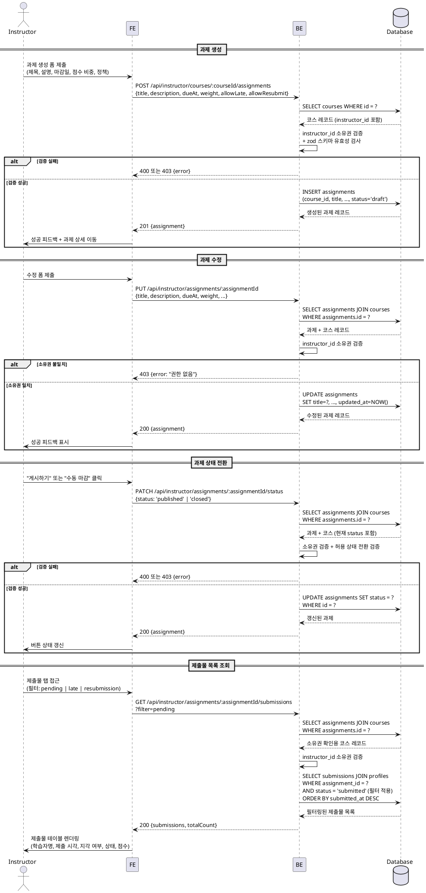

# UC-009: 과제 관리 (Instructor)

## Primary Actor

Instructor (인증된 강사)

---

## Precondition

- 로그인 상태이며 역할이 `instructor`인 사용자
- 온보딩이 완료된 상태
- 과제를 생성·수정하려는 코스의 `instructor_id`가 현재 사용자와 일치해야 한다

---

## Trigger

- 강사가 코스 상세 페이지에서 "과제 추가" 버튼을 클릭한다.
- 강사가 과제 목록에서 특정 과제를 선택하여 수정 페이지에 진입한다.
- 강사가 과제 상세 페이지에서 "게시" 또는 "마감" 버튼을 클릭한다.
- 강사가 과제 상세 페이지에서 제출물 목록을 조회한다.

---

## Main Scenario

### 9-1. 과제 생성

1. 강사가 코스 상세 페이지에서 "과제 추가" 버튼을 클릭한다.
2. 강사가 과제 생성 폼에 제목(필수), 설명, 마감일(필수), 점수 비중(필수, >0), 지각 허용 여부, 재제출 허용 여부를 입력한다.
3. FE가 클라이언트 측 유효성 검사를 수행한다.
4. FE가 `POST /api/instructor/courses/:courseId/assignments`를 호출한다.
5. BE가 세션의 `instructor_id`와 해당 코스의 `instructor_id`를 대조하여 소유권을 검증한다.
6. 소유권 검증 실패 시 403을 반환한다.
7. BE가 요청 바디를 zod 스키마로 검증한다 (`title` 필수, `due_at` 필수, `weight > 0` 필수).
8. BE가 `assignments` 테이블에 `status = 'draft'`로 레코드를 INSERT한다.
9. BE가 생성된 과제 정보를 반환한다.
10. FE가 성공 피드백을 표시하고 과제 상세 페이지로 이동한다.

### 9-2. 과제 수정

1. 강사가 과제 수정 페이지에 접근한다 (`/instructor/assignments/:assignmentId/edit`).
2. FE가 현재 과제 정보를 폼에 채워 렌더링한다.
3. 강사가 수정할 필드를 변경하고 "저장" 버튼을 클릭한다.
4. FE가 `PUT /api/instructor/assignments/:assignmentId`를 호출한다.
5. BE가 해당 과제를 조회하고, 과제가 속한 코스의 `instructor_id`와 세션 사용자를 대조하여 소유권을 검증한다.
6. 소유권 검증 실패 시 403을 반환한다.
7. BE가 요청 바디를 zod 스키마로 검증한다.
8. BE가 `assignments` 테이블의 해당 레코드를 UPDATE한다 (`updated_at`은 트리거로 자동 갱신).
9. BE가 수정된 과제 정보를 반환한다.
10. FE가 성공 피드백을 표시한다.

### 9-3. 과제 상태 전환

1. 강사가 과제 상세 페이지에서 상태 전환 버튼을 클릭한다.
   - `draft` 상태 → "게시하기" 버튼 → `published` 전환 (학습자에게 노출)
   - `published` 상태 → "수동 마감" 버튼 → `closed` 전환
2. FE가 `PATCH /api/instructor/assignments/:assignmentId/status`를 호출한다 (`{ status: 'published' | 'closed' }`).
   - 참고: UC-009 API 설계에서 상태 전환은 `PUT /api/instructor/assignments/:assignmentId`에 통합하거나 별도 엔드포인트로 처리한다.
3. BE가 소유권을 검증하고 허용 상태 전환 여부를 확인한다.
   - 허용: `draft → published`, `published → closed`
   - 불허: `closed → *`, `published → draft`, `draft → closed`
4. 전환 불가 상태의 경우 400을 반환한다.
5. BE가 `assignments.status`를 UPDATE한다.
6. FE가 버튼 상태를 즉시 갱신한다.

### 9-4. 제출물 목록 조회 및 필터링

1. 강사가 과제 상세 페이지에서 "제출물" 탭에 접근한다.
2. FE가 `GET /api/instructor/assignments/:assignmentId/submissions`를 호출한다 (필터 파라미터 포함).
3. BE가 소유권을 검증한다 (과제가 속한 코스의 `instructor_id` 대조).
4. BE가 필터 파라미터에 따라 쿼리를 구성한다.
   - 필터 없음: 전체 제출물 반환
   - `filter=pending`: `status = 'submitted'` (미채점)
   - `filter=late`: `is_late = true`
   - `filter=resubmission`: `status = 'resubmission_required'`
5. BE가 필터링된 제출물 목록을 `submitted_at DESC` 기준으로 반환한다.
6. FE가 제출물 테이블을 렌더링한다 (학습자명, 제출 시각, 지각 여부, 상태, 점수).

---

## Edge Cases

| 상황 | 처리 |
|---|---|
| 제목·마감일·점수 비중 등 필수 필드 누락 | 400 유효성 오류 반환 → 인라인 오류 메시지 표시 |
| `weight <= 0` 입력 | 400 반환 → "점수 비중은 0보다 커야 합니다" 안내 |
| 다른 강사 소유 코스의 과제에 접근 | 403 반환 → "권한이 없습니다" 안내 |
| 존재하지 않는 과제 ID 접근 | 404 반환 → 오류 페이지 표시 |
| `closed → published` 등 허용되지 않는 상태 전환 시도 | 400 반환 → "전환할 수 없는 상태입니다" 안내 |
| `published` 상태에서 마감일이 이미 지난 경우 (유효 마감) | BE에서 `NOW() > due_at` 조건을 유효 마감으로 판별, FE에서 제출 버튼 비활성화 |
| 제출물 목록에서 유효하지 않은 필터 파라미터 | 400 반환 → 허용 필터값 목록 안내 |
| 과제에 제출물이 없는 경우 | 빈 목록 반환 및 "제출물이 없습니다" 빈 상태 표시 |
| 인증되지 않은 사용자 접근 | 401 반환 → 로그인 페이지로 리다이렉트 |

---

## Business Rules

- 과제 생성 시 초기 status는 항상 `draft`이다.
- 상태 전환은 단방향이다: `draft → published → closed`. 역방향 또는 단계 건너뜀은 허용하지 않는다.
- `published` 상태로 전환 시 학습자가 과제를 열람하고 제출할 수 있게 된다.
- 유효 마감 판별 로직: `status = 'closed'` OR (`status = 'published'` AND `NOW() > due_at`). DB `status = 'closed'`는 강사 수동 강제 마감 전용이며, 일반 마감은 `due_at` 비교로 판별한다.
- `weight`는 양수(> 0)여야 하며, 성적 계산 시 비중으로 활용된다.
- 과제 소유권 검증은 과제 → 코스 → `instructor_id` 체인으로 반드시 BE에서 수행한다.
- 제출물 조회 필터: `pending`(미채점), `late`(지각), `resubmission`(재제출 요청) 세 가지를 지원하며 복수 적용은 허용하지 않는다.
- 채점이 완료된(`status = 'graded'`) 과제에 재제출이 필요한 경우 `status = 'resubmission_required'`로 전환하며, 학습자는 재제출 후 `status = 'submitted'`로 되돌아간다.

---

## Sequence Diagram

