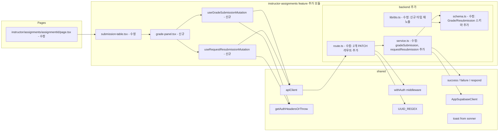

# Plan: UC-010 — 제출물 채점 & 피드백

## 개요

`instructor-assignments` feature에 채점 및 재제출 요청 기능을 추가한다.

UC-009에서 이미 `instructor-assignments` feature의 기본 골격(error.ts, schema.ts, service.ts, route.ts, lib/dto.ts)과 제출물 목록 조회(`listAssignmentSubmissions`) 기능이 완전히 구현되어 있다. UC-010은 기존 feature에 **추가(extension)** 방식으로 구현하며, 신규 feature 생성은 불필요하다.

핵심 추가 작업은 다음과 같다:

1. **BE (backend)**: `GradeSubmissionBody`, `RequestResubmissionBody` 스키마 추가 + `gradeSubmission`, `requestResubmission` 서비스 함수 추가 + `PATCH /api/instructor/submissions/:submissionId/grade`, `PATCH /api/instructor/submissions/:submissionId/request-resubmission` 라우트 추가. `gradeErrorCodes` 신규 추가 (기존 `instructorAssignmentErrorCodes`와 별도 도메인 정의)
2. **FE (frontend)**: 채점 뮤테이션 훅 2종 추가 + `submission-table.tsx`에 행 클릭 → 채점 패널(GradePanel) 컴포넌트 추가

UC-010은 새로운 DB 마이그레이션이 불필요하다. `submissions` 테이블의 `score`, `feedback`, `graded_at`, `status` 컬럼은 `0002_create_lms_tables.sql`에 이미 정의되어 있다.

| 모듈 | 위치 | 설명 | 상태 |
|---|---|---|---|
| instructor-assignments/schema 추가 | `src/features/instructor-assignments/backend/schema.ts` | `GradeSubmissionBodySchema`, `RequestResubmissionBodySchema`, `GradedSubmissionDtoSchema`, 응답 스키마 추가 | 수정 |
| instructor-assignments/service 추가 | `src/features/instructor-assignments/backend/service.ts` | `gradeSubmission`, `requestResubmission` 서비스 함수 추가 + `verifySubmissionOwnership` 내부 헬퍼 추가 | 수정 |
| instructor-assignments/route 추가 | `src/features/instructor-assignments/backend/route.ts` | 2개 PATCH 라우트 추가 | 수정 |
| instructor-assignments/dto 추가 | `src/features/instructor-assignments/lib/dto.ts` | 신규 스키마 및 타입 재노출 추가 | 수정 |
| useGradeSubmissionMutation | `src/features/instructor-assignments/hooks/useGradeSubmissionMutation.ts` | 채점 완료 뮤테이션 훅 | 신규 |
| useRequestResubmissionMutation | `src/features/instructor-assignments/hooks/useRequestResubmissionMutation.ts` | 재제출 요청 뮤테이션 훅 | 신규 |
| GradePanel | `src/features/instructor-assignments/components/grade-panel.tsx` | 채점 폼 + 재제출 요청 폼 통합 패널 | 신규 |
| submission-table 수정 | `src/features/instructor-assignments/components/submission-table.tsx` | 행 클릭 시 GradePanel 열기 + 선택된 제출물 상태 관리 | 수정 |

---

## 충돌 분석

### 기존 코드베이스와의 충돌 여부

| 검토 항목 | 충돌 여부 | 근거 |
|---|---|---|
| `src/features/instructor-assignments/backend/` 기존 파일 수정 | 충돌 없음 (추가 방식) | schema.ts에 새 스키마 추가, service.ts에 새 함수 추가, route.ts에 새 라우트 추가. 기존 함수/스키마는 변경 없음 |
| 라우트 경로 중복 | 없음 | 기존: `GET/PUT/PATCH /api/instructor/assignments/:assignmentId`, `GET /api/instructor/assignments/:assignmentId/submissions`. 신규: `PATCH /api/instructor/submissions/:submissionId/grade`, `PATCH /api/instructor/submissions/:submissionId/request-resubmission`. `/submissions/` prefix로 완전히 다름 |
| 기존 `submissions` feature와 충돌 | 없음 | 기존 `submissions` feature는 `/api/my/courses/:courseId/assignments/:assignmentId/submissions` 경로. 신규 경로는 `/api/instructor/submissions/:submissionId/...`로 prefix가 다름 |
| `verifySubmissionOwnership` 신규 헬퍼 | 없음 | 기존 service.ts에는 `verifyAssignmentOwnership`, `verifyCourseOwnershipForCreate`만 존재. `verifySubmissionOwnership`은 신규 추가 (제출물 → 과제 → 코스 → instructor_id 체인) |
| `score`, `feedback`, `graded_at` 컬럼 | 없음 | `0002_create_lms_tables.sql` `submissions` 테이블에 이미 정의됨 |
| `allow_resubmit` 컬럼 | 없음 | `assignments.allow_resubmit BOOLEAN NOT NULL DEFAULT FALSE`로 이미 정의됨 |
| `submissions.status` ENUM | 없음 | `submission_status` ENUM (`submitted`, `graded`, `resubmission_required`, `invalidated`) 이미 정의됨 |
| `app.ts` | 수정 불필요 | `registerInstructorAssignmentRoutes(app)`은 이미 등록되어 있음. 새 라우트는 동일 함수 내에서 추가 |
| `submission-table.tsx` 수정 | 충돌 없음 | 행 클릭 핸들러 + GradePanel 렌더링 추가. 기존 테이블 렌더링 로직 변경 최소화 |
| 기존 `SubmissionTable` Props 타입 변경 | 하위 호환성 필요 | `submission-table.tsx`의 `SubmissionTableProps`에 `onSelectSubmission` 추가 시 `instructor/assignments/[assignmentId]/page.tsx`도 함께 수정 필요 |

### DB 스키마와 Spec 간 주의사항

- `submissions.score`는 `INTEGER CHECK (score >= 0 AND score <= 100)`. zod 스키마에서 `z.number().int().min(0).max(100)` 으로 동일 제약 적용.
- `submissions.graded_at`은 `TIMESTAMPTZ NULL 허용`. 채점 시 `graded_at = NOW()`로 업데이트. Supabase UPDATE에서 `new Date().toISOString()`을 전달하거나 `'now()'` 문자열 사용. Supabase JS SDK에서는 `new Date().toISOString()` 방식 권장.
- 재제출 요청 시 `score = NULL` 명시적 설정 필요 (`score: null` in UPDATE payload).
- `submissions.feedback`은 `TEXT NULL 허용`. 채점/재제출 요청 시 모두 필수(`NOT NULL`, 빈 문자열 불가). zod `z.string().min(1)` 검증.
- 소유권 검증 체인: `submissions.assignment_id → assignments.course_id → courses.instructor_id`. 3-step 쿼리.
- `allow_resubmit` 검증: 재제출 요청 시 과제의 `allow_resubmit = true` 여부를 submission 조회 후 assignment 조회로 확인.
- 이미 `graded` 상태인 제출물 재채점: 200 허용 (덮어쓰기). `status = 'graded'`인 경우도 동일한 UPDATE 경로 진행.
- `submission.status`가 `submitted` 또는 `resubmission_required`인 경우에만 채점/재제출 요청 가능 (spec Precondition). 단, spec의 "이미 graded 상태에서 재채점 허용" 비즈니스 룰에 따라 `graded` 상태에서의 채점도 허용.
- `verifySubmissionOwnership` 헬퍼에서 `assignments` 컬럼 중 `allow_resubmit`, `course_id`를 함께 조회하여 단일 쿼리로 재사용 효율화.

---

## Diagram



---

## Implementation Plan

### Step 1: instructor-assignments/backend/schema.ts 수정

기존 schema.ts에 채점 및 재제출 요청 관련 스키마를 추가한다. 기존 스키마는 변경하지 않는다.

추가할 스키마:

```typescript
// src/features/instructor-assignments/backend/schema.ts 에 추가

// --- 채점 요청 스키마 ---
export const GradeSubmissionBodySchema = z.object({
  score: z.number().int('점수는 정수여야 합니다.').min(0, '점수는 0 이상이어야 합니다.').max(100, '점수는 100 이하여야 합니다.'),
  feedback: z.string().min(1, '피드백을 입력해 주세요.'),
});

// --- 재제출 요청 스키마 ---
export const RequestResubmissionBodySchema = z.object({
  feedback: z.string().min(1, '피드백을 입력해 주세요.'),
});

// --- 채점/재제출 응답 DTO ---
// submissions 레코드의 핵심 필드를 반환
export const GradedSubmissionDtoSchema = z.object({
  id: z.string().uuid(),
  assignmentId: z.string().uuid(),
  learnerId: z.string().uuid(),
  status: z.enum(['submitted', 'graded', 'resubmission_required', 'invalidated']),
  score: z.number().int().nullable(),
  feedback: z.string().nullable(),
  gradedAt: z.string().nullable(),
  submittedAt: z.string(),
});

export const GradeSubmissionResponseSchema = z.object({
  submission: GradedSubmissionDtoSchema,
});

// --- 타입 추론 추가 ---
export type GradeSubmissionBody = z.infer<typeof GradeSubmissionBodySchema>;
export type RequestResubmissionBody = z.infer<typeof RequestResubmissionBodySchema>;
export type GradedSubmissionDto = z.infer<typeof GradedSubmissionDtoSchema>;
export type GradeSubmissionResponse = z.infer<typeof GradeSubmissionResponseSchema>;
```

**설계 근거**:
- `score`는 `z.number().int().min(0).max(100)`. DB `CHECK (score >= 0 AND score <= 100)` 제약과 이중 방어.
- `feedback`은 `z.string().min(1)`. 채점/재제출 요청 양쪽 모두 필수.
- 재제출 요청 시 `score`는 응답에서 `null`로 반환. 별도 응답 스키마 없이 `GradeSubmissionResponseSchema`를 재사용 (`score: null` 가능하도록 nullable 정의됨).
- `GradedSubmissionDtoSchema`의 `gradedAt`은 nullable — 재제출 요청 후에는 null 또는 이전 채점 시각이 될 수 있음.

---

### Step 2: instructor-assignments/backend/service.ts 수정

기존 service.ts에 `verifySubmissionOwnership` 내부 헬퍼와 `gradeSubmission`, `requestResubmission` 서비스 함수를 추가한다.

#### 2-1. 신규 Row 타입 추가

```typescript
// service.ts 내부 타입 추가

type SubmissionDetailRow = {
  id: string;
  assignment_id: string;
  learner_id: string;
  status: 'submitted' | 'graded' | 'resubmission_required' | 'invalidated';
  score: number | null;
  feedback: string | null;
  graded_at: string | null;
  submitted_at: string;
  // JOIN으로 가져오는 과제 정보
  assignment: {
    course_id: string;
    allow_resubmit: boolean;
  };
};

type SubmissionWithCourseRow = {
  id: string;
  assignment_id: string;
  learner_id: string;
  status: 'submitted' | 'graded' | 'resubmission_required' | 'invalidated';
  score: number | null;
  feedback: string | null;
  graded_at: string | null;
  submitted_at: string;
  course_id: string;       // assignments.course_id
  allow_resubmit: boolean; // assignments.allow_resubmit
  instructor_id: string;   // courses.instructor_id
};
```

**주의**: Supabase JS SDK에서 관계형 JOIN은 `select('*, assignments!inner(course_id, allow_resubmit, courses!inner(instructor_id))')` 형태로 중첩 가능하나, 타입 안전성을 위해 2-step 쿼리 방식을 사용한다 (기존 `verifyAssignmentOwnership` 패턴과 일관성 유지).

#### 2-2. verifySubmissionOwnership (내부 헬퍼)

제출물 → 과제 → 코스 → `instructor_id` 체인 소유권 검증. 재제출 요청 시 필요한 `allow_resubmit` 값도 함께 반환한다.

```typescript
// src/features/instructor-assignments/backend/service.ts 에 추가

type SubmissionOwnershipData = {
  submissionId: string;
  assignmentId: string;
  learnerId: string;
  currentStatus: 'submitted' | 'graded' | 'resubmission_required' | 'invalidated';
  score: number | null;
  feedback: string | null;
  gradedAt: string | null;
  submittedAt: string;
  allowResubmit: boolean;
};

const SUBMISSION_SELECT_FOR_GRADE = `
  id,
  assignment_id,
  learner_id,
  status,
  score,
  feedback,
  graded_at,
  submitted_at
` as const;

const verifySubmissionOwnership = async (
  supabase: AppSupabaseClient,
  submissionId: string,
  instructorId: string,
): Promise<HandlerResult<SubmissionOwnershipData, InstructorAssignmentServiceError>> => {
  // Step 1: 제출물 조회
  const { data: submissionData, error: submissionError } = await supabase
    .from('submissions')
    .select(SUBMISSION_SELECT_FOR_GRADE)
    .eq('id', submissionId)
    .maybeSingle();

  if (submissionError) {
    return failure(500, instructorAssignmentErrorCodes.fetchError, submissionError.message);
  }

  if (!submissionData) {
    return failure(404, instructorAssignmentErrorCodes.notFound, '제출물을 찾을 수 없습니다.');
  }

  // Step 2: 과제 조회 (course_id, allow_resubmit 확보)
  const { data: assignmentData, error: assignmentError } = await supabase
    .from('assignments')
    .select('id, course_id, allow_resubmit')
    .eq('id', submissionData.assignment_id)
    .maybeSingle();

  if (assignmentError) {
    return failure(500, instructorAssignmentErrorCodes.fetchError, assignmentError.message);
  }

  if (!assignmentData) {
    return failure(404, instructorAssignmentErrorCodes.notFound, '과제를 찾을 수 없습니다.');
  }

  // Step 3: 코스 소유권 확인
  const { data: courseData, error: courseError } = await supabase
    .from('courses')
    .select('id, instructor_id')
    .eq('id', assignmentData.course_id)
    .maybeSingle();

  if (courseError) {
    return failure(500, instructorAssignmentErrorCodes.fetchError, courseError.message);
  }

  if (!courseData) {
    return failure(404, instructorAssignmentErrorCodes.notFound, '코스를 찾을 수 없습니다.');
  }

  if ((courseData as { instructor_id: string }).instructor_id !== instructorId) {
    return failure(403, instructorAssignmentErrorCodes.forbidden, '해당 제출물에 대한 권한이 없습니다.');
  }

  return success({
    submissionId: submissionData.id,
    assignmentId: submissionData.assignment_id,
    learnerId: submissionData.learner_id,
    currentStatus: submissionData.status as SubmissionOwnershipData['currentStatus'],
    score: submissionData.score as number | null,
    feedback: submissionData.feedback as string | null,
    gradedAt: submissionData.graded_at as string | null,
    submittedAt: submissionData.submitted_at,
    allowResubmit: assignmentData.allow_resubmit,
  });
};
```

**설계 근거**:
- 3-step 쿼리를 사용해 기존 `verifyAssignmentOwnership` 패턴과 일관성 유지.
- `allowResubmit`을 헬퍼 반환값에 포함시켜 `requestResubmission`에서 추가 쿼리 없이 사용.
- `currentStatus`를 반환하여 서비스 함수에서 상태 유효성 검증에 활용.

#### 2-3. mapGradedSubmissionRow (순수 함수)

```typescript
const mapGradedSubmissionRow = (
  data: SubmissionOwnershipData,
  overrides: {
    status: GradedSubmissionDto['status'];
    score: number | null;
    feedback: string;
    gradedAt: string | null;
  },
): GradedSubmissionDto => ({
  id: data.submissionId,
  assignmentId: data.assignmentId,
  learnerId: data.learnerId,
  status: overrides.status,
  score: overrides.score,
  feedback: overrides.feedback,
  gradedAt: overrides.gradedAt,
  submittedAt: data.submittedAt,
});
```

#### 2-4. gradeSubmission

```typescript
export const gradeSubmission = async (
  supabase: AppSupabaseClient,
  submissionId: string,
  instructorId: string,
  body: GradeSubmissionBody,
): Promise<HandlerResult<GradeSubmissionResponse, InstructorAssignmentServiceError>> => {
  const ownershipResult = await verifySubmissionOwnership(supabase, submissionId, instructorId);
  if (!ownershipResult.ok) return ownershipResult as ErrorResult<InstructorAssignmentServiceError>;

  const gradedAt = new Date().toISOString();

  const { error } = await supabase
    .from('submissions')
    .update({
      status: 'graded',
      score: body.score,
      feedback: body.feedback,
      graded_at: gradedAt,
    })
    .eq('id', submissionId);

  if (error) {
    return failure(500, instructorAssignmentErrorCodes.fetchError, error.message);
  }

  return success({
    submission: mapGradedSubmissionRow(ownershipResult.data, {
      status: 'graded',
      score: body.score,
      feedback: body.feedback,
      gradedAt: gradedAt,
    }),
  });
};
```

**설계 근거**:
- 이미 `graded` 상태인 제출물도 덮어쓰기 허용 (spec 비즈니스 룰: "이미 채점된 제출물 재채점 허용").
- `graded_at`은 `new Date().toISOString()`으로 현재 시각 설정. DB 트리거 대신 애플리케이션 레벨에서 설정 (spec에서 `graded_at = NOW()`로 명시).
- UPDATE 후 `.select().single()`로 재조회하는 대신 업데이트 페이로드를 직접 반환. 불필요한 추가 쿼리 제거.

#### 2-5. requestResubmission

```typescript
export const requestResubmission = async (
  supabase: AppSupabaseClient,
  submissionId: string,
  instructorId: string,
  body: RequestResubmissionBody,
): Promise<HandlerResult<GradeSubmissionResponse, InstructorAssignmentServiceError>> => {
  const ownershipResult = await verifySubmissionOwnership(supabase, submissionId, instructorId);
  if (!ownershipResult.ok) return ownershipResult as ErrorResult<InstructorAssignmentServiceError>;

  // 과제의 allow_resubmit 검증
  if (!ownershipResult.data.allowResubmit) {
    return failure(
      400,
      instructorAssignmentErrorCodes.resubmitNotAllowed,
      '재제출을 허용하지 않는 과제입니다.',
    );
  }

  const { error } = await supabase
    .from('submissions')
    .update({
      status: 'resubmission_required',
      feedback: body.feedback,
      score: null,
    })
    .eq('id', submissionId);

  if (error) {
    return failure(500, instructorAssignmentErrorCodes.fetchError, error.message);
  }

  return success({
    submission: mapGradedSubmissionRow(ownershipResult.data, {
      status: 'resubmission_required',
      score: null,
      feedback: body.feedback,
      gradedAt: null,
    }),
  });
};
```

**설계 근거**:
- `allowResubmit = false`이면 400 반환 (spec 비즈니스 룰).
- `score: null`을 명시적으로 SET하여 이전 점수를 초기화.
- `graded_at`은 null로 설정하지 않음 (spec에 명시 없음). 단, 재제출 요청 응답의 `gradedAt`은 null로 반환.

---

### Step 3: instructor-assignments/backend/error.ts 수정

`resubmitNotAllowed` 에러 코드를 추가한다.

```typescript
// src/features/instructor-assignments/backend/error.ts 수정

export const instructorAssignmentErrorCodes = {
  forbidden: 'FORBIDDEN',
  notFound: 'INSTRUCTOR_ASSIGNMENT_NOT_FOUND',
  invalidStatus: 'INVALID_ASSIGNMENT_STATUS_TRANSITION',
  invalidFilter: 'INVALID_SUBMISSION_FILTER',
  resubmitNotAllowed: 'RESUBMIT_NOT_ALLOWED',  // 신규 추가
  fetchError: 'INSTRUCTOR_ASSIGNMENT_FETCH_ERROR',
} as const;
```

**충돌 없음**: 기존 5개 에러 코드에 1개 추가. 기존 `InstructorAssignmentServiceError` union 타입은 `as const` 패턴으로 자동 확장됨.

---

### Step 4: instructor-assignments/backend/route.ts 수정

기존 `registerInstructorAssignmentRoutes` 함수 내부에 2개 PATCH 라우트를 추가한다.

```typescript
// src/features/instructor-assignments/backend/route.ts 에 추가할 import
import {
  GradeSubmissionBodySchema,
  RequestResubmissionBodySchema,
} from './schema';
import {
  gradeSubmission,
  requestResubmission,
} from './service';

// registerInstructorAssignmentRoutes 함수 내부 마지막에 추가:

// PATCH /api/instructor/submissions/:submissionId/grade
app.patch('/api/instructor/submissions/:submissionId/grade', withAuth(), async (c) => {
  const currentUser = getCurrentUser(c);

  if (!currentUser) {
    return respond(c, failure(401, instructorAssignmentErrorCodes.forbidden, '인증이 필요합니다.'));
  }

  if (currentUser.role !== 'instructor') {
    return respond(c, failure(403, instructorAssignmentErrorCodes.forbidden, '강사만 접근할 수 있습니다.'));
  }

  const submissionId = c.req.param('submissionId');

  if (!UUID_REGEX.test(submissionId)) {
    return respond(c, failure(400, instructorAssignmentErrorCodes.notFound, '올바르지 않은 제출물 ID입니다.'));
  }

  const rawBody = await c.req.json().catch(() => null);
  const parsed = GradeSubmissionBodySchema.safeParse(rawBody);

  if (!parsed.success) {
    return respond(
      c,
      failure(400, instructorAssignmentErrorCodes.fetchError, '올바르지 않은 요청입니다.', parsed.error.format()),
    );
  }

  const supabase = getSupabase(c);
  const result = await gradeSubmission(supabase, submissionId, currentUser.id, parsed.data);
  return respond(c, result);
});

// PATCH /api/instructor/submissions/:submissionId/request-resubmission
app.patch('/api/instructor/submissions/:submissionId/request-resubmission', withAuth(), async (c) => {
  const currentUser = getCurrentUser(c);

  if (!currentUser) {
    return respond(c, failure(401, instructorAssignmentErrorCodes.forbidden, '인증이 필요합니다.'));
  }

  if (currentUser.role !== 'instructor') {
    return respond(c, failure(403, instructorAssignmentErrorCodes.forbidden, '강사만 접근할 수 있습니다.'));
  }

  const submissionId = c.req.param('submissionId');

  if (!UUID_REGEX.test(submissionId)) {
    return respond(c, failure(400, instructorAssignmentErrorCodes.notFound, '올바르지 않은 제출물 ID입니다.'));
  }

  const rawBody = await c.req.json().catch(() => null);
  const parsed = RequestResubmissionBodySchema.safeParse(rawBody);

  if (!parsed.success) {
    return respond(
      c,
      failure(400, instructorAssignmentErrorCodes.fetchError, '올바르지 않은 요청입니다.', parsed.error.format()),
    );
  }

  const supabase = getSupabase(c);
  const result = await requestResubmission(supabase, submissionId, currentUser.id, parsed.data);
  return respond(c, result);
});
```

**라우트 경로 충돌 분석**:
- `PATCH /api/instructor/submissions/:submissionId/grade`: 기존 라우트 중 `/submissions/` prefix가 없으므로 충돌 없음.
- `PATCH /api/instructor/submissions/:submissionId/request-resubmission`: 동일.
- 기존 `registerSubmissionRoutes`의 경로는 `/api/my/courses/:courseId/assignments/:assignmentId/submissions`이므로 완전히 다름.
- Hono 라우트 매칭에서 `/api/instructor/submissions/:submissionId/grade`와 `/api/instructor/submissions/:submissionId/request-resubmission`은 suffix가 다르므로 충돌 없음.

---

### Step 5: instructor-assignments/lib/dto.ts 수정

신규 스키마 및 타입을 재노출한다.

```typescript
// src/features/instructor-assignments/lib/dto.ts 에 추가할 export

export {
  // ... 기존 export ...
  GradeSubmissionBodySchema,
  RequestResubmissionBodySchema,
  GradedSubmissionDtoSchema,
  GradeSubmissionResponseSchema,
} from '@/features/instructor-assignments/backend/schema';

export type {
  // ... 기존 type export ...
  GradeSubmissionBody,
  RequestResubmissionBody,
  GradedSubmissionDto,
  GradeSubmissionResponse,
} from '@/features/instructor-assignments/backend/schema';
```

---

### Step 6: useGradeSubmissionMutation.ts (신규)

채점 완료 뮤테이션 훅. 성공 시 제출물 목록 쿼리를 invalidate하여 최신 status를 반영한다.

```typescript
// src/features/instructor-assignments/hooks/useGradeSubmissionMutation.ts
'use client';

import { useMutation, useQueryClient } from '@tanstack/react-query';
import { apiClient, extractApiErrorMessage } from '@/lib/remote/api-client';
import { getAuthHeadersOrThrow } from '@/lib/remote/auth-headers';
import { GradeSubmissionResponseSchema } from '@/features/instructor-assignments/lib/dto';
import type { GradeSubmissionBody } from '@/features/instructor-assignments/lib/dto';

const gradeSubmissionApi = async ({
  submissionId,
  body,
}: {
  submissionId: string;
  body: GradeSubmissionBody;
}) => {
  try {
    const headers = await getAuthHeadersOrThrow();
    const { data } = await apiClient.patch(
      `/api/instructor/submissions/${submissionId}/grade`,
      body,
      { headers },
    );
    return GradeSubmissionResponseSchema.parse(data);
  } catch (error) {
    const message = extractApiErrorMessage(error, '채점에 실패했습니다.');
    throw new Error(message);
  }
};

export const useGradeSubmissionMutation = (assignmentId: string) => {
  const queryClient = useQueryClient();

  return useMutation({
    mutationFn: (params: { submissionId: string; body: GradeSubmissionBody }) =>
      gradeSubmissionApi(params),
    onSuccess: () => {
      // 제출물 목록(모든 필터 조합) invalidate
      void queryClient.invalidateQueries({
        queryKey: ['instructor', 'assignments', assignmentId, 'submissions'],
      });
    },
  });
};
```

**QueryKey invalidation 전략**:
- `['instructor', 'assignments', assignmentId, 'submissions']` prefix를 invalidate하면 모든 필터 조합 (`filter=pending`, `filter=late` 등)이 함께 무효화됨.
- `assignmentId`를 훅 파라미터로 받아 정확한 scope를 제한.

---

### Step 7: useRequestResubmissionMutation.ts (신규)

재제출 요청 뮤테이션 훅.

```typescript
// src/features/instructor-assignments/hooks/useRequestResubmissionMutation.ts
'use client';

import { useMutation, useQueryClient } from '@tanstack/react-query';
import { apiClient, extractApiErrorMessage } from '@/lib/remote/api-client';
import { getAuthHeadersOrThrow } from '@/lib/remote/auth-headers';
import { GradeSubmissionResponseSchema } from '@/features/instructor-assignments/lib/dto';
import type { RequestResubmissionBody } from '@/features/instructor-assignments/lib/dto';

const requestResubmissionApi = async ({
  submissionId,
  body,
}: {
  submissionId: string;
  body: RequestResubmissionBody;
}) => {
  try {
    const headers = await getAuthHeadersOrThrow();
    const { data } = await apiClient.patch(
      `/api/instructor/submissions/${submissionId}/request-resubmission`,
      body,
      { headers },
    );
    return GradeSubmissionResponseSchema.parse(data);
  } catch (error) {
    const message = extractApiErrorMessage(error, '재제출 요청에 실패했습니다.');
    throw new Error(message);
  }
};

export const useRequestResubmissionMutation = (assignmentId: string) => {
  const queryClient = useQueryClient();

  return useMutation({
    mutationFn: (params: { submissionId: string; body: RequestResubmissionBody }) =>
      requestResubmissionApi(params),
    onSuccess: () => {
      void queryClient.invalidateQueries({
        queryKey: ['instructor', 'assignments', assignmentId, 'submissions'],
      });
    },
  });
};
```

---

### Step 8: grade-panel.tsx (신규)

강사가 제출물을 선택한 후 채점 또는 재제출 요청을 입력하는 패널 컴포넌트.
`react-hook-form` + `zod` resolver 사용. `submission-table.tsx`에서 행 클릭 시 렌더링.

```typescript
// src/features/instructor-assignments/components/grade-panel.tsx
'use client';

import { useState } from 'react';
import { useForm } from 'react-hook-form';
import { zodResolver } from '@hookform/resolvers/zod';
import { Loader2, X } from 'lucide-react';
import { Button } from '@/components/ui/button';
import { Input } from '@/components/ui/input';
import { Textarea } from '@/components/ui/textarea';
import { Badge } from '@/components/ui/badge';
import {
  Form,
  FormControl,
  FormField,
  FormItem,
  FormLabel,
  FormMessage,
} from '@/components/ui/form';
import { useGradeSubmissionMutation } from '@/features/instructor-assignments/hooks/useGradeSubmissionMutation';
import { useRequestResubmissionMutation } from '@/features/instructor-assignments/hooks/useRequestResubmissionMutation';
import {
  GradeSubmissionBodySchema,
  RequestResubmissionBodySchema,
} from '@/features/instructor-assignments/lib/dto';
import type {
  GradeSubmissionBody,
  RequestResubmissionBody,
  InstructorSubmissionItem,
} from '@/features/instructor-assignments/lib/dto';

type GradePanelProps = {
  submission: InstructorSubmissionItem;
  assignmentId: string;
  allowResubmit: boolean;
  onClose: () => void;
  onSuccess: (message: string) => void;
};
```

**패널 구성**:
- 헤더: 학습자명 + 제출 상태 배지 + 닫기(X) 버튼
- 제출물 내용 표시 섹션 (content_text, content_link) — **주의**: 현재 `InstructorSubmissionItem` 스키마에 `content_text`, `content_link`가 없음. 이 정보는 `GET /api/instructor/assignments/:assignmentId/submissions` 응답에 포함되지 않음. 해결 방법은 아래 "설계 결정" 참조.
- "채점 완료" 폼: `score` 입력(0~100 숫자), `feedback` 텍스트에리어, "채점 완료" 버튼
- "재제출 요청" 폼 (allowResubmit = true인 경우에만 렌더링): `feedback` 텍스트에리어, "재제출 요청" 버튼

**설계 결정 - 제출물 내용(content_text, content_link) 표시**:

Spec 5항에 "FE가 제출물 상세(content_text, content_link, submitted_at, 기존 피드백 등)를 렌더링한다"고 명시. 현재 `InstructorSubmissionItem` (UC-009 구현)에는 이 필드가 없다.

두 가지 접근 중 선택:
1. `InstructorSubmissionItem` 스키마에 `contentText`, `contentLink`, `existingFeedback` 필드 추가 + `listAssignmentSubmissions` service 수정 (기존 UC-009 코드 수정)
2. `GradePanel`에서 별도 API 호출로 제출물 상세 조회

**채택: 접근 2 (별도 제출물 상세 조회 API)** - 기존 UC-009 구현된 코드 변경 최소화. `useSubmissionDetailQuery` 훅을 통해 패널 내에서 lazily 조회.

이를 위해 `GET /api/instructor/submissions/:submissionId` 엔드포인트를 route.ts에 추가한다.

**추가할 엔드포인트**:
```
GET /api/instructor/submissions/:submissionId
→ { submission: SubmissionDetailDto }
```

**추가할 스키마** (schema.ts에 추가):
```typescript
export const SubmissionDetailDtoSchema = z.object({
  id: z.string().uuid(),
  assignmentId: z.string().uuid(),
  learnerId: z.string().uuid(),
  learnerName: z.string(),
  contentText: z.string().nullable(),
  contentLink: z.string().nullable(),
  isLate: z.boolean(),
  status: z.enum(['submitted', 'graded', 'resubmission_required', 'invalidated']),
  score: z.number().int().nullable(),
  feedback: z.string().nullable(),
  submittedAt: z.string(),
  gradedAt: z.string().nullable(),
});

export const SubmissionDetailResponseSchema = z.object({
  submission: SubmissionDetailDtoSchema,
});

export type SubmissionDetailDto = z.infer<typeof SubmissionDetailDtoSchema>;
export type SubmissionDetailResponse = z.infer<typeof SubmissionDetailResponseSchema>;
```

**추가할 서비스 함수** (service.ts에 추가):
```typescript
export const getSubmissionDetail = async (
  supabase: AppSupabaseClient,
  submissionId: string,
  instructorId: string,
): Promise<HandlerResult<SubmissionDetailResponse, InstructorAssignmentServiceError>> => {
  const ownershipResult = await verifySubmissionOwnership(supabase, submissionId, instructorId);
  if (!ownershipResult.ok) return ownershipResult as ErrorResult<InstructorAssignmentServiceError>;

  // 제출물 상세(content_text, content_link 포함) 조회
  const { data: detailData, error: detailError } = await supabase
    .from('submissions')
    .select('id, assignment_id, learner_id, content_text, content_link, is_late, status, score, feedback, submitted_at, graded_at')
    .eq('id', submissionId)
    .maybeSingle();

  if (detailError) {
    return failure(500, instructorAssignmentErrorCodes.fetchError, detailError.message);
  }

  if (!detailData) {
    return failure(404, instructorAssignmentErrorCodes.notFound, '제출물을 찾을 수 없습니다.');
  }

  // 학습자명 조회
  const { data: profileData } = await supabase
    .from('profiles')
    .select('name')
    .eq('id', detailData.learner_id)
    .maybeSingle();

  return success({
    submission: {
      id: detailData.id,
      assignmentId: detailData.assignment_id,
      learnerId: detailData.learner_id,
      learnerName: (profileData?.name as string | null) ?? '알 수 없음',
      contentText: detailData.content_text as string | null,
      contentLink: detailData.content_link as string | null,
      isLate: detailData.is_late as boolean,
      status: detailData.status as SubmissionDetailDto['status'],
      score: detailData.score as number | null,
      feedback: detailData.feedback as string | null,
      submittedAt: detailData.submitted_at,
      gradedAt: detailData.graded_at as string | null,
    },
  });
};
```

**추가할 쿼리 훅** (신규 파일):
```typescript
// src/features/instructor-assignments/hooks/useSubmissionDetailQuery.ts
'use client';

import { useQuery } from '@tanstack/react-query';
import { apiClient, extractApiErrorMessage } from '@/lib/remote/api-client';
import { getAuthHeadersOrThrow } from '@/lib/remote/auth-headers';
import { SubmissionDetailResponseSchema } from '@/features/instructor-assignments/lib/dto';
import type { SubmissionDetailResponse } from '@/features/instructor-assignments/lib/dto';

const fetchSubmissionDetail = async (submissionId: string): Promise<SubmissionDetailResponse> => {
  try {
    const headers = await getAuthHeadersOrThrow();
    const { data } = await apiClient.get(
      `/api/instructor/submissions/${submissionId}`,
      { headers },
    );
    return SubmissionDetailResponseSchema.parse(data);
  } catch (error) {
    const message = extractApiErrorMessage(error, '제출물 상세 정보를 불러오지 못했습니다.');
    throw new Error(message);
  }
};

export const useSubmissionDetailQuery = (submissionId: string | null) =>
  useQuery({
    queryKey: ['instructor', 'submissions', submissionId],
    queryFn: () => fetchSubmissionDetail(submissionId!),
    enabled: Boolean(submissionId),
    staleTime: 30 * 1000,
  });
```

**GradePanel 폼 로직**:

```typescript
// GradePanel 내부 폼 로직 개요

type GradeMode = 'grade' | 'resubmission';

// 채점 폼
const gradeForm = useForm<GradeSubmissionBody>({
  resolver: zodResolver(GradeSubmissionBodySchema),
  defaultValues: { score: 0, feedback: '' },
});

// 재제출 요청 폼
const resubmitForm = useForm<RequestResubmissionBody>({
  resolver: zodResolver(RequestResubmissionBodySchema),
  defaultValues: { feedback: '' },
});

// 탭 분리: mode state로 폼 전환
const [mode, setMode] = useState<GradeMode>('grade');
```

**QA Sheet**

| 시나리오 | 기대 결과 |
|---|---|
| 제출물 행 클릭 | GradePanel 열림 + 제출물 상세 로딩 |
| 제출물 상세 로딩 중 | 스켈레톤 UI |
| content_text 있음 | 텍스트 내용 표시 |
| content_link 있음 | 링크로 표시 (외부 링크 아이콘 포함) |
| score 미입력 후 "채점 완료" 클릭 | "점수를 입력해 주세요." 인라인 오류 |
| score = 101 입력 | "점수는 100 이하여야 합니다." 인라인 오류 |
| score = -1 입력 | "점수는 0 이상이어야 합니다." 인라인 오류 |
| feedback 미입력 후 "채점 완료" 클릭 | "피드백을 입력해 주세요." 인라인 오류 |
| 정상 채점 제출 | PATCH 호출 → 성공 토스트 → GradePanel 닫힘 → 목록 status 갱신 |
| allowResubmit = false | "재제출 요청" 탭/버튼 미표시 |
| allowResubmit = true | "재제출 요청" 탭 표시 |
| 재제출 요청 feedback 미입력 | "피드백을 입력해 주세요." 인라인 오류 |
| 정상 재제출 요청 제출 | PATCH 호출 → 성공 토스트 → GradePanel 닫힘 → 목록 status 갱신 |
| API 오류 (400) | 인라인 오류 메시지 표시 |
| API 오류 (403) | "권한이 없습니다." 메시지 표시 |
| 소유권 없는 제출물 접근 시도 | 403 에러 메시지 표시 |
| X 버튼 클릭 | GradePanel 닫힘 |

**shadcn-ui 컴포넌트 확인 필요**:
- `Form`, `FormField`, `FormControl`, `FormItem`, `FormLabel`, `FormMessage`: UC-008/009에서 이미 설치됨.
- `Textarea`: UC-008에서 이미 설치됨.
- `Input`: 기존 코드베이스에 존재.

---

### Step 9: submission-table.tsx 수정

기존 `SubmissionTable` 컴포넌트에 행 클릭 → GradePanel 연동을 추가한다.

**수정 내용**:
- `SubmissionTableProps`에 `onSelectSubmission?: (submission: InstructorSubmissionItem) => void` 추가
- `allowResubmit: boolean` prop 추가 (GradePanel에 전달 필요)
- 각 `<tr>` 행에 `onClick={() => onSelectSubmission?.(submission)}` 추가
- 선택된 행에 하이라이트 스타일 적용

```typescript
// 수정될 SubmissionTableProps
type SubmissionTableProps = {
  submissions: InstructorSubmissionItem[];
  totalCount: number;
  currentFilter: SubmissionFilter;
  onFilterChange: (filter: SubmissionFilter) => void;
  isLoading: boolean;
  onSelectSubmission?: (submission: InstructorSubmissionItem) => void;  // 추가
  selectedSubmissionId?: string;  // 추가 (선택 행 하이라이트용)
  allowResubmit?: boolean;  // 추가
};
```

**하위 호환성**: `onSelectSubmission`은 optional prop으로 정의. 기존 `instructor/assignments/[assignmentId]/page.tsx`에서 바로 prop을 추가하면 됨.

---

### Step 10: instructor/assignments/[assignmentId]/page.tsx 수정

기존 과제 상세 페이지에 GradePanel 연동을 추가한다.

**수정 내용**:
- `selectedSubmission` state 추가 (`InstructorSubmissionItem | null`)
- `SubmissionTable`에 `onSelectSubmission`, `selectedSubmissionId`, `allowResubmit` prop 전달
- 페이지 우측 또는 하단에 `GradePanel` 조건부 렌더링
- GradePanel의 `onSuccess` 콜백에서 `toast()` 호출 (sonner 라이브러리)

```typescript
// 추가할 state 및 핸들러 (page.tsx 내)
const [selectedSubmission, setSelectedSubmission] = useState<InstructorSubmissionItem | null>(null);

const handleSelectSubmission = (submission: InstructorSubmissionItem) => {
  setSelectedSubmission(submission);
};

const handleGradeSuccess = (message: string) => {
  toast.success(message);
  setSelectedSubmission(null);
};
```

**레이아웃 구성**:
- 제출물 섹션을 2-column 그리드로 변경: 왼쪽 `SubmissionTable`, 오른쪽 `GradePanel` (selectedSubmission이 있을 때만)
- 모바일에서는 GradePanel이 모달 또는 하단 슬라이드로 표시 (간단한 고정 패널 방식 채택)

**Toast 라이브러리 확인**: 기존 코드베이스에서 사용 중인 toast 라이브러리를 확인하고 일관성 유지.

```typescript
// toast 사용 예시 (sonner 기준)
import { toast } from 'sonner';

// GradePanel onSuccess 콜백에서
toast.success('채점이 완료되었습니다.');
toast.success('재제출 요청이 전송되었습니다.');
```

**QA Sheet (page.tsx 수정)**

| 시나리오 | 기대 결과 |
|---|---|
| 제출물 행 클릭 | 오른쪽에 GradePanel 표시 |
| 다른 행 클릭 | GradePanel이 새 제출물로 교체 |
| GradePanel 닫기 | GradePanel 숨김 + 선택 해제 |
| 채점 성공 | 성공 토스트 표시 + GradePanel 닫힘 + 목록 갱신 |
| 재제출 요청 성공 | 성공 토스트 표시 + GradePanel 닫힘 + 목록 갱신 |

---

## 공유 모듈 의존 관계

| UC-010에서 사용 | 출처 | 비고 |
|---|---|---|
| `withAuth` | `src/backend/middleware/auth.ts` | 기존 구현 재사용 |
| `success`, `failure`, `respond` | `src/backend/http/response.ts` | 기존 구현 재사용 |
| `getSupabase`, `getCurrentUser` | `src/backend/hono/context.ts` | 기존 구현 재사용 |
| `AppSupabaseClient` | `src/backend/supabase/client.ts` | 기존 구현 재사용 |
| `UUID_REGEX` | `src/constants/validation.ts` | 기존 구현 재사용 |
| `apiClient`, `extractApiErrorMessage` | `src/lib/remote/api-client.ts` | 기존 구현 재사용 |
| `getAuthHeadersOrThrow` | `src/lib/remote/auth-headers.ts` | 기존 구현 재사용 |
| `useRoleGuard` | `src/hooks/useRoleGuard.ts` | 기존 구현 재사용 (page.tsx에서 이미 사용 중) |
| `HandlerResult`, `ErrorResult` | `src/backend/http/response.ts` | 기존 타입 재사용 |
| `instructorAssignmentErrorCodes`, `InstructorAssignmentServiceError` | `src/features/instructor-assignments/backend/error.ts` | 기존 + `resubmitNotAllowed` 추가 |
| `react-hook-form` + `@hookform/resolvers/zod` | npm 패키지 | `grade-panel.tsx` 폼 관리 |
| `ts-pattern` (match) | npm 패키지 | `grade-panel.tsx` 내 mode/status 분기 |
| `date-fns` (format, ko) | npm 패키지 | `grade-panel.tsx` 내 날짜 포맷 |
| `lucide-react` | npm 패키지 | X, Loader2, ExternalLink 아이콘 |
| `shadcn-ui` (Button, Input, Textarea, Form, Badge) | 기존 설치 | 추가 설치 불필요 |
| `sonner` (toast) | 기존 설치 여부 확인 필요 | 기존 코드베이스 toast 패턴 확인 후 사용 |

## 신규 마이그레이션

불필요. `submissions.score`, `submissions.feedback`, `submissions.graded_at`, `assignments.allow_resubmit` 컬럼 및 `trg_submissions_updated_at` 트리거는 `0002_create_lms_tables.sql`에 이미 정의되어 있다.

## 신규 shadcn-ui 컴포넌트

없음. 모든 필요 컴포넌트는 UC-008/009에서 이미 설치됨.

---

## 구현 순서 요약

| 순서 | 파일 | 작업 종류 | 비고 |
|---|---|---|---|
| 1 | `src/features/instructor-assignments/backend/error.ts` | 수정 | `resubmitNotAllowed` 에러 코드 추가 |
| 2 | `src/features/instructor-assignments/backend/schema.ts` | 수정 | `GradeSubmissionBodySchema`, `RequestResubmissionBodySchema`, `SubmissionDetailDtoSchema`, `GradedSubmissionDtoSchema` 및 응답 스키마 추가 |
| 3 | `src/features/instructor-assignments/backend/service.ts` | 수정 | `verifySubmissionOwnership`, `mapGradedSubmissionRow`, `gradeSubmission`, `requestResubmission`, `getSubmissionDetail` 추가 |
| 4 | `src/features/instructor-assignments/backend/route.ts` | 수정 | `GET /api/instructor/submissions/:submissionId`, `PATCH .../grade`, `PATCH .../request-resubmission` 라우트 추가 |
| 5 | `src/features/instructor-assignments/lib/dto.ts` | 수정 | 신규 스키마 및 타입 재노출 추가 |
| 6 | `src/features/instructor-assignments/hooks/useGradeSubmissionMutation.ts` | 신규 | 채점 뮤테이션 훅 |
| 7 | `src/features/instructor-assignments/hooks/useRequestResubmissionMutation.ts` | 신규 | 재제출 요청 뮤테이션 훅 |
| 8 | `src/features/instructor-assignments/hooks/useSubmissionDetailQuery.ts` | 신규 | 제출물 상세 조회 쿼리 훅 |
| 9 | `src/features/instructor-assignments/components/grade-panel.tsx` | 신규 | 채점 패널 컴포넌트 (채점 폼 + 재제출 요청 폼 통합) |
| 10 | `src/features/instructor-assignments/components/submission-table.tsx` | 수정 | `onSelectSubmission`, `selectedSubmissionId`, `allowResubmit` prop 추가 + 행 클릭 핸들러 |
| 11 | `src/app/(protected)/instructor/assignments/[assignmentId]/page.tsx` | 수정 | `selectedSubmission` state + GradePanel 조건부 렌더링 + 성공 토스트 |
