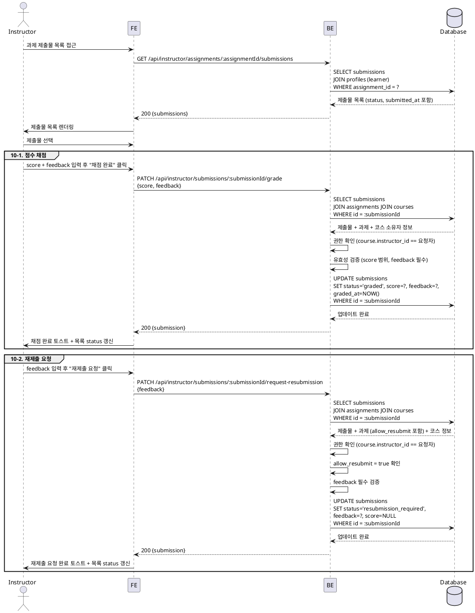

# UC-010: 제출물 채점 & 피드백

## Primary Actor

Instructor (인증된 강사)

---

## Precondition

- 로그인 상태이며 역할이 `instructor`인 사용자
- 채점 대상 과제(`assignments`)가 자신이 소유한 코스에 속해 있음
- 채점 대상 제출물(`submissions`)의 `status`가 `submitted` 또는 `resubmission_required` 상태

---

## Trigger

강사가 Instructor 대시보드 또는 과제 상세 페이지에서 특정 제출물을 선택하여 채점 화면에 진입한다.

---

## Main Scenario

1. 강사가 과제 상세 페이지에서 제출물 목록을 확인한다.
2. FE가 `GET /api/instructor/assignments/:assignmentId/submissions`를 호출하여 제출물 목록을 불러온다.
3. BE가 해당 과제에 속한 제출물 목록 (learner 정보, 제출 시각, 현재 status 포함)을 반환한다.
4. 강사가 특정 제출물을 선택한다.
5. FE가 제출물 상세(content_text, content_link, submitted_at, 기존 피드백 등)를 렌더링한다.

### 10-1. 점수 채점 (graded)

6a. 강사가 점수(0~100)와 피드백 텍스트를 입력한 후 "채점 완료" 버튼을 클릭한다.
7a. FE가 `PATCH /api/instructor/submissions/:submissionId/grade`를 호출한다 (`{ score, feedback }`).
8a. BE가 요청을 검증한다.
   - `score`가 0~100 정수 범위인지 확인
   - `feedback`이 비어 있지 않은지 확인
   - `submission.assignment.course`가 요청 강사 소유인지 확인
9a. BE가 `submissions` 레코드를 업데이트한다 (`status = 'graded'`, `score = score`, `feedback = feedback`, `graded_at = NOW()`).
10a. BE가 성공 응답을 반환한다.
11a. FE가 성공 토스트를 표시하고 제출물 목록의 status를 갱신한다.

### 10-2. 재제출 요청 (resubmission_required)

6b. 강사가 피드백 텍스트만 입력한 후 "재제출 요청" 버튼을 클릭한다.
7b. FE가 `PATCH /api/instructor/submissions/:submissionId/request-resubmission`을 호출한다 (`{ feedback }`).
8b. BE가 요청을 검증한다.
   - `feedback`이 비어 있지 않은지 확인
   - `submission.assignment.course`가 요청 강사 소유인지 확인
   - 과제의 `allow_resubmit = true` 여부 확인
9b. BE가 `submissions` 레코드를 업데이트한다 (`status = 'resubmission_required'`, `feedback = feedback`, `score = NULL`).
10b. BE가 성공 응답을 반환한다.
11b. FE가 성공 토스트를 표시하고 제출물 목록의 status를 갱신한다.
12b. Learner 대시보드의 해당 과제 상태가 `resubmission_required`로 반영된다.

---

## Edge Cases

| 상황 | 처리 |
|---|---|
| 점수가 0~100 범위를 벗어남 | 400 반환 → FE 입력 필드 인라인 오류 표시 |
| 피드백이 빈 문자열 | 400 반환 → "피드백을 입력해 주세요" 안내 메시지 |
| 요청 강사가 해당 코스 소유자가 아님 | 403 반환 → 권한 오류 메시지 |
| 이미 `graded` 상태인 제출물에 재채점 시도 | 200 허용 (덮어쓰기) — graded_at을 최신으로 갱신 |
| `allow_resubmit = false` 과제에 재제출 요청 시도 | 400 반환 → "재제출을 허용하지 않는 과제입니다" 메시지 |
| 제출물이 존재하지 않음 | 404 반환 → FE에서 오류 페이지 표시 |
| 과제가 `closed` 또는 자동 마감 상태에서 채점 시도 | 채점은 허용 (마감 후 채점 가능), 제출만 불가 |
| 네트워크 오류 | FE에서 재시도 유도 메시지 표시 |

---

## Business Rules

- 채점 시 `score`(0~100 정수)와 `feedback`은 모두 필수이다.
- 재제출 요청 시 `score`는 저장하지 않으며 (`score = NULL`), `feedback`만 필수이다.
- 채점 완료 시 `graded_at = NOW()`로 채점 시각을 기록한다.
- 재제출 요청은 과제의 `allow_resubmit = true`인 경우에만 허용한다.
- 강사는 자신이 소유한 코스의 과제 제출물만 채점할 수 있다.
- 이미 채점된(`graded`) 제출물을 재채점하는 것은 허용하며, 이전 점수와 피드백은 덮어쓴다.
- 채점 결과는 Learner 대시보드의 과제 상태 및 최근 피드백 섹션에 즉시 반영된다.

---

## Sequence Diagram

