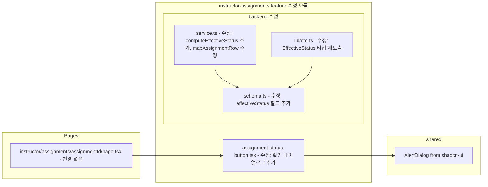

# Plan: UC-011 — Assignment 게시/마감

## 개요

UC-011은 강사가 과제를 게시(`draft → published`) 또는 수동 마감(`published → closed`)하는 기능이다.

### 현황 분석 (기존 구현 상태)

기존 UC-009 구현 시 이미 다음 모듈들이 완전히 구현되어 있다.

| 항목 | 위치 | 상태 |
|---|---|---|
| `PATCH /api/instructor/assignments/:assignmentId/status` 라우트 | `route.ts` 144번 줄 | 구현 완료 |
| `updateAssignmentStatus` 서비스 함수 | `service.ts` 233번 줄 | 구현 완료 |
| `isAllowedAssignmentStatusTransition` 순수 함수 | `service.ts` 87번 줄 | 구현 완료 |
| `useUpdateAssignmentStatusMutation` 훅 | `hooks/useUpdateAssignmentStatusMutation.ts` | 구현 완료 |
| `AssignmentStatusButton` 컴포넌트 | `components/assignment-status-button.tsx` | 구현 완료 |
| 게시/마감 버튼 page.tsx 연동 | `app/(protected)/instructor/assignments/[assignmentId]/page.tsx` | 구현 완료 |

### UC-011 Spec에서 추가로 요구하는 항목

UC-011 spec에는 기존 구현에 없는 두 가지 요소가 있다.

1. **`effective_status` 계산 및 응답 포함**: DB `status`와 `due_at`, `allow_late`를 조합하여 서버에서 계산하는 유효 상태값. 현재 `GET /api/instructor/assignments/:assignmentId` 응답(`InstructorAssignmentDtoSchema`)에는 `effective_status` 필드가 없음.

2. **마감 확인 다이얼로그**: 강사가 "수동 마감" 버튼 클릭 시 "마감 후 학습자 제출이 불가합니다. 계속하시겠습니까?" 확인 다이얼로그를 표시하는 UX. 현재 `AssignmentStatusButton`에는 이 다이얼로그가 없음.

### 추가 구현 범위

| 모듈 | 위치 | 설명 | 작업 종류 |
|---|---|---|---|
| `computeEffectiveStatus` 순수 함수 | `src/features/instructor-assignments/backend/service.ts` | DB status + due_at + allow_late 조합으로 effective_status 계산 | 수정 (추가) |
| `InstructorAssignmentDtoSchema` 확장 | `src/features/instructor-assignments/backend/schema.ts` | `effectiveStatus` 필드 추가 | 수정 |
| `mapAssignmentRow` 수정 | `src/features/instructor-assignments/backend/service.ts` | effective_status 필드 포함하도록 수정 | 수정 |
| `AssignmentStatusButton` 수정 | `src/features/instructor-assignments/components/assignment-status-button.tsx` | "수동 마감" 클릭 시 확인 다이얼로그 표시 | 수정 |

신규 파일 생성은 없으며, 신규 DB 마이그레이션도 불필요하다.

---

## 충돌 분석

### 기존 코드베이스와의 충돌 여부

| 검토 항목 | 충돌 여부 | 근거 |
|---|---|---|
| `InstructorAssignmentDtoSchema`에 `effectiveStatus` 필드 추가 | 충돌 없음 (하위 호환) | 기존 타입에 optional이 아닌 required 필드를 추가하면 클라이언트 파서(zod)가 오류를 낸다. **단, 기존 schema에서 `z.object()`는 추가 필드를 strip하므로, 응답 데이터에 새 필드를 포함하면 클라이언트의 `InstructorAssignmentResponseSchema.parse(data)`가 새 필드를 자동으로 포함한다.** schema에 필드를 추가하는 것만으로 FE/BE 모두 안전하게 확장 가능. |
| `mapAssignmentRow` 수정 | 충돌 없음 | 기존 반환 타입 `InstructorAssignmentDto`에 `effectiveStatus` 추가. 이 함수를 사용하는 `createAssignment`, `updateAssignment`, `updateAssignmentStatus`, `getInstructorAssignment`, `listInstructorCourseAssignments` 모두 동일하게 `effectiveStatus`를 포함한 응답을 반환하게 됨. 기존 동작 변경 없음, 정보 추가만 발생. |
| `computeEffectiveStatus` 순수 함수 추가 | 충돌 없음 | service.ts에 신규 함수 추가. 기존 함수 변경 없음. |
| `AssignmentStatusButton` 수정 | 충돌 없음 | 기존 Props 인터페이스 `onClose` 콜백을 유지하면서 내부에 다이얼로그 상태만 추가. 외부 인터페이스 변경 없음. `AlertDialog` shadcn-ui 컴포넌트 필요. |
| `useUpdateAssignmentStatusMutation` QueryKey invalidation | 충돌 없음 | 기존 `['instructor', 'assignments', assignmentId]` invalidation은 유지됨. `effectiveStatus`가 포함된 새 응답이 캐시에 반영됨. |
| `effective_status` 계산 로직과 학습자 제출 API | 충돌 없음 | 학습자 제출 API(`submissions/route.ts`)에서 `effective_status` 기반 제출 차단 로직은 별도 UC (학습자 과제 제출)에서 구현. UC-011은 강사 측 API만 담당. |
| `InstructorCourseAssignmentsResponseSchema` | 충돌 없음 | 코스별 과제 목록(`GET /api/instructor/courses/:courseId/assignments`)도 `InstructorAssignmentDto[]`를 반환하므로 동일하게 `effectiveStatus`가 포함됨. 학습자 대시보드 등 다른 feature에서 이 응답을 사용하지 않으므로 충돌 없음. |

### `effective_status` 계산 로직 정합성

spec에 정의된 계산 규칙:

| DB status | 조건 | effective_status |
|---|---|---|
| `closed` | (무조건) | `closed` |
| `published` | `NOW() > due_at` AND `allow_late = false` | `closed` |
| `published` | `NOW() > due_at` AND `allow_late = true` | `overdue` |
| `published` | `NOW() <= due_at` | `published` |
| `draft` | (무조건) | `draft` |

`mapAssignmentRow` 함수가 `AssignmentRow`를 받아서 `InstructorAssignmentDto`로 변환하는 시점에 계산 가능하다. `AssignmentRow`에는 이미 `status`, `due_at`, `allow_late` 필드가 모두 포함되어 있으므로 추가 DB 쿼리 없이 순수 함수로 계산 가능하다.

---

## Diagram



---

## Implementation Plan

### Step 1: schema.ts 수정 — `effectiveStatus` 필드 및 타입 추가

`InstructorAssignmentDtoSchema`에 `effectiveStatus` 필드를 추가한다.

파일 경로: `src/features/instructor-assignments/backend/schema.ts`

변경 전:
```typescript
export const InstructorAssignmentDtoSchema = z.object({
  id: z.string().uuid(),
  courseId: z.string().uuid(),
  title: z.string(),
  description: z.string().nullable(),
  dueAt: z.string(),
  weight: z.number(),
  allowLate: z.boolean(),
  allowResubmit: z.boolean(),
  status: z.enum(['draft', 'published', 'closed']),
  createdAt: z.string(),
  updatedAt: z.string(),
});
```

변경 후:
```typescript
export const EffectiveStatusSchema = z.enum(['draft', 'published', 'overdue', 'closed']);

export const InstructorAssignmentDtoSchema = z.object({
  id: z.string().uuid(),
  courseId: z.string().uuid(),
  title: z.string(),
  description: z.string().nullable(),
  dueAt: z.string(),
  weight: z.number(),
  allowLate: z.boolean(),
  allowResubmit: z.boolean(),
  status: z.enum(['draft', 'published', 'closed']),
  effectiveStatus: EffectiveStatusSchema,
  createdAt: z.string(),
  updatedAt: z.string(),
});
```

타입 추론 섹션에 추가:
```typescript
export type EffectiveStatus = z.infer<typeof EffectiveStatusSchema>;
```

**설계 근거**:
- `effectiveStatus`는 `EffectiveStatusSchema`로 별도 분리하여 FE에서 독립적으로 타입 참조 가능하게 한다.
- `EffectiveStatus` ENUM 값: `'draft' | 'published' | 'overdue' | 'closed'`. DB의 `assignment_status` ENUM(`draft`, `published`, `closed`)에 없는 `overdue` 값이 포함되므로 별도 정의 필요.
- `effectiveStatus`는 required 필드로 정의. nullable 또는 optional 처리 안 함 (서버에서 항상 계산 가능).

**Unit Test**:

```typescript
describe('EffectiveStatusSchema', () => {
  it('"draft" | "published" | "overdue" | "closed" 파싱 성공')
  it('"invalidated" 등 무효 값 파싱 실패')
})

describe('InstructorAssignmentDtoSchema', () => {
  it('effectiveStatus 포함 객체 파싱 성공')
  it('effectiveStatus 없는 객체 파싱 실패')
})
```

---

### Step 2: service.ts 수정 — `computeEffectiveStatus` 추가 및 `mapAssignmentRow` 수정

파일 경로: `src/features/instructor-assignments/backend/service.ts`

#### 2-1. `computeEffectiveStatus` 순수 함수 추가

기존 `isAllowedAssignmentStatusTransition` 다음에 추가한다.

```typescript
// import 추가 필요
import type { EffectiveStatus } from './schema';

// 추가할 순수 함수
export const computeEffectiveStatus = (
  status: 'draft' | 'published' | 'closed',
  dueAt: string,
  allowLate: boolean,
): EffectiveStatus => {
  if (status === 'draft') return 'draft';
  if (status === 'closed') return 'closed';
  // status === 'published'
  const now = new Date();
  const due = new Date(dueAt);
  if (now <= due) return 'published';
  // now > due_at
  return allowLate ? 'overdue' : 'closed';
};
```

**설계 근거**:
- 순수 함수로 분리하여 단위 테스트 가능. 외부 의존성 없음.
- `new Date(dueAt)` 변환: `dueAt`은 ISO 8601 TIMESTAMPTZ 문자열이므로 `new Date()` 파싱 가능.
- `export` 처리하여 단위 테스트에서 직접 import 가능하게 한다.
- `now <= due` (마감 시각 이전 또는 마감 시각 정확히 일치): `published` 반환. 마감 시각과 정확히 일치한 케이스는 아직 제출 가능한 것으로 간주.

**Unit Test**:

```typescript
describe('computeEffectiveStatus', () => {
  it('status = draft → always "draft" (due_at 무관)')
  it('status = closed → always "closed" (due_at 무관)')
  it('status = published, now <= due_at → "published"')
  it('status = published, now > due_at, allow_late = false → "closed"')
  it('status = published, now > due_at, allow_late = true → "overdue"')
  it('status = published, now === due_at (정확히 마감 시각) → "published"')
})
```

#### 2-2. `mapAssignmentRow` 수정

기존 `mapAssignmentRow` 함수에 `effectiveStatus` 필드를 추가한다.

변경 전:
```typescript
const mapAssignmentRow = (row: AssignmentRow): InstructorAssignmentDto => ({
  id: row.id,
  courseId: row.course_id,
  title: row.title,
  description: row.description,
  dueAt: row.due_at,
  weight: Number(row.weight),
  allowLate: row.allow_late,
  allowResubmit: row.allow_resubmit,
  status: row.status,
  createdAt: row.created_at,
  updatedAt: row.updated_at,
});
```

변경 후:
```typescript
const mapAssignmentRow = (row: AssignmentRow): InstructorAssignmentDto => ({
  id: row.id,
  courseId: row.course_id,
  title: row.title,
  description: row.description,
  dueAt: row.due_at,
  weight: Number(row.weight),
  allowLate: row.allow_late,
  allowResubmit: row.allow_resubmit,
  status: row.status,
  effectiveStatus: computeEffectiveStatus(row.status, row.due_at, row.allow_late),
  createdAt: row.created_at,
  updatedAt: row.updated_at,
});
```

**설계 근거**:
- `mapAssignmentRow`는 `AssignmentRow`에서 `InstructorAssignmentDto`로 변환하는 단일 책임 함수. 이미 `due_at`, `allow_late`, `status`를 모두 보유하고 있으므로 추가 쿼리 없이 계산 가능.
- `computeEffectiveStatus`를 호출하면 모든 서비스 함수(`createAssignment`, `updateAssignment`, `updateAssignmentStatus`, `getInstructorAssignment`, `listInstructorCourseAssignments`)의 응답에 자동으로 `effectiveStatus`가 포함됨.
- `updateAssignmentStatus` 함수는 UPDATE 후 `.select(ASSIGNMENT_SELECT).single()`로 최신 DB 값을 재조회하므로, 상태 변경 후 `effectiveStatus`도 최신 값으로 반환됨.

---

### Step 3: lib/dto.ts 수정 — `EffectiveStatus` 타입 재노출

파일 경로: `src/features/instructor-assignments/lib/dto.ts`

기존 export 목록에 추가:

```typescript
export {
  // ... 기존 export ...
  EffectiveStatusSchema,
} from '@/features/instructor-assignments/backend/schema';

export type {
  // ... 기존 type export ...
  EffectiveStatus,
} from '@/features/instructor-assignments/backend/schema';
```

---

### Step 4: assignment-status-button.tsx 수정 — 마감 확인 다이얼로그 추가

파일 경로: `src/features/instructor-assignments/components/assignment-status-button.tsx`

UC-011 spec 시나리오 11-2 Step 4: 강사가 "마감" 버튼 클릭 시 "마감 후 학습자 제출이 불가합니다. 계속하시겠습니까?" 확인 다이얼로그를 표시한다.

현재 `AssignmentStatusButton`은 `published` 상태에서 `onClose`를 직접 호출하는 버튼을 렌더링한다. 여기에 `AlertDialog`를 삽입하여 확인 단계를 추가한다.

**Props 인터페이스 변경 없음**: `onClose`, `onPublish`, `isPending` 모두 유지. 다이얼로그 상태는 컴포넌트 내부 state로 관리.

변경 후 코드 구조:

```typescript
'use client';

import { useState } from 'react';
import { match } from 'ts-pattern';
import { Globe, Lock, Loader2 } from 'lucide-react';
import { Button } from '@/components/ui/button';
import { Badge } from '@/components/ui/badge';
import {
  AlertDialog,
  AlertDialogAction,
  AlertDialogCancel,
  AlertDialogContent,
  AlertDialogDescription,
  AlertDialogFooter,
  AlertDialogHeader,
  AlertDialogTitle,
  AlertDialogTrigger,
} from '@/components/ui/alert-dialog';
import type { InstructorAssignmentDto } from '@/features/instructor-assignments/lib/dto';

type AssignmentStatusButtonProps = {
  status: InstructorAssignmentDto['status'];
  onPublish: () => void;
  onClose: () => void;
  isPending: boolean;
};

export const AssignmentStatusButton = ({
  status,
  onPublish,
  onClose,
  isPending,
}: AssignmentStatusButtonProps) =>
  match(status)
    .with('draft', () => (
      <Button onClick={onPublish} disabled={isPending} variant="default">
        {isPending ? (
          <Loader2 className="mr-2 h-4 w-4 animate-spin" />
        ) : (
          <Globe className="mr-2 h-4 w-4" />
        )}
        게시하기
      </Button>
    ))
    .with('published', () => (
      <AlertDialog>
        <AlertDialogTrigger asChild>
          <Button disabled={isPending} variant="outline">
            {isPending ? (
              <Loader2 className="mr-2 h-4 w-4 animate-spin" />
            ) : (
              <Lock className="mr-2 h-4 w-4" />
            )}
            수동 마감
          </Button>
        </AlertDialogTrigger>
        <AlertDialogContent>
          <AlertDialogHeader>
            <AlertDialogTitle>과제 마감 확인</AlertDialogTitle>
            <AlertDialogDescription>
              마감 후 학습자 제출이 불가합니다. 계속하시겠습니까?
            </AlertDialogDescription>
          </AlertDialogHeader>
          <AlertDialogFooter>
            <AlertDialogCancel>취소</AlertDialogCancel>
            <AlertDialogAction onClick={onClose}>마감하기</AlertDialogAction>
          </AlertDialogFooter>
        </AlertDialogContent>
      </AlertDialog>
    ))
    .with('closed', () => (
      <Badge variant="outline" className="text-slate-500">
        마감됨
      </Badge>
    ))
    .exhaustive();
```

**설계 근거**:
- `AlertDialog`는 shadcn-ui 컴포넌트. 기존 코드베이스 설치 여부 확인 후 미설치 시 추가 설치 필요.
- `AlertDialogTrigger asChild`로 기존 `Button` 컴포넌트를 그대로 트리거로 사용하여 스타일 일관성 유지.
- `onClose`는 `AlertDialogAction onClick`에만 연결. 취소 클릭 시 아무 동작도 하지 않음.
- `isPending` 상태에서는 트리거 버튼 자체가 disabled 처리되어 다이얼로그가 열리지 않음 (이중 클릭 방지).
- `useState` import 추가: `AlertDialog`는 내부적으로 상태를 관리하므로 별도 state 불필요. 단, `match` 함수가 React component를 반환하므로 `'use client'` 지시어 및 hook 규칙 준수 필요.

**신규 shadcn-ui 컴포넌트 확인**:

기존 코드베이스에서 `AlertDialog` 사용 여부를 확인해야 한다. 미설치 시:
```
$ npx shadcn@latest add alert-dialog
```

**QA Sheet**

| 시나리오 | 기대 결과 |
|---|---|
| status = draft | "게시하기" 버튼 표시, 다이얼로그 없음 |
| status = draft, "게시하기" 클릭 | onPublish 직접 호출 (다이얼로그 없음) |
| status = published | "수동 마감" 버튼 표시 |
| status = published, "수동 마감" 클릭 | AlertDialog 열림 ("마감 후 학습자 제출이 불가합니다. 계속하시겠습니까?") |
| 다이얼로그 "취소" 클릭 | 다이얼로그 닫힘, onClose 미호출 |
| 다이얼로그 "마감하기" 클릭 | 다이얼로그 닫힘, onClose 호출 |
| status = closed | 마감됨 배지 표시, 버튼 없음 |
| isPending = true (published) | "수동 마감" 버튼 disabled + 스피너 (다이얼로그 열리지 않음) |
| isPending = true (draft) | "게시하기" 버튼 disabled + 스피너 |

---

## 공유 모듈 의존 관계

| UC-011 신규 추가에서 사용 | 출처 | 비고 |
|---|---|---|
| `AlertDialog`, `AlertDialogAction` 등 | `src/components/ui/alert-dialog` | 신규 설치 필요 여부 확인 |
| `computeEffectiveStatus` | `src/features/instructor-assignments/backend/service.ts` | 신규 순수 함수, FE에서 직접 사용 불필요 |
| `EffectiveStatus` 타입 | `src/features/instructor-assignments/lib/dto.ts` | FE에서 타입 참조용 |

기존 구현 재사용 (변경 없음):
- `withAuth`, `success`, `failure`, `respond`, `getSupabase`, `getCurrentUser`, `UUID_REGEX`
- `useUpdateAssignmentStatusMutation`, `useInstructorAssignmentQuery`
- `AssignmentStatusButton` (Props 인터페이스 변경 없음, 내부 다이얼로그 추가만)

---

## 신규 마이그레이션

불필요. `assignments.status` (`assignment_status` ENUM: `draft`, `published`, `closed`), `assignments.due_at`, `assignments.allow_late` 컬럼은 `0002_create_lms_tables.sql`에 이미 정의되어 있다.

`effective_status`는 서버에서 런타임에 계산하는 값이므로 DB 컬럼 추가 불필요.

---

## 신규 shadcn-ui 컴포넌트

- `AlertDialog`: 마감 확인 다이얼로그.

  ```
  $ npx shadcn@latest add alert-dialog
  ```

---

## 구현 순서 요약

| 순서 | 파일 | 작업 종류 | 비고 |
|---|---|---|---|
| 1 | `src/features/instructor-assignments/backend/schema.ts` | 수정 | `EffectiveStatusSchema`, `EffectiveStatus` 타입, `InstructorAssignmentDtoSchema`에 `effectiveStatus` 필드 추가 |
| 2 | `src/features/instructor-assignments/backend/service.ts` | 수정 | `computeEffectiveStatus` 순수 함수 추가 + `mapAssignmentRow`에 `effectiveStatus` 필드 추가 + `EffectiveStatus` import |
| 3 | `src/features/instructor-assignments/lib/dto.ts` | 수정 | `EffectiveStatusSchema`, `EffectiveStatus` 재노출 추가 |
| 4 | `src/features/instructor-assignments/components/assignment-status-button.tsx` | 수정 | `AlertDialog` 추가 (마감 확인 다이얼로그) |
