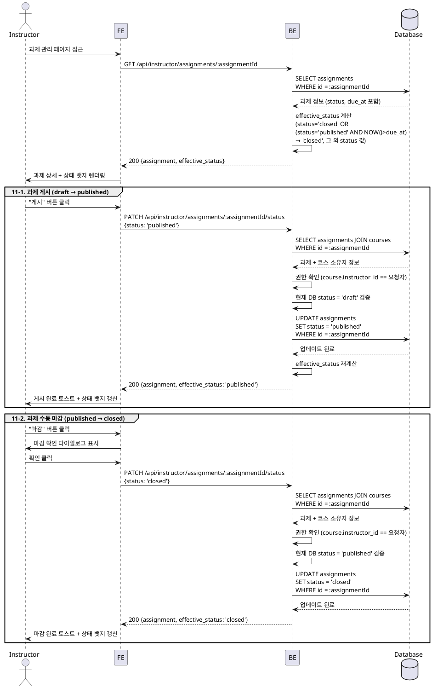

# UC-011: Assignment 게시/마감

## Primary Actor

Instructor (인증된 강사)

---

## Precondition

- 로그인 상태이며 역할이 `instructor`인 사용자
- 대상 과제(`assignments`)가 자신이 소유한 코스에 속해 있음
- 게시 전환 시: 과제의 현재 `status`가 `draft`
- 수동 마감 시: 과제의 현재 `status`가 `published`

---

## Trigger

강사가 Instructor 대시보드 또는 과제 관리 페이지에서 과제의 상태를 변경한다.

---

## 유효 상태 (Effective Status) 정의

DB의 `status` 컬럼 값과 별도로, 클라이언트 및 API 응답에서 `effective_status`를 계산하여 사용한다.

| DB status | 조건 | effective_status | 설명 |
|---|---|---|---|
| `closed` | (무조건) | `closed` | 강사 수동 마감, 제출 불가 |
| `published` | `NOW() > due_at` AND `allow_late = false` | `closed` | 자동 마감, 제출 불가 |
| `published` | `NOW() > due_at` AND `allow_late = true` | `overdue` | 지각 제출 허용 중, 제출 가능 (`is_late = true` 처리) |
| `published` | `NOW() <= due_at` | `published` | 진행 중, 제출 가능 |
| `draft` | (무조건) | `draft` | 미게시, 학습자 비노출 |

- `effective_status = 'closed'`이면 학습자의 신규 제출이 불가능하다.
- `effective_status = 'overdue'`이면 제출은 가능하되 `is_late = true`로 기록된다.
- `effective_status = 'closed'` 또는 `overdue`이더라도 강사의 채점은 허용된다.

---

## Main Scenario

### 11-1. 과제 게시 (draft → published)

1. 강사가 과제 목록에서 `draft` 상태인 과제를 선택한다.
2. FE가 `GET /api/instructor/assignments/:assignmentId`를 호출하여 과제 상세 및 `effective_status`를 불러온다.
3. BE가 `effective_status`를 계산하여 응답에 포함시킨다.
4. 강사가 "게시" 버튼을 클릭한다.
5. FE가 `PATCH /api/instructor/assignments/:assignmentId/status`를 호출한다 (`{ status: 'published' }`).
6. BE가 요청을 검증한다.
   - 요청 강사가 해당 코스의 소유자인지 확인
   - 현재 DB `status`가 `draft`인지 확인 (`published` 또는 `closed`로의 중복 게시 차단)
7. BE가 `assignments` 레코드를 업데이트한다 (`status = 'published'`).
8. BE가 성공 응답을 반환한다 (`effective_status` 포함).
9. FE가 성공 토스트를 표시하고 과제 상태 뱃지를 `published`로 갱신한다.
10. 학습자의 코스 상세 및 대시보드에 해당 과제가 노출된다.

### 11-2. 과제 수동 마감 (published → closed)

1. 강사가 과제 목록에서 `published` 상태인 과제를 선택한다.
2. FE가 `GET /api/instructor/assignments/:assignmentId`를 호출하여 과제 상세 및 `effective_status`를 불러온다.
3. 강사가 "마감" 버튼을 클릭한다.
4. FE가 마감 확인 다이얼로그를 표시한다 ("마감 후 학습자 제출이 불가합니다. 계속하시겠습니까?").
5. 강사가 확인을 클릭한다.
6. FE가 `PATCH /api/instructor/assignments/:assignmentId/status`를 호출한다 (`{ status: 'closed' }`).
7. BE가 요청을 검증한다.
   - 요청 강사가 해당 코스의 소유자인지 확인
   - 현재 DB `status`가 `published`인지 확인
8. BE가 `assignments` 레코드를 업데이트한다 (`status = 'closed'`).
9. BE가 성공 응답을 반환한다 (`effective_status = 'closed'` 포함).
10. FE가 성공 토스트를 표시하고 과제 상태 뱃지를 `closed`로 갱신한다.
11. 이후 학습자의 제출 시도는 차단되며, 강사의 채점은 계속 허용된다.

---

## Edge Cases

| 상황 | 처리 |
|---|---|
| 이미 `published` 상태인 과제에 게시 요청 | 400 반환 → "이미 게시된 과제입니다" 메시지 |
| `draft` 상태인 과제에 마감 요청 | 400 반환 → "게시된 과제만 마감할 수 있습니다" 메시지 |
| 요청 강사가 해당 코스 소유자가 아님 | 403 반환 → 권한 오류 메시지 |
| 과제가 존재하지 않음 | 404 반환 → FE에서 오류 페이지 표시 |
| 자동 마감(`due_at` 초과) 상태에서 수동 마감 재시도 | DB `status`는 여전히 `published`이므로 수동 마감 허용 → `closed`로 갱신 |
| 마감된 과제에 학습자가 제출 시도 | 제출 API에서 `effective_status` 확인 후 400 반환 → "마감된 과제입니다" 메시지 |
| 네트워크 오류 | FE에서 재시도 유도 메시지 표시 |

---

## Business Rules

- 과제의 상태 전환은 `draft → published → closed` 단방향이다. 역방향 전환(`closed → published` 등)은 허용하지 않는다.
- `effective_status`는 DB `status`와 `due_at`을 조합하여 서버에서 계산하며, 클라이언트는 이 값을 기준으로 UI를 렌더링한다.
- `effective_status = 'closed'`인 과제는 학습자의 신규 제출이 불가능하다.
- `effective_status = 'overdue'`인 과제는 지각 제출이 허용(`allow_late = true`)되며, 제출 시 `is_late = true`로 기록된다.
- `effective_status = 'closed'` 또는 `overdue`이더라도 강사는 기존 제출물에 대한 채점 및 피드백을 수행할 수 있다.
- `published` 상태의 과제만 학습자 대시보드 및 코스 상세에 노출된다.
- 강사는 자신이 소유한 코스의 과제만 상태를 변경할 수 있다.
- 수동 마감(`closed`)은 `due_at` 도달 여부와 무관하게 즉시 적용된다.

---

## Sequence Diagram

