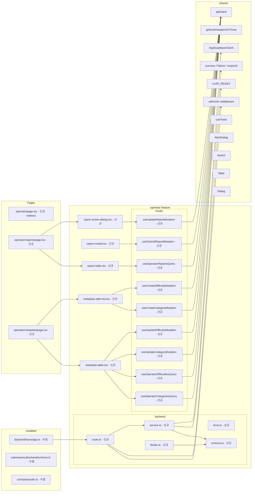

# Plan: UC-012 — 운영 (Operator)

## 개요

UC-012는 세 가지 독립적인 기능으로 구성된다.

- **12-1. 신고 접수**: 인증된 모든 사용자(learner/instructor/operator)가 코스·과제·제출물·사용자를 신고한다.
- **12-2. 신고 처리**: operator가 신고 관리 대시보드에서 신고 목록을 조회하고 상태를 갱신하며 후속 액션을 처리한다.
- **12-3. 메타데이터 관리**: operator가 카테고리·난이도를 CRUD 관리한다.

신규 feature `operator`를 생성하여 모든 operator 전용 백엔드 라우트와 서비스 로직을 통합한다.
신고 접수(`POST /api/reports`)는 역할 제한 없이 인증만 요구하므로 operator feature 하위에 함께 등록한다.

---

## 현황 분석

### 기존 코드베이스 현황

| 항목 | 위치 | 상태 |
|---|---|---|
| `reports` 테이블 (DB) | `supabase/migrations/0002_create_lms_tables.sql` | 완전 정의됨 (`report_target_type`, `report_status`, `report_action` ENUM 포함) |
| `categories` 테이블 (DB) | `supabase/migrations/0002_create_lms_tables.sql` | 완전 정의됨 (`name`, `is_active`) |
| `difficulties` 테이블 (DB) | `supabase/migrations/0002_create_lms_tables.sql` | 완전 정의됨 (`name`, `is_active`) |
| `profiles` 테이블 (DB) | `supabase/migrations/0002_create_lms_tables.sql` | `is_active` 컬럼 없음 (마이그레이션 필요) |
| `submission_status` ENUM | `supabase/migrations/0002_create_lms_tables.sql` | `submitted`, `graded`, `resubmission_required` — `invalidated` 없음 (마이그레이션 필요) |
| `warnings` 테이블 | 없음 | 마이그레이션 필요 |
| operator feature 디렉토리 | 없음 | 신규 생성 필요 |
| `/operator` 페이지 | `src/app/(protected)` 에 없음 | 신규 생성 필요 |
| `useRoleGuard`의 operator 경로 | `src/hooks/useRoleGuard.ts` L17 | `/operator` 경로 이미 참조됨 |
| `ROLE_HOME` operator 키 | `src/hooks/useRoleGuard.ts` | 이미 `/operator` 지정됨 |
| toast 라이브러리 | `src/hooks/use-toast.ts`, `src/components/ui/toast.tsx` | shadcn-ui 내장 toast 사용 (`useToast` 훅) |
| `alert-dialog` shadcn-ui 컴포넌트 | `src/components/ui/alert-dialog.tsx` | 이미 설치됨 |
| `select` shadcn-ui 컴포넌트 | `src/components/ui/select.tsx` | 이미 설치됨 |
| `dialog` shadcn-ui 컴포넌트 | 없음 | 신규 설치 필요 |
| `table` shadcn-ui 컴포넌트 | 없음 | 신규 설치 필요 |
| `switch` shadcn-ui 컴포넌트 | 없음 | 신규 설치 필요 |

### spec 요구 DB 변경 사항

spec 문서(Business Rules 하단 주석)에서 명시한 세 가지 DB 변경이 필요하다.

| 변경 항목 | 종류 | 결정 |
|---|---|---|
| `warnings` 테이블 추가 | 신규 테이블 | 마이그레이션 추가 |
| `profiles.is_active` 컬럼 추가 | 컬럼 추가 | 마이그레이션 추가 |
| `submission_status` ENUM에 `invalidated` 값 추가 | ENUM 확장 | 마이그레이션 추가 |

### 기존 `submissions` feature와의 관계

`submissions/backend/schema.ts`의 `SubmissionResponseSchema`의 `status` 필드가 현재 `['submitted', 'graded', 'resubmission_required']` 3개 값만 허용한다. `invalidated` ENUM 값 추가 후 이 스키마를 확장해야 하므로 기존 feature 수정이 발생한다.

`instructor-assignments/backend/schema.ts`의 `GradedSubmissionDtoSchema`와 `SubmissionDetailDtoSchema`에는 이미 `invalidated`가 포함되어 있어 해당 feature는 변경 불필요하다.

---

## 신규 생성 파일 목록

| 파일 | 종류 | 설명 |
|---|---|---|
| `supabase/migrations/0005_add_operator_tables.sql` | SQL 마이그레이션 | `invalidated` ENUM 추가, `profiles.is_active`, `warnings` 테이블 |
| `src/features/operator/backend/error.ts` | 신규 | operator 에러 코드 정의 |
| `src/features/operator/backend/schema.ts` | 신규 | 요청/응답 zod 스키마 |
| `src/features/operator/backend/service.ts` | 신규 | 비즈니스 로직 (신고 접수, 신고 처리, 메타데이터 CRUD) |
| `src/features/operator/backend/route.ts` | 신규 | Hono 라우터 등록 함수 |
| `src/features/operator/lib/dto.ts` | 신규 | FE 재노출 |
| `src/features/operator/hooks/useSubmitReportMutation.ts` | 신규 | 신고 접수 뮤테이션 훅 |
| `src/features/operator/hooks/useOperatorReportsQuery.ts` | 신규 | 신고 목록 조회 쿼리 훅 |
| `src/features/operator/hooks/useUpdateReportMutation.ts` | 신규 | 신고 상태/액션 수정 뮤테이션 훅 |
| `src/features/operator/hooks/useOperatorCategoriesQuery.ts` | 신규 | 카테고리 목록 조회 쿼리 훅 |
| `src/features/operator/hooks/useOperatorDifficultiesQuery.ts` | 신규 | 난이도 목록 조회 쿼리 훅 |
| `src/features/operator/hooks/useCreateCategoryMutation.ts` | 신규 | 카테고리 생성 뮤테이션 훅 |
| `src/features/operator/hooks/useUpdateCategoryMutation.ts` | 신규 | 카테고리 수정 뮤테이션 훅 |
| `src/features/operator/hooks/useCreateDifficultyMutation.ts` | 신규 | 난이도 생성 뮤테이션 훅 |
| `src/features/operator/hooks/useUpdateDifficultyMutation.ts` | 신규 | 난이도 수정 뮤테이션 훅 |
| `src/features/operator/components/report-modal.tsx` | 신규 | 신고 모달 (신고 사유 선택 + 상세 내용 입력) |
| `src/features/operator/components/report-table.tsx` | 신규 | 신고 목록 테이블 |
| `src/features/operator/components/report-action-dialog.tsx` | 신규 | 신고 처리 다이얼로그 (처리 액션 선택) |
| `src/features/operator/components/metadata-table.tsx` | 신규 | 카테고리/난이도 공통 메타데이터 테이블 |
| `src/features/operator/components/metadata-add-row.tsx` | 신규 | 새 항목 이름 입력 인라인 폼 행 |
| `src/app/(protected)/operator/page.tsx` | 신규 | operator 홈 (신고 관리 대시보드로 redirect) |
| `src/app/(protected)/operator/reports/page.tsx` | 신규 | 신고 관리 대시보드 페이지 |
| `src/app/(protected)/operator/metadata/page.tsx` | 신규 | 메타데이터 관리 페이지 |

## 수정 파일 목록

| 파일 | 종류 | 설명 |
|---|---|---|
| `src/backend/hono/app.ts` | 수정 | `registerOperatorRoutes` import 및 등록 |
| `src/features/submissions/backend/schema.ts` | 수정 | `SubmissionResponseSchema` status에 `invalidated` 추가 |
| `src/constants/auth.ts` | 수정 | `OPERATOR_HOME_PATH` 상수 추가 |

---

## 충돌 분석

### 기존 코드베이스와의 충돌 여부

| 검토 항목 | 충돌 여부 | 근거 |
|---|---|---|
| `POST /api/reports` 라우트 신규 등록 | 충돌 없음 | 기존 코드베이스에 `/api/reports` 경로 없음 |
| `GET /api/operator/reports` 라우트 신규 등록 | 충돌 없음 | 기존 코드베이스에 `/api/operator/` prefix 경로 없음 |
| `PATCH /api/operator/reports/:reportId` | 충돌 없음 | 동일 |
| `GET/POST/PATCH /api/operator/categories` | 충돌 없음 | 기존 `GET /api/instructor/courses/meta`가 `categories`를 조회하나, 라우트 경로가 완전히 다름 |
| `GET/POST/PATCH /api/operator/difficulties` | 충돌 없음 | 동일 |
| `submission_status` ENUM에 `invalidated` 추가 | 기존 코드 수정 필요 | `submissions/backend/schema.ts`의 `SubmissionResponseSchema.status` 필드가 3개 값 ENUM으로 정의됨. `invalidated` 추가 시 FE 타입에서 새 값이 허용됨 (하위 호환성 깨지지 않음). `instructor-assignments/backend/schema.ts`의 `GradedSubmissionDtoSchema`와 `SubmissionDetailDtoSchema`에는 이미 `invalidated`가 포함되어 있어 충돌 없음 |
| `profiles.is_active` 컬럼 추가 | 기존 코드 영향 없음 | `profiles` 테이블 조회 시 명시적 `select` 컬럼 목록을 사용하므로 새 컬럼이 자동으로 노출되지 않음. 기존 `withAuth` 미들웨어에서 `select('id, role')` 조회하므로 영향 없음 |
| `warnings` 테이블 신규 추가 | 충돌 없음 | 기존 테이블에 FK 참조만 추가됨 |
| `registerOperatorRoutes(app)` 등록 | 충돌 없음 | `app.ts`에 다른 feature와 동일한 패턴으로 append |
| 카테고리/난이도 `is_active = false` 항목 | 기존 `instructor-courses` 영향 | `getInstructorCourseMeta` 서비스가 `categories`와 `difficulties`를 조회할 때 `is_active = true` 필터를 적용하고 있는지 확인 필요 |

### `getInstructorCourseMeta`의 is_active 필터 확인

spec 비즈니스 룰에 따라 `is_active = false`인 항목은 코스 생성/수정 시 선택 불가여야 한다. 기존 `instructor-courses/backend/service.ts`의 `getInstructorCourseMeta` 함수가 이 필터를 적용하고 있는지 반드시 검증해야 한다.

미적용 시 `instructor-courses/backend/service.ts` 수정도 범위에 포함된다.

---

## Diagram



---

## Implementation Plan

### Step 1: DB 마이그레이션 — `0005_add_operator_tables.sql`

파일 경로: `supabase/migrations/0005_add_operator_tables.sql`

세 가지 변경을 하나의 마이그레이션에 통합한다.

**1-1. `submission_status` ENUM에 `invalidated` 값 추가**

Postgres에서 ENUM 값은 기존 `ALTER TYPE ... ADD VALUE IF NOT EXISTS` 문법을 사용해 멱등 방식으로 추가한다.

```sql
ALTER TYPE public.submission_status ADD VALUE IF NOT EXISTS 'invalidated';
```

**설계 근거**:
- `ADD VALUE IF NOT EXISTS`는 이미 값이 존재하면 오류 없이 무시하므로 멱등 적용 가능.
- `invalidate_submission` 액션 처리 시 submission의 status를 `'invalidated'`로 명확히 설정한다. (spec에서 제안한 `score = NULL, status = 'submitted'` 초기화 방식 대신, 별도 `invalidated` 상태를 사용해 의미를 명확히 분리한다.)

**1-2. `profiles.is_active` 컬럼 추가**

```sql
ALTER TABLE public.profiles
  ADD COLUMN IF NOT EXISTS is_active boolean NOT NULL DEFAULT true;
```

**설계 근거**:
- `DEFAULT true`로 기존 모든 프로필 레코드가 활성 상태를 유지.
- `restrict_account` 액션 처리 시 `is_active = false`로 업데이트.

**1-3. `warnings` 테이블 신규 생성**

```sql
CREATE TABLE IF NOT EXISTS public.warnings (
  id         uuid        PRIMARY KEY DEFAULT gen_random_uuid(),
  user_id    uuid        NOT NULL REFERENCES public.profiles(id) ON DELETE CASCADE,
  report_id  uuid        NOT NULL REFERENCES public.reports(id) ON DELETE CASCADE,
  warned_at  timestamptz NOT NULL DEFAULT now(),
  created_at timestamptz NOT NULL DEFAULT now(),
  updated_at timestamptz NOT NULL DEFAULT now()
);

ALTER TABLE IF EXISTS public.warnings DISABLE ROW LEVEL SECURITY;

CREATE INDEX IF NOT EXISTS idx_warnings_user_id   ON public.warnings(user_id);
CREATE INDEX IF NOT EXISTS idx_warnings_report_id ON public.warnings(report_id);

DROP TRIGGER IF EXISTS trg_warnings_updated_at ON public.warnings;
CREATE TRIGGER trg_warnings_updated_at
  BEFORE UPDATE ON public.warnings
  FOR EACH ROW EXECUTE FUNCTION public.set_updated_at();
```

**설계 근거**:
- `user_id`: 경고 대상 사용자. `report.target_id`가 `target_type = 'user'`인 경우이거나, `target_type = 'submission'`이면 해당 제출물의 `learner_id`에서 파생.
- `report_id`: 어떤 신고 처리 결과로 발급된 경고인지 추적.
- `public.set_updated_at()` 트리거 함수는 `0002_create_lms_tables.sql`에서 이미 정의됨.

---

### Step 2: `submissions/backend/schema.ts` 수정 — `invalidated` status 추가

파일 경로: `src/features/submissions/backend/schema.ts`

```typescript
// 변경 전
status: z.enum(['submitted', 'graded', 'resubmission_required']),

// 변경 후
status: z.enum(['submitted', 'graded', 'resubmission_required', 'invalidated']),
```

**충돌 분석**:
- `SubmissionResponseSchema`를 사용하는 `mapSubmissionRow` 반환 타입과 FE의 `useSubmissionQuery` 훅 응답 타입에 `invalidated`가 추가됨.
- 기존 FE 로직에서 submission status를 분기하는 `match` 코드(`ts-pattern`)가 있다면 `invalidated` 케이스를 누락 시 타입 오류가 발생함. 구현 시 해당 컴포넌트들도 확인 필요.
- `instructor-assignments`의 `GradedSubmissionDtoSchema`와 `SubmissionDetailDtoSchema`에는 이미 `invalidated`가 포함되어 있어 충돌 없음.

---

### Step 3: `constants/auth.ts` 수정 — `OPERATOR_HOME_PATH` 추가

파일 경로: `src/constants/auth.ts`

```typescript
export const OPERATOR_HOME_PATH = '/operator';
```

**설계 근거**:
- `useRoleGuard.ts`에서 이미 `'/operator'` 문자열을 하드코딩하고 있으므로 상수 추출로 단일 출처 보장.

---

### Step 4: `instructor-courses/backend/service.ts` 검증 및 수정

파일 경로: `src/features/instructor-courses/backend/service.ts`

`getInstructorCourseMeta` 함수가 `categories`와 `difficulties`를 조회할 때 `.eq('is_active', true)` 필터를 적용하고 있는지 확인한다.

미적용 시 다음을 추가한다:

```typescript
// categories 조회 시
const { data: categories } = await supabase
  .from('categories')
  .select('id, name')
  .eq('is_active', true)
  .order('name');

// difficulties 조회 시
const { data: difficulties } = await supabase
  .from('difficulties')
  .select('id, name')
  .eq('is_active', true)
  .order('name');
```

**설계 근거**:
- spec 비즈니스 룰: "`is_active = false`인 항목은 코스 생성/수정 시 선택 불가". 이 룰은 operator가 비활성화한 시점부터 강사 코스 생성 폼에 해당 항목이 노출되지 않아야 함을 의미한다.

---

### Step 5: `operator/backend/error.ts` (신규)

파일 경로: `src/features/operator/backend/error.ts`

```typescript
export const operatorErrorCodes = {
  forbidden: 'FORBIDDEN',
  notFound: 'OPERATOR_NOT_FOUND',
  targetNotFound: 'REPORT_TARGET_NOT_FOUND',
  alreadyResolved: 'REPORT_ALREADY_RESOLVED',
  duplicateName: 'DUPLICATE_METADATA_NAME',
  invalidReportStatus: 'INVALID_REPORT_STATUS',
  fetchError: 'OPERATOR_FETCH_ERROR',
} as const;

type OperatorErrorValue =
  (typeof operatorErrorCodes)[keyof typeof operatorErrorCodes];

export type OperatorServiceError = OperatorErrorValue;
```

**에러 코드 설계 근거**:
- `targetNotFound` (404): 신고 대상(`target_id`)이 실제 존재하지 않을 때.
- `alreadyResolved` (400): 이미 `resolved` 상태인 신고를 재처리 시도할 때.
- `duplicateName` (409): 카테고리/난이도 이름 중복 시.
- `invalidReportStatus`: `status` 값이 허용 범위를 벗어날 때 (Zod 검증 통과 후 서비스 레이어 방어).

---

### Step 6: `operator/backend/schema.ts` (신규)

파일 경로: `src/features/operator/backend/schema.ts`

#### 6-1. 신고 접수 스키마

```typescript
export const ReportTargetTypeSchema = z.enum(['course', 'assignment', 'submission', 'user']);

export const CreateReportBodySchema = z.object({
  targetType: ReportTargetTypeSchema,
  targetId: z.string().uuid('대상 ID가 유효하지 않습니다.'),
  reason: z.string().min(1, '신고 사유를 입력해 주세요.'),
  content: z.string().min(1, '신고 내용을 입력해 주세요.'),
});

export const CreateReportResponseSchema = z.object({
  reportId: z.string().uuid(),
});
```

#### 6-2. 신고 처리 스키마

```typescript
export const ReportStatusSchema = z.enum(['received', 'investigating', 'resolved']);

export const ReportActionSchema = z.enum([
  'warning',
  'invalidate_submission',
  'restrict_account',
]);

export const UpdateReportBodySchema = z.object({
  status: ReportStatusSchema,
  action: ReportActionSchema.nullable().optional(),
});

export const ReportDtoSchema = z.object({
  id: z.string().uuid(),
  reporterId: z.string().uuid(),
  targetType: ReportTargetTypeSchema,
  targetId: z.string().uuid(),
  reason: z.string(),
  content: z.string(),
  status: ReportStatusSchema,
  action: ReportActionSchema.nullable(),
  createdAt: z.string(),
  updatedAt: z.string(),
});

export const ReportListResponseSchema = z.object({
  reports: z.array(ReportDtoSchema),
  totalCount: z.number().int().nonnegative(),
});

export const ReportResponseSchema = z.object({
  report: ReportDtoSchema,
});
```

**설계 근거**:
- `UpdateReportBodySchema.action`은 optional + nullable: `investigating` 변경 시에는 action 불필요, `resolved` 변경 시에는 action이 있을 수도 없을 수도 있음 (무혐의 처리 허용).
- `action`은 `status = 'resolved'`일 때만 의미를 가지지만, 라우트 레이어에서 강제하지 않고 서비스 레이어에서 `status = 'resolved'`일 때만 action을 기록한다.

#### 6-3. 카테고리/난이도 스키마 (공유 패턴)

```typescript
// --- 카테고리 ---

export const CreateCategoryBodySchema = z.object({
  name: z.string().min(1, '이름을 입력해 주세요.'),
});

export const UpdateCategoryBodySchema = z.object({
  name: z.string().min(1, '이름을 입력해 주세요.').optional(),
  isActive: z.boolean().optional(),
});

export const CategoryDtoSchema = z.object({
  id: z.string().uuid(),
  name: z.string(),
  isActive: z.boolean(),
  createdAt: z.string(),
  updatedAt: z.string(),
});

export const CategoryListResponseSchema = z.object({
  categories: z.array(CategoryDtoSchema),
});

export const CategoryResponseSchema = z.object({
  category: CategoryDtoSchema,
});

// --- 난이도 (카테고리와 동일 구조) ---

export const CreateDifficultyBodySchema = z.object({
  name: z.string().min(1, '이름을 입력해 주세요.'),
});

export const UpdateDifficultyBodySchema = z.object({
  name: z.string().min(1, '이름을 입력해 주세요.').optional(),
  isActive: z.boolean().optional(),
});

export const DifficultyDtoSchema = z.object({
  id: z.string().uuid(),
  name: z.string(),
  isActive: z.boolean(),
  createdAt: z.string(),
  updatedAt: z.string(),
});

export const DifficultyListResponseSchema = z.object({
  difficulties: z.array(DifficultyDtoSchema),
});

export const DifficultyResponseSchema = z.object({
  difficulty: DifficultyDtoSchema,
});
```

**설계 근거**:
- `UpdateCategoryBodySchema`와 `UpdateDifficultyBodySchema`의 필드를 모두 optional로 정의하여 이름 변경 전용, is_active 변경 전용, 동시 변경 모두 지원.
- `refine`으로 최소 하나의 필드 제공 강제도 가능하나, 운영자 UX에서 단일 필드만 변경하는 경우가 일반적이므로 서비스 레이어에서 빈 업데이트를 방어하는 것으로 충분.

#### 6-4. 타입 추론

```typescript
export type ReportTargetType = z.infer<typeof ReportTargetTypeSchema>;
export type ReportStatus = z.infer<typeof ReportStatusSchema>;
export type ReportAction = z.infer<typeof ReportActionSchema>;
export type CreateReportBody = z.infer<typeof CreateReportBodySchema>;
export type CreateReportResponse = z.infer<typeof CreateReportResponseSchema>;
export type UpdateReportBody = z.infer<typeof UpdateReportBodySchema>;
export type ReportDto = z.infer<typeof ReportDtoSchema>;
export type ReportListResponse = z.infer<typeof ReportListResponseSchema>;
export type ReportResponse = z.infer<typeof ReportResponseSchema>;
export type CreateCategoryBody = z.infer<typeof CreateCategoryBodySchema>;
export type UpdateCategoryBody = z.infer<typeof UpdateCategoryBodySchema>;
export type CategoryDto = z.infer<typeof CategoryDtoSchema>;
export type CategoryListResponse = z.infer<typeof CategoryListResponseSchema>;
export type CategoryResponse = z.infer<typeof CategoryResponseSchema>;
export type CreateDifficultyBody = z.infer<typeof CreateDifficultyBodySchema>;
export type UpdateDifficultyBody = z.infer<typeof UpdateDifficultyBodySchema>;
export type DifficultyDto = z.infer<typeof DifficultyDtoSchema>;
export type DifficultyListResponse = z.infer<typeof DifficultyListResponseSchema>;
export type DifficultyResponse = z.infer<typeof DifficultyResponseSchema>;
```

---

### Step 7: `operator/backend/service.ts` (신규)

파일 경로: `src/features/operator/backend/service.ts`

#### 7-1. 내부 타입 및 헬퍼

```typescript
// Row 타입 (service.ts 내부 전용)
type ReportRow = {
  id: string;
  reporter_id: string;
  target_type: ReportTargetType;
  target_id: string;
  reason: string;
  content: string;
  status: ReportStatus;
  action: ReportAction | null;
  created_at: string;
  updated_at: string;
};

type MetaRow = {
  id: string;
  name: string;
  is_active: boolean;
  created_at: string;
  updated_at: string;
};

const mapReportRow = (row: ReportRow): ReportDto => ({ ... });
const mapMetaRow = (row: MetaRow): CategoryDto | DifficultyDto => ({ ... });
```

#### 7-2. 신고 대상 존재 확인 헬퍼

`target_type`에 따라 다른 테이블을 조회해 `target_id`가 실제 존재하는지 확인한다.

```typescript
const verifyTargetExists = async (
  supabase: AppSupabaseClient,
  targetType: ReportTargetType,
  targetId: string,
): Promise<HandlerResult<null, OperatorServiceError>> => {
  const tableMap: Record<ReportTargetType, string> = {
    course: 'courses',
    assignment: 'assignments',
    submission: 'submissions',
    user: 'profiles',
  };

  const tableName = tableMap[targetType];

  const { data, error } = await supabase
    .from(tableName)
    .select('id')
    .eq('id', targetId)
    .maybeSingle();

  if (error) {
    return failure(500, operatorErrorCodes.fetchError, error.message);
  }

  if (!data) {
    return failure(404, operatorErrorCodes.targetNotFound, '존재하지 않는 대상입니다.');
  }

  return success(null);
};
```

**설계 근거**:
- `tableMap`을 통해 각 `target_type`에 대응하는 테이블을 단일 선언에서 관리.
- Supabase JS SDK의 `.from(tableName)` 인수는 문자열이므로 타입 안전성을 위해 `as Parameters<typeof supabase.from>[0]` 캐스팅 필요.

#### 7-3. `createReport` (신고 접수)

```typescript
export const createReport = async (
  supabase: AppSupabaseClient,
  reporterId: string,
  body: CreateReportBody,
): Promise<HandlerResult<CreateReportResponse, OperatorServiceError>>
```

로직:
1. `verifyTargetExists` 호출.
2. `reports` INSERT (`status = 'received'`, `reporter_id = reporterId`).
3. `success({ reportId: inserted.id }, 201)` 반환.

#### 7-4. `listReports` (신고 목록 조회)

```typescript
export const listReports = async (
  supabase: AppSupabaseClient,
  params: { status?: ReportStatus; sort?: 'asc' | 'desc' },
): Promise<HandlerResult<ReportListResponse, OperatorServiceError>>
```

로직:
1. `reports` 조회.
2. `params.status`가 있으면 `.eq('status', params.status)` 필터.
3. `params.sort`에 따라 `.order('created_at', { ascending: params.sort === 'asc' })` (기본 desc).
4. `totalCount`는 `.select('*', { count: 'exact', head: false })` 패턴 사용.

#### 7-5. `updateReport` (신고 처리)

```typescript
export const updateReport = async (
  supabase: AppSupabaseClient,
  reportId: string,
  body: UpdateReportBody,
): Promise<HandlerResult<ReportResponse, OperatorServiceError>>
```

로직:
1. `reports`에서 현재 신고 조회.
2. 현재 `status = 'resolved'`이면 400 + `alreadyResolved` 반환.
3. `reports` UPDATE (`status`, `action` — `status = 'resolved'`일 때만 action 기록).
4. `body.status === 'resolved'`이고 `body.action`이 있는 경우 후속 액션 처리:
   - `warning`: `target_type`에서 대상 사용자 ID를 결정 → `warnings` INSERT.
     - `target_type = 'user'`: `user_id = target_id`
     - `target_type = 'submission'`: `submissions`에서 `learner_id` 조회 후 `user_id = learner_id`
     - `target_type = 'course'` / `'assignment'`: 해당 리소스의 소유자 ID를 조회 후 경고
   - `invalidate_submission`: `target_type = 'submission'`인 경우에만 `submissions` UPDATE (`status = 'invalidated'`).
   - `restrict_account`: `target_type = 'user'`인 경우에만 `profiles` UPDATE (`is_active = false`).
5. 최신 `report` 레코드 반환.

**후속 액션 설계 결정**:
- `warning` 액션은 `target_type`에 관계없이 적용 가능하도록 대상 사용자 ID를 동적으로 결정.
- `invalidate_submission`은 `target_type = 'submission'`인 신고에만 의미가 있다. `target_type`이 다른 경우 서비스 레이어에서 경고 없이 action을 기록하되 submissions 업데이트는 건너뜀.
- `restrict_account`는 `target_type = 'user'`인 신고에만 `profiles.is_active = false` 업데이트 적용. 다른 `target_type`의 경우 관련 사용자를 파악하기 어려우므로 action 기록만 하고 profiles 업데이트는 건너뜀.
- 후속 액션 처리 실패(Supabase 오류)는 주 report UPDATE 성공 여부와 독립적으로 처리되지 않는다. 트랜잭션 미지원이므로 서비스 함수 내에서 오류 발생 시 500 반환. (Supabase JS SDK는 DB 트랜잭션을 직접 지원하지 않으므로 이 한계를 plan에 명시)

#### 7-6. 카테고리/난이도 CRUD (공통 패턴)

카테고리와 난이도는 동일한 DB 구조이므로 테이블명을 파라미터로 받는 내부 헬퍼로 공통 로직을 추출한다.

```typescript
// 내부 헬퍼 — table 파라미터로 categories/difficulties 분기
const listMeta = async (
  supabase: AppSupabaseClient,
  table: 'categories' | 'difficulties',
): Promise<MetaRow[]>

const createMeta = async (
  supabase: AppSupabaseClient,
  table: 'categories' | 'difficulties',
  name: string,
): Promise<HandlerResult<MetaRow, OperatorServiceError>>

const updateMeta = async (
  supabase: AppSupabaseClient,
  table: 'categories' | 'difficulties',
  id: string,
  update: { name?: string; isActive?: boolean },
): Promise<HandlerResult<MetaRow, OperatorServiceError>>
```

공개 서비스 함수들은 내부 헬퍼를 래핑한다:

```typescript
export const listCategories = (supabase) => listMeta(supabase, 'categories');
export const createCategory = (supabase, name) => createMeta(supabase, 'categories', name);
export const updateCategory = (supabase, id, update) => updateMeta(supabase, 'categories', id, update);

export const listDifficulties = (supabase) => listMeta(supabase, 'difficulties');
export const createDifficulty = (supabase, name) => createMeta(supabase, 'difficulties', name);
export const updateDifficulty = (supabase, id, update) => updateMeta(supabase, 'difficulties', id, update);
```

**이름 중복 검증**:
- `createMeta`와 `updateMeta`(이름 변경 시)에서 동일 이름의 레코드가 존재하는지 `.eq('name', name).maybeSingle()` 조회.
- 존재하면 409 + `duplicateName` 반환.
- Postgres UNIQUE 제약으로도 차단되지만 애플리케이션 레이어에서 먼저 검증하여 의미 있는 오류 메시지 반환.

---

### Step 8: `operator/backend/route.ts` (신규)

파일 경로: `src/features/operator/backend/route.ts`

```typescript
export const registerOperatorRoutes = (app: Hono<AppEnv>) => {
  // === 신고 접수 (인증된 모든 역할) ===

  // POST /api/reports
  app.post('/api/reports', withAuth(), async (c) => { ... });

  // === operator 전용 ===

  // GET /api/operator/reports
  app.get('/api/operator/reports', withAuth(), async (c) => { ... });

  // PATCH /api/operator/reports/:reportId
  app.patch('/api/operator/reports/:reportId', withAuth(), async (c) => { ... });

  // GET /api/operator/categories
  app.get('/api/operator/categories', withAuth(), async (c) => { ... });

  // POST /api/operator/categories
  app.post('/api/operator/categories', withAuth(), async (c) => { ... });

  // PATCH /api/operator/categories/:id
  app.patch('/api/operator/categories/:id', withAuth(), async (c) => { ... });

  // GET /api/operator/difficulties
  app.get('/api/operator/difficulties', withAuth(), async (c) => { ... });

  // POST /api/operator/difficulties
  app.post('/api/operator/difficulties', withAuth(), async (c) => { ... });

  // PATCH /api/operator/difficulties/:id
  app.patch('/api/operator/difficulties/:id', withAuth(), async (c) => { ... });
};
```

**권한 검증 패턴**:
- `POST /api/reports`: 인증(`withAuth`)만 필요. 역할 무관. `currentUser` 존재 여부만 확인.
- operator 전용 라우트: `currentUser.role !== 'operator'`이면 403 반환.

**라우트 경로 충돌 분석**:
- `POST /api/reports`: 기존 없음. 충돌 없음.
- `/api/operator/*`: 기존 없음. 충돌 없음.
- `PATCH /api/operator/categories/:id`와 `PATCH /api/operator/difficulties/:id`: 파라미터명 `:id` 사용. 기존 라우트들은 `/:courseId`, `/:assignmentId` 등 고유 파라미터명을 사용하므로 Hono 라우터에서 중복 없음.

---

### Step 9: `operator/lib/dto.ts` (신규)

파일 경로: `src/features/operator/lib/dto.ts`

backend/schema.ts의 모든 스키마와 타입을 재노출한다. 패턴은 `instructor-assignments/lib/dto.ts`와 동일하다.

```typescript
export {
  ReportTargetTypeSchema,
  ReportStatusSchema,
  ReportActionSchema,
  CreateReportBodySchema,
  CreateReportResponseSchema,
  UpdateReportBodySchema,
  ReportDtoSchema,
  ReportListResponseSchema,
  ReportResponseSchema,
  CreateCategoryBodySchema,
  UpdateCategoryBodySchema,
  CategoryDtoSchema,
  CategoryListResponseSchema,
  CategoryResponseSchema,
  CreateDifficultyBodySchema,
  UpdateDifficultyBodySchema,
  DifficultyDtoSchema,
  DifficultyListResponseSchema,
  DifficultyResponseSchema,
} from '@/features/operator/backend/schema';

export type {
  ReportTargetType,
  ReportStatus,
  ReportAction,
  CreateReportBody,
  CreateReportResponse,
  UpdateReportBody,
  ReportDto,
  ReportListResponse,
  ReportResponse,
  CreateCategoryBody,
  UpdateCategoryBody,
  CategoryDto,
  CategoryListResponse,
  CategoryResponse,
  CreateDifficultyBody,
  UpdateDifficultyBody,
  DifficultyDto,
  DifficultyListResponse,
  DifficultyResponse,
} from '@/features/operator/backend/schema';
```

---

### Step 10: `backend/hono/app.ts` 수정

파일 경로: `src/backend/hono/app.ts`

기존 `registerInstructorAssignmentRoutes` 등록 다음에 `registerOperatorRoutes`를 추가한다.

```typescript
import { registerOperatorRoutes } from '@/features/operator/backend/route';

// createHonoApp 내부
registerOperatorRoutes(app);
```

---

### Step 11: React Query 훅 (신규)

모든 훅은 `src/lib/remote/api-client.ts`의 `apiClient`와 `src/lib/remote/auth-headers.ts`의 `getAuthHeadersOrThrow`를 통해 HTTP 요청을 처리한다. 기존 `useGradeSubmissionMutation` 패턴을 그대로 따른다.

#### 11-1. `useSubmitReportMutation`

파일 경로: `src/features/operator/hooks/useSubmitReportMutation.ts`

```typescript
// POST /api/reports
// queryKey invalidation: 없음 (사용자 피드백은 onSuccess 토스트로만)
export const useSubmitReportMutation = () => useMutation({ ... });
```

#### 11-2. `useOperatorReportsQuery`

파일 경로: `src/features/operator/hooks/useOperatorReportsQuery.ts`

```typescript
// GET /api/operator/reports?status=&sort=
// queryKey: ['operator', 'reports', { status, sort }]
export const useOperatorReportsQuery = (params: { status?: ReportStatus; sort?: 'asc' | 'desc' }) =>
  useQuery({ ... });
```

#### 11-3. `useUpdateReportMutation`

파일 경로: `src/features/operator/hooks/useUpdateReportMutation.ts`

```typescript
// PATCH /api/operator/reports/:reportId
// onSuccess: queryClient.invalidateQueries(['operator', 'reports'])
export const useUpdateReportMutation = () => useMutation({ ... });
```

#### 11-4~5. `useOperatorCategoriesQuery`, `useOperatorDifficultiesQuery`

```typescript
// GET /api/operator/categories
// queryKey: ['operator', 'categories']

// GET /api/operator/difficulties
// queryKey: ['operator', 'difficulties']
```

#### 11-6~9. Create/Update 뮤테이션

```typescript
// POST /api/operator/categories → onSuccess: invalidate ['operator', 'categories']
// PATCH /api/operator/categories/:id → onSuccess: invalidate ['operator', 'categories']
// POST /api/operator/difficulties → onSuccess: invalidate ['operator', 'difficulties']
// PATCH /api/operator/difficulties/:id → onSuccess: invalidate ['operator', 'difficulties']
```

---

### Step 12: 컴포넌트 (신규)

#### 12-1. `report-modal.tsx`

파일 경로: `src/features/operator/components/report-modal.tsx`

신고 버튼을 클릭할 때 표시되는 모달. `Dialog` shadcn-ui 컴포넌트를 사용한다.

Props:
```typescript
type ReportModalProps = {
  targetType: ReportTargetType;
  targetId: string;
  open: boolean;
  onOpenChange: (open: boolean) => void;
};
```

구성:
- `DialogContent`: 신고 사유 입력 + 상세 내용 입력
- `react-hook-form` + `zod` (`CreateReportBodySchema`) 폼 검증
- 제출 성공 시 `useToast`로 "신고가 접수되었습니다." 토스트 표시 + 모달 닫기
- `useSubmitReportMutation` 사용

**설계 근거**:
- `targetType`과 `targetId`는 외부 컴포넌트(코스/과제/제출물/사용자 상세 페이지)에서 주입. 모달 자체는 재사용 가능한 독립 컴포넌트로 설계.
- shadcn-ui `Dialog` 신규 설치 필요.

#### 12-2. `report-table.tsx`

파일 경로: `src/features/operator/components/report-table.tsx`

Props:
```typescript
type ReportTableProps = {
  reports: ReportDto[];
  isLoading: boolean;
  onSelectReport: (report: ReportDto) => void;
  selectedReportId?: string;
};
```

구성:
- shadcn-ui `Table` 컴포넌트 사용
- 컬럼: 신고 일시, 대상 유형, 신고 사유, 처리 상태(Badge), 처리 액션
- 행 클릭 시 `onSelectReport` 호출
- `status` 값에 따른 Badge 색상 분기 (received: 회색, investigating: 파란색, resolved: 초록색)

**설계 근거**:
- shadcn-ui `Table` 신규 설치 필요.

#### 12-3. `report-action-dialog.tsx`

파일 경로: `src/features/operator/components/report-action-dialog.tsx`

운영자가 신고 상태를 변경하거나 처리 액션을 선택하는 다이얼로그.

Props:
```typescript
type ReportActionDialogProps = {
  report: ReportDto;
  open: boolean;
  onOpenChange: (open: boolean) => void;
  onSuccess: () => void;
};
```

구성:
- 신고 상세 정보 표시 (대상 유형, 신고 사유, 내용, 현재 상태)
- 상태 변경 Select (`investigating`, `resolved`)
- `status = 'resolved'` 선택 시 액션 Select 표시 (`warning`, `invalidate_submission`, `restrict_account`, `null` - 무혐의)
- `useUpdateReportMutation` 사용
- 이미 `resolved`인 경우 수정 불가 안내 텍스트 표시

#### 12-4. `metadata-table.tsx`

파일 경로: `src/features/operator/components/metadata-table.tsx`

카테고리와 난이도를 공통으로 표시하는 테이블. `type` prop으로 분기한다.

Props:
```typescript
type MetadataTableProps = {
  type: 'category' | 'difficulty';
  items: CategoryDto[] | DifficultyDto[];
  isLoading: boolean;
  onUpdate: (id: string, update: { name?: string; isActive?: boolean }) => void;
  isPending: boolean;
};
```

구성:
- 컬럼: 이름(인라인 수정 가능 Input), 활성화 상태(Switch 토글), 생성일
- `Switch` 토글 변경 시 `is_active = false`인 경우 `AlertDialog` 확인 다이얼로그 표시 ("사용 중인 항목입니다. 신규 코스에서 선택 불가합니다. 계속하시겠습니까?")

**설계 근거**:
- shadcn-ui `Switch` 신규 설치 필요.
- 비활성화 확인 다이얼로그는 이미 설치된 `AlertDialog` 재사용.

#### 12-5. `metadata-add-row.tsx`

파일 경로: `src/features/operator/components/metadata-add-row.tsx`

새 항목을 추가하는 인라인 입력 행.

Props:
```typescript
type MetadataAddRowProps = {
  onAdd: (name: string) => void;
  isPending: boolean;
  placeholder: string;
};
```

구성:
- Input + "추가" 버튼
- 이름 최소 1자 검증 (로컬 상태 또는 `react-hook-form` 최소 적용)
- 제출 성공 시 Input 초기화

---

### Step 13: 페이지 컴포넌트 (신규)

#### 13-1. `src/app/(protected)/operator/page.tsx`

```typescript
'use client';

import { redirect } from 'next/navigation';

export default function OperatorPage() {
  redirect('/operator/reports');
}
```

**설계 근거**:
- operator 홈(`/operator`)은 신고 관리 대시보드로 리다이렉트. `useRoleGuard`가 `/operator`로 리다이렉트하도록 이미 설정되어 있으므로 최초 진입 페이지만 처리.

#### 13-2. `src/app/(protected)/operator/reports/page.tsx`

```typescript
'use client';
// Promise<{ params: { } }> 형태 (Next.js App Router 규칙)
export default function OperatorReportsPage() { ... }
```

구성:
- `useRoleGuard('operator')` 호출로 권한 가드
- `status` 필터 Select + `sort` 토글
- `useOperatorReportsQuery` 로 신고 목록 데이터 페칭
- `ReportTable` 렌더링
- 행 클릭 시 `ReportActionDialog` 열기 (`selectedReport` state 관리)

#### 13-3. `src/app/(protected)/operator/metadata/page.tsx`

```typescript
'use client';
export default function OperatorMetadataPage() { ... }
```

구성:
- `useRoleGuard('operator')` 호출로 권한 가드
- 카테고리 섹션: `useOperatorCategoriesQuery` + `MetadataTable` + `MetadataAddRow`
- 난이도 섹션: `useOperatorDifficultiesQuery` + `MetadataTable` + `MetadataAddRow`
- 두 섹션 병렬 데이터 페칭 (React Query `useQuery` 두 개를 페이지에서 동시 호출)

---

## 신규 shadcn-ui 컴포넌트

```
$ npx shadcn@latest add dialog
$ npx shadcn@latest add table
$ npx shadcn@latest add switch
```

---

## 신규 DB 마이그레이션

```
supabase/migrations/0005_add_operator_tables.sql
```

Supabase에 적용 필요:
1. `submission_status` ENUM에 `invalidated` 추가
2. `profiles.is_active` 컬럼 추가
3. `warnings` 테이블 신규 생성

---

## 공유 모듈 의존 관계

| UC-012 구현에서 사용 | 출처 | 비고 |
|---|---|---|
| `withAuth` | `src/backend/middleware/auth.ts` | 기존 구현 재사용 |
| `success`, `failure`, `respond` | `src/backend/http/response.ts` | 기존 구현 재사용 |
| `getSupabase`, `getCurrentUser` | `src/backend/hono/context.ts` | 기존 구현 재사용 |
| `AppSupabaseClient` | `src/backend/supabase/client.ts` | 기존 구현 재사용 |
| `UUID_REGEX` | `src/constants/validation.ts` | 기존 구현 재사용 |
| `apiClient`, `extractApiErrorMessage` | `src/lib/remote/api-client.ts` | 기존 구현 재사용 |
| `getAuthHeadersOrThrow` | `src/lib/remote/auth-headers.ts` | 기존 구현 재사용 |
| `useRoleGuard` | `src/hooks/useRoleGuard.ts` | operator 페이지에서 권한 가드 |
| `useToast` | `src/hooks/use-toast.ts` | 기존 toast 패턴 |
| `HandlerResult`, `ErrorResult` | `src/backend/http/response.ts` | 기존 타입 재사용 |
| `AlertDialog` 관련 | `src/components/ui/alert-dialog.tsx` | 이미 설치됨 |
| `react-hook-form` + `@hookform/resolvers/zod` | npm 패키지 | report-modal.tsx 폼 관리 |
| `ts-pattern` (match) | npm 패키지 | report-table의 status 분기 |
| `date-fns` (format, ko) | npm 패키지 | 신고 일시 포맷 |
| `lucide-react` | npm 패키지 | 아이콘 |
| `Dialog`, `Table`, `Switch` shadcn-ui | 신규 설치 필요 | 상세는 위 목록 참조 |

---

## 구현 순서 요약

| 순서 | 파일 | 작업 종류 | 비고 |
|---|---|---|---|
| 1 | `supabase/migrations/0005_add_operator_tables.sql` | 신규 | `invalidated` ENUM, `profiles.is_active`, `warnings` 테이블 |
| 2 | `src/features/submissions/backend/schema.ts` | 수정 | `status` enum에 `invalidated` 추가 |
| 3 | `src/constants/auth.ts` | 수정 | `OPERATOR_HOME_PATH` 상수 추가 |
| 4 | `src/features/instructor-courses/backend/service.ts` | 수정 (조건부) | `is_active = true` 필터 확인 및 적용 |
| 5 | `src/features/operator/backend/error.ts` | 신규 | 에러 코드 정의 |
| 6 | `src/features/operator/backend/schema.ts` | 신규 | 요청/응답 zod 스키마 |
| 7 | `src/features/operator/backend/service.ts` | 신규 | 비즈니스 로직 (신고 접수, 신고 처리, 메타데이터 CRUD) |
| 8 | `src/features/operator/backend/route.ts` | 신규 | Hono 라우터 등록 |
| 9 | `src/features/operator/lib/dto.ts` | 신규 | FE 재노출 |
| 10 | `src/backend/hono/app.ts` | 수정 | `registerOperatorRoutes` 등록 |
| 11 | `src/features/operator/hooks/useSubmitReportMutation.ts` | 신규 | 신고 접수 훅 |
| 12 | `src/features/operator/hooks/useOperatorReportsQuery.ts` | 신규 | 신고 목록 조회 훅 |
| 13 | `src/features/operator/hooks/useUpdateReportMutation.ts` | 신규 | 신고 처리 훅 |
| 14 | `src/features/operator/hooks/useOperatorCategoriesQuery.ts` | 신규 | 카테고리 목록 조회 훅 |
| 15 | `src/features/operator/hooks/useOperatorDifficultiesQuery.ts` | 신규 | 난이도 목록 조회 훅 |
| 16 | `src/features/operator/hooks/useCreateCategoryMutation.ts` | 신규 | 카테고리 생성 훅 |
| 17 | `src/features/operator/hooks/useUpdateCategoryMutation.ts` | 신규 | 카테고리 수정 훅 |
| 18 | `src/features/operator/hooks/useCreateDifficultyMutation.ts` | 신규 | 난이도 생성 훅 |
| 19 | `src/features/operator/hooks/useUpdateDifficultyMutation.ts` | 신규 | 난이도 수정 훅 |
| 20 | `src/features/operator/components/report-modal.tsx` | 신규 | 신고 모달 |
| 21 | `src/features/operator/components/report-table.tsx` | 신규 | 신고 목록 테이블 |
| 22 | `src/features/operator/components/report-action-dialog.tsx` | 신규 | 신고 처리 다이얼로그 |
| 23 | `src/features/operator/components/metadata-table.tsx` | 신규 | 메타데이터 공통 테이블 |
| 24 | `src/features/operator/components/metadata-add-row.tsx` | 신규 | 새 항목 추가 인라인 폼 |
| 25 | `src/app/(protected)/operator/page.tsx` | 신규 | operator 홈 (redirect) |
| 26 | `src/app/(protected)/operator/reports/page.tsx` | 신규 | 신고 관리 대시보드 |
| 27 | `src/app/(protected)/operator/metadata/page.tsx` | 신규 | 메타데이터 관리 페이지 |

---

## QA Sheet

### 12-1. 신고 접수

| 시나리오 | 기대 결과 |
|---|---|
| 인증된 사용자가 신고 모달 열기 | 신고 사유 입력 + 상세 내용 입력 폼 표시 |
| `reason` 또는 `content` 비어있는 채로 제출 | 400 + 인라인 오류 메시지 |
| `target_id`가 존재하지 않는 UUID | 404 + "존재하지 않는 대상입니다." |
| 정상 신고 제출 | 201 + "신고가 접수되었습니다." 토스트 + 모달 닫기 |
| 비인증 사용자가 `POST /api/reports` 호출 | 401 반환 |
| 동일 사용자가 동일 대상 중복 신고 | 허용 (201 정상 처리) |

### 12-2. 신고 처리

| 시나리오 | 기대 결과 |
|---|---|
| operator가 신고 관리 대시보드 접근 | 신고 목록 렌더링 |
| status 필터 변경 | 해당 status 신고만 표시 |
| 비operator 역할로 `GET /api/operator/reports` | 403 반환 |
| 신고 선택 후 `investigating` 변경 | PATCH 성공 + 목록 갱신 |
| 이미 `resolved`된 신고 재처리 시도 | 400 + "이미 처리 완료된 신고입니다." |
| `resolved` + `warning` 액션 | `warnings` INSERT + 목록 갱신 |
| `resolved` + `invalidate_submission` 액션 | `submissions.status = 'invalidated'` + 목록 갱신 |
| `resolved` + `restrict_account` 액션 | `profiles.is_active = false` + 목록 갱신 |
| `resolved` + action = null (무혐의) | report만 `resolved` 처리, 후속 액션 없음 |

### 12-3. 메타데이터 관리

| 시나리오 | 기대 결과 |
|---|---|
| 메타데이터 관리 페이지 접근 | 카테고리/난이도 전체 목록 (`is_active` 포함) 표시 |
| 중복 이름으로 카테고리 추가 | 409 + "이미 존재하는 이름입니다." |
| 정상 카테고리 추가 | 201 + 목록 갱신 |
| 카테고리 이름 수정 | PATCH 200 + 목록 갱신 |
| `is_active = true → false` 토글 | `AlertDialog` 경고 표시 → 확인 시 비활성화 |
| 비활성화된 카테고리 | 코스 생성/수정 폼 카테고리 Select에서 제외 |
| 비활성화된 카테고리를 사용 중인 기존 코스 | 코스 데이터 유지 (영향 없음) |
| 비operator 역할로 메타데이터 API 접근 | 403 반환 |
