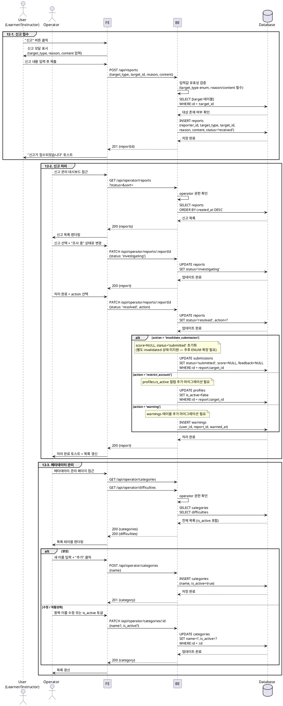

# UC-012: 운영 (Operator)

## Primary Actor

- 신고 접수(12-1): Learner 또는 Instructor (인증된 모든 사용자)
- 신고 처리(12-2): Operator (운영자)
- 메타데이터 관리(12-3): Operator (운영자)

---

## Precondition

- 12-1 신고 접수: 로그인 상태인 사용자 (역할 무관)
- 12-2 신고 처리: 로그인 상태이며 역할이 `operator`인 사용자
- 12-3 메타데이터 관리: 로그인 상태이며 역할이 `operator`인 사용자

---

## Trigger

- 12-1: 사용자가 코스/과제/제출물/다른 사용자에 대해 신고 버튼을 클릭한다.
- 12-2: 운영자가 신고 관리 대시보드에서 신고 목록을 확인하고 처리한다.
- 12-3: 운영자가 메타데이터 관리 페이지에서 카테고리 또는 난이도를 생성·수정·비활성화한다.

---

## Main Scenario

### 12-1. 신고 접수

1. 사용자가 코스/과제/제출물/사용자 상세 페이지에서 "신고" 버튼을 클릭한다.
2. FE가 신고 모달을 표시한다 (신고 사유 선택 + 상세 내용 입력).
3. 사용자가 `reason`(신고 유형)과 `content`(상세 내용)를 입력하고 제출한다.
4. FE가 `POST /api/reports`를 호출한다 (`{ target_type, target_id, reason, content }`).
5. BE가 요청을 검증한다.
   - `target_type`이 `course | assignment | submission | user` 중 하나인지 확인
   - `reason`과 `content`가 비어 있지 않은지 확인
   - `target_id`에 해당하는 대상이 실제로 존재하는지 확인
6. BE가 `reports` 레코드를 생성한다 (`status = 'received'`, `reporter_id = 요청 사용자 id`).
7. BE가 성공 응답을 반환한다.
8. FE가 "신고가 접수되었습니다" 토스트를 표시하고 모달을 닫는다.

### 12-2. 신고 처리

1. 운영자가 신고 관리 대시보드에 접근한다.
2. FE가 `GET /api/operator/reports`를 호출한다 (status 필터, 정렬 파라미터 포함).
3. BE가 운영자 권한을 확인한 후 신고 목록을 반환한다.
4. 운영자가 특정 신고를 선택하여 상세 내용을 확인한다.
5. 운영자가 신고 처리 상태를 `investigating`으로 변경한다.
6. FE가 `PATCH /api/operator/reports/:reportId`를 호출한다 (`{ status: 'investigating' }`).
7. BE가 `reports` 레코드를 업데이트한다.
8. 운영자가 조사를 완료하고 처리 액션을 결정한다.
9. 운영자가 처리 내용(`status: 'resolved'`, `action`)을 입력하고 "처리 완료" 버튼을 클릭한다.
10. FE가 `PATCH /api/operator/reports/:reportId`를 호출한다 (`{ status: 'resolved', action }`).
11. BE가 `reports` 레코드를 업데이트한다 (`status = 'resolved'`, `action = action`).
12. 선택된 액션에 따라 후속 처리를 수행한다.
    - `warning`: 대상 사용자에게 경고 처리 (profiles 또는 별도 경고 로그)
    - `invalidate_submission`: 해당 `submission`의 `status`를 무효화 처리
    - `restrict_account`: 해당 사용자 계정 접근 제한 처리
13. BE가 성공 응답을 반환한다.
14. FE가 신고 목록의 상태를 갱신한다.

### 12-3. 메타데이터 관리 (카테고리 & 난이도 CRUD)

1. 운영자가 메타데이터 관리 페이지에 접근한다.
2. FE가 `GET /api/operator/categories`와 `GET /api/operator/difficulties`를 병렬로 호출한다.
3. BE가 운영자 권한을 확인한 후 전체 목록(`is_active` 포함)을 반환한다.
4. FE가 카테고리/난이도 목록을 테이블로 렌더링한다.

**생성:**
5a. 운영자가 새 이름을 입력하고 "추가" 버튼을 클릭한다.
6a. FE가 `POST /api/operator/categories` 또는 `POST /api/operator/difficulties`를 호출한다 (`{ name }`).
7a. BE가 이름 중복 여부를 확인한다.
8a. BE가 새 레코드를 생성한다 (`is_active = true`).
9a. FE가 목록을 갱신한다.

**수정 (이름 변경 또는 활성화 상태 변경):**
5b. 운영자가 항목을 선택하고 이름을 수정하거나 `is_active` 토글을 변경한다.
6b. FE가 `PATCH /api/operator/categories/:id` 또는 `PATCH /api/operator/difficulties/:id`를 호출한다 (`{ name?, is_active? }`).
7b. BE가 이름 중복 여부를 확인한다(이름 변경 시).
8b. BE가 레코드를 업데이트한다.
9b. FE가 목록을 갱신한다.

**비활성화 (삭제 대신):**
5c. 운영자가 현재 코스에서 사용 중인 카테고리/난이도의 `is_active` 토글을 끈다.
6c. FE가 비활성화 확인 다이얼로그를 표시한다 ("사용 중인 항목입니다. 신규 코스에서 선택 불가합니다. 계속하시겠습니까?").
7c. FE가 `PATCH /api/operator/categories/:id`를 호출한다 (`{ is_active: false }`).
8c. BE가 레코드를 업데이트한다 (`is_active = false`).
9c. 기존에 해당 값을 사용하는 코스에는 영향 없음. 신규 코스 생성 시 선택 목록에서 제외된다.

---

## Edge Cases

| 상황 | 처리 |
|---|---|
| 신고 대상(`target_id`)이 존재하지 않음 | 404 반환 → "존재하지 않는 대상입니다" 메시지 |
| `reason` 또는 `content`가 빈 값으로 신고 제출 | 400 반환 → FE 입력 필드 인라인 오류 표시 |
| 동일한 사용자가 동일 대상을 중복 신고 | 허용 (중복 신고 자체를 차단하지 않음 — 운영자가 판단) |
| Operator가 아닌 역할로 신고 처리 API 접근 | 403 반환 → 권한 오류 메시지 |
| `received` 상태 신고를 `investigating` 건너뛰고 `resolved`로 직접 변경 | 허용 (단계 강제 없음, 운영자 재량) |
| 이미 `resolved`된 신고에 재처리 시도 | 400 반환 → "이미 처리 완료된 신고입니다" 메시지 |
| 카테고리/난이도 이름 중복 생성 시도 | 409 반환 → "이미 존재하는 이름입니다" 메시지 |
| 사용 중인 카테고리/난이도 비활성화 | 비활성화 허용 (기존 코스 데이터 보존), FE에서 경고 안내 후 진행 |
| `invalidate_submission` 액션 대상 제출물이 이미 무효화 상태 | 멱등 처리 (재처리 시 동일 결과, 오류 없음) |
| 네트워크 오류 | FE에서 재시도 유도 메시지 표시 |

---

## Business Rules

- 신고 접수는 인증된 모든 역할(Learner, Instructor, Operator)이 가능하다.
- 신고 처리(`GET/PATCH /api/operator/*`) 및 메타데이터 관리는 `operator` 역할만 수행할 수 있다.
- 신고 상태는 `received → investigating → resolved` 순서를 권장하나 단계 강제는 없다.
- 신고 처리 액션은 `warning | invalidate_submission | restrict_account` 중 하나이며, `resolved` 상태일 때만 액션을 기록한다.
- `action = null`인 `resolved` 상태도 허용한다 (조사 결과 무혐의 처리 가능).
- 카테고리/난이도는 물리적으로 삭제하지 않으며 `is_active = false`로 비활성화한다.
- `is_active = false`인 항목은 코스 생성/수정 시 선택 불가하지만, 기존 코스의 데이터는 유지된다.
- 카테고리/난이도의 `name`은 UNIQUE 제약이 있어 중복 이름 생성/수정이 불가하다.

> **스키마 추가 필요 (구현 시 마이그레이션 필요):**
> - `warning` 액션 처리를 위한 `warnings` 테이블 (user_id, report_id, warned_at) — 현재 DB 스키마 미포함
> - `restrict_account` 액션 처리를 위한 `profiles.is_active` 컬럼 — 현재 DB 스키마 미포함
> - `invalidate_submission` 액션은 현재 `submission_status` ENUM에 별도 `invalidated` 값이 없으므로, `score = NULL`, `status = 'submitted'`로 초기화하는 방식으로 처리하거나 ENUM 확장이 필요하다.

---

## Sequence Diagram

