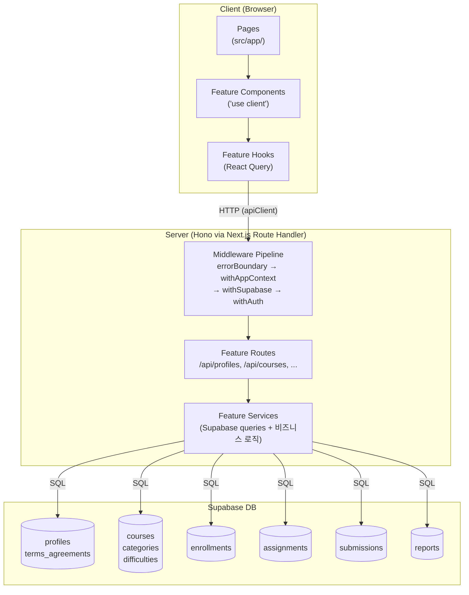
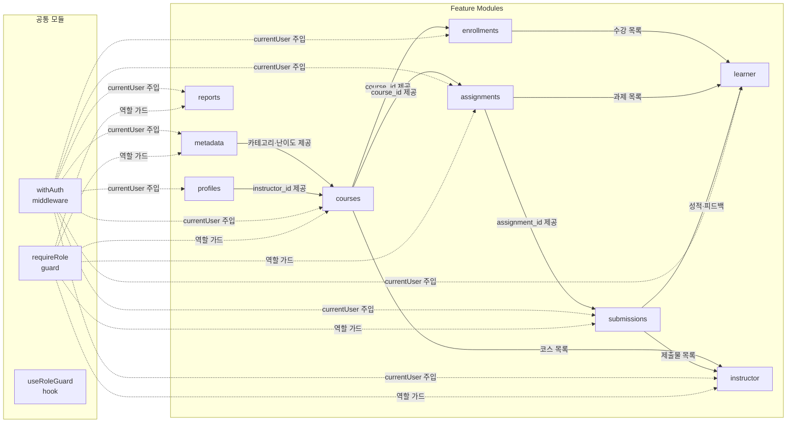
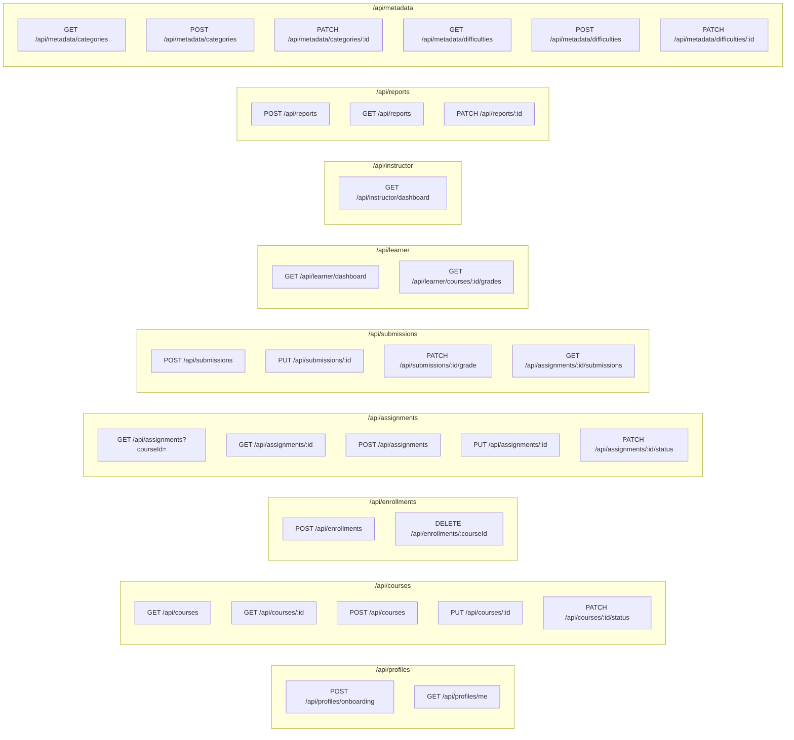

# Implementation Plan

> 기반 문서: `prd.md`, `workflow.md`, `database.md`
> 코드베이스 컨벤션: `.ruler/AGENTS.md`

---

## 1. 개요

### 공통(Shared) 모듈

| 모듈 | 위치 | 설명 |
|---|---|---|
| `withAuth` | `src/backend/middleware/auth.ts` | 쿠키 JWT 검증 → `currentUser`(id, role)를 Hono context에 주입하는 미들웨어 |
| `requireRole` | `src/backend/guards/role.ts` | Hono 라우트 레벨 역할 가드 팩토리. 예: `requireRole('instructor')` |
| `useRoleGuard` | `src/hooks/useRoleGuard.ts` | 클라이언트 역할 불일치 시 리다이렉트하는 범용 훅 |
| `StatusBadge` | `src/components/status-badge.tsx` | course/assignment/submission 상태 enum을 배지로 렌더링하는 범용 UI |

### Feature 모듈 (신규, src/features/)

| 모듈 | 위치 | API Prefix | 담당 유저플로우 |
|---|---|---|---|
| `profiles` | `src/features/profiles/` | `/api/profiles` | §1 역할 선택 & 온보딩 |
| `courses` | `src/features/courses/` | `/api/courses` | §2 코스 탐색, §8 코스 관리 |
| `enrollments` | `src/features/enrollments/` | `/api/enrollments` | §2 수강신청/취소/재신청 |
| `assignments` | `src/features/assignments/` | `/api/assignments` | §4 과제 열람, §9 과제 관리, §11 마감 |
| `submissions` | `src/features/submissions/` | `/api/submissions` | §5 제출/재제출, §10 채점/피드백 |
| `learner` | `src/features/learner/` | `/api/learner` | §3 대시보드, §6 성적/피드백 |
| `instructor` | `src/features/instructor/` | `/api/instructor` | §7 강사 대시보드 |
| `reports` | `src/features/reports/` | `/api/reports` | §12 신고 접수·처리 |
| `metadata` | `src/features/metadata/` | `/api/metadata` | §12 카테고리·난이도 관리 |

### 신규 페이지 (src/app/)

| 경로 | 파일 위치 | 주요 feature |
|---|---|---|
| `/onboarding` | `src/app/onboarding/page.tsx` | profiles |
| `/courses` | `src/app/courses/page.tsx` | courses |
| `/courses/[courseId]/about` | `src/app/courses/[courseId]/about/page.tsx` | courses |
| `/courses/[courseId]/curriculum` | `src/app/courses/[courseId]/curriculum/page.tsx` | courses |
| `/courses/[courseId]/enroll` | `src/app/courses/[courseId]/enroll/page.tsx` | enrollments |
| `/courses/my` | `src/app/courses/my/page.tsx` | learner |
| `/courses/my/[courseId]/assignments/[assignmentId]` | `src/app/courses/my/[courseId]/assignments/[assignmentId]/page.tsx` | assignments |
| `/courses/my/[courseId]/assignments/[assignmentId]/submit` | `.../submit/page.tsx` | submissions |
| `/courses/my/[courseId]/assignments/[assignmentId]/feedback` | `.../feedback/page.tsx` | submissions |
| `/courses/my/[courseId]/grades` | `src/app/courses/my/[courseId]/grades/page.tsx` | learner |
| `/instructor/dashboard` | `src/app/instructor/dashboard/page.tsx` | instructor |
| `/instructor/courses/new` | `src/app/instructor/courses/new/page.tsx` | courses |
| `/instructor/courses/[courseId]/edit` | `src/app/instructor/courses/[courseId]/edit/page.tsx` | courses |
| `/instructor/assignments/new` | `src/app/instructor/assignments/new/page.tsx` | assignments |
| `/instructor/assignments/[assignmentId]/submissions` | `.../submissions/page.tsx` | submissions |

---

## 2. Diagram

### 2.1 전체 아키텍처



### 2.2 Feature 의존성



### 2.3 API 라우트 맵



---

## 3. Implementation Plan

---

### [Shared] withAuth + requireRole

> 모든 보호 라우트의 전제 조건

**파일 구조:**
```
src/backend/
├── middleware/
│   └── auth.ts              ← 신규: JWT 검증 + currentUser 주입
├── guards/
│   └── role.ts              ← 신규: requireRole() 팩토리
└── hono/
    └── context.ts           ← 수정: AppVariables에 currentUser 추가
```

**Context 수정 (`src/backend/hono/context.ts`):**
```typescript
// AppVariables에 추가
currentUser?: {
  id: string;
  role: 'learner' | 'instructor' | 'operator';
};
```

**withAuth 미들웨어 동작:**
1. `Authorization: Bearer <token>` 헤더 또는 `sb-access-token` 쿠키에서 JWT 추출
2. `supabase.auth.getUser(token)` 호출
3. `profiles` 테이블에서 역할(role) 조회
4. `c.set('currentUser', { id, role })` 주입
5. 인증 실패 시 401 반환

**requireRole 동작:**
```typescript
// 사용 예: app.post('/api/courses', requireRole('instructor'), handler)
export const requireRole = (role: UserRole) => createMiddleware(...)
```

**Unit Tests (auth.ts):**
```
describe('withAuth')
  ✓ 유효한 JWT → currentUser 주입
  ✗ 토큰 없음 → 401 UNAUTHORIZED
  ✗ 만료된 토큰 → 401 UNAUTHORIZED
  ✗ 프로필 미존재 → 403 PROFILE_REQUIRED (온보딩 유도)

describe('requireRole')
  ✓ 일치하는 역할 → next() 진행
  ✗ 역할 불일치 → 403 FORBIDDEN
  ✗ currentUser 없음 (withAuth 미적용) → 500
```

**QA Sheet (src/hooks/useRoleGuard.ts):**
| 시나리오 | 사전 조건 | 단계 | 기대 결과 |
|---|---|---|---|
| Learner가 강사 경로 접근 | role=learner 로그인 | /instructor/dashboard 직접 접근 | /courses/my 로 리다이렉트 |
| 비로그인 보호 경로 접근 | 비로그인 상태 | /courses/my 접근 | /login?redirectedFrom=/courses/my |
| 온보딩 미완료 접근 | 로그인, 프로필 없음 | 어느 경로든 접근 | /onboarding 로 리다이렉트 |

---

### [Feature] profiles

> 유저플로우 §1 역할 선택 & 온보딩

**파일 구조:**
```
src/features/profiles/
├── backend/
│   ├── route.ts    ← POST /api/profiles/onboarding, GET /api/profiles/me
│   ├── service.ts  ← createProfile(), getMyProfile()
│   ├── schema.ts   ← OnboardingRequestSchema, ProfileResponseSchema
│   └── error.ts    ← PROFILE_ALREADY_EXISTS, INVALID_ROLE
├── components/
│   └── onboarding-form.tsx   ← 역할 선택 + 이름·휴대폰 입력 + 약관 동의
├── hooks/
│   └── useOnboardingMutation.ts
└── lib/
    └── dto.ts
```

**API 엔드포인트:**
| Method | Path | 설명 | 권한 |
|---|---|---|---|
| `POST` | `/api/profiles/onboarding` | 프로필 생성 + 약관 이력 저장 | 로그인(withAuth, 프로필 없음) |
| `GET` | `/api/profiles/me` | 내 프로필 조회 | withAuth |

**Backend Unit Tests:**
```
describe('createProfile')
  ✓ 신규 유저: profiles INSERT + terms_agreements INSERT
  ✓ role=learner → 카탈로그 리다이렉트 경로 반환
  ✓ role=instructor → 대시보드 리다이렉트 경로 반환
  ✗ 이미 프로필 존재 → failure(409, PROFILE_ALREADY_EXISTS)
  ✗ role 값 없음 → failure(400, INVALID_ROLE)
  ✗ name 빈 값 → failure(400, VALIDATION_ERROR)

describe('getMyProfile')
  ✓ 존재하는 프로필 반환
  ✗ 프로필 없음 → failure(404, PROFILE_NOT_FOUND)
```

**Frontend QA Sheet:**
| 시나리오 | 사전 조건 | 단계 | 기대 결과 |
|---|---|---|---|
| Learner 온보딩 완료 | 회원가입 후 /onboarding 진입 | Learner 선택 → 이름·전화번호 입력 → 약관 동의 → 제출 | /courses 로 이동 |
| Instructor 온보딩 완료 | 회원가입 후 /onboarding 진입 | Instructor 선택 → 입력 → 제출 | /instructor/dashboard 로 이동 |
| 필수 항목 누락 | /onboarding | 이름 없이 제출 | 이름 필드에 에러 메시지 표시, 제출 차단 |
| 약관 미동의 | /onboarding | 약관 미체크 후 제출 | 약관 동의 에러 표시, 제출 차단 |
| 중복 온보딩 시도 | 이미 프로필 존재 | /onboarding 재접근 | /courses 또는 /instructor/dashboard 로 리다이렉트 |

---

### [Feature] courses

> 유저플로우 §2 코스 탐색, §8 코스 관리

**파일 구조:**
```
src/features/courses/
├── backend/
│   ├── route.ts    ← GET /api/courses, GET /api/courses/:id, POST, PUT, PATCH status
│   ├── service.ts  ← getCourseCatalog(), getCourseDetail(), createCourse(), updateCourse(), updateCourseStatus()
│   ├── schema.ts   ← CourseCatalogQuerySchema, CourseResponseSchema, CreateCourseSchema
│   └── error.ts    ← COURSE_NOT_FOUND, NOT_COURSE_OWNER, INVALID_STATUS_TRANSITION
├── components/
│   ├── course-catalog.tsx        ← 검색/필터/정렬 + 카드 목록
│   ├── course-filter-bar.tsx     ← 카테고리·난이도·정렬 셀렉터
│   ├── course-card.tsx           ← 개별 코스 카드
│   ├── course-detail.tsx         ← 소개·커리큘럼·강사 정보
│   ├── course-form.tsx           ← 강사 생성/수정 폼
│   └── course-status-control.tsx ← 강사 상태 전환 버튼
├── hooks/
│   ├── useCourseCatalogQuery.ts
│   ├── useCourseDetailQuery.ts
│   ├── useCreateCourseMutation.ts
│   ├── useUpdateCourseMutation.ts
│   └── useUpdateCourseStatusMutation.ts
└── lib/
    └── dto.ts
```

**API 엔드포인트:**
| Method | Path | 설명 | 권한 |
|---|---|---|---|
| `GET` | `/api/courses` | 카탈로그 목록 (검색·필터·정렬) | public |
| `GET` | `/api/courses/:id` | 코스 상세 | public |
| `POST` | `/api/courses` | 코스 생성 (draft) | instructor |
| `PUT` | `/api/courses/:id` | 코스 수정 | instructor + owner |
| `PATCH` | `/api/courses/:id/status` | 상태 전환 | instructor + owner |

**Backend Unit Tests:**
```
describe('getCourseCatalog')
  ✓ status=published인 코스만 반환
  ✓ 검색어로 title ILIKE 필터
  ✓ category_id 필터
  ✓ difficulty_id 필터
  ✓ 최신순(created_at DESC) 정렬
  ✓ 인기순(enrollments count DESC) 정렬
  ✓ 결과 없을 시 빈 배열 반환

describe('createCourse')
  ✓ 정상 생성 → status=draft, instructor_id=currentUser.id
  ✗ role≠instructor → failure(403, FORBIDDEN)

describe('updateCourseStatus')
  ✓ draft → published
  ✓ published → archived
  ✗ archived → published → failure(400, INVALID_STATUS_TRANSITION)
  ✗ 소유자 아닌 경우 → failure(403, NOT_COURSE_OWNER)
```

**Frontend QA Sheet:**
| 시나리오 | 사전 조건 | 단계 | 기대 결과 |
|---|---|---|---|
| 카탈로그 기본 진입 | 로그인, published 코스 3개 | /courses 접근 | 코스 카드 3개 표시 |
| 키워드 검색 | 카탈로그 표시 중 | 검색창에 "React" 입력 | "React" 포함 코스만 표시 |
| 카테고리 필터 | 카탈로그 표시 중 | 카테고리 "웹개발" 선택 | 해당 카테고리 코스만 표시 |
| 코스 상세 진입 | 카탈로그 표시 중 | 코스 카드 클릭 | about 페이지 진입, 소개·커리큘럼·강사 표시 |
| 강사 코스 생성 | role=instructor | /instructor/courses/new → 폼 작성 → 제출 | 생성 완료, 목록에 draft 상태로 표시 |
| 강사 코스 published 전환 | draft 코스 존재 | 코스 편집 → "게시" 버튼 클릭 | status=published, 카탈로그에 노출 |
| 강사 코스 archived 전환 | published 코스 존재 | "종료" 버튼 클릭 | status=archived, 카탈로그에서 미표시, 신규 수강 불가 |

---

### [Feature] enrollments

> 유저플로우 §2 수강신청/취소/재신청

**파일 구조:**
```
src/features/enrollments/
├── backend/
│   ├── route.ts    ← POST /api/enrollments, DELETE /api/enrollments/:courseId
│   ├── service.ts  ← enrollCourse(), cancelEnrollment()
│   ├── schema.ts   ← EnrollRequestSchema, EnrollmentResponseSchema
│   └── error.ts    ← ALREADY_ENROLLED, NOT_ENROLLED, COURSE_NOT_PUBLISHED
├── components/
│   └── enroll-button.tsx   ← 신청/취소/재신청 상태에 따른 버튼 렌더링
├── hooks/
│   ├── useEnrollmentStatusQuery.ts    ← 현재 수강 상태 조회
│   ├── useEnrollMutation.ts
│   └── useCancelEnrollmentMutation.ts
└── lib/
    └── dto.ts
```

**API 엔드포인트:**
| Method | Path | 설명 | 권한 |
|---|---|---|---|
| `POST` | `/api/enrollments` | 수강신청 (신규 or 재신청 UPSERT) | learner |
| `DELETE` | `/api/enrollments/:courseId` | 수강취소 | learner + 수강 중 |

**Backend Unit Tests:**
```
describe('enrollCourse')
  ✓ 기록 없음 → enrollments INSERT (신규 신청)
  ✓ cancelled_at IS NOT NULL → UPDATE(cancelled_at=NULL, enrolled_at=NOW()) (재신청)
  ✗ cancelled_at IS NULL (이미 활성) → failure(409, ALREADY_ENROLLED)
  ✗ course.status ≠ published → failure(400, COURSE_NOT_PUBLISHED)
  ✗ role≠learner → failure(403, FORBIDDEN)

describe('cancelEnrollment')
  ✓ 활성 수강 → UPDATE(cancelled_at=NOW())
  ✗ 수강 이력 없음 → failure(404, NOT_ENROLLED)
  ✗ 이미 취소된 수강 → failure(400, ALREADY_CANCELLED)
```

**Frontend QA Sheet:**
| 시나리오 | 사전 조건 | 단계 | 기대 결과 |
|---|---|---|---|
| 최초 수강신청 | role=learner, published 코스 | 코스 상세 → "수강신청" 클릭 | 버튼 "수강취소"로 변경, 내 코스에 추가 |
| 수강취소 | 활성 수강 중 | "수강취소" 클릭 | 버튼 "재신청"으로 변경, 내 코스에서 제거 |
| 재신청 | 취소 이력 존재 | "재신청" 클릭 | 버튼 "수강취소"로 변경, 내 코스에 재추가 |
| archived 코스 신청 시도 | archived 코스 | 수강신청 버튼 클릭 | 에러 토스트 표시, 신청 실패 |
| 강사 계정 신청 시도 | role=instructor | 수강신청 버튼 클릭 | 403 에러 토스트 표시 |

---

### [Feature] assignments

> 유저플로우 §4 과제 열람, §9 과제 관리, §11 게시/마감

**파일 구조:**
```
src/features/assignments/
├── backend/
│   ├── route.ts    ← GET list, GET :id, POST, PUT :id, PATCH :id/status
│   ├── service.ts  ← getAssignmentList(), getAssignmentDetail(), createAssignment(), updateAssignment(), updateAssignmentStatus()
│   ├── schema.ts   ← AssignmentListQuerySchema, AssignmentResponseSchema, CreateAssignmentSchema
│   └── error.ts    ← ASSIGNMENT_NOT_FOUND, NOT_ASSIGNMENT_OWNER, INVALID_STATUS_TRANSITION, SUBMISSION_BLOCKED
├── components/
│   ├── assignment-list.tsx         ← 과제 목록 (학습자/강사 공통)
│   ├── assignment-detail.tsx       ← 과제 상세 (설명·마감·비중·정책)
│   ├── assignment-form.tsx         ← 강사 생성/수정 폼
│   ├── assignment-status-badge.tsx ← draft/published/closed 배지
│   └── assignment-status-control.tsx ← 강사 상태 전환 버튼
├── hooks/
│   ├── useAssignmentListQuery.ts
│   ├── useAssignmentDetailQuery.ts
│   ├── useCreateAssignmentMutation.ts
│   ├── useUpdateAssignmentMutation.ts
│   └── useUpdateAssignmentStatusMutation.ts
└── lib/
    └── dto.ts
```

**API 엔드포인트:**
| Method | Path | 설명 | 권한 |
|---|---|---|---|
| `GET` | `/api/assignments?courseId=` | 과제 목록 조회 | withAuth + 수강 여부 검증 |
| `GET` | `/api/assignments/:id` | 과제 상세 | withAuth + 수강 여부 검증 |
| `POST` | `/api/assignments` | 과제 생성 | instructor + owner |
| `PUT` | `/api/assignments/:id` | 과제 수정 | instructor + owner |
| `PATCH` | `/api/assignments/:id/status` | 상태 전환 | instructor + owner |

**Backend Unit Tests:**
```
describe('getAssignmentList')
  ✓ learner: status=published 과제만 반환
  ✓ instructor(소유자): 전체 상태(draft/published/closed) 반환
  ✗ 수강 중이 아닌 learner → failure(403, NOT_ENROLLED)

describe('getAssignmentDetail')
  ✓ published 과제 반환
  ✗ draft 과제를 learner 조회 → failure(403, ASSIGNMENT_NOT_PUBLISHED)
  ✗ 수강 중이 아닌 learner → failure(403, NOT_ENROLLED)

describe('createAssignment')
  ✓ 정상 생성 → status=draft
  ✗ 소유하지 않은 courseId → failure(403, NOT_COURSE_OWNER)

describe('updateAssignmentStatus')
  ✓ draft → published
  ✓ published → closed (수동 강제 마감)
  ✗ closed → published → failure(400, INVALID_STATUS_TRANSITION)
  ✗ 소유자 아닌 경우 → failure(403, NOT_ASSIGNMENT_OWNER)
```

**Frontend QA Sheet:**
| 시나리오 | 사전 조건 | 단계 | 기대 결과 |
|---|---|---|---|
| 과제 목록 진입 | 수강 중, published 과제 2개 | /courses/my/[id]/assignments | 과제 카드 2개 표시 |
| closed 과제 진입 | status=closed (또는 due_at 경과) | 과제 클릭 | "제출 마감" 표시, 제출 버튼 비활성화 |
| 강사 과제 생성 | role=instructor | /instructor/assignments/new → 폼 작성 → 제출 | 목록에 draft 상태 표시 |
| 강사 과제 게시 | draft 과제 존재 | "게시" 클릭 | status=published, 학습자 화면에 노출 |
| 강사 수동 마감 | published 과제 존재 | "마감" 클릭 | status=closed, 학습자 제출 버튼 비활성화 |

---

### [Feature] submissions

> 유저플로우 §5 제출/재제출, §10 채점/피드백

**파일 구조:**
```
src/features/submissions/
├── backend/
│   ├── route.ts    ← POST, PUT :id (재제출), PATCH :id/grade, GET assignments/:id/submissions
│   ├── service.ts  ← submitAssignment(), resubmitAssignment(), gradeSubmission(), getSubmissionList()
│   ├── schema.ts   ← SubmitRequestSchema, GradeRequestSchema, SubmissionResponseSchema
│   └── error.ts    ← SUBMISSION_NOT_FOUND, LATE_SUBMISSION_BLOCKED, RESUBMIT_NOT_ALLOWED, INVALID_SCORE
├── components/
│   ├── submission-form.tsx        ← text + link 입력 폼 (제출/재제출 공통)
│   ├── submission-status.tsx      ← submitted/graded/resubmission_required 상태 표시
│   ├── feedback-view.tsx          ← 학습자: 점수·피드백·is_late 표시
│   ├── grade-form.tsx             ← 강사: 점수·피드백·재제출요청 폼
│   └── submission-table.tsx       ← 강사: 제출물 테이블 (필터: 미채점/지각/재제출요청)
├── hooks/
│   ├── useSubmitMutation.ts
│   ├── useResubmitMutation.ts
│   ├── useGradeMutation.ts
│   ├── useMySubmissionQuery.ts        ← 학습자: 내 제출 상태 조회
│   └── useSubmissionListQuery.ts      ← 강사: 제출물 목록 조회
└── lib/
    └── dto.ts
```

**API 엔드포인트:**
| Method | Path | 설명 | 권한 |
|---|---|---|---|
| `POST` | `/api/submissions` | 과제 제출 | learner + 수강 중 |
| `PUT` | `/api/submissions/:id` | 재제출 | learner + allow_resubmit=true |
| `PATCH` | `/api/submissions/:id/grade` | 채점/피드백/재제출요청 | instructor + owner |
| `GET` | `/api/assignments/:id/submissions` | 제출물 목록 (강사) | instructor + owner |

**Backend Unit Tests:**
```
describe('submitAssignment')
  ✓ 마감 전 → status=submitted, is_late=false
  ✓ 마감 후 + allow_late=true → status=submitted, is_late=true
  ✗ 마감 후 + allow_late=false → failure(400, LATE_SUBMISSION_BLOCKED)
  ✗ assignment.status=closed → failure(400, SUBMISSION_BLOCKED)
  ✗ 이미 제출 + allow_resubmit=false → failure(409, ALREADY_SUBMITTED)
  ✗ content_text 빈 값 → failure(400, VALIDATION_ERROR)
  ✗ 수강 중이 아닌 learner → failure(403, NOT_ENROLLED)

describe('resubmitAssignment')
  ✓ allow_resubmit=true + status=resubmission_required → UPDATE(content, submitted_at, status=submitted)
  ✗ allow_resubmit=false → failure(400, RESUBMIT_NOT_ALLOWED)
  ✗ status≠resubmission_required → failure(400, RESUBMIT_NOT_REQUESTED)
  ✗ assignment 마감 상태 → failure(400, SUBMISSION_BLOCKED)

describe('gradeSubmission')
  ✓ 점수 입력 → status=graded, graded_at=NOW()
  ✓ 재제출 요청 → status=resubmission_required, feedback 저장
  ✗ score > 100 또는 < 0 → failure(400, INVALID_SCORE)
  ✗ feedback 없음 → failure(400, FEEDBACK_REQUIRED)
  ✗ 소유하지 않은 과제 → failure(403, NOT_ASSIGNMENT_OWNER)
```

**Frontend QA Sheet:**
| 시나리오 | 사전 조건 | 단계 | 기대 결과 |
|---|---|---|---|
| 정상 제출 | 수강 중, 마감 전, 미제출 | submit 페이지 → 텍스트 입력 → 제출 | 상태 "제출됨"으로 변경 |
| 지각 제출 (허용) | allow_late=true, 마감 후 | 텍스트 입력 → 제출 | 상태 "제출됨 (지각)" 표시 |
| 지각 제출 (차단) | allow_late=false, 마감 후 | submit 페이지 접근 | 제출 버튼 비활성화, 마감 안내 메시지 |
| 재제출 요청 수신 | 강사가 resubmission_required 설정 | feedback 페이지 접근 | "재제출 요청" 상태 + 피드백 표시, 재제출 버튼 활성화 |
| 재제출 완료 | resubmission_required 상태 | submit 페이지 → 재제출 | 상태 "제출됨"으로 변경 |
| 강사 채점 | role=instructor | submissions 테이블 → 제출물 선택 → 점수·피드백 입력 → 채점 | 상태 "채점완료", 학습자 feedback 페이지에 반영 |
| 강사 재제출 요청 | role=instructor | 점수 미입력 → "재제출 요청" 클릭 + 피드백 입력 | 상태 "재제출요청", 학습자에게 반영 |
| 피드백 없는 채점 시도 | role=instructor | 피드백 빈칸으로 채점 제출 | 피드백 필수 에러 표시, 제출 차단 |

---

### [Feature] learner

> 유저플로우 §3 대시보드, §6 성적/피드백

**파일 구조:**
```
src/features/learner/
├── backend/
│   ├── route.ts    ← GET /api/learner/dashboard, GET /api/learner/courses/:id/grades
│   ├── service.ts  ← getLearnerDashboard(), getCourseGrades()
│   ├── schema.ts   ← DashboardResponseSchema, GradesResponseSchema
│   └── error.ts    ← LEARNER_NOT_FOUND
├── components/
│   ├── learner-dashboard.tsx      ← 내 코스 + 진행률 + 마감 임박 + 최근 피드백
│   ├── course-progress-card.tsx   ← 코스별 진행률 카드
│   ├── upcoming-assignments.tsx   ← 마감 임박 과제 목록
│   ├── recent-feedback.tsx        ← 최근 피드백 요약
│   └── grades-view.tsx            ← 과제별 점수 + 현재 성적(가중 평균)
├── hooks/
│   ├── useLearnerDashboardQuery.ts
│   └── useCourseGradesQuery.ts
└── lib/
    └── dto.ts
```

**API 엔드포인트:**
| Method | Path | 설명 | 권한 |
|---|---|---|---|
| `GET` | `/api/learner/dashboard` | 내 코스·진행률·마감임박·최근피드백 | learner |
| `GET` | `/api/learner/courses/:id/grades` | 코스별 현재 성적 (채점된 과제 기준) | learner + 수강 중 |

**Backend Unit Tests:**
```
describe('getLearnerDashboard')
  ✓ cancelled_at IS NULL인 수강 코스만 반환
  ✓ 진행률: COUNT(status≠resubmission_required) / COUNT(status=published assignments)
  ✓ 마감 임박: due_at 오름차순, status=published, NOW() < due_at
  ✓ 최근 피드백: status=graded, graded_at 내림차순
  ✓ 수강 코스 없을 시 빈 상태 반환

describe('getCourseGrades')
  ✓ 채점된(graded) 과제의 score × weight 합산
  ✓ 현재 성적: SUM(score×weight) / SUM(weight) (graded만)
  ✓ 미채점 과제 집계 제외 (0점 처리 안 함)
  ✓ 채점된 과제 없을 시 null 반환
  ✗ 수강 중이 아닌 경우 → failure(403, NOT_ENROLLED)
```

**Frontend QA Sheet:**
| 시나리오 | 사전 조건 | 단계 | 기대 결과 |
|---|---|---|---|
| 대시보드 기본 표시 | 수강 코스 2개, 각 과제 있음 | /courses/my 접근 | 코스 카드 2개 + 진행률 표시 |
| 진행률 계산 | 과제 4개 중 2개 graded | 대시보드 접근 | 진행률 50% 표시 |
| 마감 임박 과제 | 24시간 내 마감 과제 존재 | 대시보드 접근 | "마감 임박" 섹션에 해당 과제 표시 |
| 성적 페이지 | 채점된 과제 2개 | /courses/my/[id]/grades | 과제별 점수 + 현재 성적(가중 평균) 표시 |
| 미채점 과제 성적 표시 | 과제 3개, 채점 1개 | grades 페이지 | 미채점 과제는 "-" 표시, 현재 성적은 채점된 1개 기준 계산 |
| 수강 없는 대시보드 | 수강 코스 0개 | /courses/my 접근 | 빈 상태 + "코스 탐색" 버튼 표시 |

---

### [Feature] instructor

> 유저플로우 §7 강사 대시보드

**파일 구조:**
```
src/features/instructor/
├── backend/
│   ├── route.ts    ← GET /api/instructor/dashboard
│   ├── service.ts  ← getInstructorDashboard()
│   ├── schema.ts   ← InstructorDashboardResponseSchema
│   └── error.ts    ← INSTRUCTOR_NOT_FOUND
├── components/
│   ├── instructor-dashboard.tsx   ← 내 코스 목록 + 채점 대기 수 + 최근 제출물
│   ├── pending-grade-summary.tsx  ← 채점 대기 수 요약
│   └── recent-submissions-list.tsx ← 최근 제출물 목록
├── hooks/
│   └── useInstructorDashboardQuery.ts
└── lib/
    └── dto.ts
```

**API 엔드포인트:**
| Method | Path | 설명 | 권한 |
|---|---|---|---|
| `GET` | `/api/instructor/dashboard` | 내 코스·채점대기수·최근제출물 | instructor |

**Backend Unit Tests:**
```
describe('getInstructorDashboard')
  ✓ instructor_id로 내 코스 목록 반환 (모든 status)
  ✓ 채점 대기 수: submissions.status=submitted COUNT
  ✓ 최근 제출물: submitted_at DESC 상위 10건
  ✓ 코스 없을 시 빈 상태 반환
  ✗ role≠instructor → failure(403, FORBIDDEN)
```

**Frontend QA Sheet:**
| 시나리오 | 사전 조건 | 단계 | 기대 결과 |
|---|---|---|---|
| 대시보드 기본 표시 | 코스 3개, 제출물 5개(미채점 2개) | /instructor/dashboard | 코스 목록 + 채점 대기 2건 + 최근 제출물 5개 표시 |
| 채점 대기 클릭 | 채점 대기 카운트 표시 중 | 카운트 클릭 | 미채점 제출물만 필터된 제출물 테이블로 이동 |
| 코스 없는 강사 | 코스 0개 | /instructor/dashboard | "코스 만들기" 빈 상태 표시 |

---

### [Feature] reports

> 유저플로우 §12 신고 접수·처리

**파일 구조:**
```
src/features/reports/
├── backend/
│   ├── route.ts    ← POST /api/reports, GET /api/reports, PATCH /api/reports/:id
│   ├── service.ts  ← createReport(), getReportList(), updateReport()
│   ├── schema.ts   ← CreateReportSchema, UpdateReportSchema, ReportResponseSchema
│   └── error.ts    ← REPORT_NOT_FOUND, INVALID_STATUS_TRANSITION
├── components/
│   ├── report-form.tsx        ← 신고 접수 폼 (target_type, reason, content)
│   └── report-table.tsx       ← 운영자: 신고 목록 + 상태 필터
├── hooks/
│   ├── useCreateReportMutation.ts
│   ├── useReportListQuery.ts
│   └── useUpdateReportMutation.ts
└── lib/
    └── dto.ts
```

**API 엔드포인트:**
| Method | Path | 설명 | 권한 |
|---|---|---|---|
| `POST` | `/api/reports` | 신고 접수 | withAuth |
| `GET` | `/api/reports` | 신고 목록 조회 | operator |
| `PATCH` | `/api/reports/:id` | 상태·액션 처리 | operator |

**Backend Unit Tests:**
```
describe('createReport')
  ✓ 정상 신고 접수 → status=received
  ✗ 유효하지 않은 target_type → failure(400, VALIDATION_ERROR)
  ✗ reason 빈 값 → failure(400, VALIDATION_ERROR)

describe('updateReport')
  ✓ received → investigating
  ✓ investigating → resolved + action 지정
  ✗ resolved → received (역방향) → failure(400, INVALID_STATUS_TRANSITION)
  ✗ role≠operator → failure(403, FORBIDDEN)
```

**Frontend QA Sheet:**
| 시나리오 | 사전 조건 | 단계 | 기대 결과 |
|---|---|---|---|
| 코스 신고 | 로그인, 코스 상세 페이지 | "신고" 클릭 → 사유·내용 작성 → 제출 | "신고 접수됨" 토스트 표시 |
| 운영자 신고 목록 | role=operator | /operator/reports | 전체 신고 목록 표시 |
| 운영자 상태 처리 | received 신고 존재 | 신고 선택 → "조사 중"으로 변경 | 상태 investigating 업데이트 |

---

### [Feature] metadata

> 유저플로우 §12 카테고리·난이도 관리

**파일 구조:**
```
src/features/metadata/
├── backend/
│   ├── route.ts    ← CRUD for /api/metadata/categories, /api/metadata/difficulties
│   ├── service.ts  ← getCategoryList(), createCategory(), updateCategory(), getDifficultyList(), createDifficulty(), updateDifficulty()
│   ├── schema.ts   ← CategorySchema, DifficultySchema
│   └── error.ts    ← DUPLICATE_NAME, METADATA_IN_USE
├── components/
│   ├── category-manager.tsx     ← 카테고리 목록 + 추가/비활성화
│   └── difficulty-manager.tsx   ← 난이도 목록 + 추가/비활성화
├── hooks/
│   ├── useCategoryListQuery.ts
│   ├── useCreateCategoryMutation.ts
│   ├── useUpdateCategoryMutation.ts
│   ├── useDifficultyListQuery.ts
│   ├── useCreateDifficultyMutation.ts
│   └── useUpdateDifficultyMutation.ts
└── lib/
    └── dto.ts
```

**API 엔드포인트:**
| Method | Path | 설명 | 권한 |
|---|---|---|---|
| `GET` | `/api/metadata/categories` | 카테고리 목록 | public (is_active=true) / operator (전체) |
| `POST` | `/api/metadata/categories` | 카테고리 생성 | operator |
| `PATCH` | `/api/metadata/categories/:id` | 비활성화/활성화 | operator |
| `GET` | `/api/metadata/difficulties` | 난이도 목록 | public / operator |
| `POST` | `/api/metadata/difficulties` | 난이도 생성 | operator |
| `PATCH` | `/api/metadata/difficulties/:id` | 비활성화/활성화 | operator |

**Backend Unit Tests:**
```
describe('createCategory')
  ✓ 정상 생성 → is_active=true
  ✗ 중복 이름 → failure(409, DUPLICATE_NAME)
  ✗ role≠operator → failure(403, FORBIDDEN)

describe('updateCategory (is_active)')
  ✓ 사용 중인 카테고리 비활성화 → is_active=false (코스에는 유지, 신규 선택 불가)
  ✓ 비활성 카테고리 재활성화 → is_active=true
  ✗ role≠operator → failure(403, FORBIDDEN)
```

**Frontend QA Sheet:**
| 시나리오 | 사전 조건 | 단계 | 기대 결과 |
|---|---|---|---|
| 카테고리 생성 | role=operator | "카테고리 추가" → 이름 입력 → 저장 | 목록에 신규 항목 표시 |
| 중복 이름 입력 | 동일 이름 카테고리 존재 | 동일 이름으로 생성 시도 | 중복 에러 메시지 표시 |
| 카테고리 비활성화 | 사용 중인 카테고리 | "비활성화" 클릭 | is_active=false, 코스 생성 폼에서 미표시 |
| 코스 필터에서 활성 카테고리만 표시 | 비활성 카테고리 존재 | /courses 필터 바 확인 | is_active=true인 카테고리만 표시 |

---

## 4. 구현 순서 권장

```
1단계 (인프라)
  withAuth middleware
  requireRole guard
  useRoleGuard hook
  src/constants/auth.ts 경로 상수 추가 (onboarding, instructor/*, courses/my/*)

2단계 (사용자 기반)
  profiles feature (온보딩)

3단계 (핵심 메타데이터)
  metadata feature (카테고리·난이도: courses 폼에서 필요)

4단계 (코스 도메인)
  courses feature
  enrollments feature

5단계 (과제·제출 도메인)
  assignments feature
  submissions feature

6단계 (집계 뷰)
  learner feature (dashboard + grades)
  instructor feature (dashboard)

7단계 (운영)
  reports feature
```
