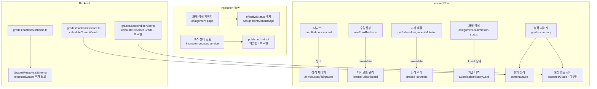

# Userflow Improvement Plan

> 작성일: 2026-02-22
> 대상 브랜치: `main`
> 참고 스펙: `docs/004~012/spec.md`, `docs/home/plan.md`

---

## 1. 개요 (Overview)

코드베이스 전체 탐색 및 스펙 대조를 통해 발견된 **버그 · 누락 · 스펙 불일치** 항목을 정리하고, 우선순위별 구현 계획을 수립합니다.

| # | 모듈 | 위치 | 분류 | 심각도 |
|---|---|---|---|---|
| F-01 | 성적 페이지 링크 경로 오류 | `features/dashboard/components/enrolled-course-card.tsx` | Bug | 🔴 High |
| F-02 | 수강신청·취소 후 대시보드 캐시 미무효화 | `features/enrollments/hooks/useEnrollMutation.ts`, `useCancelEnrollmentMutation.ts` | Bug | 🔴 High |
| F-03 | 과제 제출 후 성적 캐시 미무효화 | `features/submissions/hooks/useSubmitAssignmentMutation.ts` | Bug | 🔴 High |
| F-04 | closed 과제에서 제출 내역 미표시 | `features/assignments/components/assignment-submission-status.tsx` | Bug | 🟡 Medium |
| F-05 | effectiveStatus FE 뱃지 미반영 | `app/(protected)/instructor/assignments/[assignmentId]/page.tsx` | Bug | 🟡 Medium |
| F-06 | 예상 최종 성적(달성도 지표) 미구현 | `features/grades/backend/`, `features/grades/components/` | Feature | 🟡 Medium |
| F-07 | contentText 미입력 시 제출 버튼 사전 비활성화 미구현 | `features/submissions/components/submission-form.tsx` | Improvement | 🟢 Low |
| F-08 | published → draft 역방향 전환 미구현 | `features/instructor-courses/backend/service.ts` | Improvement | 🟢 Low |

---

## 2. 모듈 관계 다이어그램



---

## 3. 구현 계획 (Implementation Plan)

### F-01 · 성적 페이지 링크 경로 오류

**파일**: `src/features/dashboard/components/enrolled-course-card.tsx:91`

**문제**: 성적 링크가 `/courses/my/${course.id}/grades`로 잘못 설정되어 있음 → 실제 라우트는 `/my/courses/${course.id}/grades`

**수정 방향**:
```diff
- href={`/courses/my/${course.id}/grades`}
+ href={`/my/courses/${course.id}/grades`}
```

**QA Sheet**:
| 시나리오 | 기댓값 |
|---|---|
| 학생이 대시보드에서 "성적 보기" 클릭 | `/my/courses/:id/grades` 페이지로 이동 |
| 이동 후 성적 데이터 표시 | 과제별 점수 및 현재 성적 표시 |

---

### F-02 · 수강신청·취소 후 대시보드 캐시 미무효화

**파일**:
- `src/features/enrollments/hooks/useEnrollMutation.ts`
- `src/features/enrollments/hooks/useCancelEnrollmentMutation.ts`

**문제**: 수강신청·취소 성공 후 `['learner', 'dashboard']` 쿼리가 무효화되지 않아 대시보드가 즉시 갱신되지 않음

**수정 방향**:
```diff
// useEnrollMutation.ts, useCancelEnrollmentMutation.ts 공통
onSuccess: () => {
  void queryClient.invalidateQueries({ queryKey: ['course', courseId] });
  void queryClient.invalidateQueries({ queryKey: ['enrollment-status', courseId] });
+ void queryClient.invalidateQueries({ queryKey: ['learner', 'dashboard'] });
},
```

**QA Sheet**:
| 시나리오 | 기댓값 |
|---|---|
| 수강신청 후 대시보드 이동 | 새로 신청한 코스가 즉시 표시 |
| 수강취소 후 대시보드 이동 | 취소된 코스가 즉시 사라짐 |

---

### F-03 · 과제 제출 후 성적 캐시 미무효화

**파일**: `src/features/submissions/hooks/useSubmitAssignmentMutation.ts`

**문제**: 과제 제출 성공 후 `['grades', courseId]` 쿼리가 무효화되지 않아 성적 페이지가 자동 갱신되지 않음

**수정 방향**:
```diff
onSuccess: () => {
  void queryClient.invalidateQueries({ queryKey: ['assignment', courseId, assignmentId] });
+ void queryClient.invalidateQueries({ queryKey: ['grades', courseId] });
},
```

**QA Sheet**:
| 시나리오 | 기댓값 |
|---|---|
| 과제 제출 후 성적 페이지 이동 | 해당 과제 "채점 대기중" 상태로 즉시 반영 |
| 재제출 후 성적 페이지 이동 | 점수/피드백 초기화 및 "채점 대기중" 표시 |

---

### F-04 · closed 과제에서 제출 내역 미표시

**파일**: `src/features/assignments/components/assignment-submission-status.tsx`

**문제**: `isEffectivelyClosed = true`이면 기존 제출 내역 유무와 무관하게 `{ type: 'closed' }`만 반환하여 이미 제출한 학생이 자신의 제출 내역을 볼 수 없음

**수정 방향**:
```diff
// resolveSubmissionState() 함수
if (isEffectivelyClosed) {
-  return { type: 'closed' };
+  if (assignment.mySubmission) {
+    return { type: 'submitted', submission: assignment.mySubmission };
+  }
+  return { type: 'closed' };
}
```

**QA Sheet**:
| 시나리오 | 기댓값 |
|---|---|
| closed 과제, 제출 이력 있음 | 기존 제출 내용(점수·피드백) 표시, 재제출 버튼 없음 |
| closed 과제, 제출 이력 없음 | "마감된 과제입니다" 안내 표시 |

---

### F-05 · effectiveStatus FE 뱃지 미반영

**파일**: `src/app/(protected)/instructor/assignments/[assignmentId]/page.tsx`

**문제**: 뱃지가 DB `status`(draft/published/closed)만 표시하고 `effectiveStatus`(overdue 포함)를 반영하지 않아 마감일 경과 시에도 "게시됨"으로만 보임

**수정 방향**:
```diff
// AssignmentStatusBadge에 effectiveStatus prop 추가
- <AssignmentStatusBadge status={data.assignment.status} />
+ <AssignmentStatusBadge status={data.assignment.effectiveStatus} />
```

`AssignmentStatusBadge` 컴포넌트에 `overdue` 케이스 추가:
```diff
.with('overdue', () => ({ label: '마감 임박(지각 가능)', variant: 'destructive' as const }))
```

**QA Sheet**:
| 시나리오 | 기댓값 |
|---|---|
| 마감일 경과, `allow_late=true` | "마감 임박(지각 가능)" 뱃지 표시 |
| 마감일 경과, `allow_late=false` | "게시됨" → 제출 차단 상태 유지 |
| 명시적 `closed` 전환 | "마감됨" 뱃지 표시 |

---

### F-06 · 예상 최종 성적(달성도 지표) 미구현

**파일**:
- `src/features/grades/backend/service.ts`
- `src/features/grades/backend/schema.ts`
- `src/features/grades/components/grade-summary.tsx`

**문제**: 스펙 §6에서 "현재 성적 + 미제출 과제를 0점으로 가정한 예상 최종 성적" 표시를 요구하지만 미구현

**구현 방향**:

```typescript
// grades/backend/service.ts - 추가
export const calculateExpectedGrade = (
  assignments: AssignmentWithSubmission[],
): number | null => {
  const totalWeight = assignments.reduce((sum, a) => sum + a.weight, 0);
  if (totalWeight === 0) return null;

  const weightedScore = assignments.reduce((sum, a) => {
    const score = a.mySubmission?.status === 'graded'
      ? (a.mySubmission.score ?? 0)
      : 0; // 미제출·채점전은 0점으로 가정
    return sum + score * a.weight;
  }, 0);

  return Math.round((weightedScore / totalWeight) * 10) / 10;
};
```

```diff
// grades/backend/schema.ts
GradesResponseSchema = z.object({
  currentGrade: z.number().nullable(),
+ expectedGrade: z.number().nullable(),
  assignments: z.array(AssignmentGradeItemSchema),
});
```

```diff
// grades/backend/service.ts - getGrades() 응답
return success({
  currentGrade: calculateCurrentGrade(assignments),
+ expectedGrade: calculateExpectedGrade(assignments),
  assignments: assignmentItems,
});
```

```diff
// grade-summary.tsx
// expectedGrade 표시 섹션 추가
+ {expectedGrade !== null && (
+   <div className="mt-1 text-sm text-slate-500">
+     예상 최종 성적 (미제출=0점 가정): <span className="font-medium">{expectedGrade}점</span>
+   </div>
+ )}
```

**Unit Test 케이스**:
| 입력 | 기댓값 |
|---|---|
| 전체 과제 채점 완료 | `currentGrade === expectedGrade` |
| 일부 과제 미제출 | `expectedGrade < currentGrade` |
| 전체 과제 미제출 | `expectedGrade === 0` |
| 과제 없음 | `expectedGrade === null` |

**QA Sheet**:
| 시나리오 | 기댓값 |
|---|---|
| 일부 과제 채점 완료, 일부 미제출 | "예상 최종 성적" 수치 표시 |
| 모든 과제 채점 완료 | 현재 성적 = 예상 최종 성적 |
| 채점된 과제 없음 | 예상 최종 성적 0점 표시 |

---

### F-07 · contentText 미입력 시 제출 버튼 사전 비활성화

**파일**: `src/features/submissions/components/submission-form.tsx`

**문제**: Zod 검증으로 제출 차단은 되지만 버튼 자체가 비활성화되지 않아 UX 피드백 지연

**수정 방향**:
```diff
// react-hook-form의 watch 또는 formState.isValid 활용
+ const contentText = watch('contentText');

<Button
  type="submit"
  size="sm"
- disabled={isPending}
+ disabled={isPending || !contentText?.trim()}
>
```

**QA Sheet**:
| 시나리오 | 기댓값 |
|---|---|
| contentText 비어있음 | 제출 버튼 비활성화 |
| contentText 입력 후 삭제 | 즉시 버튼 비활성화 |
| contentText 입력 완료 | 버튼 활성화 |

---

### F-08 · published → draft 역방향 전환 미구현

**파일**: `src/features/instructor-courses/backend/service.ts`

**문제**: 현재 `draft → published → archived`만 허용하여 게시 후 초안으로 되돌릴 수 없음

**구현 방향**:
```diff
// isAllowedCourseStatusTransition 함수 (또는 유사 검증 로직)
const ALLOWED_TRANSITIONS: Record<string, string[]> = {
  draft: ['published'],
- published: ['archived'],
+ published: ['draft', 'archived'],
  archived: [],
};
```

> **주의**: `published → draft` 전환 시 이미 수강신청한 학생 세션 처리 정책 확인 필요 (기획 확인 후 적용)

**QA Sheet**:
| 시나리오 | 기댓값 |
|---|---|
| published 코스 → draft 전환 | 성공, 코스 카탈로그에서 숨김 처리 |
| archived 코스 → draft 전환 | 400 Bad Request |
| draft 코스 → archived 전환 | 400 Bad Request |

---

## 4. 작업 우선순위 및 순서

```mermaid
gantt
  title 구현 우선순위
  dateFormat X
  axisFormat %s

  section 🔴 High (즉시)
  F-01 성적 링크 경로 수정         :done, 1, 2
  F-02 수강신청 캐시 무효화         :done, 1, 2
  F-03 과제 제출 성적 캐시 무효화   :done, 1, 2

  section 🟡 Medium (이번 스프린트)
  F-04 closed 과제 제출 내역 표시  :active, 2, 4
  F-05 effectiveStatus 뱃지 반영   :2, 4
  F-06 예상 최종 성적 구현          :3, 6

  section 🟢 Low (다음 스프린트)
  F-07 제출 버튼 사전 비활성화      :6, 7
  F-08 published→draft 전환        :6, 8
```



---

## 5. 수정 대상 파일 목록

| 파일 경로 | 관련 항목 |
|---|---|
| `src/features/dashboard/components/enrolled-course-card.tsx` | F-01 |
| `src/features/enrollments/hooks/useEnrollMutation.ts` | F-02 |
| `src/features/enrollments/hooks/useCancelEnrollmentMutation.ts` | F-02 |
| `src/features/submissions/hooks/useSubmitAssignmentMutation.ts` | F-03 |
| `src/features/assignments/components/assignment-submission-status.tsx` | F-04 |
| `src/app/(protected)/instructor/assignments/[assignmentId]/page.tsx` | F-05 |
| `src/features/grades/backend/service.ts` | F-06 |
| `src/features/grades/backend/schema.ts` | F-06 |
| `src/features/grades/components/grade-summary.tsx` | F-06 |
| `src/features/submissions/components/submission-form.tsx` | F-07 |
| `src/features/instructor-courses/backend/service.ts` | F-08 |
